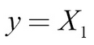

Lab 1. Neural Networks and Gradient-Based Optimization
-------------------------------------------------------------------


The financial services industry is fundamentally an
information processing industry. An investment fund processes
information in order to evaluate investments, an insurance company
processes information to price their insurances, while a retail bank
will process information in order to decide which products to offer
to which customers. It is, therefore, no accident that the financial
industry was an early adopter of computers.

The first stock ticker was the printing telegraph, which was invented
back in 1867. The first mechanical adding machine, which was directly
targeted at the finance industry, was patented in
1885. Then in 1971, the automatic teller banking machine, which allowed
customers to withdraw cash using a plastic card, was patented. That same
year, the first electronic stock exchange, the NASDAQ, opened its doors,
and 11 years later, in 1982, the first Bloomberg Terminal was installed.
The reason for the happy marriage between the finance sector and
computers is that success in the industry, especially in investing, is
often tied to you having an information advantage.

In the early days of Wall Street, the legends of the gilded age made
brazen use of private information. Jay Gould, for example, one of the
richest men of his time, placed a mole inside the US government. The
mole was to give notice of government gold sales and through that, tried
to influence President Ulysses S. Grant as well as his secretary. Toward
the end of the 1930s, the SEC and CFTC stood between investors and such
information advantages.

As information advantages ceased to be a reliable source of above-market
performance, clever financial modeling took its place. The term [*hedge
fund*] was coined back in 1949, the Harry Markowitz model was
published in 1953, and in 1973, the Black-Scholes formula was first
published. Since then, the field has made much progress and has
developed a wide range of financial products. However, as knowledge of
these models becomes more widespread, the returns on using them
diminish.

When we look at the financial industry coupled with modern computing,
it\'s clear that the information advantage is back. This time not in the
form of insider information and sleazy deals, but instead is coming from
an automated analysis of the vast amount of public information that\'s
out there.

Today\'s fund managers have access to more information than their
forbearers could ever dream of. However, this is not useful on its own.
For example, let\'s look at news reports. You can get them via the
internet and they are easy to access, but to make use of them, a
computer would have to read, understand, and contextualize them. The
computer would have to know which company an article is about, whether
it is good news or bad news that\'s being reported, and whether we can
learn something about the relationship between this company and another
company mentioned in the article. Those are just a couple of examples of
contextualizing the story. Firms that master sourcing
such **alternative data,** as it is often called, will often
have an advantage.

But it does not stop there. Financial professionals are expensive people
who frequently make six- to seven-figure salaries and occupy office
space in some of the most expensive real estate in the world. This is
justified as many financial professionals are smart, well-educated, and
hard-working people that are scarce and for which there is a high
demand. Because of this, it\'s thus in the interest of any company to
maximize the productivity of these individuals. By getting more bang for
the buck from the best employees, they will allow companies to offer
their products cheaper or in greater variety.

Passive investing through exchange-traded funds, for instance, requires
little management for large sums of money. Fees for passive investment
vehicles, such as funds that just mirror the S&P 500, are often well
below one percent. But with the rise of modern computing technology,
firms are now able to increase the productivity of their money managers
and thus reduce their fees to stay competitive.


Our journey in this course
------------------------

* * * * *

This course is not only about investing or trading in the finance sector;
it's much more as a direct result of the love story between computers
and finance. Investment firms have customers, often insurance firms or
pension funds, and these firms are financial services companies
themselves and, in turn, also have customers, everyday people that have
a pension or are insured.

Most bank customers are everyday people as well, and increasingly, the
main way people are interacting with their bank, insurer, or pension is
through an app on their mobile phone.

In the decades before today, retail banks relied on the fact that people
would have to come into the branch, face-to-face, in order to withdraw
cash or to make a transaction. While they were in the branch, their
advisor could also sell them another product, such as a mortgage or
insurance. Today's customers still want to buy mortgages and insurance,
but they no longer have to do it in person at the branch. In today's
world, banks tend to advise their clients online, whether it's through
the app or their website.

This online aspect only works if the bank can understand its customers'
needs from their data and provide tailor-made experiences online.
Equally, from the customers, perspective, they now expect to be able to
submit insurance claims from their phone and to get an instant response.
In today's world, insurers need to be able to automatically assess
claims and make decisions in order to fulfill their customers' demands.

This course is not about how to write trading algorithms in order to make
a quick buck. It is about leveraging the art and craft of building
machine learning-driven systems that are useful in the financial
industry.

Building anything of value requires a lot of time and effort. Right now,
the market for building valuable things, to make an analogy to
economics, is highly inefficient. Applications of machine learning will
transform the industry over the next few decades, and this course will
provide you with a toolbox that allows you to be part of the change.

Many of the examples in this course use data outside the realm of
"financial data." Stock market data is used at no time in this course, and
this decision was made for three specific reasons.

Firstly, the examples that are shown demonstrate techniques that can
usually easily be applied to other datasets. Therefore, datasets were
chosen that demonstrate some common challenges that professionals, like
yourselves, will face while also remaining computationally tractable.

Secondly, financial data is fundamentally time dependent. To make this
course useful over a longer span of time, and to ensure that as machine
learning becomes more prominent, this course remains a vital part of your
toolkit, we have used some non-financial data so that the data discussed
here will still be relevant.

Finally, using alternative and non-classical data aims to inspire you to
think about what other data you could use in your processes. Could you
use drone footage of plants to augment your grain price models? Could
you use web browsing behavior to offer different financial products?
Thinking outside of the box is a necessary skill to have if you want to
make use of the data that is around you.


#### Pre-reqs:
- Google Chrome (Recommended)

#### Lab Environment
Notebooks are ready to run. All packages and datasets have been installed. There is no requirement for any setup.

**Note:** Elev8ed Notebooks (powered by Jupyter) will be accessible at the port given to you by your instructor. Password for jupyterLab : `1234`

All Notebooks are present in `work/machine-learning-for-finance` folder.


What is machine learning? 
--------------------------

> \"Machine learning is the subfield of computer science that gives
> computers the ability to learn without being explicitly programmed.\"
>
> \- Arthur Samuel, 1959


What do we mean by machine learning? Most computer
programs today are handcrafted by humans. Software engineers carefully
craft every rule that governs how software behaves and then translate it
into computer code.

If you are reading this as an eBook, take a look at your screen right
now. Everything that you see appears there because of some rule that a
software engineer somewhere crafted. This approach has gotten us quite
far, but that\'s not to say there are no limits to it. Sometimes, there
might just be too many rules for humans to write. We might not be able
to think of rules since they are too complex for even the smartest
developers to come up with.

As a brief exercise, take a minute to come up with a list of rules that
describe all dogs, but clearly distinguish dogs from all other animals.
Fur? Well, cats have fur, too. What about a dog wearing a jacket? That
is still a dog, just in a jacket. Researchers have spent years trying to
craft these rules, but they\'ve had very little success.

Humans don\'t seem to be able to perfectly tell why something is a dog,
but they know a dog when they see a dog. As a species, we seem to detect
specific, hard-to-describe patterns that, in aggregate, let us classify
an animal as a dog. Machine learning attempts to do the same. Instead of
handcrafting rules, we let a computer develop its own rules through
pattern detection.

There are different ways this can work, and we\'re now going to look at
three different types of learning: supervised, unsupervised, and
reinforcement learning.


Supervised learning
-------------------------------------


Let\'s go back to our dog classifier. There are in
fact many such classifiers currently in use today. If you use Google
images, for example, and search for \"dog,\" it will use an image
classifier to show you pictures of dogs. These classifiers are trained
under a paradigm known as supervised learning.


Supervised learning


In supervised learning, we have a large number of training examples,
such as images of animals, and labels that describe what the expected
outcome for those training examples is. For example, the preceding
figure would come with the label \"dog,\" while an image of a cat would
come with a label \"not a dog.\"

If we have a high number of these labeled training examples, we can
train a classifier on detecting the subtle statistical patterns that
differentiate dogs from all other animals.


### Note

**Note**: The classifier does not know what a dog
fundamentally is. It only knows the statistical patterns that linked
images to dogs in training.


If a supervised learning classifier encounters something that\'s very
different from the training data, it can often get confused and will
just output nonsense.


Unsupervised learning
---------------------------------------


While supervised learning has made great advances
over the last few years, most of this course will focus on working with
labeled examples. However, sometimes we may not have labels. In this
case, we can still use machine learning to find hidden patterns in data.


Clustering is a common form of unsupervised learning


Imagine a company that has a number of customers for its products. These
customers can probably be grouped into different market segments, but
what we don\'t know is what the different market segments are. We also
cannot ask customers which market segment they belong to because they
probably don\'t know. Which market segment of the shampoo market are
you? Do you even know how shampoo firms segment their customers?

In this example, we would like an algorithm that looks at a lot of data
from customers and groups them into segments. This is an example of
unsupervised learning.

This area of machine learning is far less developed than supervised
learning, but it still holds great potential.


Reinforcement learning
----------------------------------------


In reinforcement learning, we train agents who take actions in an
environment, such as a self-driving car on the road. While 
we do not have labels, that is, we cannot tell what the
[*correct*] action is in any situation, we can assign rewards
or punishments. For example, we could reward keeping a proper distance
from the car in front.


Reinforcement learning


A driving instructor does not tell the student to \"push the brake
halfway down while moving the steering wheel two degrees to the right,\"
but rather they tell the student whether they are doing well or not,
while the student figures out the exact amount of brakes to use.

Reinforcement learning has also made some remarkable progress in the
past couple of years and is considered by many to be a promising avenue
toward general artificial intelligence, that being computers that are as
smart as humans.


### The unreasonable effectiveness of data


In 2009, three Google engineers published a landmark
paper titled [*The unreasonable effectiveness of data*]. In
the paper, they described how relatively simple machine learning systems
that had been around for a long time had exhibited much better
performance when fed with the enormous amounts of data Google had on its
servers. In fact, they discovered that when fed with more data, these
simple systems could master tasks that had been thought to be impossible
before.

From there, researchers quickly started revisiting old machine learning
technologies and found that artificial neural networks did especially
well when trained on massive datasets. This was around the same time
that computing power became cheap and plentiful
enough to train much bigger networks than before.

These bigger artificial neural networks were so effective that they got
a name: deep neural networks, or deep learning. Deep neural networks are
especially good at pattern detection. They can find complex patterns,
such as the statistical pattern of light and dark that describes a face
in a picture, and they can do so automatically given enough data.

Machine learning is, therefore, best understood as a paradigm change in
how we program computers. Instead of carefully handcrafting rules, we
feed the computer vast amounts of information and train it to craft the
rules by itself.

This approach is superior if there is a very large number of rules, or
even if these rules are difficult to describe. Modern machine learning
is, therefore, the ideal tool for combing through the huge amounts of
data the financial industry is confronted with.


### All models are wrong


There is a saying in statistics that [*all models are wrong, but some
are useful*]. Machine learning creates incredibly complex
statistical models that are often, for example, in deep learning, not
interpretable to humans. They sure are useful and have great value, but
they are still wrong. This is because they are complex black boxes, and
people tend to not question machine learning models, even though they
should question them precisely because they are black boxes.

There will come a time when even the most sophisticated deep neural
network will make a fundamentally wrong prediction, just as the advanced
**Collateralized Debt Obligation** (**CDO**)
models did in the financial crises of 2008. Even worse, black box
machine learning models, which will make millions of decisions on loan
approval or insurance, impacting everyday people\'s lives, will
eventually make wrong decisions.

Sometimes they will be biased. Machine learning is ever only as good as
the data that we feed it, data that can often be biased in what it\'s
showing, something we\'ll consider later on in this lab. This is
something we must pay a lot of time in addressing, as if we mindlessly
deploy these algorithms, we will automate discrimination too, which has
the possibility of causing another financial crisis.

This is especially true in the financial industry, where algorithms can
often have a severe impact on people\'s lives while at the same time
being kept secret. The unquestionable, secret black boxes that gain
their acceptance through the heavy use of math pose a much bigger threat
to society than the self-aware artificial intelligence taking over the
world that you see in movies.

While this is not an ethics course, it makes sense for any practitioner of
the field to get familiar with the ethical implications of his or her
work. In addition to recommending that you read Cathy O\'Neil\'s
[*Weapons of math destruction,*] it\'s also worth asking you
to swear [*The Modelers Hippocratic Oath*]. The oath was
developed by Emanuel Derman and Paul Wilmott, two quantitative finance
researchers, in 2008 in the wake of the financial crisis:


> \"I will remember that I didn\'t make the world, and it doesn\'t
> satisfy my equations. Though I will use models boldly to estimate
> value, I will not be overly impressed by mathematics. I will never
> sacrifice reality for elegance without explaining why I have done so.
> Nor will I give the people who use my model false comfort about its
> accuracy. Instead, I will make explicit its assumptions and
> oversights. I understand that my work may have enormous effects on
> society and the economy, many of them beyond my comprehension.\"


In recent years, machine learning has made a number
of great strides, with researchers mastering tasks that were previously
seen as unsolvable. From identifying objects in images to transcribing
voice and playing complex board games like Go, modern machine learning
has matched, and continues to match and even beat, human performance at
a dazzling range of tasks.

Interestingly, **deep learning** is the method behind all
these advances. In fact, the bulk of advances come from a subfield of
deep learning called **deep neural networks**. While 
many practitioners are familiar with standard econometric
models, such as regression, few are familiar with this new breed
of modeling.

The bulk of this course is devoted to deep learning. This is because it is
one of the most promising techniques for machine learning and will give
anyone mastering it the ability to tackle tasks considered impossible
before.

In this lab, we will explore how and why neural networks work in
order to give you a fundamental understanding of the topic.


Setting up your workspace
-------------------------------------------


Before we can start, you will need to set up your
workspace. The examples in this book are all meant to run in a Jupyter
notebook. Jupyter notebooks are an interactive development environment
mostly used for data-science applications and are considered the go-to
environment to build data-driven applications in.

You can run Jupyter notebooks either on your local machine, on a server
in the cloud, or on a website such as Kaggle.


### Note

**Note**: All code examples for this course can be found here:
<https://github.com/PacktPublishing/Machine-Learning-for-Finance> and
for lab 1 refer the following link:
<https://www.kaggle.com/jannesklaas/machine-learning-for-finance-lab-1-code>.


Deep learning is computer intensive, and the data used in the examples
throughout this course are frequently over a gigabyte in size. It can be
accelerated by the use of **Graphics Processing Units**
(**GPUs**), which were invented for
rendering video and games. If you have a GPU enabled computer, you can
run the examples locally. If you do not have such a machine, it is
recommended to use a service such as Kaggle kernels.

Learning deep learning used to be an expensive endeavor because GPUs
are an expensive piece of hardware. While there are cheaper options
available, a powerful GPU can cost up to \$10,000 if you buy it and
about \$0.80 an hour to rent it in the cloud.

If you have many, long-running training jobs, it might be worth
considering building a \"deep learning\" box, a desktop computer with a
GPU. There are countless tutorials for this online and a decent box can
be assembled for as little as a few hundred dollars all the way to
\$5,000.

The examples in this course can all be run on Kaggle
for free, though. In fact, they have been developed using this site.


Using Kaggle kernels
--------------------------------------


Kaggle is a popular data-science website owned by
Google. It started out with competitions in which participants had to
build machine learning models in order to make predictions. However,
over the years, it has also had a popular forum,
an online learning system and, most importantly for us, a hosted Jupyter
service.

To use Kaggle, you can visit their website at <https://www.kaggle.com/>.
In order to use the site, you will be required to create an account.

After you\'ve created your account, you can find the
**Kernels** page by clicking on **Kernels**
located in the main menu, as seen in the following screenshot:


Public Kaggle kernels


In the preceding screenshot, you can see a number of 
kernels that other people have both written and published.
Kernels can be private, but publishing kernels is a good way to show
skills and share knowledge.

To start a new kernel, click **New Kernel**. In the dialog
that follows, you want to select **Notebook**:


The kernel editor


You will get to the kernel editor, which looks like the preceding
screenshot.

Note that Kaggle is actively iterating on the kernel design, and so a
few elements might be in different positions, but the basic
functionality is the same. The most important piece of a notebook is the
code cells. Here you can enter the code and run it by clicking the run
button on the bottom left, or alternatively by pressing
[*Shift*] + [*Enter*].

The variables you define in one cell become environment variables, so
you can access them in another cell. Markdown cells allow you to write
text in markdown format to add a description to what is going on in your
code. You can upload and download notebooks with the little cloud
buttons featured in the top-right corner.

To publish a notebook from the kernel editor, firstly you must click the
**Commit & Run** button and then set the notebook to
**Public** in the settings. To enable a GPU on your notebook,
make sure to check the **Enable GPU** button located in
the bottom right. It\'s important to remember that this will restart
your notebook, so your environment variables will be lost.

Once you run the code, the run button turns into a stop button. If your
code ever gets stuck, you can interrupt it by clicking that stop button.
If you want to wipe all environment variables and begin anew, simply
click the restart button located in the bottom-right corner.

With this system, you can connect a kernel to any dataset hosted on
Kaggle, or alternatively you can just upload a new dataset on the fly.
The notebooks belonging to this course already come with the data
connection.

Kaggle kernels come with the most frequently used
packages preinstalled, so for most of the time you do not have to worry
about installing packages.

Sometimes this course does use custom packages not installed in Kaggle by
default. In this case, you can add custom packages at the bottom of the
Settings menu. Instructions for installing custom packages will be
provided when they are used in this course.

Kaggle kernels are free to use and can save you a lot of time and money,
so it\'s recommended to run the code samples on Kaggle. To copy a
notebook, go to the link provided at the beginning of the code section
of each lab and then click **Fork Notebook**. Note that
Kaggle kernels can run for up to six hours.


### Running notebooks locally


If you have a machine powerful enough to run deep
learning operations, you can run the code samples locally. In that case,
it\'s strongly recommended to install Jupyter
through Anaconda.

To install Anaconda, simply visit <https://www.anaconda.com/download> to
download the distribution. The graphical installer will guide you
through the steps necessary to install Anaconda on your system. When
installing Anaconda, you\'ll also install a range of useful Python
libraries such as NumPy and matplotlib, which will be used throughout
this course.

After installing Anaconda, you can start a Jupyter server locally by
opening your machine\'s Terminal and typing in the following code:


``` {.programlisting .language-markup}
$ jupyter notebook
```


You can then visit the URL displayed in the Terminal. This will take you
to your local notebook server.

To start a new notebook, click on **New** in the top-right
corner.

All code samples in this course use Python 3, so make sure you are using
Python 3 in your local notebooks. If you are running your notebooks
locally, you will also need to install both TensorFlow and Keras, the
two deep learning libraries used throughout this course.


#### Installing TensorFlow


Before installing Keras, we need to first install
TensorFlow. You can install TensorFlow by opening a Terminal window and
entering the following command:


``` {.programlisting .language-markup}
$ sudo pip install TensorFlow
```


For instructions on how to install TensorFlow with GPU support, simply
click on this link, where you will be provided with the instructions for
doing so: <https://www.tensorflow.org/>.

It\'s worth noting that you will need a CUDA-enabled GPU in order to run
TensorFlow with CUDA. For instructions on how to
install CUDA, visit <https://docs.nvidia.com/cuda/index.html>.


#### Installing Keras


After you have installed TensorFlow, you can install
Keras in the same way, by running the following command:


``` {.programlisting .language-markup}
$ sudo pip install Keras
```


Keras will now automatically use the TensorFlow backend. Note that
TensorFlow 1.7 will include Keras built in, which we\'ll cover this
later on in this lab.


#### Using data locally


To use the data of the course code samples locally, visit the notebooks on
Kaggle and then download the connected datasets from there. Note that
the file paths to the data will change depending on where you save the
data, so you will need to replace the file paths when running notebooks
locally.

Kaggle also offers a command-line interface, which allows you to
download the data more easily. Visit
<https://github.com/Kaggle/kaggle-api> for instructions on how to
achieve this.


Using the AWS deep learning AMI
-------------------------------------------------


**Amazon Web Services** (**AWS**) provides an
easy-to-use, preconfigured way to run deep learning
in the cloud.

Visit <https://aws.amazon.com/machine-learning/amis/> for instructions
on how to set up an **Amazon Machine Image**
](**AMI**). While AMIs are paid, they can run longer
than Kaggle kernels. So, for big projects, it might be worth using
an AMI instead of a kernel.

To run the notebooks for this course on an AMI, first set up the AMI, then
download the notebooks from GitHub, and then upload them to your AMI.
You will have to download the data from Kaggle as well. See the [*Using
data locally*] section for instructions.


Approximating functions
-----------------------------------------


There are many views on how best to think about
neural networks, but perhaps the most useful is to
see them as function approximators. Functions in math relate some input,
[*x,*] to some output, [*y*]. We can write it as
the following formula:


A simple function could be like this:


In this case, we can give the function an input, [*x*], and
it would quadruple it:


You might have seen functions like this in school, but functions can do
more; as an example, they can map an element from a set (the collection
of values the function accepts) to another element of 
a set. These sets can be something other than simple numbers.

A function could, for example, also map an image to an identification of
what is in the image:


This function would map an image of a cat to the label \"cat,\" as we
can see in the following diagram:


Mapping images to labels


We should note that for a computer, images are matrices full of numbers
and any description of an image\'s content would also be stored as a
matrix of numbers.

A neural network, if it is big enough, can approximate any function. It
has been mathematically proven that an indefinitely large network could
approximate every function. While we don\'t need to use an indefinitely
large network, we are certainly using very large networks.

Modern deep learning architectures can have tens or even hundreds of
layers and millions of parameters, so only storing
the model already takes up a few gigabytes. This means that a neural
network, if it\'s big enough, could also approximate our function,
[*f*], for mapping images to their content.

The condition that the neural network has to be \"big enough\" explains
why deep (big) neural networks have taken off. The fact that \"big
enough\" neural networks can approximate any function means that they
are useful for a large number of tasks.


A forward pass
--------------------------------


Over the course of this course, we will build powerful
neural networks that are able to approximate extremely complex
functions. We will be mapping text to named entities, images to their
content, and even news articles to their summaries. But for now, we will
work with a simple problem that can be solved with logistic regression,
a popular technique used in both economics and finance.

We will be working with a simple problem. Given an input matrix,
[*X*], we want to output the first column of the matrix,
[*X~1~*]. In this example, we will be approaching the problem
from a mathematical perspective in order to gain some intuition for what
is going on.

Later on in this lab, we will implement what we have described in
Python. We already know that we need data to train a neural network, and
so the data, seen here, will be our dataset for the exercise:


  X~1~   X~2~   X~3~   y
  ------ ------ ------ ---
  0      1      0      0
  1      0      0      1
  1      1      1      1
  0      1      1      0


In the dataset, each row contains an input vector, [*X*], and
an output, [*y*].

The data follows the formula:





The function we want to approximate is as follows:


In this case, writing down the function is relatively straightforward.
However, keep in mind that in most cases it is not possible to write
down the function, as functions expressed by deep neural networks can
become very complex.

For this simple function, a shallow neural network with only one layer
will be enough. Such shallow networks are also called logistic
regressors.


A logistic regressor
--------------------------------------


As we just explained, the simplest neural network is
a logistic regressor. A logistic regression takes in values of any range
but only outputs values between zero and one.

There is a wide range of applications where logistic regressors are
suitable. One such example is to predict the likelihood of a homeowner
defaulting on a mortgage.

We might take all kinds of values into account when trying to predict
the likelihood of someone defaulting on their payment, such as the
debtor\'s salary, whether they have a car, the security of their job,
and so on, but the likelihood will always be a value between zero and
one. Even the worst debtor ever cannot have a default likelihood above
100%, and the best cannot go below 0%.

The following diagram shows a logistic regressor. [*X*] is
our input vector; here it\'s shown as three components,
[*X~1~*], [*X~2~*], and [*X~3~*].

[*W*] is a vector of three weights. You can imagine it as the
thickness of each of the three lines. [*W*] determines how
much each of the values of [*X*] goes into the next
layer. [*b*] is the bias, and it can move the output of the
layer up or down:


Logistic regressor


To compute the output of the regressor, we must
first do a **linear step**. We compute the 
dot product of the input, [*X*], and the weights,
[*W*]. This is the same as multiplying each value of
[*X*] with its weight and then taking the sum. To this
number, we then add the bias, [*b*]. Afterward, we do a
**nonlinear step**.

In the nonlinear step, we run the linear intermediate
 product, [*z*], through an **activation
function**; in this case, the sigmoid
function. The sigmoid function squishes the input values to outputs
between zero and one:


The Sigmoid function


### Python version of our logistic regressor


If all the preceding math was a bit too theoretical
for you, rejoice! We will now implement the same thing, but this time
with Python. In our example, we will be using a library called NumPy,
which enables easy and fast matrix operations within Python.

NumPy comes preinstalled with Anaconda and on Kaggle kernels. To ensure
we get the same result in all of our experiments, we have to set a
random seed. We can do this by running the following code:


``` {.programlisting .language-markup}
import numpy as np
np.random.seed(1)
```


Since our dataset is quite small, we\'ll define it manually as NumPy
matrices, as we can see here:


``` {.programlisting .language-markup}
X = np.array([[0,1,0],
              [1,0,0],
              [1,1,1],
              [0,1,1]])

y = np.array([[0,1,1,0]]).T
```


We can define the sigmoid, which squishes all the values into values
between 0 and 1, through an activation function as a Python function:


``` {.programlisting .language-markup}
def sigmoid(x):
    return 1/(1+np.exp(-x))
```


So far, so good. We now need to initialize [*W*]. In this
case, we actually know already what values [*W*] should have.
But we cannot know about other problems where we do not know the
function yet. So, we need to assign weights randomly.

The weights are usually assigned randomly with a
mean of zero, and the bias is usually set to zero by default. NumPy\'s
`random` function expects to receive the shape of the random
matrix to be passed on as a tuple, so `random((3,1))` creates
a 3x1 matrix. By default, the random values generated are between 0 and
1, with a mean of 0.5 and a standard deviation of 0.5.

We want the random values to have a mean of 0 and a standard deviation
of 1, so we first multiply the values generated by 2 and then subtract
1. We can achieve this by running the following code:


``` {.programlisting .language-markup}
W = 2*np.random.random((3,1)) - 1
b = 0
```


With that done, all the variables are set. We can now move on to do the
linear step, which is achieved with the following:


``` {.programlisting .language-markup}
z = X.dot(W) + b
```


Now we can do the nonlinear step, which is run with the following:


``` {.programlisting .language-markup}
A = sigmoid(z)
```


Now, if we print out `A`, we\'ll get the following output:


``` {.programlisting .language-markup}
print(A)
```


``` {.programlisting .language-markup}
out:
[[ 0.60841366]
 [ 0.45860596]
 [ 0.3262757 ]
 [ 0.36375058]]
```


But wait! This output looks nothing like our desired output,
[*y*], at all! Clearly, our regressor is representing
[*some*] function, but it\'s quite far away from the function
we want.

To better approximate our desired function, we have to tweak the
weights, [*W*], and the bias, [*b*]. To this end,
in the next section, we will optimize the model parameters.


Optimizing model parameters
---------------------------------------------


We\'ve already seen that we need to tweak the weights and biases,
collectively called the parameters, of our model in order to 
arrive at a closer approximation of our desired function.

In other words, we need to look through the space of possible functions
that can be represented by our model in order to find a function,
[]{.inlinemediaobject}, that matches our
desired function, [*f*], as closely as possible.

But how would we know how close we are? In fact, since we don\'t know
[*f*], we cannot directly know how close our hypothesis,
[]{.inlinemediaobject}, is to
[*f*]. But what we can do is measure how well
[]{.inlinemediaobject}\'s outputs match
the output of [*f*]. The expected outputs of [*f*]
given [*X*] are the labels, [*y*]. So, we can try
to approximate [*f*] by finding a function,
[]{.inlinemediaobject}, whose outputs are
also [*y*] given [*X*].

We know that the following is true:


We also know that:


We can try to find [*f*] by optimizing using the following
formula:


Within this formula,
[]{.inlinemediaobject} is the space of
functions that can be represented by our model, also called the
hypothesis space, while [*D*] is the
distance function, which we use to evaluate how close
[]{.inlinemediaobject} and
[*y*] are.


### Note

**Note**: This approach makes a crucial assumption that our
data, [*X*], and labels, [*y*], represent our
desired function, [*f*]. This is not always the case.
When our data contains systematic biases, we might gain a function
that fits our data well but is different from the one we wanted.


An example of optimizing model parameters comes from
human resource management. Imagine you are trying to build a model that
predicts the likelihood of a debtor defaulting on their loan, with the
intention of using this to decide who should get a loan.

As training data, you can use loan decisions made by human bank managers
over the years. However, this presents a problem as these managers might
be biased. For instance, minorities, such as black people, have
historically had a harder time getting a loan.

With that being said, if we used that training data, our function would
also present that bias. You\'d end up with a function mirroring or even
amplifying human biases, rather than creating a function that is good at
predicting who is a good debtor.

It is a commonly made mistake to believe that a neural network will find
the intuitive function that we are looking for. It\'ll actually find the
function that best fits the data with no regard for whether that is the
desired function or not.


Measuring model loss
--------------------------------------


We saw earlier how we could optimize parameters by minimizing some
distance function, [*D*]. This distance function, also called
the loss function, is the performance measure by which we evaluate
possible functions. In machine learning, a loss function measures how
bad the model performs. A high loss function goes hand in hand with low
accuracy, whereas if the function is low, then the model is doing well.

In this case, our issue is a binary classification problem. Because of
that, we will be using the binary cross-entropy loss, as we can see in
the following formula:


Let\'s go through this formula step by step:

- [*D~BCE~*]: This is the distance function for binary
    cross entropy loss.
- []{.inlinemediaobject}: The loss over
    a batch of [*N*] examples is the average loss of all
    examples.
- []{.inlinemediaobject}: This
    part of the loss only comes into play if the
    true value, [*y~i~*] is 1. If [*y~i~*] is 1,
    we want []{.inlinemediaobject} to be
    as close to 1 as possible, so we can achieve a low loss.
- []{.inlinemediaobject}: This part of
    the loss comes into play if [*y~i~*], is 0. If so, we
    want []{.inlinemediaobject} to be
    close to 0 as well.


In Python, this loss function is implemented as follows:


``` {.programlisting .language-markup}
def bce_loss(y,y_hat):
  N = y.shape[0]
  loss = -1/N * (y*np.log(y_hat) + (1 - y)*np.log(1-y_hat))
  return loss
```


The output, `A,` of our logistic regressor is equal to
[]{.inlinemediaobject}, so we can
calculate the binary cross-entropy loss as follows:


``` {.programlisting .language-markup}
loss = bce_loss(y,A)
print(loss)
```


``` {.programlisting .language-markup}
out: 
0.82232258208779863
```


As we can see, this is quite a high loss, so we
should now look at seeing how we can improve our model. The goal here is
to bring this loss to zero, or at least to get closer to zero.

You can think of losses with respect to different function hypotheses as
a surface, sometimes also called the \"loss surface.\" The loss surface
is a lot like a mountain range, as we have high points on the mountain
tops and low points in valleys.

Our goal is to find the absolute lowest point in the mountain range: the
deepest valley, or the \"global minimum.\" A global minimum is a point
in the function hypothesis space at which the loss is at the lowest
point.

A \"local minimum,\" by contrast, is the point at which the loss is
lower than in the immediately surrounding space. Local minima are
problematic because while they might seem like a good function to use at
face value, there are much better functions available. Keep this in mind
as we now walk through gradient descent, a method for finding a minimum
in our function space.


### Gradient descent


Now that we know what we judge our candidate models,
[]{.inlinemediaobject}, by, how do we
tweak the parameters to obtain better models? The most popular
optimization algorithm for neural networks is called gradient descent.
Within this method, we slowly move along the slope, the derivative, of
the loss function.

Imagine you are in a mountain forest on a hike, and you\'re at a point
where you\'ve lost the track and are now in the woods trying to find the
bottom of the valley. The problem here is that because there are so many
trees, you cannot see the valley\'s bottom, only the ground
 under your feet.

Now ask yourself this: how would you find your way down? One sensible
approach would be to follow the slope, and where the slope goes
downwards, you go. This is the same approach that is taken by a gradient
descent algorithm.

To bring it back to our focus, in this forest situation the loss
function is the mountain, and to get to a low loss, the algorithm
follows the slope, that is, the derivative, of the loss function. When
we walk down the mountain, we are updating our location coordinates.

The algorithm updates the parameters of the neural network, as we are
seeing in the following diagram:


Gradient descent


Gradient descent requires that the loss function has a derivative with
respect to the parameters that we want to optimize. This will work well
for most supervised learning problems, but things
become more difficult when we want to tackle problems for which there is
no obvious derivative.

Gradient descent can also only optimize the parameters, weights, and
biases of our model. What it cannot do is optimize how many layers our
model has or which activation functions it should use, since there is no
way to compute the gradient with respect to model topology.

These settings, which cannot be optimized by gradient descent, are
called **hyperparameters** and are usually set by humans. You
just saw how we gradually scale down the loss
function, but how do we update the parameters? To this end, we\'re going
to need another method called backpropagation.


### Backpropagation


Backpropagation allows us to apply gradient descent
updates to the parameters of a model. To update the parameters, we need
to calculate the derivative of the loss function with respect to the
weights and biases.

If you imagine the parameters of our models are like the geo-coordinates
in our mountain forest analogy, calculating the loss derivative with
respect to a parameter is like checking the mountain slope in the
direction north to see whether you should go north or south.

The following diagram shows the forward and backward pass through a
logistic regressor:


Forward and backward pass through a logistic regressor


To keep things simple, we refer to the derivative of
the loss function to any variable as the [*d*] variable. For
example, we\'ll write the derivative of the loss function with respect
to the weights as [*dW*].

To calculate the gradient with respect to different parameters of our
model, we can make use of the chain rule. You might remember the chain
rule as the following:


This is also sometimes written as follows:


The chain rule basically says that if you want to take the derivative
through a number of nested functions, you multiply the derivative of the
inner function with the derivative of the outer function.

This is useful because neural networks, and our logistic regressor, are
nested functions. The input goes through the linear
step, a function of input, weights, and biases; and the output of the
linear step, [*z*], goes through the activation function.

So, when we compute the loss derivative with respect to weights and
biases, we\'ll first compute the loss derivative with respect to the
output of the linear step, [*z*], and use it to compute
[*dW*]. Within the code, it looks like this:


``` {.programlisting .language-markup}
dz = (A - y)

dW = 1/N * np.dot(X.T,dz)

db = 1/N * np.sum(dz,axis=0,keepdims=True)
```


### Parameter updates


Now we have the gradients, how do we improve our model? Going back to
our mountain analogy, now that we know that the mountain goes up in the
north and east directions, where do we go? To the south and west, of
course!

Mathematically speaking, we go in the opposite
direction to the gradient. If the gradient is positive with respect to a
parameter, that is, the slope is upward, then we reduce the parameter.
If it is negative, that is, downward sloping, we increase it. When our
slope is steeper, we move our gradient more.

The update rule for a parameter, [*p*], then goes like this:


Here [*p*] is a model parameter (either in weight or a bias),
[*dp*] is the loss derivative with respect to
[*p*], and
[]{.inlinemediaobject} is the learning
rate.

The learning rate is something akin to the gas pedal
within a car. It sets by how much we want to apply the gradient updates.
It is one of those hyperparameters that we have to set manually, and
something we will discuss in the next lab.

Within the code, our parameter updates look like this:


``` {.programlisting .language-markup}
alpha = 1
W -= alpha * dW
b -= alpha * db
```


### Putting it all together


Well done! We\'ve now looked at all the parts that are needed in order
to train a neural network. Over the next few steps in this section, we
will be training a one-layer neural network, which is also
 called a logistic regressor.

Firstly, we\'ll import numpy before we define the data. We can do this
by running the following code:


``` {.programlisting .language-markup}
import numpy as np
np.random.seed(1)

X = np.array([[0,1,0],
              [1,0,0],
              [1,1,1],
              [0,1,1]])

y = np.array([[0,1,1,0]]).T
```


The next step is for us to define the sigmoid activation function and
loss function, which we can do with the following code:


``` {.programlisting .language-markup}
def sigmoid(x):
    return 1/(1+np.exp(-x))

def bce_loss(y,y_hat):
    N = y.shape[0]
    loss = -1/N * np.sum((y*np.log(y_hat) + (1 - y)*np.log(1-y_hat)))
    return loss
```


We\'ll then randomly initialize our model, which we can achieve with the
following code:


``` {.programlisting .language-markup}
W = 2*np.random.random((3,1)) - 1
b = 0
```


As part of this process, we also need to set some hyperparameters. The
first one is alpha, which we will just set to `1` here. Alpha
is best understood as the step size. A large alpha means that while our
model will train quickly, it might also overshoot the target. A small
alpha, in comparison, allows gradient descent to tread more carefully
and find small valleys it would otherwise shoot over.

The second one is the number of times we want to run the training
process, also called the number of epochs we want to run. We can set the
parameters with the following code:


``` {.programlisting .language-markup}
alpha = 1
epochs = 20
```


Since it is used in the training loop, it\'s also useful to define the
number of samples in our data. We\'ll also define an empty array in
order to keep track of the model\'s losses over time. To achieve this,
we simply run the following:


``` {.programlisting .language-markup}
N = y.shape[0]
losses = []
```


Now we come to the main training loop:


``` {.programlisting .language-markup}
for i in range(epochs):
    # Forward pass
    z = X.dot(W) + b 
    A = sigmoid(z)
    
    # Calculate loss
    loss = bce_loss(y,A)
    print('Epoch:',i,'Loss:',loss)
    losses.append(loss)
    
    # Calculate derivatives
    dz = (A - y)
    dW = 1/N * np.dot(X.T,dz)
    db = 1/N * np.sum(dz,axis=0,keepdims=True)    
    
    # Parameter updates
    W -= alpha * dW
    b -= alpha * db
```


As a result of running the previous code, we would get the following
output:


``` {.programlisting .language-markup}
out: 
Epoch: 0 Loss: 0.822322582088
Epoch: 1 Loss: 0.722897448125
Epoch: 2 Loss: 0.646837651208
Epoch: 3 Loss: 0.584116122241
Epoch: 4 Loss: 0.530908161024
Epoch: 5 Loss: 0.48523717872
Epoch: 6 Loss: 0.445747750118
Epoch: 7 Loss: 0.411391164148
Epoch: 8 Loss: 0.381326093762
Epoch: 9 Loss: 0.354869998127
Epoch: 10 Loss: 0.331466036109
Epoch: 11 Loss: 0.310657702141
Epoch: 12 Loss: 0.292068863232
Epoch: 13 Loss: 0.275387990352
Epoch: 14 Loss: 0.260355695915
Epoch: 15 Loss: 0.246754868981
Epoch: 16 Loss: 0.234402844624
Epoch: 17 Loss: 0.22314516463
Epoch: 18 Loss: 0.21285058467
Epoch: 19 Loss: 0.203407060401
```


You can see that over the course of the output, the
loss steadily decreases, starting at `0.822322582088` and
ending at `0.203407060401`.

We can plot the loss to a graph in order to give us a better look at it.
To do this, we can simply run the following code:


``` {.programlisting .language-markup}
import matplotlib.pyplot as plt
plt.plot(losses)
plt.xlabel('epoch')
plt.ylabel('loss')
plt.show()
```


This will then output the following chart:


The output of the previous code, showing loss rate improving over time


A deeper network
----------------------------------


We established earlier in this lab that in order
to approximate more complex functions, we need bigger and deeper
networks. Creating a deeper network works by stacking layers on top of
each other.

In this section, we will build a two-layer neural network like the one
seen in the following diagram:


Sketch of a two-layer neural network


The input gets multiplied with the first set of
weights, [*W~1~*], producing an intermediate product,
[*z~1~*]. This is then run through an activation function,
which will produce the first layer\'s activations, [*A~1~*].

These activations then get multiplied with the second layer of weights,
[*W~2~*], producing an intermediate product,
[*z~2~*]. This gets run through a second activation function,
which produces the output, [*A~2~*], of our neural network:


``` {.programlisting .language-markup}
z1 = X.dot(W1) + b1

a1 = np.tanh(z1)

z2 = a1.dot(W2) + b2

a2 = sigmoid(z2)
```


### Note

**Note**: The full code for this example can be found in the
GitHub repository belonging to this course.


As you can see, the first activation function is not a sigmoid function
but is actually a tanh function. Tanh is a popular activation function
for hidden layers and works a lot like sigmoid, except that it squishes
values in the range between -1 and 1 rather than 0 and 1:


The tanh function


Backpropagation through our deeper network works by
the chain rule, too. We go back through the network and multiply the
derivatives:


Forward and backward pass through a two-layer neural network


The preceding equations can be expressed as the
following Python code:


``` {.programlisting .language-markup}
# Calculate loss derivative with respect to the output
dz2 = bce_derivative(y=y,y_hat=a2)

# Calculate loss derivative with respect to second layer weights
dW2 = (a1.T).dot(dz2)

# Calculate loss derivative with respect to second layer bias
db2 = np.sum(dz2, axis=0, keepdims=True)

# Calculate loss derivative with respect to first layer
dz1 = dz2.dot(W2.T) * tanh_derivative(a1)

# Calculate loss derivative with respect to first layer weights
dW1 = np.dot(X.T, dz1)

# Calculate loss derivative with respect to first layer bias
db1 = np.sum(dz1, axis=0)
```


Note that while the size of the inputs and outputs are determined by
your problem, you can freely choose the size of your hidden layer. The
hidden layer is another hyperparameter you can tweak. The bigger the
hidden layer size, the more complex the function you can approximate.
However, the flip side of this is that the model might overfit. That is,
it may develop a complex function that fits the noise but not the true
relationship in the data.

Take a look at the following chart. What we see here is the two moons
dataset that could be clearly separated, but right now there
 is a lot of noise, which makes the separation hard to see
even for humans. You can find the full code for the two-layer neural
network as well as for the generation of these samples in the Lab 1
GitHub repo:


The two moons dataset


The following diagram shows a visualization of the decision boundary,
that is, the line at which the model separates the two classes, using a
hidden layer size of 1:


Decision boundary for hidden layer size 1


As you can see, the network does not capture the
true relationship of the data. This is because it\'s too simplistic. In
the following diagram, you will see the decision boundary for a network
with a hidden layer size of 500:


Decision boundary for hidden layer size 500


This model clearly fits the noise, but not the
moons. In this case, the right hidden layer size is about 3.

Finding the right size and the right number of hidden layers is a
crucial part of designing effective learning models. Building models
with NumPy is a bit clumsy and can be very easy to get wrong. Luckily,
there is a much faster and easier tool for building neural networks,
called Keras.


A brief introduction to Keras
-----------------------------------------------


Keras is a high-level neural network API that can
run on top of TensorFlow, a library for dataflow programming. What this
means is that it can run the operations needed for a neural network in a
highly optimized way. Therefore, it\'s much faster and easier to use
than TensorFlow. Because Keras acts as an interface to TensorFlow, it
makes it easier to build even more complex neural networks. Throughout
the rest of the course, we will be working with the Keras library in order
to build our neural networks.


### Importing Keras


When importing Keras, we usually just import the
modules we will use. In this case, we need two types of layers:

- The `Dense` layer is the plain layer that we have gotten
    to know in this lab
- The `Activation` layer allows us to add an activation
    function


We can import them simply by running the following code:


``` {.programlisting .language-markup}
from keras.layers import Dense, Activation
```


Keras offers two ways to build models, through the sequential and the
functional APIs. Because the sequential API is easier to use and allows
more rapid model building, we will be using it for most of the course.
However, in later labs, we will take a look at the functional API as
well.

We can access the sequential API through this code:


``` {.programlisting .language-markup}
from keras.models import Sequential
```


### A two-layer model in Keras


Building a neural network in the
sequential API works as follows.


#### Stacking layers


Firstly, we create an empty sequential model with no layers:


``` {.programlisting .language-markup}
model = Sequential()
```


Then we can add layers to this model, just like
stacking a layer cake, with `model.add()`.

For the first layer, we have to specify the input dimensions of the
layer. In our case, the data has two features, the coordinates of the
point. We can add a hidden layer of size 3 with the following code:


``` {.programlisting .language-markup}
model.add(Dense(3,input_dim=2))
```


Note how we nest the functions inside `model.add()`. We
specify the `Dense` layer, and the positional argument is the
size of the layer. This `Dense` layer now only does the linear
step.

To add a `tanh` activation function, we call the following:


``` {.programlisting .language-markup}
model.add(Activation('tanh'))
```


Then, we add the linear step and the activation function of the output
layer in the same way, by calling up:


``` {.programlisting .language-markup}
model.add(Dense(1))
model.add(Activation('sigmoid'))
```


Then to get an overview of all the layers we now
have in our model, we can use the following command:


``` {.programlisting .language-markup}
model.summary()
```


This yields the following overview of the model:


``` {.programlisting .language-markup}
out: 
Layer (type)                 Output Shape              Param #   
=================================================================
dense_3 (Dense)              (None, 3)                 9         
_________________________________________________________________
activation_3 (Activation)    (None, 3)                 0         
_________________________________________________________________
dense_4 (Dense)              (None, 1)                 4         
_________________________________________________________________
activation_4 (Activation)    (None, 1)                 0         
=================================================================
Total params: 13
Trainable params: 13
Non-trainable params: 0
```


You can see the layers listed nicely, including their output shape and
the number of parameters the layer has. `None`, located within
the output shape, means that the layer has no fixed input size in that
dimension and will accept whatever we feed it. In our case, it means the
layer will accept any number of samples.

In pretty much every network, you will see that the input dimension on
the first dimension is variable like this in order to accommodate the
different amounts of samples.


#### Compiling the model


Before we can start training the model, we have to
specify how exactly we want to train the model; and, more importantly,
we need to specify which optimizer and which loss
function we want to use.

The simple optimizer we have used so far is called the **Stochastic
Gradient Descent**, or **SGD**. To look at more
optimizers, see Lab
2,
[*Applying Machine Learning to Structured Data*].

The loss function we use for this binary classification problem is
called binary cross-entropy. We can also specify what metrics we want to
track during training. In our case, accuracy, or just `acc` to
keep it short, would be interesting to track:


``` {.programlisting .language-markup}
model.compile(optimizer='sgd',
              loss='binary_crossentropy',
              metrics=['acc'])
```


#### Training the model


Now we are ready to run the training process, which
we can do with the following line:


``` {.programlisting .language-markup}
history = model.fit(X,y,epochs=900)
```


This will train the model for 900 iterations, which are also referred to
as epochs. The output should look similar to this:


``` {.programlisting .language-markup}
Epoch 1/900
200/200 [==============================] - 0s 543us/step - 
loss: 0.6840 - acc: 0.5900
Epoch 2/900
200/200 [==============================] - 0s 60us/step - 
loss: 0.6757 - acc: 0.5950
...

Epoch 899/900
200/200 [==============================] - 0s 90us/step - 
loss: 0.2900 - acc: 0.8800
Epoch 900/900
200/200 [==============================] - 0s 87us/step - 
loss: 0.2901 - acc: 0.8800
```


The full output of the training process has been truncated in the
middle, this is to save space in the course, but you can see that the loss
goes continuously down while accuracy goes up. In other words, success!

Over the course of this course, we will be adding more bells and whistles
to these methods. But at this moment, we have a pretty solid
understanding of the theory of deep learning. We are just missing one
building block: how does Keras actually work under the hood? What is
TensorFlow? And why does deep learning work faster on a GPU?

We will be answering these questions in the next, and final, section of
this lab.


### Keras and TensorFlow


Keras is a high-level library and can be used as a
simplified interface to TensorFlow. That means Keras does not do any
computations by itself; it is just a simple way to interact with
TensorFlow, which is running in the background.

TensorFlow is a software library developed by Google and is very popular
for deep learning. In this course, we usually try to work with TensorFlow
only through Keras, since that is easier than working with TensorFlow
directly. However, sometimes we might want to write a bit of TensorFlow
code in order to build more advanced models.

The goal of TensorFlow is to run the computations
needed for deep learning as quickly as possible. It does so, as the name
gives away, by working with tensors in a data flow graph. Starting in
version 1.7, Keras is now also a core part of TensorFlow.

So, we could import the Keras layers by running the following:


``` {.programlisting .language-markup}
from tensorflow.keras.layers import Dense, Activation
```


This course will treat Keras as a standalone library. However, you might
want to use a different backend for Keras one day, as it keeps the code
cleaner if we have shorter `import` statements.


Tensors and the computational graph
-----------------------------------------------------


Tensors are arrays of numbers that transform based
on specific rules. The simplest kind of tensor is a single number. This
is also called a scalar. Scalars are sometimes referred to as rank-zero
tensors.

The next tensor is a vector, also known as a rank-one tensor. The next
The next ones up the order are matrices, called rank-two tensors; cube
matrices, called rank-three tensors; and so on. You can see the rankings
in the following table:


  Rank   Name                   Expresses
  ------ ---------------------- -------------------------
  0      Scalar                 Magnitude
  1      Vector                 Magnitude and Direction
  2      Matrix                 Table of numbers
  3      Cube Matrix            Cube of numbers
  n      n-dimensional matrix   You get the idea


This course mostly uses the word tensor for rank-three or higher tensors.

TensorFlow and every other deep learning library perform calculations
along a computational graph. In a computational graph, operations, such
as matrix multiplication or an activation function, are nodes in a
network. Tensors get passed along the edges of the graph between the
different operations.

A forward pass through our simple neural network has the following
graph:


A simple computational graph


The advantage of structuring computations as a graph is that it\'s
easier to run nodes in parallel. Through parallel computation, we do not
need one very fast machine; we can also achieve fast computation with
many slow computers that split up the tasks.

This is the reason why GPUs are so useful for deep
learning. GPUs have many small cores, as opposed to CPUs, which only
have a few fast cores. A modern CPU might only have four cores, whereas
a modern GPU can have hundreds or even thousands of cores.

The entire graph of just a very simple model can
look quite complex, but you can see the components of the dense layer.
There is a **matrix multiplication** (**matmul**),
adding bias and a ReLU activation function:


The computational graph of a single layer in TensorFlow. Screenshot from
TensorBoard.


Another advantage of using computational graphs such
as this is that TensorFlow and other libraries can quickly and
automatically calculate derivatives along this graph. As we have
explored throughout this lab, calculating derivatives is key for
training neural networks.


Exercises
---------------------------


Now that we have finished the first lab in this exciting journey,
I\'ve got a challenge for you! You\'ll find some exercises that you can
do that are all themed around what we\'ve covered in this lab!

So, why not try to do the following:


1.  Expand the two-layer neural network in Python to three layers.

2.  Within the GitHub repository, you will find an Excel file called
    `1 Excel Exercise`. The goal is to classify three types of
    wine by their cultivar data. Build a logistic regressor to this end
    in Excel.

3.  Build a two-layer neural network in Excel.

4.  Play around with the hidden layer size and learning rate of the
    2-layer neural network. Which options offer the lowest loss? Does
    the lowest loss also capture the true relationship?


Summary 
-------------------------


And that\'s it! We\'ve learned how neural networks work. Throughout the
rest of this course, we\'ll look at how to build more complex neural
networks that can approximate more complex functions.

As it turns out, there are a few tweaks to make to the basic structure
for it to work well on specific tasks, such as image recognition. The
basic ideas introduced in this lab, however, stay the same:

- Neural networks function as approximators
- We gauge how well our approximated function,
    []{.inlinemediaobject}, performs
    through a loss function
- Parameters of the model are optimized by updating them in the
    opposite direction of the derivative of the loss function with
    respect to the parameter
- The derivatives are calculated backward through the model using the
    chain rule in a process called backpropagation


The key takeaway from this lab is that while we are looking for
function [*f*], we can try and find it by optimizing a
function to perform like [*f*] on a dataset. A subtle but
important distinction is that we do not know whether
[]{.inlinemediaobject} works like
[*f*] at all. An often-cited example is a military project
that tried to use deep learning to spot tanks within images. The model
trained well on the dataset, but once the Pentagon wanted to try out
their new tank spotting device, it failed miserably.

In the tank example, it took the Pentagon a while to figure out that in
the dataset they used to develop the model, all the pictures of the
tanks were taken on a cloudy day and pictures without a tank where taken
on a sunny day. Instead of learning to spot tanks, the model had learned
to spot grey skies instead.

This is just one example of how your model might work very differently
to how you think, or even plan for it to do. Flawed data might seriously
throw your model off track, sometimes without you even noticing.
However, for every failure, there are plenty of success stories in deep
learning. It is one of the high-impact technologies that will reshape
the face of finance.

In the next lab, we will get our hands dirty by jumping in and
working with a common type of data in finance, structured tabular data.
More specifically, we will tackle the problem of fraud, a problem that
many financial institutions sadly have to deal with and for which modern
machine learning is a handy tool. We will learn about preparing data and
making predictions using Keras, scikit-learn, and XGBoost.
