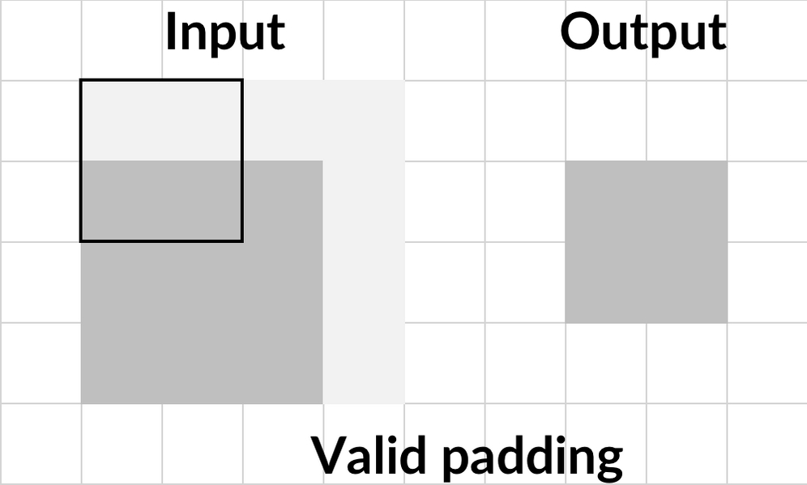

Lab 3. Utilizing Computer Vision
---------------------------------------------


When Snapchat first introduced a filter featuring a breakdancing hotdog,
the stock price of the company surged. However, investors were less
interested in the hotdog\'s handstand; what actually fascinated them was
that Snapchat had successfully built a powerful form of computer vision
technology.

The Snapchat app was now not only able to take pictures, but it was also
able to find the surfaces within those pictures that a hotdog could
breakdance on. Their app would then stick the hotdog there, something
that could still be done when the user moved their phone, allowing the
hotdog to keep dancing in the same spot.

While the dancing hotdog may be one of the sillier applications of
computer vision, it successfully showed the world the potential of the
technology. In a world full of cameras, from the billions of
smartphones, security cameras, and satellites in use every day, to
**Internet of Things** (**IoT**) devices, being
able to interpret images yields great benefits for both consumers and
producers.

Computer vision allows us to both perceive and interpret the real world
at scale. You can think of it like this: no analyst could ever look at
millions of satellite images to mark mining sites and track their
activity over time; it\'s just not possible. Yet for computers, it\'s
not just a possibility; it\'s something that\'s a reality here and now.

In fact, something that's being used in the real world now, by several
firms, is retailers counting the number of cars in their parking lot in
order to estimate what the sales of goods will be in a given period.

Another important application of computer vision can be seen in finance,
specifically in the area of insurance. For instance, insurers might use
drones to fly over roofs in order to spot issues before they become an
expensive problem. This could extend to them using computer vision to
inspect factories and equipment they insure.

Looking at another case in the finance sector, banks needing to comply
with **Know-Your-Customer** (**KYC**) rules are
automating back-office processes and identity verification. In financial
trading, computer vision can be applied to candlestick charts in order
to find new patterns for technical analysis. We could dedicate a whole
course to the practical applications of computer vision.

In this lab, we will be covering the building blocks of computer
vision models. This will include a focus on the following topics:


-   Convolutional layers.
-   Padding.
-   Pooling.
-   Regularization to prevent overfitting.
-   Momentum-based optimization.
-   Batch normalization.
-   Advanced architectures for computer vision beyond classification.
-   A note on libraries.

#### Pre-reqs:
- Google Chrome (Recommended)

#### Lab Environment
Notebooks are ready to run. All packages and datasets have been installed. There is no requirement for any setup.

**Note:** Elev8ed Notebooks (powered by Jupyter) will be accessible at the port given to you by your instructor. Password for jupyterLab : `1234`

All Notebooks are present in `work/machine-learning-for-finance` folder.


Before we start, let\'s have a look at all the different libraries we
will be using in this lab:

- **Keras**: A high-level neural 
    network library and an interface to TensorFlow.
- **TensorFlow**: A dataflow programming
     and machine learning library that we use for
    GPU-accelerated computation.
- **Scikit-learn**: A popular machine
    learning library with implementation of many classic algorithms as
    well as evaluation tools.
- **OpenCV**: An image processing
    library that can be used for rule-based augmentation
- **NumPy**: A library for handling
    matrices in Python.
- **Seaborn**: A plotting library.
- **tqdm**: A tool to monitor the
    progress of Python programs.


It\'s worth taking a minute to note that all of these libraries, except
for OpenCV, can be installed via `pip`; for example,
`pip install keras`.

OpenCV, however, will require a slightly more complex installation
procedure. This is beyond the scope of this course, but the information is
well documented online via OpenCV documentation,
which you can view at the following URL:
<https://docs.opencv.org/trunk/df/d65/tutorial_table_of_content_introduction.html>.

Alternately, it\'s worth noting that both Kaggle and Google Colab come
with OpenCV preinstalled. To run the examples in this lab, make sure
you have OpenCV installed and can import with `import cv2`.


Convolutional Neural Networks
------------------------------


**Convolutional Neural Networks**, **ConvNets**,
or **CNNs** for short, are the driving engine behind computer
vision. ConvNets allow us to work with larger images while still keeping
the network at a reasonable size.

The name Convolutional Neural Network comes from
the mathematical operation that differentiates them from regular neural
networks. Convolution is the mathematically correct term for sliding one
matrix over another matrix. We\'ll explore in the next section,
[*Filters on MNIST*], why this is important for ConvNets,
but also why this is not the best name in the world for them, and why
ConvNets should, in reality, be called **filter nets**.

You may be asking, \"but why filter nets?\" The answer is simply because
what makes them work is the fact that they use filters.

In the next section, we will be working with the MNIST dataset, which is
a collection of handwritten digits that has become a standard \"Hello,
World!\" application for computer vision.


### Filters on MNIST


What does a computer actually see when it sees an
image? Well, the values of the pixels are stored as
numbers in the computer. So, when the computer [*sees*] a
black-and-white image of a seven, it actually sees something similar to
the following:


The number 7 from the MNIST dataset


The preceding is an example from the MNIST dataset. The handwritten
number in the image has been highlighted to make the figure seven
visible for humans, but for the computer, the image
is really just a collection of numbers. This means we can perform all
kinds of mathematical operations on the image.

When detecting numbers, there are a few lower-level features that make a
number. For example, in this handwritten figure 7, there\'s a
combination of one vertical straight line, one horizontal line on the
top, and one horizontal line through the middle. In contrast,
a 9 is made up of four rounded lines that form a circle at the top and a
straight, vertical line.

We\'re now able to present the central idea behind ConvNets. We can use
small filters that can detect a certain kind of low-level feature, such
as a vertical line, and then slide it over the entire
 image to detect all the vertical lines in the image.

The following screenshot shows a vertical line filter. To detect
vertical lines in our image, we need to slide this 3x3 matrix filter
over the image.


A vertical line filter


Using the MNIST dataset on the following page, we start in the top-left
corner and slice out the top-left 3x3 grid of pixels, which in this case
is all zeros.

We then perform an element-wise multiplication of all the elements in
the filter with all elements in the slice of the image. The nine
products then get summed up, and bias is added. This value then forms
the output of the filter and gets passed on as a new pixel to the next
layer:


As a result, the output of our vertical line filter will look like this:


The output of a vertical line filter


Take a minute to notice that the vertical lines are
visible while the horizontal lines are gone. Only a
few artifacts remain. Also, notice how the filter captures the vertical
line from one side.

Since it responds to high pixel values on the left and low pixel values
on the right, only the right side of the output shows strong positive
values. Meanwhile, the left side of the line
actually shows negative values. This is not a big problem in practice as
there are usually different filters for different kinds of lines and
directions.


### Adding a second filter


Our vertical filter is working, but we\'ve already noticed that we also
need to filter our image for horizontal lines in order to detect a
seven.

Our horizontal line filter might look like this:


A horizontal line filter


Using that example, we can now slide this filter over our image in the
exact same way we did with the vertical filter, resulting in the
following output:


The output of the vertical line filter


See how this filter removes the vertical lines and
pretty much only leaves the horizontal lines? The question now is what
do we now pass onto the next layer? Well, we stack the outputs of both
filters on top of each other, creating a three-dimensional cube:


The MNIST convolution


By adding multiple convolutional layers, our
ConvNet is able to extract ever more complex and semantic features.


Filters on color images
-----------------------------------------


Of course, our filter technique is not only limited to black-and-white
images. In this section we\'re going to have a look at color images.

The majority of color images consist of three layers or channels, and
this is commonly referred to as RGB, the initialism for the three
layers. They are made up of one red channel, one 
blue channel, and one green channel. When these three
channels are laid on top of each other, they add up to create the
traditional color image that we know.

Taking that concept, an image is therefore not flat, but actually a
cube, a three-dimensional matrix. Combining this idea with our
objective, we want to apply a filter to the image, and apply it to all
three channels at once. We will, therefore, perform an element-wise
multiplication between two three-dimensional cubes.

Our 3x3 filter now has a depth of three and thus nine parameters,
plus the bias:


An example of a filter cube or convolutional kernel


This cube, which is referred to as a convolutional
kernel, gets slid over the image just like the two-dimensional matrix
did before. The element-wise products then again get summed up, the bias
is added, and the outcome represents a pixel in the next layer.

Filters always capture the whole depth of the previous layer. The
filters are moved over the width and height of the image. Likewise,
filters are not moved across the depth, that is, the different channels,
of an image. In technical terms, weights, the numbers that make up the
filters, are shared over width and height, but not over different
channels.


The building blocks of ConvNets in Keras
----------------------------------------------------------


In this section, we will be building a simple
ConvNet that can be used for classifying the MNIST
characters, while at the same time, learning about the different pieces
that make up modern ConvNets.

We can directly import the MNIST dataset from Keras by running the
following code:


``` {.programlisting .language-markup}
from keras.datasets import mnist
(x_train, y_train), (x_test, y_test) = mnist.load_data()
```


Our dataset contains 60,000 28x28-pixel images. MNIST characters are
black and white, so the data shape usually does not include channels:


``` {.programlisting .language-markup}
x_train.shape
```


``` {.programlisting .language-markup}
out: (60000, 28, 28)
```


We will take a closer look at color channels later,
but for now, let\'s expand our data dimensions to show that we
 only have a one-color channel. We can achieve this by
running the following:


``` {.programlisting .language-markup}
import numpy as np
x_train = np.expand_dims(x_train,-1)
x_test = np.expand_dims(x_test,-1)
x_train.shape
```


``` {.programlisting .language-markup}
out: (60000, 28, 28, 1)
```


With the code being run, you can see that we now have a single color
channel added.


### Conv2D


Now we come to the meat and potatoes of ConvNets:
using a convolutional layer in Keras. Conv2D is the
actual convolutional layer, with one Conv2D layer housing several
filters, as can be seen in the following code:


``` {.programlisting .language-markup}
from keras.layers import Conv2D
from keras.models import Sequential

model = Sequential()

img_shape = (28,28,1)

model.add(Conv2D(filters=6,
                 kernel_size=3,
                 strides=1,
                 padding='valid',
                 input_shape=img_shape))
```


When creating a new Conv2D layer, we must specify the number of filters
we want to use, and the size of each filter.


#### Kernel size


The size of the filter is also called
`kernel_size`, as the individual filters are sometimes called
kernels. If we only specify a single number as the kernel size,
Keras will assume that our filters are squares. In this case, for
example, our filter would be 3x3 pixels.

It is possible, however, to specify non-square kernel sizes by passing a
tuple to the `kernel_size` parameter. For example, we could
choose to have a 3x4-pixel filter through
`kernel_size = (3,4)`. However, this is very rare, and in the
majority of cases, filters have a size of either 3x3 or 5x5.
Empirically, researchers have found that this is a size that yields good
results.


#### Stride size


The `strides` parameter specifies the step size, also called
the stride size, with which the convolutional filter slides over the
image, usually referred to as the feature map. In the vast majority of
cases, filters move pixel by pixel, so their stride
size is set to 1. However, there are researchers that make more
extensive use of larger stride sizes in order to reduce the spatial size
of the feature map.

Like with `kernel_size`, Keras assumes that we use the same
stride size horizontally and vertically if we specify only one value,
and in the vast majority of cases that is correct. However, if we want
to use a stride size of one horizontally, but two vertically, we can
pass a tuple to the parameter as follows: `strides=(1,2)`. As
in the case of the filter size, this is rarely done.


#### Padding


Finally, we have to add `padding` to our
convolutional layer. Padding adds zeros around our image. This can be
done if we want to prevent our feature map from
shrinking.

Let\'s consider a 5x5-pixel feature map and a 3x3 filter. The filter
only fits on the feature map nine times, so we\'ll end up with a 3x3
output. This both reduces the amount of information that we can capture
in the next feature map, and how much the outer pixels of the input
feature map can contribute to the task. The filter never centers on
them; it only goes over them once.

There are three options for padding: not using padding, known as \"No\"
padding, \"Same\" padding and \"Valid\" padding.

Let\'s have a look at each of the three paddings. First, No Padding:


Option 1: No padding


Then we have Same Padding:


Option 2: Same padding


To ensure the output has the same size as the
input, we can use `same` padding. Keras will then add enough
zeros around the input feature map so that we can 
preserve the size. The default padding setting, however, is
`valid`. This padding does not preserve the feature map size,
but only makes sure that the filter and stride size actually fit on the
input feature map:





Option 3: Valid padding


#### Input shape


Keras requires us to specify the input shape.
However, this is only required for the first layer.
For all the following layers, Keras will infer the input shape from the
previous layer\'s output shape.


#### Simplified Conv2D notation


The preceding layer takes a 28x28x1 input and slides six filters with a
2x2 filter size over it, going pixel by pixel. A more common way to
specify the same layer would be by using the following code:


``` {.programlisting .language-markup}
model.add(Conv2D(6,3,input_shape=img_shape))
```


The number of filters (here `6`) and the filter size (here
`3`) are set as positional arguments, while
`strides` and `padding` default to `1` and
`valid` respectively. If this was a layer deeper in the
network, we wouldn\'t even have to specify the input shape.


#### ReLU activation


Convolutional layers only perform a linear step.
The numbers that make up the image get multiplied with the filter, which
is a linear operation.

So, in order to approximate complex functions, we need to introduce
non-linearity with an activation function. The most common activation
function for computer vision is the Rectified Linear Units, or ReLU
function, which we can see here:


The ReLU activation function


The ReLU formula, which was used to produce the above chart, can be seen
below:

[*ReLU(x) = max(x, 0)*]

In other words, the ReLU function returns the input if the input is
positive. If it\'s not, then it returns zero. This very simple function
has been shown to be quite useful, making gradient descent converge
faster.

It is often argued that ReLU is faster because the derivative for all
values above zero is just one, and it does not become very small as the
derivative for some extreme values does, for example, with sigmoid or
tanh.

ReLU is also less computationally expensive than both sigmoid and tanh.
It does not require any computationally expensive
calculations, input values below zero are just set to zero, and the rest
is outputted. Unfortunately, though, ReLU activations are a bit fragile
and can \"die.\"

When the gradient is very large and moves multiple weights towards a
negative direction, then the derivative of ReLU will also always be
zero, so the weights never get updated again. This might mean that a
neuron never fires again. However, this can be mitigated through a
smaller learning rate.

Because ReLU is fast and computationally cheap, it has become the
default activation function for many practitioners. To use the ReLU
function in Keras, we can just name it as the desired activation
function in the activation layer, by running this code:


``` {.programlisting .language-markup}
from keras.layers import Activation
model.add(Activation('relu'))
```


### MaxPooling2D


It\'s common practice to use a pooling layer after
a number of convolutional layers. Pooling decreases the spatial size of
the feature map, which in turn reduces the number of parameters needed
in a neural network and thus reduces overfitting.

Below, we can see an example of Max Pooling:


Max pooling


Max pooling returns the maximum element out of a
pool. This is in contrast to the example average of
`AveragePooling2D`, which returns the average of a pool. Max
pooling often delivers superior results to average pooling, so it is the
standard most practitioners use.

Max pooling can be achieved by running the following:


``` {.programlisting .language-markup}
from keras.layers import MaxPool2D

model.add(MaxPool2D(pool_size=2, 
                    strides=None, 
                    padding='valid'))
```


When using a max pooling layer in Keras, we have to specify the desired
pool size. The most common value is a 2x2 pool. Just as with the
`Conv2D` layer, we can also specify a stride size.

For pooling layers, the default stride size is `None`, in
which case Keras sets the stride size to be the same as the pool size.
In other words, pools are next to each other and don\'t overlap.

We can also specify padding, with `valid` being the default
choice. However, specifying `same` padding for 
pooling layers is extremely rare since the point of a pooling
layer is to reduce the spatial size of the feature map.

Our `MaxPooling2D` layer here takes 2x2-pixel pools next to
each other with no overlap and returns the maximum element. A more
common way of specifying the same layer is through the execution of the
following:


``` {.programlisting .language-markup}
model.add(MaxPool2D(2))
```


In this case, both `strides` and `padding` are set
to their defaults, `None` and `valid` respectively.
There is usually no activation after a pooling layer since the pooling
layer does not perform a linear step.


### Flatten


You might have noticed that our feature maps are
three dimensional while our desired output is a one-dimensional vector,
containing the probability of each of the 10 classes. So, how do we get
from 3D to 1D? Well, we `Flatten` our feature maps.

The `Flatten` operation works similar to NumPy\'s
`flatten` operation. It takes in a batch of feature maps with
dimensions `(batch_size, height, width, channels)` and returns
a set of vectors with dimensions
`(batch_size, height * width * channels)`.

It performs no computation and only reshapes the matrix. There are no
hyperparameters to be set for this operation, as you can see in the
following code:


``` {.programlisting .language-markup}
from keras.layers import Flatten

model.add(Flatten())
```


### Dense


ConvNets usually consist of a feature extraction
part, the convolutional layers, as well as a classification part. The
classification part is made up out of the simple fully connected layers
that we've already explored in Lab
1,
[*Neural Networks and Gradient-Based Optimization*], and
[Lab
2,
[*Applying Machine Learning to Structured Data*].

To distinguish the plain layers from all other types of layers, we refer
to them as `Dense` layers. In a dense layer, each input neuron
is connected to an output neuron. We only have to specify the number of
output neurons we would like, in this case, 10.

This can be done by running the following code:


``` {.programlisting .language-markup}
from keras.layers import Dense
model.add(Dense(10))
```


After the linear step of the dense layer, we can add a
`softmax` activation for multi-class regression, just as we
did in the first two labs, by running the following code:


``` {.programlisting .language-markup}
model.add(Activation('softmax'))
```


### Training MNIST


Let\'s now put all of these elements together so we can train a ConvNet
on the MNIST dataset.


#### The model


First, we must specify the model, which we can do
with the following code:


``` {.programlisting .language-markup}
from keras.layers import Conv2D, Activation, MaxPool2D, Flatten, Dense
from keras.models import Sequential

img_shape = (28,28,1)

model = Sequential()

model.add(Conv2D(6,3,input_shape=img_shape))

model.add(Activation('relu'))

model.add(MaxPool2D(2))

model.add(Conv2D(12,3))

model.add(Activation('relu'))

model.add(MaxPool2D(2))

model.add(Flatten())

model.add(Dense(10))

model.add(Activation('softmax'))
```


In the following code, you can see the general structure of a typical
ConvNet:


``` {.programlisting .language-markup}
Conv2D
Pool 

Conv2D
Pool

Flatten

Dense
```


The convolution and pooling layers are often used together in these
blocks; you can find neural networks that repeat
the `Conv2D`, `MaxPool2D` combination tens of times.

We can get an overview of our model with the following command:


``` {.programlisting .language-markup}
model.summary()
```


Which will give us the following output:


``` {.programlisting .language-markup}
Layer (type)                 Output Shape              Param #   
=================================================================
conv2d_2 (Conv2D)            (None, 26, 26, 6)         60        
_________________________________________________________________
activation_3 (Activation)    (None, 26, 26, 6)         0         
_________________________________________________________________
max_pooling2d_2 (MaxPooling2 (None, 13, 13, 6)         0         
_________________________________________________________________
conv2d_3 (Conv2D)            (None, 11, 11, 12)        660       
_________________________________________________________________
activation_4 (Activation)    (None, 11, 11, 12)        0         
_________________________________________________________________
max_pooling2d_3 (MaxPooling2 (None, 5, 5, 12)          0         
_________________________________________________________________
flatten_2 (Flatten)          (None, 300)               0         
_________________________________________________________________
dense_2 (Dense)              (None, 10)                3010      
_________________________________________________________________
activation_5 (Activation)    (None, 10)                0         
=================================================================
Total params: 3,730
Trainable params: 3,730
Non-trainable params: 0
_________________________________________________________________
```


In this summary, you can clearly see how the pooling layers reduce the
size of the feature map. It\'s a little bit less obvious from the
summary alone, but you can see how the output of the first
`Conv2D` layer is 26x26 pixels, while the input images are
28x28 pixels.

By using `valid` padding, `Conv2D` also reduces the
size of the feature map, although only by a small amount. The same
happens for the second `Conv2D` layer, which shrinks the
feature map from 13x13 pixels to 11x11 pixels.

You can also see how the first convolutional layer only has 60
parameters, while the `Dense` layer has 3,010, over 50 times
as many parameters. Convolutional layers usually achieve surprising
feats with very few parameters, which is why they are so popular. The
total number of parameters in a network can often be significantly
reduced by convolutional and pooling layers.


#### Loading the data


The MNIST dataset we are using comes preinstalled
with Keras. When loading the data, make sure you have an internet
connection if you want to use the dataset directly via Keras, as Keras
has to download it first.

You can import the dataset with the following code:


``` {.programlisting .language-markup}
from keras.datasets import mnist
(x_train, y_train), (x_test, y_test) = mnist.load_data()
```


As explained at the beginning of the lab, we want to reshape the
dataset so that it can have a channel dimension as well. The dataset as
it comes does not have a channel dimension yet, but this is something we
can do:


``` {.programlisting .language-markup}
x_train.shape
```


``` {.programlisting .language-markup}
out:
(60000, 28, 28)
```


So, we add a channel dimension with NumPy, with the following code:


``` {.programlisting .language-markup}
import numpy as np

x_train = np.expand_dims(x_train,-1)

x_test = np.expand_dims(x_test,-1)
```


Now there is a channel dimension, as we can see here:


``` {.programlisting .language-markup}
x_train.shape
```


``` {.programlisting .language-markup}
out:
(60000, 28, 28,1)
```


#### Compiling and training


In the previous labs, we have used one-hot
encoded targets for multiclass regression. While we
have reshaped the data, the targets are still in their original form.
They are a flat vector containing the numerical data representation for
each handwritten figure. Remember that we have 60,000 of these in the
MNIST dataset:


``` {.programlisting .language-markup}
y_train.shape
```


``` {.programlisting .language-markup}
out:
(60000,)
```


Transforming targets through one-hot encoding is a frequent and annoying
task, so Keras allows us to just specify a loss function that converts
targets to one-hot on the fly. This loss function is called
`sparse_categorical_crossentropy`.

It\'s the same as the categorical cross-entropy loss used in earlier
labs, the only difference is that this uses sparse, that is, not
one-hot encoded, targets.

Just as before, you still need to make sure that your network output has
as many dimensions as there are classes.

We\'re now at a point where we can compile the model, which we can do
with the following code:


``` {.programlisting .language-markup}
model.compile(loss='sparse_categorical_crossentropy',optimizer='adam',metrics=['acc'])
```


As you can see, we are using an Adam optimizer. The exact workings of
Adam are explained in the next section, [*More bells and whistles for
our neural network*], but for now, you can just think of it
as a more sophisticated version of stochastic
gradient descent.

When training, we can directly specify a validation
set in Keras by running the following code:


``` {.programlisting .language-markup}
history = model.fit(x_train,y_train,batch_size=32,epochs=5,validation_data=(x_test,y_test))
```


Once we have successfully run that code, we\'ll get the following
output:


``` {.programlisting .language-markup}
Train on 60000 samples, validate on 10000 samples
Epoch 1/10
60000/60000 [==============================] - 19s 309us/step - loss: 5.3931 - acc: 0.6464 - val_loss: 1.9519 - val_acc: 0.8542
Epoch 2/10
60000/60000 [==============================] - 18s 297us/step - loss: 0.8855 - acc: 0.9136 - val_loss: 0.1279 - val_acc: 0.9635
....
Epoch 10/10
60000/60000 [==============================] - 18s 296us/step - loss: 0.0473 - acc: 0.9854 - val_loss: 0.0663 - val_acc: 0.9814
```


To better see what is going on, we can plot the
progress of training with the following code:


``` {.programlisting .language-markup}
import matplotlib.pyplot as plt

fig, ax = plt.subplots(figsize=(10,6))
gen = ax.plot(history.history['val_acc'], label='Validation Accuracy')
fr = ax.plot(history.history['acc'],dashes=[5, 2], label='Training Accuracy')

legend = ax.legend(loc='lower center', shadow=True)

plt.show()
```


This will give us the following chart:


The visualized output of validation and training accuracy


As you can see in the preceding chart, the model achieves about 98%
validation accuracy, which is pretty nice!


More bells and whistles for our neural network
----------------------------------------------------------------


Let\'s take a minute to look at some of the other elements of our neural
network.


### Momentum


In previous labs we\'ve explained gradient descent in terms of
someone trying to find the way down a mountain by
just following the slope of the floor. Momentum can be explained with
an analogy to physics, where a ball is rolling down the same hill. A
small bump in the hill would not make the ball roll in a completely
different direction. The ball already has some momentum, meaning that
its movement gets influenced by its previous movement.

Instead of directly updating the model parameters with their gradient,
we update them with the exponentially weighted moving average. We update
our parameter with an outlier gradient, then we take the moving average,
which will smoothen out outliers and capture the general direction of
the gradient, as we can see in the following diagram:


How momentum smoothens gradient updates


The exponentially weighted moving average is a clever mathematical trick
used to compute a moving average without having to
memorize a set of previous values. The exponentially weighted average,
[*V*], of some value,
[]{.inlinemediaobject}, would be as
follows:


A beta value of 0.9 would mean that 90% of the mean would come from the
previous moving average,
[]{.inlinemediaobject}, and 10% would come
from the new value,
[]{.inlinemediaobject}.

Using momentum makes learning more robust against gradient descent
pitfalls such as outlier gradients, local minima, and saddle points.

We can augment the standard stochastic gradient descent optimizer in
Keras with momentum by setting a value for beta, which we do in the
following code:


``` {.programlisting .language-markup}
from keras.optimizers import SGD
momentum_optimizer = SGD(lr=0.01, momentum=0.9)
```


This little code snippet creates a stochastic gradient descent optimizer
with a learning rate of 0.01 and a beta value of 0.9. We can use it when
we compile our model, as we\'ll now do with this:


``` {.programlisting .language-markup}
model.compile(optimizer=momentum_optimizer,loss='sparse_categorical_crossentropy',metrics=['acc'])
```


### The Adam optimizer


Back in 2015, Diederik P. Kingma and Jimmy Ba created the
**Adam** (**Adaptive Momentum Estimation**)
optimizer. This is another way to make gradient descent 
work more efficiently. Over the past few years, this method
has shown very good results and has, therefore,
become a standard choice for many practitioners. For example, we\'ve
used it with the MNIST dataset.

First, the Adam optimizer computes the exponentially weighted average of
the gradients, just like a momentum optimizer does. It achieves this
with the following formula:


It then also computes the exponentially weighted average of the squared
gradients:


It then updates the model parameters like this:


Here []{.inlinemediaobject} is a very
small number to avoid division by zero.

This division by the root of squared gradients reduces the update speed
when gradients are very large. It also stabilizes
learning as the learning algorithm does not get thrown off track by
outliers as much.

Using Adam, we have a new hyperparameter. Instead of having just one
momentum factor, []{.inlinemediaobject},
we now have two, []{.inlinemediaobject}
and []{.inlinemediaobject}. The
recommended values for


and []{.inlinemediaobject} are 0.9 and
0.999 respectively.

We can use Adam in Keras like this:


``` {.programlisting .language-markup}
from keras.optimizers import adam

adam_optimizer=adam(lr=0.1,beta_1=0.9, beta_2=0.999, epsilon=1e-08)

model.compile(optimizer=adam_optimizer,loss='sparse_categorical_crossentropy',metrics=['acc'])
```


As you have seen earlier in this lab, we can also compile the model
just by passing the `adam` string as an optimizer. In this
case, Keras will create an Adam optimizer for us and choose the
recommended values.


### Regularization


Regularization is a technique used to avoid
overfitting. Overfitting is when the model fits the training data too
well, and as a result, it does not generalize well to either development
or test data. You may see that overfitting is sometimes also referred to
as \"high variance,\" while underfitting, obtaining poor results on
training, development, and test data, is referred to as \"high bias.\"

In classical statistical learning, there is a lot of focus on the
bias-variance tradeoff. The argument that is made is that a model that
fits very well to the training set is likely to be overfitting and that
some amount of underfitting (bias) has to be accepted in order to obtain
good outcomes. In classical statistical learning, the hyperparameters
that prevent overfitting also often prevent the training set
fitting well.

Regularization in neural networks, as it is presented here, is largely
borrowed from classical learning algorithms. Yet, modern machine
learning research is starting to embrace the concept of
\"orthogonality,\" the idea that different hyperparameters influence
bias and variance.

By separating those hyperparameters, the bias-variance tradeoff can be
broken, and we can find models that generalize well and deliver accurate
predictions. However, so far these efforts have only yielded small
rewards, as low-bias and low-variance models require large amounts of
training data.


#### L2 regularization


One popular technique to counter overfitting is L2 regularization. L2
regularization adds the sum of squared weights to
the loss function. We can see an example of this in the formula below:


Here [*N*] is the number of training examples and
[]{.inlinemediaobject} is the
regularization hyperparameter, which determines how much we want to
regularize, with a common value being around 0.01.

Adding this regularization to the loss function means that high weights
increase losses and the algorithm is incentivized to reduce the weights.
Small weights, those around zero, mean that the neural network will rely
less on them.

Therefore, a regularized algorithm will rely less on every single
feature and every single node activation, and instead will have a more
holistic view, taking into account many features and activations. This
will prevent the algorithm from overfitting.


#### L1 regularization


L1 regularization is very similar to L2
regularization, but instead of adding the sum of squares, it adds the
sum of absolute values, as we can see in this formula:


In practice, it is often a bit uncertain as to which of the two will
work best, but the difference between the two is not very large.


#### Regularization in Keras


In Keras, regularizers that are applied to
 the weights are called **kernel\_regularizer**,
and regularizers that are applied to the bias are
called **bias\_regularizer**. You can also apply
regularization directly to the activation of the nodes to prevent them
from being activated very strongly with
**activity\_regularizer**.

For now, let\'s add some L2 regularization to our network. To do this,
we need to run the following code:


``` {.programlisting .language-markup}
from keras.regularizers import l2

model = Sequential()


model.add(Conv2D(6,3,input_shape=img_shape, kernel_regularizer=l2(0.01)))

model.add(Activation('relu'))

model.add(MaxPool2D(2))

model.add(Conv2D(12,3,activity_regularizer=l2(0.01)))

model.add(Activation('relu'))

model.add(MaxPool2D(2))

model.add(Flatten())

model.add(Dense(10,bias_regularizer=l2(0.01)))

model.add(Activation('softmax'))
```


Setting `kernel_regularizer` as done in the first
convolutional layer in Keras means regularizing weights. Setting
`bias_regularizer` regularizes the bias, and setting
`activity_regularizer` regularizes the output activations of a
layer.

In this following example, the regularizers are set to be shown off, but
here they actually harm the performance to our network. As you can see
from the preceding training results, our network is
not actually overfitting, so setting regularizers harms performance
here, and as a result, the model underfits.

As we can see in the following output, in this case, the model reaches
about 87% validation accuracy:


``` {.programlisting .language-markup}
model.compile(loss='sparse_categorical_crossentropy',optimizer = 'adam',metrics=['acc'])
              
history = model.fit(x_train,y_train,batch_size=32,epochs=10,validation_data=(x_test,y_test))

Train on 60000 samples, validate on 10000 samples
Epoch 1/10
60000/60000 [==============================] - 22s 374us/step - loss: 7707.2773 - acc: 0.6556 - val_loss: 55.7280 - val_acc: 0.7322
Epoch 2/10
60000/60000 [==============================] - 21s 344us/step - loss: 20.5613 - acc: 0.7088 - val_loss: 6.1601 - val_acc: 0.6771
....
Epoch 10/10
60000/60000 [==============================] - 20s 329us/step - loss: 0.9231 - acc: 0.8650 - val_loss: 0.8309 - val_acc: 0.8749
```


You\'ll notice that the model achieves a higher
accuracy on the validation than on the training set; this is a clear
sign of underfitting.


### Dropout


As the title of the 2014 paper by Srivastava et al gives away, [*Dropout
is A Simple Way to Prevent Neural Networks from
Overfitting*]. It achieves this by
randomly removing nodes from the neural network:


Schematic of the dropout method. From Srivastava et al, \"Dropout: A
Simple Way to Prevent Neural Networks from Overfitting,\" 2014


With dropout, each node has a small probability of having its activation
set to zero. This means that the learning algorithm can no longer rely
heavily on single nodes, much like in L2 and L1 regularization. Dropout
therefore also has a regularizing effect.

In Keras, dropout is a new type of layer. It\'s put after the
activations you want to apply dropout to. It passes on activations, but
sometimes it sets them to zero, achieving the same effect as a dropout
in the cells directly. We can see this in the following code:


``` {.programlisting .language-markup}
from keras.layers import Dropout
model = Sequential()

model.add(Conv2D(6,3,input_shape=img_shape))
model.add(Activation('relu'))
model.add(MaxPool2D(2))

model.add(Dropout(0.2))

model.add(Conv2D(12,3))
model.add(Activation('relu'))
model.add(MaxPool2D(2))

model.add(Dropout(0.2))

model.add(Flatten())

model.add(Dense(10,bias_regularizer=l2(0.01)))

model.add(Activation('softmax'))
```


A dropout value of 0.5 is considered a good choice
if overfitting is a serious problem, while values that are over 0.5 are
not very helpful, as the network would have too few values to work with.
In this case, we chose a dropout value of 0.2, meaning that each cell
has a 20% chance of being set to zero.

Note that dropout is used after pooling:


``` {.programlisting .language-markup}
model.compile(loss='sparse_categorical_crossentropy',optimizer = 'adam',metrics=['acc'])
              
history = model.fit(x_train,y_train,batch_size=32,epochs=10,validation_data=(x_test,y_test))
```


``` {.programlisting .language-markup}
Train on 60000 samples, validate on 10000 samples
Epoch 1/10
60000/60000 [==============================] - 22s 371us/step - loss: 5.6472 - acc: 0.6039 - val_loss: 0.2495 - val_acc: 0.9265
Epoch 2/10
60000/60000 [==============================] - 21s 356us/step - loss: 0.2920 - acc: 0.9104 - val_loss: 0.1253 - val_acc: 0.9627
....
Epoch 10/10
60000/60000 [==============================] - 21s 344us/step - loss: 0.1064 - acc: 0.9662 - val_loss: 0.0545 - val_acc: 0.9835
```


The low dropout value creates nice results for us,
but again, the network does better on the validation set rather than the
training set, a clear sign of underfitting taking place. Note that
dropout is only applied at training time. When the model is used
for predictions, dropout doesn\'t do anything.


### Batchnorm


**Batchnorm**, short for **batch** 
 **normalization**, is a technique for
\"normalizing\" input data to a layer batch-wise. Each batchnorm
computes the mean and standard deviation of the data and applies a
transformation so that the mean is zero and the standard deviation is
one.

This makes training easier because the loss surface becomes more
\"round.\" Different means and standard deviations along different input
dimensions would mean that the network would have to learn a more
complicated function.

In Keras, batchnorm is a new layer as well, as you
can see in the following code:


``` {.programlisting .language-markup}
from keras.layers import BatchNormalization

model = Sequential()

model.add(Conv2D(6,3,input_shape=img_shape))
model.add(Activation('relu'))
model.add(MaxPool2D(2))

model.add(BatchNormalization())

model.add(Conv2D(12,3))
model.add(Activation('relu'))
model.add(MaxPool2D(2))

model.add(BatchNormalization())

model.add(Flatten())

model.add(Dense(10,bias_regularizer=l2(0.01)))

model.add(Activation('softmax'))
model.compile(loss='sparse_categorical_crossentropy',optimizer = 'adam',metrics=['acc'])
              
history = model.fit(x_train,y_train,batch_size=32,epochs=10,validation_data=(x_test,y_test))
```


``` {.programlisting .language-markup}
Train on 60000 samples, validate on 10000 samples
Epoch 1/10
60000/60000 [==============================] - 25s 420us/step - loss: 0.2229 - acc: 0.9328 - val_loss: 0.0775 - val_acc: 0.9768
Epoch 2/10
60000/60000 [==============================] - 26s 429us/step - loss: 0.0744 - acc: 0.9766 - val_loss: 0.0668 - val_acc: 0.9795
....
Epoch 10/10
60000/60000 [==============================] - 26s 432us/step - loss: 0.0314 - acc: 0.9897 - val_loss: 0.0518 - val_acc: 0.9843
```


Batchnorm often accelerates training by making it
easier. You can see how the accuracy rate jumps up in the first epoch
here:


Training and validation accuracy of our MNIST classifier with batchnorm


Batchnorm also has a mildly regularizing effect. Extreme values are
often overfitted to, and batchnorm reduces extreme
values, similar to activity regularization. All this makes batchnorm an
extremely popular tool in computer vision.


Working with big image datasets
-------------------------------------------------


Images tend to be big files. In fact, it\'s likely that you will not be
able to fit your entire image dataset into your machine\'s RAM.

Therefore, we need to load the images from disk
\"just in time\" rather than loading them all in advance. In this
section, we will be setting up an image data generator that loads images
on the fly.

We\'ll be using a dataset of plant seedlings in this case. This was
provided by Thomas Giselsson and others, 2017, via their publication,
[*A Public Image Database for Benchmark of Plant Seedling Classification
Algorithms*].

This dataset is available from the following link:
<https://arxiv.org/abs/1711.05458>.

You may be wondering why we\'re looking at plants; after all, plant
classifications are not a common problem that is faced in the finance
sector. The simple answer is that this dataset lends itself to
demonstrating many common computer vision techniques and is available
under an open domain license; it\'s therefore a great training dataset
for us to use.

Readers who wish to test their knowledge on a more relevant dataset
should take a look at the [*State Farm Distracted Driver*]
dataset as well as the [*Planet: Understanding the Amazon from
Space*] dataset.


### Note

The code and data for this section and the section on stacking
pretrained models can be found and run here:
<https://www.kaggle.com/jannesklaas/stacking-vgg>.


Keras comes with an image data generator that can
load files from disk out of the box. To do this, you simply need to run:


``` {.programlisting .language-markup}
from keras.preprocessing.image import ImageDataGenerator
```


To obtain a generator reading from the files, we first have to specify
the generator. In Keras, `ImageDataGenerator` offers a range
of image augmentation tools, but in our example, we will only be making
use of the rescaling function.

Rescaling multiplies all values in an image with a constant. For most
common image formats, the color values range from 0 to 255, so we want
to rescale by 1/255. We can achieve this by running the following:


``` {.programlisting .language-markup}
imgen = ImageDataGenerator(rescale=1/255)
```


This, however, is not yet the generator that loads the images for us.
The `ImageDataGenerator` class offers a range of generators
that can be created by calling functions on it.

To obtain a generator loading file, we have to call
`flow_from_directory`.

We then have to specify the directory Keras should use, the batch size
we would like, in this case `32`, as well as the target size
the images should be resized to, in this case 150x150 pixels. To do
this, we can simply run the following code:


``` {.programlisting .language-markup}
train_generator = imgen.flow_from_directory('train',batch_size=32, target_size=(150,150))
validation_generator = imgen.flow_from_directory('validation',batch_size=32, tar get_size=(150,150))
```


How did Keras find the images and how does it know
which classes the images belong to? The Keras generator expects the
following folder structure:


-   Root:

    
    -   Class 0
        
        -   img
        -   img
        -   ...
        
    

    
    -   Class 1
        
        -   img
        -   img
        -   ...
        
    

    
    -   Class 1
        
        -   img
        
    


Our dataset is already set up that way, and it\'s usually not hard to
sort images to match the generator\'s expectations.


Working with pretrained models
------------------------------------------------


Training large computer vision models is not only
hard, but computationally expensive. Therefore, it\'s common to use
models that were originally trained for another purpose and fine-tune
them for a new purpose. This is an example of transfer learning.

Transfer learning aims to transfer the learning from one task to another
task. As humans, we are very good at transferring what we have learned.
When you see a dog that you have not seen before, you don\'t need to
relearn everything about dogs for this particular dog; instead, you just
transfer new learning to what you already knew about dogs. It\'s not
economical to retrain a big network every time, as you\'ll often find
that there are parts of the model that we can reuse.

In this section, we will fine-tune VGG-16, originally trained on the
ImageNet dataset. The ImageNet competition is an annual computer vision
competition, and the ImageNet dataset consists of millions of images of
real-world objects, from dogs to planes.

In the ImageNet competition, researchers compete to build the most
accurate models. In fact, ImageNet has driven much of the progress in
computer vision over the recent years, and the models built for ImageNet
competitions are a popular basis to fine-tune models from.

VGG-16 is a model architecture developed by the visual geometry group at
Oxford University. The model consists of a convolutional part and a
classification part. We will only be using the convolutional part. In
addition, we will be adding our own classification part that can
classify plants.

VGG-16 can be downloaded via Keras by using the following code:


``` {.programlisting .language-markup}
from keras.applications.vgg16 import VGG16
vgg_model = VGG16(include_top=False,input_shape=(150,150,3))
```


``` {.programlisting .language-markup}
out: 
Downloading data from https://github.com/fchollet/deep-learning-models/releases/download/v0.1/vgg16_weights_tf_dim_ordering_tf_kernels_notop.h5
58892288/58889256 [==============================] - 5s 0us/step
```


When downloading the data, we want to let Keras know that we don\'t want
to include the top part (the classification part); we also want to let
Keras know the desired input shape. If we do not specify the input
shape, the model will accept any image size, and it
will not be possible to add `Dense` layers on top:


``` {.programlisting .language-markup}
vgg_model.summary()
```


``` {.programlisting .language-markup}
out: 
_________________________________________________________________
Layer (type)                 Output Shape              Param #   
=================================================================
input_1 (InputLayer)         (None, 150, 150, 3)       0         
_________________________________________________________________
block1_conv1 (Conv2D)        (None, 150, 150, 64)      1792      
_________________________________________________________________
block1_conv2 (Conv2D)        (None, 150, 150, 64)      36928     
_________________________________________________________________
block1_pool (MaxPooling2D)   (None, 75, 75, 64)        0         
_________________________________________________________________
block2_conv1 (Conv2D)        (None, 75, 75, 128)       73856     
_________________________________________________________________
block2_conv2 (Conv2D)        (None, 75, 75, 128)       147584    
_________________________________________________________________
block2_pool (MaxPooling2D)   (None, 37, 37, 128)       0         
_________________________________________________________________
block3_conv1 (Conv2D)        (None, 37, 37, 256)       295168    
_________________________________________________________________
block3_conv2 (Conv2D)        (None, 37, 37, 256)       590080    
_________________________________________________________________
block3_conv3 (Conv2D)        (None, 37, 37, 256)       590080    
_________________________________________________________________
block3_pool (MaxPooling2D)   (None, 18, 18, 256)       0         
_________________________________________________________________
block4_conv1 (Conv2D)        (None, 18, 18, 512)       1180160   
_________________________________________________________________
block4_conv2 (Conv2D)        (None, 18, 18, 512)       2359808   
_________________________________________________________________
block4_conv3 (Conv2D)        (None, 18, 18, 512)       2359808   
_________________________________________________________________
block4_pool (MaxPooling2D)   (None, 9, 9, 512)         0         
_________________________________________________________________
block5_conv1 (Conv2D)        (None, 9, 9, 512)         2359808   
_________________________________________________________________
block5_conv2 (Conv2D)        (None, 9, 9, 512)         2359808   
_________________________________________________________________
block5_conv3 (Conv2D)        (None, 9, 9, 512)         2359808   
_________________________________________________________________
block5_pool (MaxPooling2D)   (None, 4, 4, 512)         0         
=================================================================
Total params: 14,714,688
Trainable params: 14,714,688
Non-trainable params: 0
_________________________________________________________________
```


As you can see, the VGG model is very large, with
over 14.7 million trainable parameters. It also consists of both
`Conv2D` and `MaxPooling2D` layers, both
of which we\'ve already learned about when working on the MNIST dataset.

From this point, there are two different ways we can proceed:


-   Add layers and build a new model.

-   Preprocess all the images through the pertained model and then train
    a new model.


### Modifying VGG-16


In this section, we will be adding layers on top of
the VGG-16 model, and then from there, we will train the new, big model.

We do not want to retrain all those convolutional layers that have been
trained already, however. So, we must first \"freeze\" all the layers in
VGG-16, which we can do by running the following:


``` {.programlisting .language-markup}
for the layer in vgg_model.layers:
  layer.trainable = False
```


Keras downloads VGG as a functional API model. We will learn more about
the functional API in Lab
6,
[*Using Generative Models*], but for now, we just want to use
the Sequential API, which allows us to stack layers through
`model.add()`. We can convert a model with the functional API
with the following code:


``` {.programlisting .language-markup}
finetune = Sequential(layers = vgg_model.layers)
```


As a result of running the code, we have now created a new model called
`finetune` that works just like a normal Sequential model. We
need to remember that converting models with the Sequential API only
works if the model can actually be expressed in the Sequential API. Some
more complex models cannot be converted.

As a result of everything we\'ve just done, adding layers to our model
is now simple:


``` {.programlisting .language-markup}
finetune.add(Flatten())
finetune.add(Dense(12))
finetune.add(Activation('softmax'))
```


The newly added layers are by default trainable, while the reused model
socket is not. We can train this stacked model just as we would train
any other model, on the data generator we defined in the previous
section. This can be executed by running the following code:


``` {.programlisting .language-markup}
finetune.compile(loss='categorical_crossentropy',optimizer='adam',metrics = ['acc'])
                 
finetune.fit_generator(train_generator,epochs=8,steps_per_epoch= 4606 // 32, validation_data=validation_generator, validation_steps= 144//32)
```


After running this, the model manages to achieve a rate of about 75%
validation accuracy.


### Random image augmentation


A general problem in machine learning is that no
matter how much data we have, having more data will always be better, as
it would increase the quality of our output while also preventing
overfitting and allowing our model to deal with a larger variety of
inputs. It\'s therefore common to apply random augmentation to images,
for example, a rotation or a random crop.

The idea is to get a large number of different images out of one image,
therefore reducing the chance that the model will overfit. For most
image augmentation purposes, we can just use Keras\'
`ImageDataGenerator`.

More advanced augmentations can be done with the OpenCV library.
However, focusing on this is outside the scope of this lab.


#### Augmentation with ImageDataGenerator


When using an augmenting data generator, we only
usually use it for training. The validation generator should not use the
augmentation features because when we validate our model, we want to
estimate how well it is doing on unseen, actual data, and not augmented
data.

This is different from rule-based augmentation, where we try to create
images that are easier to classify. For this reason, we need to create
two `ImageDataGenerator` instances, one for training and one
for validation. This can be done by running the following code:


``` {.programlisting .language-markup}
train_datagen = ImageDataGenerator(
  rescale = 1/255,
  rotation_range=90,
  width_shift_range=0.2,
  height_shift_range=0.2,
  shear_range=0.2,
  zoom_range=0.1,
  horizontal_flip=True,
  fill_mode='nearest')
```


This training data generator makes use of a few built-in augmentation
techniques.


### Note

**Note**: There are more commands
available in Keras. For a full list, you should refer to the Keras
documentation at <https://keras.io/>.


In the following list, we\'ve highlighted several commonly used
commands:


-   `rescale` scales the values in the image. We used it
    before and will also use it for validation.

-   `rotation_range` is a range (0 to 180 degrees) in which to
    randomly rotate the image.

-   `width_shift_range` and `height_shift_range` are
    ranges (relative to the image size, so here 20%) in which to
    randomly stretch images horizontally or vertically.

-   `shear_range` is a range (again, relative to the image) in
    which to randomly apply shear.

-   `zoom_range` is the range in which to randomly zoom into a
    picture.

-   `horizontal_flip` specifies whether to randomly flip the
    image.

-   `fill_mode` specifies how to fill empty spaces created by,
    for example, rotation.


We can check out what the generator does by running one image through it
multiple times.

First, we need to import the Keras image tools and specify an image path
(this one was chosen at random). This can be done by running the
following:


``` {.programlisting .language-markup}
from keras.preprocessing import image
fname = 'train/Charlock/270209308.png'
```


We then need to load the image and convert it to a
NumPy array, which is achieved with the following code:


``` {.programlisting .language-markup}
img = image.load_img(fname, target_size=(150, 150))
img = image.img_to_array(img)
```


As before, we have to add a batch size dimension to the image:


``` {.programlisting .language-markup}
img = np.expand_dims(img,axis=0)
```


We then use the `ImageDataGenerator` instance we just created,
but instead of using `flow_from_directory`, we\'ll use
`flow`, which allows us to pass the data directly into the
generator. We then pass that one image we want to use, which we can do
by running this:


``` {.programlisting .language-markup}
gen = train_datagen.flow(img, batch_size=1)
```


In a loop, we then call `next` on our generator four times:


``` {.programlisting .language-markup}
for i in range(4):
    plt.figure(i)
    batch = next(gen)
    imgplot = plt.imshow(image.array_to_img(batch[0]))
    
plt.show()
```


This will produce the following output:


A few samples of the randomly modified image


The modularity tradeoff
-----------------------------------------


This lab has shown that it is possible, and
often useful, to aid a machine learning model with some rule-based
system. You might also have noticed that the images in the dataset were
all cropped to show only one plant.

While we could have built a model to locate and classify the plants for
us, in addition to classifying it, we could have also built a system
that would output the treatment a plant should directly receive. This
begs the question of how modular we should make our systems.

End-to-end deep learning was all the rage for several years. If given a
huge amount of data, a deep learning model can learn what would
otherwise have taken a system with many components much longer to learn.
However, end-to-end deep learning does have several drawbacks:


-   End-to-end deep learning needs huge amounts of data. Because models
    have so many parameters, a large amount of data is needed in order
    to avoid overfitting.

-   End-to-end deep learning is hard to debug. If you replace your
    entire system with one black box model, you have little hope of
    finding out why certain things happened.

-   Some things are hard to learn but easy to write down as a code,
    especially sanity-check rules.


Recently, researchers have begun to make their models more modular. A
great example is Ha and Schmidthuber\'s [*World Models*],
which can be read here: <https://worldmodels.github.io/>. In this,
they\'ve encoded visual information, made predictions about the future,
and chosen actions with three different models.

On the practical side, we can take a look at Airbnb, who combine
structural modeling with machine learning for their pricing engine. You
can read more about it here:
<https://medium.com/airbnb-engineering/learning-market-dynamics-for-optimal-pricing-97cffbcc53e3>.
Modelers knew that bookings roughly follow a Poisson Distribution and
that there are also seasonal effects. So, Airbnb built a model to
predict the parameters of the distribution and seasonality directly,
rather than letting the model predict bookings directly.

If you have a small amount of data, then your
algorithm\'s performance needs to come from human insight. If some
subtasks can be easily expressed in code, then it\'s usually better to
express them in code. If you need explainability and want to see why
certain choices were made, a modular setup with clearly interpretable
intermediate outputs is a good choice. However, if a task is hard and
you don\'t know exactly what subtasks it entails, and you have lots of
data, then it\'s often better to use an end-to-end approach.

It\'s very rare to use a [*pure*] end-to-end approach.
Images, for example, are always preprocessed from the camera chip, you
never really work with raw data.

Being smart about dividing a task can boost performance and reduce risk.


Computer vision beyond classification
-------------------------------------------------------


As we have seen, there are many techniques that we can use to make our
image classifier work better. These are techniques that you\'ll find
used throughout this course, and not only for computer vision
applications.

In this final section of the lab, we will discuss some approaches
that go beyond classifying images. These tasks often require more
creative use of neural networks than what we\'ve discussed throughout
this lab.

To get the most out of this section, you don\'t
need to worry too much about the details of the techniques presented,
but instead look at how researchers were creative about using neural
networks. We\'re taking this approach because you will often find that
the tasks you are looking to solve require similar creativity.


### Facial recognition


Facial recognition has many applications for retail
institutions. For instance, if you\'re in the front office, you might
want to automatically recognize your customer at an ATM, or
alternatively, you might want to offer face-based security features,
such as the iPhone offers. In the back office, however, you need to
comply with KYC regulations, which require you to identify which
customer you are working with.

On the surface, facial recognition looks like a classification task. You
give an image of a face to the machine, and it will predict which person
it is. The trouble is that you might have millions of customers, but
only one or two pictures per customer.

On top of that, you\'ll likely be continuously getting new customers.
You can\'t change your model every time you get a new customer, and
a simple classification approach will fail if it has to choose between
millions of classes with only one example for each class.

The creative insight here is that instead of classifying the customer\'s
face, you can see whether two images show the same face. You can see a
visual representation of this idea in the following diagram:


Schematic of a Siamese network


To this end, you\'ll have to run the two images through first. A Siamese
network is a class of neural network architecture that contains two or
more identical subnetworks, both of which are identical and contain the
same weights. In Keras, you can achieve such a setup by defining the
layers first and then using them in both networks. The two networks then
feed into a single classification layer, which determines whether the
two images show the same face.

To avoid running all of the customer images in our database through the
entire Siamese network every time we want to recognize a face, it\'s
common to save the final output of the Siamese network. The final output
of the Siamese network for an image is called the face embedding. When
we want to recognize a customer, we compare the embedding of the image
of the customer\'s face with the embeddings stored in our database. We
can do this with a single classification layer.

Storing facial embedding is very beneficial as it will save us a
significant amount of computational cost, in addition to allowing for
the clustering of faces. Faces will cluster together according to traits
such as sex, age, and race. By only comparing an
image to the images in the same cluster, we can save even more
computational power and, as a result, get even faster recognition.

There are two ways to train Siamese networks. We can train them together
with the classifier by creating pairs of matching and non-matching
images and then using binary cross-entropy classification loss to train
the entire model. However, another, and in many respects better, option
is to train the model to generate face embeddings directly. This
approach is described in Schroff, Kalenichenko, and Philbin\'s 2015
paper, [*FaceNet: A Unified Embedding for Face Recognition and
Clustering*], which you can read here:
<https://arxiv.org/abs/1503.03832>.

The idea is to create triplets of images: one anchor image, one positive
image showing the same face as the anchor image, and one negative image
showing a different face than the anchor image. A triplet loss is used
to make the distance between the anchor\'s embedding and the positive\'s
embedding smaller, and the distance between the anchor and the negative
larger.

The loss function looks like this:


Here []{.inlinemediaobject} is an anchor
image, and []{.inlinemediaobject} is the
output of the Siamese network, the anchor image\'s embedding. The
triplet loss is the Euclidean distance between the anchor and the
positive minus the Euclidean distance between the anchor and the
negative. A small constant,
[]{.inlinemediaobject}, is a margin
enforced between positive and negative pairs. To reach zero loss, the
difference between distances needs to be
[]{.inlinemediaobject}.

You should be able to understand that you can use a neural network to
predict whether two items are semantically the same in order to get
around large classification problems. You can train the Siamese model
through some binary classification tasks but also by treating the
outputs as embeddings and using a triplet loss. This insight extends to
more than faces. If you wanted to compare time series to classify
events, then you could use the exact same approach.


### Bounding box prediction


The likelihood is that at some point, you\'ll be
interested in locating objects within images. For instance, say you are
an insurance company that needs to inspect the roofs it insures. Getting
people to climb on roofs to check them is expensive, so an alternative
is to use satellite imagery. Having acquired the images, you now need to
find the roofs in them, as we can see in the
following screenshot. You can then crop out the roofs and send the roof
images to your experts, who will check them:


California homes with bounding boxes around their roofs


What you need are bounding box predictions. A bounding box predictor
outputs the coordinates of several bounding boxes together with
predictions for what object is shown in the box.

There are two approaches to obtaining such bounding boxes.

A **Region-based Convolutional Neural Network**
(**R-CNN**) reuses a classification model. It takes an image
and slides the classification model over the image. The 
result is many classifications for different parts of the
image. Using this feature map, a region proposal network performs a
regression task to come up with bounding boxes and a classification
network creates classifications for each
bounding box.

The approach has been refined, culminating in Ren and others\' 2016
paper, [*Faster R-CNN: Towards Real-Time Object Detection with Region
Proposal Networks*], which is available at
<https://arxiv.org/abs/1506.01497>, but the basic concept of sliding
a classifier over an image has remained the same.

**You Only Look Once** (**YOLO**), on the other
hand, uses a single model consisting of only convolutional layers. It
divides an image into a grid and predicts an object
class for each grid cell. It then predicts several possible bounding
boxes containing objects for each grid cell.

For each bounding box, it regresses coordinates and both width and
height values, as well as a confidence score that this bounding box
actually contains an object. It then eliminates all bounding boxes with
a too low confidence score or with a too large overlap with another, a
more confident bounding box.


### Note

For a more detailed description, read Redmon and Farhadi\'s 2016 paper,
[*YOLO9000: Better, Faster, Stronger*], available at
<https://arxiv.org/abs/1612.08242>. Further reading includes the 2018
paper, [*YOLOv3: An Incremental Improvement*]. This is
available at <https://arxiv.org/abs/1804.027>.

Both are well-written, tongue-in-cheek papers, that explain the YOLO
concept in more detail.


The main advantage of YOLO over an R-CNN is that it\'s much faster. Not
having to slide a large classification model is much more efficient.
However, an R-CNN\'s main advantage is that it is somewhat more accurate
than a YOLO model. If your task requires real-time analysis, you should
use YOLO; however, if you do not need real-time speed but just want the
best accuracy, then using an R-CNN is the way to go.

Bounding box detection is often used as one of many processing steps. In
the insurance case, the bounding box detector would crop out all roofs.
The roof images can then be judged by a human expert, or by a separate
deep learning model that classifies damaged roofs. Of course, you could
train an object locator to distinguish between damaged and intact roofs
directly, but in practice, this is usually not a good idea.

If you\'re interested in reading more about this, Lab
4,
[*Understanding Time Series*], has a great discussion on
modularity.


Exercises
---------------------------


Fashion MNIST is a drop-in replacement for MNIST, but instead of
handwritten digits, it is about classifying clothes. Try out the
techniques we have used in this lab on Fashion MNIST. How do they
work together? What gives good results? You can find the dataset on
Kaggle at <https://www.kaggle.com/zalando-research/fashionmnist>.

Take on the whale recognition challenge and read the top kernels and
discussion posts. The link can be found here:
<https://www.kaggle.com/c/whale-categorization-playground>. The task of
recognizing whales by their fluke is similar to recognizing humans by
their face. There are good kernels showing off bounding boxes as well as
Siamese networks. We have not covered all the technical tools needed to
solve the task yet, so do not worry about the code in detail but instead
focus on the concepts shown.


Summary 
-------------------------


In this lab, you have seen the building blocks of computer vision
models. We\'ve learned about convolutional layers, and both the ReLU
activation and regularization methods. You have also seen a number of
ways to use neural networks creatively, such as with Siamese networks
and bounding box predictors.

You have also successfully implemented and tested all these approaches
on a simple benchmark task, the MNIST dataset. We scaled up our training
and used a pretrained VGG model to classify thousands of plant images,
before then using a Keras generator to load images from disk on the fly
and customizing the VGG model to fit our new task.

We also learned about the importance of image augmentation and the
modularity tradeoff in building computer vision models. Many of these
building blocks, such as convolutions, batchnorm, and dropout, are used
in other areas beyond computer vision. They are fundamental tools that
you will see outside of computer vision applications as well. By
learning about them here, you have set yourself up to discover a wide
range of possibilities in, for example, time series or generative
models.

Computer vision has many applications in the financial industry,
especially in back-office functions as well as alternative alpha
generation. It is one application of modern machine learning that can
translate into real value for many corporations today. An increasing
number of firms incorporate image-based data sources in their decision
making; you are now prepared to tackle such problems head-on.

Over the course of this lab, we\'ve seen that an entire pipeline is
involved in a successful computer vision project, and working on the
pipeline often has a similar or greater benefit as compared to working
on the model.

In the next lab, we will look at the most iconic and common form of
financial data: time series. We will tackle the task of forecasting web
traffic using more traditional statistical methods, such as
**ARIMA** (short for **AutoRegressive Integrated Moving
Average**), as well as modern neural network-based approaches.
You will also learn about feature engineering with autocorrelation
and Fourier transformations. Finally, you will learn how to compare and
contrast different forecasting methods and build a high-quality
forecasting system.
