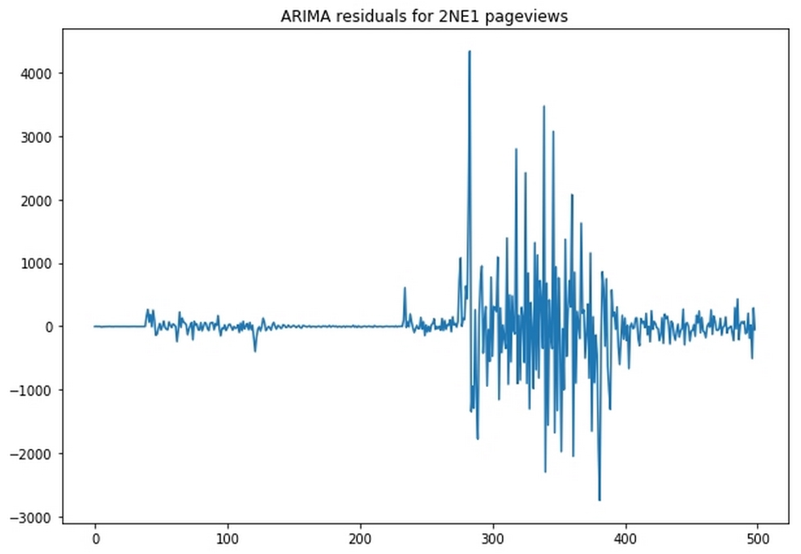

Lab 4. Understanding Time Series
---------------------------------------------


A time series is a form of data that has a temporal dimension and is
easily the most iconic form of financial data out there. While a single
stock quote is not a time series, take the quotes you get every day and
line them up, and you get a much more interesting
time series. Virtually all media materials related to finance sooner or
later show a stock price gap; not a list of prices at a given moment,
but a development of prices over time.

You\'ll often hear financial commenters discussing the movement of
prices: \"Apple Inc. is up 5%.\" But what does that mean? You\'ll hear
absolute values a lot less, such as, \"A share of Apple Inc. is
\$137.74.\" Again, what does that mean? This occurs because market
participants are interested in how things will develop in the future and
they try to extrapolate these forecasts from how things developed in the
past:


Multiple time series graphs as seen on Bloomberg TV


Most forecasting that is done involves looking at past developments over
a period of time. The concept of a time series set of data is an
important element related to forecasting; for example, farmers will look
at a time series dataset when forecasting crop yields. Because of this,
a vast body of knowledge and tools for working with time series has
developed within the fields of statistics, econometrics,
and engineering.

In this lab, we will be looking at a few classic tools that are
still very much relevant today. We will then learn how neural networks
can deal with time series, and how deep learning models can express
uncertainty.

Before we jump into looking at time series, I need to set your
expectations for this lab. Many of you might have
come to this lab to read about stock market forecasting,
but I need to warn you that this lab is not about stock market
forecasting, neither is any other lab in this course.

Economic theory shows that markets are somewhat efficient. The efficient
market hypothesis states that all publicly available information is
included in stock prices. This extends to information on how to process
information, such as forecasting algorithms.

If this course were to present an algorithm that could predict prices on
the stock market and deliver superior returns, many investors would
simply implement this algorithm. Since those algorithms would all buy or
sell in anticipation of price changes, they would change the prices in
the present, thus destroying the advantage that you would gain by using
the algorithm. Therefore, the algorithm presented would not work for
future readers.

Instead, this lab will use traffic data from Wikipedia. Our goal is
to forecast traffic for a specific Wikipedia page. We can obtain the
Wikipedia traffic data via the `wikipediatrend` CRAN package.

The dataset that we are going to use here is the traffic data of around
145,000 Wikipedia pages that has been provided by Google. The data can
be obtained from Kaggle.


### Note

The data can be found at the following links:
<https://www.kaggle.com/c/web-traffic-time-series-forecasting>

<https://www.kaggle.com/muonneutrino/wikipedia-traffic-data-exploratio>


#### Pre-reqs:
- Google Chrome (Recommended)

#### Lab Environment
Notebooks are ready to run. All packages and datasets have been installed. There is no requirement for any setup.

**Note:** Elev8ed Notebooks (powered by Jupyter) will be accessible at the port given to you by your instructor. Password for jupyterLab : `1234`

All Notebooks are present in `work/machine-learning-for-finance` folder.


Visualization and preparation in pandas
---------------------------------------------------------

As we saw in Lab 2,
[*Applying Machine Learning to Structured Data*], it\'s
usually a good idea to get an overview of the data before we
 start training. You can achieve this for the data we
obtained from Kaggle by running the following:


``` {.programlisting .language-markup}
train = pd.read_csv('../input/train_1.csv').fillna(0)
train.head()
```


Running this code will give us the following table:


      Page                                         2015-07-01   2015-07-02   ...   2016-12-31
  --- -------------------------------------------- ------------ ------------ ----- ------------
  0   2NE1\_zh.wikipedia.org\_all-access\_spider   0            0            ...   0
  1   2PM\_zh.wikipedia.org\_all-access\_spider    0            0            ...   0


The data in the **Page** column contains the name of the
page, the language of the Wikipedia page, the type of accessing device,
and the accessing agent. The other columns contain the traffic for that
page on that date.

So, in the preceding table, the first row contains the page of 2NE1, a
Korean pop band, on the Chinese version of Wikipedia, by all methods of
access, but only for agents classified as spider traffic; that is,
traffic not coming from humans. While most time series work is focused
on local, time-dependent features, we can enrich
all of our models by providing access to **global features**.

Therefore, we want to split up the page string into smaller, more useful
features. We can achieve this by running the following code:


``` {.programlisting .language-markup}
def parse_page(page):
    x = page.split('_')
    return ' '.join(x[:-3]), x[-3], x[-2], x[-1]
```


We split the string by underscores. The name of a page could also
include an underscore, so we separate off the last three fields and then
join the rest to get the subject of the article.

As we can see in the following code, the third-from-last element is the
sub URL, for example,
[en.wikipedia.org](http://en.wikipedia.org/){.ulink}. The
second-from-last element is the access, and the last element the agent:


``` {.programlisting .language-markup}
parse_page(train.Page[0])
```


``` {.programlisting .language-markup}
Out:
('2NE1', 'zh.wikipedia.org', 'all-access', 'spider')
```


When we apply this function to every page entry in the training set, we
obtain a list of tuples that we can then join together into a new
DataFrame, as we can see in the following code:


``` {.programlisting .language-markup}
l = list(train.Page.apply(parse_page))
df = pd.DataFrame(l)
df.columns = ['Subject','Sub_Page','Access','Agent']
```


Finally, we must add this new DataFrame back to our original DataFrame
before removing the original page column, which we can do by running the
following:


``` {.programlisting .language-markup}
train = pd.concat([train,df],axis=1)
del train['Page']
```


As a result of running this code, we have successfully finished loading
the dataset. This means we can now move on to exploring it.


### Aggregate global feature statistics


After all of this hard work, we can now create some
aggregate statistics on global features.

The pandas `value_counts()` function allows us to plot the
distribution of global features easily. By running the following code,
we will get a bar chart output of our Wikipedia dataset:


``` {.programlisting .language-markup}
train.Sub_Page.value_counts().plot(kind='bar')
```


As a result of running the previous code, we will output a bar chat that
ranks the distributions of records within our dataset:


Distribution of records by Wikipedia country page


The preceding plot shows the number of time series
available for each subpage. Wikipedia has subpages for different
languages, and we can see that our dataset contains pages from the
English (en), Japanese (ja), German (de), French (fr), Chinese (zh),
Russian (ru), and Spanish (es) Wikipedia sites.

In the bar chart we produced you may have also noted two non-country
based Wikipedia sites. Both
[commons.wikimedia.org](http://commons.wikimedia.org/){.ulink} and
[www.mediawiki.org](http://www.mediawiki.org/){.ulink} are used to host
media files such as images.

Let\'s run that command again, this time focusing on the type of access:


``` {.programlisting .language-markup}
train.Access.value_counts().plot(kind='bar')
```


After running this code, we\'ll then see the following bar chart as the
output:


Distribution of records by access type


There are two possible access methods:
**mobile** and **desktop**. There\'s also a third
option **all-access**, which combines the statistics for
mobile and desktop access.

We can then plot the distribution of records by agent by running the
following code:


``` {.programlisting .language-markup}
train.Agent.value_counts().plot(kind='bar')
```


After running that code, we\'ll output the following chart:


Distribution of records by agent


There are time series available not only for spider agents, but also for
all other types of access. In classic statistical modeling, the next
step would be to analyze the effect of each of these global features and
build models around them. However, this is not necessary if there\'s
enough data and computing power available.

If that\'s the case then a neural network is able to discover the
effects of the global features itself and create new features based on
their interactions. There are only two real considerations that need to
be addressed for global features:


- **Is the distribution of features very skewed?** If this
    is the case then there might only be a few instances that possess a
    global feature, and our model might overfit on this global feature.
    Imagine that there were only a small number of articles from the
    Chinese Wikipedia in the dataset. The algorithm might distinguish
    too much based on the feature then overfit the few Chinese entries.
    Our distribution is relatively even, so we do not have to worry
    about this.

- **Can features be easily encoded?** Some global features
    cannot be one-hot encoded. Imagine that we were given the full text
    of a Wikipedia article with the time series. It would not be
    possible to use this feature straight away, as some heavy 
    preprocessing would have to be done in order to use it.
    In our case, there are a few relatively straightforward categories
    that can be one-hot encoded. The subject names, however, cannot be
    one-hot encoded since there are too many of them.


### Examining the sample time series


To examine the global features, of our dataset, we have to look at a few
sample time series in order to get an understanding of the challenges
that we may face. In this section, we will plot the views for the
English language page of [*Twenty One Pilots*], a musical duo
from the USA.

To plot the actual page views together with a 10-day rolling mean. We
can do this by running the following code:


``` {.programlisting .language-markup}
idx = 39457

window = 10


data = train.iloc[idx,0:-4]
name = train.iloc[idx,-4]
days = [r for r in range(data.shape[0] )]

fig, ax = plt.subplots(figsize=(10, 7))

plt.ylabel('Views per Page')
plt.xlabel('Day')
plt.title(name)

ax.plot(days,data.values,color='grey')
ax.plot(np.convolve(data, 
                    np.ones((window,))/window, 
                    mode='valid'),color='black')


ax.set_yscale('log')
```


There is a lot going on in this code snippet, and it is worth going
through it step by step. Firstly, we define which row we want to plot.
The Twenty One Pilots article is row 39,457 in the training dataset.
From there, we then define the window size for the rolling mean.

We separate the page view data and the name from the overall dataset by
using the pandas  `iloc` tool. This allows us to index the
data by row and column coordinates. Counting the days rather than
displaying all the dates of the measurements makes the plot easier to
read, therefore we are going to create a day counter for the
[*X*]-axis.

Next, we set up the plot and make sure it has the desired size by
setting `figsize`. We also define the axis labels and the
title. Next, we plot the actual page views. Our [*X*]
coordinates are the days, and the [*Y*] coordinates are the
page views.

To compute the mean, we are going to use a **convolve**
operation, which you might be familiar with as we explored convolutions
in Lab
3,
[*Utilizing Computer Vision*]. This 
convolve operation creates a vector of ones divided by the
window size, in this case 10. The convolve operation slides the vector
over the page view, multiplies 10-page views with 1/10, and then sums
the resulting vector up. This creates a rolling 
mean with a window size 10. We plot this mean in black.
Finally, we specify that we want to use a log scale for the
[*Y*] axis:


Access statistics for the Twenty One Pilots Wikipedia page with a
rolling mean


You can see there are some pretty large spikes in the Twenty One Pilots
graph we just generated, even though we used a logarithmic axis. On some
days, views skyrocket to 10 times what they were just days before.
Because of that, it quickly becomes clear that a
good model will have to be able to deal with such extreme spikes.

Before we move on, it\'s worth pointing out that it\'s also clearly
visible that there are global trends, as the page views generally
increase over time.

For good measure, let\'s plot the interest in Twenty One Pilots for all
languages. We can do this by running the following code:


``` {.programlisting .language-markup}
fig, ax = plt.subplots(figsize=(10, 7))
plt.ylabel('Views per Page')
plt.xlabel('Day')
plt.title('Twenty One Pilots Popularity')
ax.set_yscale('log')

for country in ['de','en','es','fr','ru']:
    idx= np.where((train['Subject'] == 'Twenty One Pilots') 
                  & (train['Sub_Page'] == '{}.wikipedia.org'.format(country)) & (train['Access'] == 'all-access') & (train['Agent'] == 'all-agents'))
                  
    idx=idx[0][0]
    
    data = train.iloc[idx,0:-4]
    handle = ax.plot(days,data.values,label=country)
    

ax.legend()
```


In this snippet, we first set up the graph, as before. We then loop over
the language codes and find the index of Twenty One Pilots. The index is
an array wrapped in a tuple, so we have to extract the integer
specifying the actual index. We then extract the page view data from the
training dataset and plot the page views.

In the following chart, we can view the output of the code that we\'ve
just produced:


Access statistics for Twenty One Pilots by country


There is clearly some correlation between the time series. The English
language version of Wikipedia (the top line) is, not surprisingly, by
far the most popular. We can also see that the time series in our
datasets are clearly not stationary; they change means and standard
deviations over time.

A stationary process is one whose unconditional
joint probability distribution stays constant over time. In other words,
things such as the series mean or standard deviation should stay
constant.

However, as you can see, between days 200-250 in the preceding graph,
the mean views on the page changes dramatically. This result undermines
some of the assumptions many classic modeling approaches make. Yet,
financial time series are hardly ever stationary, so it is worthwhile
dealing with these problems. By addressing these problems, we become
familiar with several useful tools that can help us
handle nonstationarity.


Fast Fourier transformations
----------------------------------------------


Another interesting statistic we often want to compute about time series
is the Fourier transformation (FT). Without going into the math, a
Fourier transformation will show us the amount of oscillation within a
particular frequency in a function.

You can imagine this like the tuner on an old FM radio. As you turn the
tuner, you search through different frequencies. Every once in a while,
you find a frequency that gives you a clear signal of a particular radio
station. A Fourier transformation basically scans through the entire
frequency spectrum and records at what frequencies there is a strong
signal. In terms of a time series, this is useful when trying to find
periodic patterns in the data.

Imagine that we found out that a frequency of one per week gave us a
strong pattern. This would mean that knowledge about what the traffic
was ton the same day one week ago would help our model.

When both the function and the Fourier transform are discrete, which is
the case in a series of daily measurements, it is 
called the **discrete Fourier transform**
(**DFT**). A very fast algorithm that is used for computing
the DFT is known as the **Fast Fourier Transform**
(**FFT**), which today has become an important algorithm
in scientific computing. This theory was known to the mathematician Carl
Gauss in 1805 but was brought to light more recently by American
mathematicians James W. Cooley and John Tukey in 1965.

It\'s beyond the scope of this lab to go into how and why the
Fourier transformations work, so in this section we will only be giving
a brief introduction. Imagine our function as a piece of wire. We take
this wire and wrap it around a point, and if you wrap the wire so that
the number of revolutions around the point matches the frequency of a
signal, all of the signal peaks will be on one side of the pole. This
means that the center of mass of the wire will move away from the point
we wrapped the wire around.

In math, wrapping a function around a point can be achieved by
multiplying the function [*g*]([*n*]) with
[]{.inlinemediaobject}, where
[*f*] is the frequency of wrapping, [*n*] is the
number of the item from the series, and [*i*] is the
imaginary square root of -1. Readers that are not familiar with
imaginary numbers can think of them as coordinates in which each number
has a two-dimensional coordinate consisting of both a real and an
imaginary number.

To compute the center of mass, we average the coordinates of the points
in our discrete function. The DFT formula is, therefore, as follows:


Here [*y*]\[[*f*]\] is the [*f*]th
element in the transformed series, and
[*x*]\[[*n*]\] is the [*n*]th element
of the input series, [*x*]. [*N*] is the total
number of points in the input series. Note that
[*y*]\[[*f*]\] will be a number with a real and a
discrete element.

To detect frequencies, we are only really interested in the overall
magnitude of [*y*]\[[*f*]\]. To get this magnitude
we need to so we compute the root of the sum of the squares
 of the imaginary and real parts. In Python, we do not have
to worry about all the math as we can use
`scikit-learn's fftpack`, which has an FFT function built in.

The next step is to run the following code:


``` {.programlisting .language-markup}
data = train.iloc[:,0:-4]
fft_complex = fft(data)
fft_mag = [np.sqrt(np.real(x)*np.real(x)+np.imag(x)*np.imag(x)) for x in fft_complex]
```


Here, we first extract the time series measurements without the global
features from our training set. Then we run the FFT algorithm, before
finally computing the magnitudes of the transformation.

After running that code, we now have the Fourier transformations for all
the time series datasets. In order to allow us to get a better insight
into the general behavior of the Fourier transformations we can average
them by simply running:


``` {.programlisting .language-markup}
arr = np.array(fft_mag)
fft_mean = np.mean(arr,axis=0)
```


This first turns the magnitudes into a NumPy array before then computing
the mean. We want to compute the mean per frequency, not just the mean
value of all the magnitudes, therefore we need to specify the
`axis` along which to take the mean value.

In this case, the series are stacked in rows, so taking the mean
column-wise (axis zero) will result in frequency-wise means. To better
plot the transformation, we need to create a list of frequencies tested.
The frequencies are in the form: day/all days in the dataset for each
day, so 1/550, 2/550, 3/550, and so on. To create the list we need to
run:


``` {.programlisting .language-markup}
fft_xvals = [day / fft_mean.shape[0] for day in range(fft_mean.shape[0])]
```


In this visualization, we only care about the range of frequencies in a
weekly range, so we will remove the second half of the transformation,
which we can do by running:


``` {.programlisting .language-markup}
npts = len(fft_xvals) // 2 + 1
fft_mean = fft_mean[:npts]
fft_xvals = fft_xvals[:npts]
```


Finally, we can plot our transformation:


``` {.programlisting .language-markup}
fig, ax = plt.subplots(figsize=(10, 7))
ax.plot(fft_xvals[1:],fft_mean[1:])
plt.axvline(x=1./7,color='red',alpha=0.3)
plt.axvline(x=2./7,color='red',alpha=0.3)
plt.axvline(x=3./7,color='red',alpha=0.3)
```


Upon plotting the transformation, we will have successfully produced a
chart similar to the one you see here:


Fourier transformation of Wikipedia access statistics. Spikes marked by
vertical lines


As you can see in the chart we produced, there are spikes at roughly 1/7
(0.14), 2/7 (0.28), and 3/7 (0.42). As a week has seven days, that is a
frequency of one time per week, two times per week, and three times per
week. In other words, page statistics repeat themselves (approximately)
every week, so that, for example, access on one 
Saturday correlates with access on the previous Saturday.


Autocorrelation
---------------------------------


Autocorrelation is the correlation between two
elements of a series separated by a given interval. Intuitively, we
would, for example, assume that knowledge about the last time step helps
us in forecasting the next step. But how about knowledge from 2 time
steps ago or from 100 time steps ago?

Running `autocorrelation_plot` will plot the correlation
between elements with different lag times and can help us answer these
questions. As a matter of fact, pandas comes with a handy
autocorrelation plotting tool. To use it, we have to pass a series of
data. In our case, we pass the page views of a page, selected at random.

We can do this by running the following code:


``` {.programlisting .language-markup}
from pandas.plotting import autocorrelation_plot

autocorrelation_plot(data.iloc[110])
plt.title(' '.join(train.loc[110,['Subject', 'Sub_Page']]))
```


This will present us with the following diagram:


Autocorrelation of the Oh My Girl Chinese Wikipedia page


The plot in the preceding chart shows the 
correlation of page views for the Wikipedia page of [*Oh My
Girl*], a South Korean girl group, within the Chinese
Wikipedia.

You can see that shorter time intervals between 1 and 20 days show a
higher autocorrelation than longer intervals. Likewise there are also
curious spikes, such as around 120 days and 280 days. It\'s possible
that annual, quarterly, or monthly events could lead to an increase in
the frequency of visits to the [*Oh My Girl*] Wikipedia page.

We can examine the general pattern of these frequencies by drawing 1,000
of these autocorrelation plots. To do this we run the following code:


``` {.programlisting .language-markup}
a = np.random.choice(data.shape[0],1000)

for i in a:
    autocorrelation_plot(data.iloc[i])
    
plt.title('1K Autocorrelations')
```


This code snippet first samples 1,000 random
numbers between 0 and the number of series in our dataset, which in our
case is around 145,000. We use these as indices to randomly sample rows
from our dataset for which we then draw the autocorrelation plot, which
we can see in the following graphic:


Autocorrelations for 1,000 Wikipedia pages


As you can see, autocorrelations can be quite different for different
series and there is a lot of noise within the chart. There also seems to
be a general trend toward higher correlations at around the 350-day
mark.

Therefore, it makes sense to incorporate annual lagged page views as a
time-dependent feature as well as the autocorrelation for one-year time
intervals as a global feature. The same is true for quarterly and
half-year lag as these seem to have high autocorrelations, or sometimes
quite negative autocorrelations, which makes them valuable as well.

Time series analysis, such as in the examples shown previously, can help
us engineer features for our model. Complex neural networks could, in
theory, discover all of these features by themselves. However, it is
often much easier to help them a bit, especially with information about
long periods of time.


Establishing a training and testing regime
------------------------------------------------------------


Even with lots of data available, we have to ask
ourselves; How do we want to split data between [*training*],
[*validation*], and [*testing*]. This dataset
already comes with a test set of future data, therefore we don\'t have
to worry about the test set, but for the validation set, there are two
ways of splitting: a walk-forward split, and a side-by-side split:


Possible testing regimes


In a walk-forward split, we train on all 145,000 series. To validate, we
are going to use more recent data from all the series. In a side-by-side
split, we sample a number of series for training and use the rest for
validation.

Both have advantages and disadvantages. The disadvantage of walk-forward
splitting is that we cannot use all of the observations of the series
for our predictions. The disadvantage of side-by-side splitting is that
we cannot use all series for training.

If we have few series, but multiple data observations per series, a
walk-forward split is preferable. However, if we have a lot of series,
but few observations per series, then a side-by-side split is
preferable.

Establishing a training and testing regime also aligns more nicely with
the forecasting problem at hand. In side-by-side splitting, the model
might overfit to global events in the prediction period. Imagine that
Wikipedia was down for a week in the prediction period used in
side-by-side splitting. This event would reduce the number of views for
all the pages, and as a result the model would overfit to this global
event.

We would not catch the overfitting in our
validation set because the prediction period would also be affected by
the global event. However, in our case, we have multiple time series,
but only about 550 observations per series. Therefore there seems to be
no global events that would have significantly impacted all the
Wikipedia pages in that time period.

However, there are some global events that impacted views for some
pages, such as the Winter Olympics. Yet, this is a reasonable risk in
this case, as the number of pages affected by such global events is
still small. Since we have an abundance of series and only a few
observations per series, a side-by-side split is more feasible in our
case.

In this lab, we\'re focusing on forecasting traffic for 50 days. So,
we must first split the last 50 days of each series from the rest, as
seen in the following code, before splitting the training and validation
set:


``` {.programlisting .language-markup}
from sklearn.model_selection import train_test_split

X = data.iloc[:,:500]
y = data.iloc[:,500:]

X_train, X_val, y_train, y_val = train_test_split(X.values, y.values, test_size=0.1, random_state=42)
```


When splitting, we use `X.values` to only get the data, not a
DataFrame containing the data. After splitting we are left with 130,556
series for training and 14,507 for validation.

In this example, we are going to use the **mean absolute percentage
error** (**MAPE**) as a loss and evaluation metric.
MAPE can cause division-by-zero errors if the true
value of `y` is zero. Thus, to prevent division by zero
occurring, we\'ll use a small-value epsilon:


``` {.programlisting .language-markup}
def mape(y_true,y_pred):
    eps = 1
    err = np.mean(np.abs((y_true - y_pred) / (y_true + eps))) * 100
    return err
```


A note on backtesting
---------------------------------------


The peculiarities of choosing training and testing sets are especially
important in both systematic investing and algorithmic trading. The main
way to test trading algorithms is a process called
**backtesting**.

Backtesting means we train the algorithm on data from a certain time
period and then test its performance on
[*older*] data. For example, we could train on data from a
date range of 2015 to 2018 and then test on data from 1990 to 2015. By
doing this, not only is the model\'s accuracy tested, but the backtested
algorithm executes virtual trades so its profitability can be evaluated.
Backtesting is done because there is plenty of past data available.

With all that being said, backtesting does suffer from several biases.
Let\'s take a look at four of the most important biases that we need to
be aware of:


- **Look-ahead bias**: This is introduced if future data is
    accidentally included at a point in the simulation 
    where that data would not have been available yet. This
    can be caused by a technical bug in the simulator, but it can
    also stem from a parameter calculation. If a
    strategy makes use of the correlation between two securities, for
    example, and the correlation is calculated once for all time, a
    look-ahead bias is introduced. The same goes for the calculation of
    maxima or minima.

- **Survivorship bias**: This is introduced if only stocks
    that still exist at the time of testing are included in the
    simulation. Consider, for example, the 2008 financial crisis in
    which many firms went bankrupt. Leaving the
    stocks of these firms out when building a simulator in 2018 would
    introduce survivorship bias. After all, the algorithm could have
    invested in those stocks in 2008.

- **Psychological tolerance bias**: What looks good in a
    backtest might not be good in real life. Consider an algorithm that
    loses money for four months in a row before making it all back in a
    backtest. We might feel satisfied with this algorithm. However, if
    the algorithm loses money for four months in a
    row in real life and we don\'t know whether it will make that amount
    back, then will we sit tight or pull the plug? In the backtest, we
    know the final result, but in real life, we do not.

- **Overfitting**: This is a problem for all machine
    learning algorithms, but in backtesting, overfitting is a persistent
    and insidious problem. Not only does the
    algorithm potentially overfit, but the designer of the algorithm
    might also use knowledge about the past and build an algorithm that
    overfits to it. It is easy to pick stocks in hindsight, and
    knowledge can be incorporated into models that then look great in
    backtests. While it might be subtle, such as relying on certain
    correlations that held up well in the past, but it is easy to build
    bias into models that are evaluated in backtesting.


Building good testing regimes is a core activity of any quantitative
investment firm or anyone working intensively with forecasting. One
popular strategy for testing algorithms, other than backtesting, testing
models on data that is statistically similar to stock data but differs
because it\'s generated. We might build a generator for data that looks
like real stock data but is not real, thus avoiding
knowledge about real market events creeping into our models.

Another option is to deploy models silently and test them in the future.
The algorithm runs but executes only virtual trades so that if things go
wrong, no money will be lost. This approach makes use of future data
instead of past data. However, the downside to this method is that we
have to wait for quite a while before the algorithm can be used.

In practice, a combination regime is used. Statisticians carefully
design regimes to see how an algorithm responds to different
simulations. In our web traffic forecasting model, we will simply
validate on different pages and then test on future data in the end.


Median forecasting
------------------------------------


A good sanity check and an often underrated forecasting tool is medians.
A median is a value separating the higher half of a
distribution from the lower half; it sits exactly in the middle of the
distribution. Medians have the advantage of removing noise, coupled with
the fact that they are less susceptible to outliers than means, and the
way they capture the midpoint of distribution means that they are also
easy to compute.

To make a forecast, we compute the median over a look-back window in our
training data. In this case, we use a window size of 50, but you could
experiment with other values. The next step is to select the last 50
values from our [*X*] values and compute the median.

Take a minute to note that in the NumPy median function, we have to set
`keepdims=True`. This ensures that we keep a two-dimensional
matrix rather than a flat array, which is important when computing the
error. So, to make a forecast, we need to run the following code:


``` {.programlisting .language-markup}
lookback = 50

lb_data = X_train[:,-lookback:]

med = np.median(lb_data,axis=1,keepdims=True)

err = mape(y_train,med)
```


The output returned shows we obtain an error of about 68.1%; not bad
given the simplicity of our method. To see how the medians work, let\'s
plot the [*X*] values, the true [*y*] values, and
predictions for a random page:


``` {.programlisting .language-markup}
idx = 15000

fig, ax = plt.subplots(figsize=(10, 7))


ax.plot(np.arange(500),X_train[idx], label='X')
ax.plot(np.arange(500,550),y_train[idx],label='True')

ax.plot(np.arange(500,550),np.repeat(med[idx],50),label='Forecast')

plt.title(' '.join(train.loc[idx,['Subject', 'Sub_Page']]))
ax.legend()
ax.set_yscale('log')
```


As you can see, our plotting consists of drawing three plots. For each
plot, we must specify the [*X*] and [*Y*] values
for the plot. For `X_train`, the [*X*] values range
from 0 to 500, and for `y_train` and the forecast they range
from 500 to 550. We then select the series we want to plot from our
training data. Since we have only one median value, we repeat the median
forecast of the desired series 50 times in order to draw our forecast.

The output can be seen here:


Median forecast and actual values for access of an image file. The True
values are to the right-hand side of the plot, and the median forecast
is the horizontal line in the center of them.


As you can see in the preceding output median forecast, the data for
this page, in this case, an image of American actor Eric Stoltz, is very
noisy, and the median cuts through all the noise.
The median is especially useful here for pages that are visited
infrequently and where there is no clear trend or pattern.

This is not all you can do with medians. Beyond what we\'ve just
covered, you could, for example, use different medians for weekends or
use a median of medians from multiple look-back periods. A simple tool,
such as median forecasting, is able to deliver good results with smart
feature engineering. Therefore, it makes sense to spend a bit of time on
implementing median forecasting as a baseline and performing a sanity
check before using more advanced methods.


ARIMA
-----------------------


Earlier, in the section on exploratory data analysis, we talked about
how seasonality and stationarity are important elements when it comes to
forecasting time series. In fact, median forecasting has trouble with
both. If the mean of a time series continuously shifts, then median
forecasting will not continue the trend, and if a time series shows
cyclical behavior, then the median will not continue 
with the cycle.

**ARIMA** which stands for **Autoregressive Integrated
Moving Average**, is made up of three core components:


- **Autoregression**: The model uses
    the relationship between a value and a number of lagged
    observations.

- **Integrated**: The model uses the
    difference between raw observations to make the time series
    stationary. A time series going continuously upward will have a flat
    integral as the differences between points are always the same.

- **Moving Average**: The model uses
    residual errors from a moving average.


We have to manually specify how many lagged observations we want to
include, [*p*], how often we want to differentiate the
series, [*d*], and how large the moving average window should
be, [*q*]. ARIMA then performs a linear regression against
all the included lagged observations and moving average residuals on the
differentiated series.

We can use ARIMA in Python with `statsmodels`, a library with
many helpful statistical tools. To do this, we simply run this:


``` {.programlisting .language-markup}
from statsmodels.tsa.arima_model import ARIMA
```


Then, to create a new ARIMA model, we pass the data we want to fit, in
this case from our earlier example of views for 2NE1 from the Chinese
Wikipedia, as well as the desired values for [*p*],
[*d,*] and [*q,*] in that order. In this case, we
want to include five lagged observations, differentiate once, and take a
moving average window of five. In code, this works out as follows:


``` {.programlisting .language-markup}
model = ARIMA(X_train[0], order=(5,1,5))
```


We can then fit the model using `model.fit()`:


``` {.programlisting .language-markup}
model = model.fit()
```


Running `model.summary()` at this point would output all the
coefficients as well as significance values for statistical analysis.
We, however, are more interested in how well our
model does in forecasting. So, to complete this, and see the output,
we simply run:


``` {.programlisting .language-markup}
residuals = pd.DataFrame(model.resid)
ax.plot(residuals)

plt.title('ARIMA residuals for 2NE1 pageviews')
```


After running the previous code, we\'ll be able to output the results
for 2NE1 page views, as we can see in this graph:





The residual error of the ARIMA forecast


In the preceding chart, we can see that the model does very well in the
beginning but really begins to struggle at around the 300-day mark. This
could be because page views are harder to predict or because there is
more volatility in this period.

In order for us to ensure that our model is not skewed, we need to
examine the distribution of the residuals. We can
do this by plotting a [*kernel density estimator*], which is
a mathematical method designed to estimate distributions without needing
to model them.

We can do this by running the following code:


``` {.programlisting .language-markup}
residuals.plot(kind='kde',figsize=(10,7),title='ARIMA residual distribution 2NE1 ARIMA',legend = False)
```


This code will then output the following graph:


Approximately normally distributed residuals from ARIMA forecast


As you can see, our model roughly represents a Gaussian distribution
with a mean of zero. So, it\'s all good on that front, but then the
question arises, \"how do we make forecasts?\"

To use this model for forecasting, all we have to do is to specify the
number of days we want to forecast, which we can do with the following
code:


``` {.programlisting .language-markup}
predictions, stderr, conf_int = model.forecast(50)
```


This forecast not only gives us predictions but
also the standard error and confidence interval, which is 95% by
default.

Let\'s plot the projected views against the real views to see how we are
doing. This graph shows the last 20 days for our prediction basis as
well as the forecast to keep things readable. To produce this, we must
execute the following code:


``` {.programlisting .language-markup}
fig, ax = plt.subplots(figsize=(10, 7))

ax.plot(np.arange(480,500),basis[480:], label='X')
ax.plot(np.arange(500,550),y_train[0], label='True')
ax.plot(np.arange(500,550),predictions, label='Forecast')

plt.title('2NE1 ARIMA forecasts')
ax.legend()
ax.set_yscale('log')
```


This code will output the following graph:


ARIMA forecast and actual access


You can see that ARIMA captures the periodicity of
the series very well. Its forecast does steer off a bit toward the end,
but in the beginning, it does a remarkable job.


Kalman filters
--------------------------------


Kalman filters are a method of extracting a signal from either noisy or
incomplete measurements. They were invented by Hungarian-born, American
engineer, Rudolf Emil Kalman, for the purpose of electrical engineering,
and were first used in the Apollo Space program in
the 1960s.

The basic idea behind the Kalman filter is that there is some hidden
state of a system that we cannot observe directly but for which we can
obtain noisy measurements. Imagine you want to measure the temperature
inside a rocket engine. You cannot put a measurement device directly
into the engine, because it\'s too hot, but you can have a device on the
outside of the engine.

Naturally, this measurement is not going to be perfect, as there are a
lot of external factors occurring outside of the engine that make the
measurement noisy. Therefore, to estimate the temperature inside the
rocket, you need a method that can deal with the noise. We can think of
the internal state in the page forecasting as the actual interest in a
certain page, of which the page views represent only a noisy
measurement.

The idea here is that the internal state,
[]{.inlinemediaobject}, at time
[*k*] is a state transition matrix,
[*A,*] multiplied with the previous internal state,
[]{.inlinemediaobject}, plus some process
noise, []{.inlinemediaobject}. How
interest in the Wikipedia page of 2NE1 develops is 
to some degree random. The randomness is assumed to follow a
Gaussian normal distribution with mean zero and variance
[*Q*]:


The obtained measurement at time [*k*],
[]{.inlinemediaobject}, is an observation
model, [*H*], describing how states translate to measurements
times the state, []{.inlinemediaobject},
plus some observation noise,
[]{.inlinemediaobject}. The observation
noise is assumed to follow a Gaussian normal distribution with mean zero
and variance [*R*]:


Roughly speaking, Kalman filters fit a function by estimating
[*A*], [*H*], [*Q,*] and
[*R*]. The process of going over a time series and updating
the parameters is called smoothing. The exact mathematics of the
estimation process is complicated and not very relevant if all we want
to do is forecasting. Yet, what is relevant is that we need to provide
priors to these values.

We should note that our state does not have to be only one number. In
this case, our state is an eight-dimensional vector, with one hidden
level as well as seven levels to capture weekly seasonality, as we can
see in this code:


``` {.programlisting .language-markup}
n_seasons = 7

state_transition = np.zeros((n_seasons+1, n_seasons+1))

state_transition[0,0] = 1

state_transition[1,1:-1] = [-1.0] * (n_seasons-1)
state_transition[2:,1:-1] = np.eye(n_seasons-1)
```


The transition matrix, [*A,*] looks like the following table,
describing one hidden level, which we might interpret as the real
interest as well as a seasonality model:


``` {.programlisting .language-markup}
array([[ 1.,  0.,  0.,  0.,  0.,  0.,  0.,  0.],
       [ 0., -1., -1., -1., -1., -1., -1.,  0.],
       [ 0.,  1.,  0.,  0.,  0.,  0.,  0.,  0.],
       [ 0.,  0.,  1.,  0.,  0.,  0.,  0.,  0.],
       [ 0.,  0.,  0.,  1.,  0.,  0.,  0.,  0.],
       [ 0.,  0.,  0.,  0.,  1.,  0.,  0.,  0.],
       [ 0.,  0.,  0.,  0.,  0.,  1.,  0.,  0.],
       [ 0.,  0.,  0.,  0.,  0.,  0.,  1.,  0.]])
```


The observation model, [*H,*] maps the general interest plus
seasonality to a single measurement:


``` {.programlisting .language-markup}
observation_model = [[1,1] + [0]*(n_seasons-1)]
```


The observation model looks like this:


``` {.programlisting .language-markup}
[[1, 1, 0, 0, 0, 0, 0, 0]]
```


The noise priors are just estimates scaled by a
\"smoothing factor,\" which allows us to control the update process:


``` {.programlisting .language-markup}
smoothing_factor = 5.0

level_noise = 0.2 / smoothing_factor
observation_noise = 0.2
season_noise = 1e-3

process_noise_cov = np.diag([level_noise, season_noise] + [0]*(n_seasons-1))**2
observation_noise_cov = observation_noise**2
```


`process_noise_cov` is an eight-dimensional vector, matching
the eight-dimensional state vector. Meanwhile,
`observation_noise_cov` is a single number, as we have only
a single measurement. The only real requirement for these priors is that
their shapes must allow the matrix multiplications described in the two
preceding formulas. Other than that, we are free to specify transition
models as we see them.

Otto Seiskari, a mathematician and 8th place winner in the original
Wikipedia traffic forecasting competition, wrote a very fast Kalman
filtering library, which we will be using here. His library
allows for the vectorized processing of multiple
independent time series, which is very handy if you have 145,000 time
series to process.


### Note

**Note**: The library\'s repository can be found here:
<https://github.com/oseiskar/simdkalman>.


You can install his library using the following command:


``` {.programlisting .language-markup}
pip install simdkalman
```


To import it, run the following code:


``` {.programlisting .language-markup}
import simdkalman
```


Although `simdkalman` is very sophisticated, it is quite
simple to use. Firstly, we are going to specify a Kalman filter using
the priors we just defined:


``` {.programlisting .language-markup}
kf = simdkalman.KalmanFilter(state_transition = state_transition,process_noise = process_noise_cov,observation_model = observation_model,observation_noise = observation_noise_cov)
```


From there we can then estimate the parameters and compute a forecast in
one step:


``` {.programlisting .language-markup}
result = kf.compute(X_train[0], 50)
```


Once again, we make forecasts for 2NE1\'s Chinese page and create a
forecast for 50 days. Take a minute to note that we could also pass
multiple series, for example, the first 10 with
`X_train[:10]`, and compute separate filters for all of them
at once.

The result of the compute function contains the state and observation
estimates from the smoothing process as well as predicted internal
states and observations. States and observations are Gaussian
distributions, so to get a plottable value, we need to access their
mean.

Our states are eight-dimensional, but we only care about
the non-seasonal state value, so we need to index the mean, which we can
achieve by running the following:


``` {.programlisting .language-markup}
fig, ax = plt.subplots(figsize=(10, 7))
ax.plot(np.arange(480,500),X_train[0,480:], label='X')
ax.plot(np.arange(500,550),y_train[0],label='True')

ax.plot(np.arange(500,550),
        result.predicted.observations.mean,
        label='Predicted observations')

ax.plot(np.arange(500,550),
        result.predicted.states.mean[:,0],
        label='predicted states')

ax.plot(np.arange(480,500),
        result.smoothed.observations.mean[480:],
        label='Expected Observations')

ax.plot(np.arange(480,500),
        result.smoothed.states.mean[480:,0],
        label='States')


ax.legend()
ax.set_yscale('log')
```


The preceding code will then output the following chart:


Predictions and inner states from the Kalman filter


We can clearly see in the preceding graph the effects of our prior
modeling on the predictions. We can see the model predicts strong weekly
oscillation, stronger than actually observed. Likewise, we can also see
that the model does not anticipate any trends since
we did not see model trends in our prior model.

Kalman filters are a useful tool and are used in many applications, from
electrical engineering to finance. In fact, until relatively recently,
they were the go-to tool for time series modeling. Smart modelers were
able to create smart systems that described the time series very well.
However, one weakness of Kalman filters is that they cannot discover
patterns by themselves and need carefully engineered priors in order to
work.

In the second half of this lab, we will be looking at neural
network-based approaches that can automatically model time series, and
often with higher accuracy.


Forecasting with neural networks
--------------------------------------------------


The second half of the lab is all about neural networks. In the
first part, we will be building a simple neural 
network that only forecasts the next time step. Since the
spikes in the series are very large, we will be working with
log-transformed page views in input and output. We can use the
short-term forecast neural network to make longer-term forecasts, too,
by feeding its predictions back into the network.

Before we can dive in and start building forecast models, we need to do
some preprocessing and feature engineering. The advantage of neural
networks is that they can take in both a high number of features in
addition to very high-dimensional data. The 
disadvantage is that we have to be careful about what
features we input. Remember how we discussed look-ahead bias earlier in
the lab, including future data that would not have been available at
the time of forecasting, which is a problem in backtesting.


### Data preparation


For each series, we will assemble the following features:

- `log_view`: The natural logarithm of page views. Since the
    logarithm of zero is undefined, we will use
    `log1p`, which is the natural logarithm of page views plus
    one.
- `days`: One-hot encoded weekdays.
- `year_lag`: The value of `log_view` from 365
    days ago. `-1` if there is no value available.
- `halfyear_lag`: The value of `log_view` from 182
    days ago. `-1` if there is no value available.
- `quarter_lag`: The value of `log_view` from 91
    days ago. `-1` if there is no value available.
- `page_enc`: The one-hot encoded subpage.
- `agent_enc`: The one-hot encoded agent.
- `acc_enc`: The one-hot encoded access method.
- `year_autocorr`: The autocorrelation of the series of 365
    days.
- `halfyr_autocorr`: The autocorrelation of the series of
    182 days.
- `quarter_autocorr`: The autocorrelation of the series of
    91 days.
- `medians`: The median of page views over the lookback
    period.


These features are assembled for each time series,
giving our input data the shape (batch size, look back window size, 29).


#### Weekdays


The day of the week matters. Sundays may show
different access behavior, when people are browsing from their couch,
compared to Mondays, when people may be looking up things for work. So,
we need to encode the weekday. A simple one-hot encoding will do the
job:


``` {.programlisting .language-markup}
import datetime
from sklearn.preprocessing import LabelEncoder
from sklearn.preprocessing import OneHotEncoder

weekdays = [datetime.datetime.strptime(date, '%Y-%m-%d').strftime('%a')
            for date in train.columns.values[:-4]]
```


Firstly, we turn the date strings (such as 2017-03-02) into their
weekday (Thursday). This is very simple to do, and can be done with the
following code:


``` {.programlisting .language-markup}
day_one_hot = LabelEncoder().fit_transform(weekdays)
day_one_hot = day_one_hot.reshape(-1, 1)
```


We then encode the weekdays into integers, so that \"Monday\" becomes
`1`, \"Tuesday\" becomes `2`, and so on. We reshape
the resulting array into a rank-2 tensor with shape (array length, 1) so
that the one-hot encoder knows that we have many observations, but only
one feature, and not the other way around:


``` {.programlisting .language-markup}
day_one_hot = OneHotEncoder(sparse=False).fit_transform(day_one_hot)
day_one_hot = np.expand_dims(day_one_hot,0)
```


Finally, we one-hot encode the days. We then add a new dimension to the
tensor showing that we only have one \"row\" of dates. We will later
repeat the array along this axis:


``` {.programlisting .language-markup}
agent_int = LabelEncoder().fit(train['Agent'])
agent_enc = agent_int.transform(train['Agent'])
agent_enc = agent_enc.reshape(-1, 1)
agent_one_hot = OneHotEncoder(sparse=False).fit(agent_enc)

del agent_enc
```


We will need the encoders for the agents later when we encode the agent
of each series.

Here, we first create a `LabelEncoder` instance that can
transform the agent name strings into integers. We then transform all of
the agents into such an integer string in order to set up a
`OneHotEncoder` instance that can one-hot encode the agents.
To save memory, we will then delete the already-encoded agents.

We do the same for subpages and access methods by running the following:


``` {.programlisting .language-markup}
page_int = LabelEncoder().fit(train['Sub_Page'])
page_enc = page_int.transform(train['Sub_Page'])
page_enc = page_enc.reshape(-1, 1)
page_one_hot = OneHotEncoder(sparse=False).fit(page_enc)

del page_enc

acc_int = LabelEncoder().fit(train['Access'])
acc_enc = acc_int.transform(train['Access'])
acc_enc = acc_enc.reshape(-1, 1)
acc_one_hot = OneHotEncoder(sparse=False).fit(acc_enc)

del acc_enc
```


Now we come to the lagged features. Technically, neural networks could
discover what past events are relevant for forecasting themselves.
However, this is pretty difficult because of the 
vanishing gradient problem, something that is covered in more
detail later, in the [*LSTM*] section of this lab. For
now, let\'s just set up a little function that creates an array lagged
by a number of days:


``` {.programlisting .language-markup}
def lag_arr(arr, lag, fill):
    filler = np.full((arr.shape[0],lag,1),-1)
    comb = np.concatenate((filler,arr),axis=1)
    result = comb[:,:arr.shape[1]]
    return result
```


This function first creates a new array that will fill up the \"empty
space\" from the shift. The new array has as many rows as the original
array but its series length, or width, is the number of days we want to
lag. We then attach this array to the front of our original array.
Finally, we remove elements from the back of the array in order to get
back to the original array series length or width.
We want to inform our
model about the amount of autocorrelation for different time intervals.
To compute the autocorrelation for a single series, we shift the series
by the amount of lag we want to measure the autocorrelation for. We then
compute the autocorrelation:


In this formula []{.inlinemediaobject} is
the lag indicator. We do not just use a NumPy function since there is a
real possibility that the divider is zero. In this
case, our function will just return 0:


``` {.programlisting .language-markup}
def single_autocorr(series, lag):
    s1 = series[lag:]
    s2 = series[:-lag]
    ms1 = np.mean(s1)
    ms2 = np.mean(s2)
    ds1 = s1 - ms1
    ds2 = s2 - ms2
    divider = np.sqrt(np.sum(ds1 * ds1)) * np.sqrt(np.sum(ds2 * ds2))
    return np.sum(ds1 * ds2) / divider if divider != 0 else 0
```


We can use this function, which we wrote for a single series, to create
a batch of autocorrelation features, as seen here:


``` {.programlisting .language-markup}
def batc_autocorr(data,lag,series_length):
    corrs = []
    for i in range(data.shape[0]):
        c = single_autocorr(data, lag)
        corrs.append(c)
    corr = np.array(corrs)
    corr = np.expand_dims(corr,-1)
    corr = np.expand_dims(corr,-1)
    corr = np.repeat(corr,series_length,axis=1)
    return corr
```


Firstly, we calculate the autocorrelations for each series in the batch.
Then we fuse the correlations together into one NumPy array. Since
autocorrelations are a global feature, we need to create a new dimension
for the length of the series and another new dimension to show that this
is only one feature. We then repeat the autocorrelations over the entire
length of the series.

The `get_batch` function utilizes all of these tools in order
to provide us with one batch of data, as can be seen with the
 following code:


``` {.programlisting .language-markup}
def get_batch(train,start=0,lookback = 100):                  #1
    assert((start + lookback) <= (train.shape[1] - 5))        #2
    data = train.iloc[:,start:start + lookback].values        #3
    target = train.iloc[:,start + lookback].values
    target = np.log1p(target)                                 #4
    log_view = np.log1p(data)
    log_view = np.expand_dims(log_view,axis=-1)               #5
    days = day_one_hot[:,start:start + lookback]
    days = np.repeat(days,repeats=train.shape[0],axis=0)      #6
    year_lag = lag_arr(log_view,365,-1)
    halfyear_lag = lag_arr(log_view,182,-1)
    quarter_lag = lag_arr(log_view,91,-1)                     #7
    agent_enc = agent_int.transform(train['Agent'])
    agent_enc = agent_enc.reshape(-1, 1)
    agent_enc = agent_one_hot.transform(agent_enc)
    agent_enc = np.expand_dims(agent_enc,1)
    agent_enc = np.repeat(agent_enc,lookback,axis=1)          #8
    page_enc = page_int.transform(train['Sub_Page'])
    page_enc = page_enc.reshape(-1, 1)
    page_enc = page_one_hot.transform(page_enc)
    page_enc = np.expand_dims(page_enc, 1)
    page_enc = np.repeat(page_enc,lookback,axis=1)            #9
    acc_enc = acc_int.transform(train['Access'])
    acc_enc = acc_enc.reshape(-1, 1)
    acc_enc = acc_one_hot.transform(acc_enc)
    acc_enc = np.expand_dims(acc_enc,1)
    acc_enc = np.repeat(acc_enc,lookback,axis=1)              #10
    year_autocorr = batc_autocorr(data,lag=365,series_length=lookback)
    halfyr_autocorr = batc_autocorr(data,lag=182,series_length=lookback)
    quarter_autocorr = batc_autocorr(data,lag=91,series_length=lookback)                                       #11
    medians = np.median(data,axis=1)
    medians = np.expand_dims(medians,-1)
    medians = np.expand_dims(medians,-1)
    medians = np.repeat(medians,lookback,axis=1)              #12
    batch = np.concatenate((log_view,
                            days, 
                            year_lag, 
                            halfyear_lag, 
                            quarter_lag,
                            page_enc,
                            agent_enc,
                            acc_enc, 
                            year_autocorr, 
                            halfyr_autocorr,
                            quarter_autocorr, 
                            medians),axis=2)
    
    return batch, target
```


That was a lot of code, so let\'s take a minute to walk through the
preceding code step by step in order to fully understand it:


1.  Ensures there is enough data to create a lookback window and
    a target from the given starting point.

2.  Separates the lookback window from the training data.

3.  Separates the target and then takes the one plus logarithm of it.

4.  Takes the one plus logarithm of the lookback window and adds
    a feature dimension.

5.  Gets the days from the precomputed one-hot encoding of days and
    repeats it for each time series in the batch.

6.  Computes the lag features for year lag,
    half-year lag, and quarterly lag.

7.  This step will encode the global features using the preceding
    defined encoders. The next two steps, 8 and 9, will echo the same
    role.

8.  This step repeats step 7.

9.  This step repeats step 7 and 8.

10. Calculates the year, half-year, and quarterly autocorrelation.

11. Calculates the median for the lookback data.

12. Fuses all these features into one batch.


Finally, we can use our `get_batch` function to write a
generator, just like we did in Lab
3,
[*Utilizing Computer Vision*]. This generator loops over the
original training set and passes a subset into the `get_batch`
function. It then yields the batch obtained.

Note that we choose random starting points to make the most out of our
data:


``` {.programlisting .language-markup}
def generate_batches(train,batch_size = 32, lookback = 100):
    num_samples = train.shape[0]
    num_steps = train.shape[1] - 5
    while True:
        for i in range(num_samples // batch_size):
            batch_start = i * batch_size
            batch_end = batch_start + batch_size

            seq_start = np.random.randint(num_steps - lookback)
            X,y = get_batch(train.iloc[batch_start:batch_end],start=seq_start)
            yield X,y
```


This function is what we will train and validate on.


Conv1D
------------------------


You might remember Convolution Neural Networks (ConvNets, or CNNs) from
[Lab
3,
[*Utilizing Computer Vision*], where we looked briefly at
roofs and insurance. In computer vision, convolutional filters slide
over the image two-dimensionally. There is also a version of
convolutional filters that can slide over a sequence one-dimensionally.
The output is another sequence, much like the
output of a two-dimensional convolution was another image. Everything
else about one-dimensional convolutions is exactly the same as
two-dimensional convolutions.

In this section, we\'re going to start by building a ConvNet that
expects a fixed input length:


``` {.programlisting .language-markup}
n_features = 29
max_len = 100

model = Sequential()

model.add(Conv1D(16,5, input_shape=(100,29)))
model.add(Activation('relu'))
model.add(MaxPool1D(5))

model.add(Conv1D(16,5))
model.add(Activation('relu'))
model.add(MaxPool1D(5))
model.add(Flatten())
model.add(Dense(1))
```


Notice that next to `Conv1D` and `Activation`, there
are two more layers in this network. `MaxPool1D` works exactly
like `MaxPooling2D`, which we used earlier in the course. It
takes a piece of the sequence with a specified length and returns the
maximum element in the sequence. This is similar to how it returned the
maximum element of a small window in two-dimensional convolutional
networks.

Take note that max pooling always returns the maximum element for each
channel. `Flatten` transforms the two-dimensional sequence
tensor into a one-dimensional flat tensor. To use `Flatten` in
combination with `Dense`, we need to specify the sequence
length in the input shape. Here, we set it with the `max_len`
variable. We do this because `Dense` expects a fixed input
shape and `Flatten` will return a tensor based on the size of
its input.

An alternative to using `Flatten` is
`GlobalMaxPool1D`, which returns the maximum element of the
entire sequence. Since the sequence is fixed in size, you can use
a `Dense` layer afterward without fixing the input length.

Our model compiles just as you would expect:


``` {.programlisting .language-markup}
model.compile(optimizer='adam',loss='mean_absolute_percentage_error')
```


We then train it on the generator that we wrote earlier. To obtain
separate train and validation sets, we must first split the overall
dataset and then create two generators based on the two datasets. To do
this, run the following code:


``` {.programlisting .language-markup}
from sklearn.model_selection import train_test_split

batch_size = 128
train_df, val_df = train_test_split(train, test_size=0.1)
train_gen = generate_batches(train_df,batch_size=batch_size)
val_gen = generate_batches(val_df, batch_size=batch_size)

n_train_samples = train_df.shape[0]
n_val_samples = val_df.shape[0]
```


Finally, we can train our model on a generator,
just like we did in computer vision:


``` {.programlisting .language-markup}
model.fit_generator(train_gen, epochs=20,steps_per_epoch=n_train_samples // batch_size, validation_data= val_gen, validation_steps=n_val_samples // batch_size)
```


Your validation loss will still be quite high, around 12,798,928. The
absolute loss value is never a good guide for how well your model is
doing. You\'ll find that it\'s better to use other metrics in order to
see whether your forecasts are useful. However, please note that we will
reduce the loss significantly later in this lab.


Dilated and causal convolution
------------------------------------------------


As discussed in the section on backtesting, we have
to make sure that our model does not suffer from look-ahead bias:


Standard convolution does not take the direction of convolution into
account


As the convolutional filter slides over the data,
it looks into the future as well as the past. Causal convolution ensures
that the output at time [*t*] derives only from inputs from
time [*t - 1*]:


Causal convolution shifts the filter in the right direction


In Keras, all we have to do is set the
`padding` parameter to `causal`. We can do this by
executing the following code:


``` {.programlisting .language-markup}
model.add(Conv1D(16,5, padding='causal'))
```


Another useful trick is dilated convolutional networks. Dilation means
that the filter only accesses every [*n*]th element, as we
can see in the image below.


Dilated convolution skips over inputs while convolving


In the preceding diagram, the upper convolutional
layer has a dilation rate of 4 and the lower layer a dilation rate of 1.
We can set the dilation rate in Keras by running the following:


``` {.programlisting .language-markup}
model.add(Conv1D(16,5, padding='causal', dilation_rate=4))
```


Simple RNN
----------------------------


Another method to make order matter within neural
networks is to give the network some kind of memory. So far, all of our
networks have done a forward pass without any memory of what happened
before or after the pass. It\'s time to change that
with a **recurrent neural network** (**RNN**):


The scheme of an RNN


RNNs contain recurrent layers. Recurrent layers can remember their last
activation and use it as their own input:


A recurrent layer takes a sequence as an input. For
each element, it then computes a matrix multiplication ([*W \*
in*]), just like a `Dense` layer, and runs the
result through an activation function, such as `relu`. It then
retains its own activation. When the next item of the sequence arrives,
it performs the matrix multiplication as before, but this time it also
multiplies its previous activation with a second matrix
([]{.inlinemediaobject}). The recurrent
layer adds the result of both operations together and passes it through
the activation function again.

In Keras, we can use a simple RNN as follows:


``` {.programlisting .language-markup}
from keras.layers import SimpleRNN

model = Sequential()
model.add(SimpleRNN(16,input_shape=(max_len,n_features)))
model.add(Dense(1))

model.compile(optimizer='adam',loss='mean_absolute_percentage_error')
```


The only parameter we need to specify is the size of the recurrent
layer. This is basically the same as setting the size of a
`Dense` layer, as `SimpleRNN` layers are very
similar to `Dense` layers except that they feed their output
back in as input. RNNs, by default, only return the last output of the
sequence.

To stack multiple RNNs, we need to set `return_sequences` to
`True`, which we can do by running the following code:


``` {.programlisting .language-markup}
from keras.layers import SimpleRNN

model = Sequential()
model.add(SimpleRNN(16,return_sequences=True,input_shape=(max_len,n_features)))
model.add(SimpleRNN(32, return_sequences = True))
model.add(SimpleRNN(64))
model.add(Dense(1))

model.compile(optimizer='adam',loss='mean_absolute_percentage_error')

You can then fit the model on the generator as before:

model.fit_generator(train_gen,epochs=20,steps_per_epoch=n_train_samples // batch_size, validation_data= val_gen, validation_steps=n_val_samples // batch_size)
```


As a result of this code, we\'ll be able to see that a simple 
RNN does much better than the convolutional model, with a
loss of around 1,548,653. You\'ll remember that previously our loss was
at 12,793,928. However, we can do much better using a more sophisticated
version of the RNN.


LSTM
----------------------


In the last section, we learned about basic RNNs.
In theory, simple RNNs should be able to retain even long-term memories.
However, in practice, this approach often falls short because of the
vanishing gradients problem.

Over the course of many timesteps, the network has a hard time keeping
up meaningful gradients. While this is not the focus of this lab, a
more detailed exploration of why this happens can be read in the 1994
paper, [*Learning long-term dependencies with gradient descent is
difficult,*] available at
-<https://ieeexplore.ieee.org/document/279181> - by Yoshua Bengio,
Patrice Simard, and Paolo Frasconi.

In direct response to the vanishing gradients problem of simple RNNs,
the **Long Short-Term Memory** (**LSTM**) layer
was invented. This layer performs much better at longer time series.
Yet, if relevant observations are a few hundred steps behind in
the series, then even LSTM will struggle. This is why we manually
included some lagged observations.

Before we dive into details, let\'s look at a 
simple RNN that has been unrolled over time:


A rolled out RNN


As you can see, this is the same as the RNN that we saw in Lab
2,
[*Applying Machine Learning to Structured Data*], except that
this has been unrolled over time.


### The carry


The central addition of an LSTM over an RNN is the [*carry*].
The carry is like a conveyor belt that runs along the
 RNN layer. At each time step, the carry is fed into the RNN
layer. The new carry gets computed from the input, RNN output, and old
carry, in a separate operation from the RNN layer itself::


The LSTM schematic


To understand what the Compute Carry is, we should determine what
should be added from the input and state:


In these formulas []{.inlinemediaobject}
is the state at time [*t*] (output of the simple RNN layer),
[]{.inlinemediaobject} is the input at
time [*t,*] and [*Ui*], [*Wi*],
[*Uk*], and [*Wk*] are the model parameters
(matrices) that will be learned. [*a()*] is an activation
function.

To determine what should be forgotten from the state and input, we need
to use the following formula:


The new carry is then computed as follows:


While the standard theory claims that the LSTM layer learns what to add
and what to forget, in practice, nobody knows what
really happens inside an LSTM. However, LSTM models have been shown to
be quite effective at learning long-term memory.

Take this time to note that LSTM layers do not need an extra activation
function as they already come with a `tanh` activation
function out of the box.

LSTMs can be used in the same way as `SimpleRNN`:


``` {.programlisting .language-markup}
from keras.layers import LSTM

model = Sequential()
model.add(LSTM(16,input_shape=(max_len,n_features)))
model.add(Dense(1))
```


To stack layers, you also need to set `return_sequences` to
`True`. Note that you can easily combine `LSTM` and
`SimpleRNN` using the following code:


``` {.programlisting .language-markup}
model = Sequential()
model.add(LSTM(32,return_sequences=True,input_shape=(max_len,n_features)))
model.add(SimpleRNN(16, return_sequences = True))
model.add(LSTM(16))
model.add(Dense(1))
```


### Note

**Note**: If you are using a GPU and TensorFlow backend with
Keras, use `CuDNNLSTM` instead of `LSTM`. It\'s
significantly faster while working in exactly the same way.


We\'ll now compile and run the model just as we did before:


``` {.programlisting .language-markup}
model.compile(optimizer='adam',loss='mean_absolute_percentage_error')

model.fit_generator(train_gen, epochs=20,steps_per_epoch=n_train_samples // batch_size, validation_data= val_gen, validation_steps=n_val_samples // batch_size)
```


This time, the loss went as low as 88,735, which is
several orders of magnitude better than our initial model.


Recurrent dropout
-----------------------------------


Having read this far into the course, you\'ve already 
encountered the concept of [*dropout*]. Dropout
removes some elements of one layer of input at random. A common and
important tool in RNNs is a [*recurrent dropout*], which does
not remove any inputs between layers but inputs between time steps:


Recurrent dropout scheme


Just as with regular dropout, recurrent dropout has a regularizing
effect and can prevent overfitting. It\'s used in Keras by simply
passing an argument to the LSTM or RNN layer.

As we can see in the following code, recurrent dropout, unlike regular
dropout, does not have its own layer:


``` {.programlisting .language-markup}
model = Sequential()
model.add(LSTM(16, recurrent_dropout=0.1,return_sequences=True,input_shape=(max_len,n_features)))

model.add(LSTM(16,recurrent_dropout=0.1))

model.add(Dense(1))
```


Bayesian deep learning
----------------------------------------


We now have a whole set of models that can make
forecasts on time series. But are the point estimates that these models
give sensible estimates or just random guesses? How certain is the
model? Most classic probabilistic modeling techniques, such as
 Kalman filters, can give confidence intervals for
predictions, whereas regular deep learning cannot do this. The field of
Bayesian deep learning combines Bayesian approaches with deep learning
to enable models to express uncertainty.

The key idea in Bayesian deep learning is that there is inherent
uncertainty in the model. Sometimes this is done by learning a mean and
standard deviation for weights instead of just a single weight value.
However, this approach increases the number of parameters required, so
it did not catch on. A simpler hack that allows us to turn regular deep
networks into Bayesian deep networks is to activate dropout during
prediction time and then make multiple predictions.

In this section, we will be using a simpler dataset than before. Our
`X` values are 20 random values between -5 and 5, and our
`y` values are just the sine function applied to these values.

We start by running the following code:


``` {.programlisting .language-markup}
X = np.random.rand(20,1) * 10-5
y = np.sin(X)
```


Our neural network is relatively straightforward, too. Note that Keras
does not allow us to make a dropout layer the first layer, therefore we
need to add a `Dense` layer that just passes through the input
value. We can achieve this with the following code:


``` {.programlisting .language-markup}
from keras.models import Sequential
from keras.layers import Dense, Dropout, Activation

model = Sequential()

model.add(Dense(1,input_dim = 1))
model.add(Dropout(0.05))

model.add(Dense(20))
model.add(Activation('relu'))
model.add(Dropout(0.05))

model.add(Dense(20))
model.add(Activation('relu'))
model.add(Dropout(0.05))

model.add(Dense(20))
model.add(Activation('sigmoid'))

model.add(Dense(1))
```


To fit this function, we need a relatively low learning rate, so we
import the Keras vanilla stochastic gradient descent optimizer in order
to set the learning rate there. We then train the model for 10,000
epochs. Since we are not interested in the training logs, we set
`verbose` to `0`, which makes the model train
\"quietly.\"

We do this by running the following:


``` {.programlisting .language-markup}
from keras.optimizers import SGD
model.compile(loss='mse',optimizer=SGD(lr=0.01))
model.fit(X,y,epochs=10000,batch_size=10,verbose=0)
```


We want to test our model over a larger range of
values, so we create a test dataset with 200 values ranging from -10 to
10 in 0.1 intervals. We can imitate the test by running the following
code:


``` {.programlisting .language-markup}
X_test = np.arange(-10,10,0.1)
X_test = np.expand_dims(X_test,-1)
```


And now comes the magic trick! Using
`keras.backend`, we can pass settings to TensorFlow, which
runs the operations in the background. We use the backend to set the
learning phase parameter to `1`. This makes TensorFlow believe
that we are training, and so it will apply dropout. We then make 100
predictions for our test data. The result of these 100 predictions is a
probability distribution for the `y` value at every instance
of `X`.


### Note

**Note**: For this example to work, you have to load the
backend, clear the session, and set the learning phase before defining
and training the model, as the training process will leave the setting
in the TensorFlow graph. You can also save the trained model, clear the
session, and reload the model. See the code for this section for a
working implementation.


To start this process, we first run:


``` {.programlisting .language-markup}
import keras.backend as K
K.clear_session()
K.set_learning_phase(1)
```


And now we can obtain our distributions with the following code:


``` {.programlisting .language-markup}
probs = []
for i in range(100):
    out = model.predict(X_test)
    probs.append(out)
```


Next we can calculate the mean and standard deviation for our
distributions:


``` {.programlisting .language-markup}
p = np.array(probs)

mean = p.mean(axis=0)
std = p.std(axis=0)
```


Finally, we plot the model\'s predictions with one,
two, and four standard deviations (corresponding to
different shades of blue):


``` {.programlisting .language-markup}
plt.figure(figsize=(10,7))
plt.plot(X_test,mean,c='blue')

lower_bound = mean - std * 0.5
upper_bound =  mean + std * 0.5
plt.fill_between(X_test.flatten(),upper_bound.flatten(),lower_bound.flatten(),alpha=0.25, facecolor='blue')

lower_bound = mean - std
upper_bound =  mean + std
plt.fill_between(X_test.flatten(),upper_bound.flatten(),lower_bound.flatten(),alpha=0.25, facecolor='blue')

lower_bound = mean - std * 2
upper_bound =  mean + std * 2
plt.fill_between(X_test.flatten(),upper_bound.flatten(),lower_bound.flatten(),alpha=0.25, facecolor='blue')

plt.scatter(X,y,c='black')
```


As a result of running this code, we will see the following graph:


Predictions with uncertainty bands


As you can see, the model is relatively confident
around areas where it had data and becomes less and less confident the
further away it gets from the data points.

Getting uncertainty estimates from our model
increases the value we can get from it. It also helps in improving the
model if we can detect where the model is over or under confident. Right
now, Bayesian deep learning is only in its infancy, and we will
certainly see many advances in the next few years.


Exercises
---------------------------


Now we\'re at the end of the lab, why not try some of the following
exercises? You\'ll find guides on how to complete them all throughout
this lab:

- A good trick is to use LSTMs on top of one-dimensional convolution,
    as one-dimensional convolution can go over large sequences while
    using fewer parameters. Try to implement an architecture that first
    uses a few convolutional and pooling layers and then a few LSTM
    layers. Try it out on the web traffic dataset. Then try adding
    (recurrent) dropout. Can you beat the LSTM model?
- Add uncertainty to your web traffic forecasts. To do this, remember
    to run your model with dropout turned on at inference time. You will
    obtain multiple forecasts for one time step. Think about what this
    would mean in the context of trading and stock prices.
- Visit the Kaggle datasets page and search for time series data. Make
    a forecasting model. This involves feature engineering with
    autocorrelation and Fourier transformation, picking the right model
    from the ones introduced (for example, ARIMA versus neural
    networks), and then training your model. A hard task, but you will
    learn a lot! Any dataset will do, but I suggest that you may want to
    try the stock market dataset here:
    <https://www.kaggle.com/szrlee/stock-time-series-20050101-to-20171231>,
    or the electric power consumption dataset here:
    <https://www.kaggle.com/uciml/electric-power-consumption-data-set>.


Summary 
-------------------------


In this lab, you learned about a wide range of conventional tools
for dealing with time series data. You also learned about
one-dimensional convolution and recurrent architectures, and finally,
you learned a simple way to get your models to express uncertainty.

Time series are the most iconic form of financial data. This lab has
given you a rich toolbox for dealing with time series. Let\'s recap all
of the things that we\'ve covered on the example of forecasting web
traffic for Wikipedia:

- Basic data exploration to understand what we are dealing with
- Fourier transformation and autocorrelation as tools for feature
    engineering and understanding data
- Using a simple median forecast as a baseline and sanity check
- Understanding and using ARIMA and Kalman filters as classic
    prediction models
- Designing features, including building a data loading mechanism for
    all our time series
- Using one-dimensional convolutions and variants such as causal
    convolutions and dilated convolutions
- Understanding the purpose and use of RNNs and their more powerful
    variant, LSTMs
- Getting to grips with understanding how to add uncertainty to our
    forecasts with the dropout trick, taking our first step into
    Bayesian learning


This rich toolbox of time series techniques comes in especially handy in
the next lab, where we will cover natural language processing.
Language is basically a sequence, or time series, of words. This means
we can reuse many tools from time series modeling for natural language
processing.

In the next lab, you will learn how to find company names in text,
how to group text by topic, and even how to translate text using neural
networks.
