Lab 5. Parsing Textual Data with Natural Language Processing {#lab-5.-parsing-textual-data-with-natural-language-processing .title}
-------------------------------------------------------------------------


It\'s no accident that Peter Brown, Co-CEO of Renaissance Technologies,
one of the most successful quantitative hedge funds of all time, had
previously worked at IBM, where he applied machine learning to natural
language problems.

As we\'ve explored in earlier chapters, in today\'s world, information
drives finance, and the most important source of information is written
and spoken language. Ask any finance professional what they are actually
spending time on, and you will find that a significant part of their
time is spent on reading. This can cover everything from reading
headlines on tickers, to reading a Form 10K, the financial press, or
various analyst reports; the list goes on and on. Automatically
processing this information can increase the speed of trades occurring
and widen the breadth of information considered for trades while at the
same time reducing overall costs.

**Natural language processing** (**NLP**) is
making inroads into the finance sector. As an example, insurance
companies are increasingly looking to process claims automatically,
while retail banks try to streamline their customer service and offer
better products to their clients. The understanding of text is
increasingly becoming the go-to application of machine learning within
the finance sector.

Historically, NLP has relied on hand-crafted rules that were created by
linguists. Today, the linguists are being replaced by neural networks
that are able to learn the complex, and often hard to codify, rules of
language.

In this lab, you will learn how to build powerful natural language
models with Keras, as well as how to use the spaCy NLP library.

The focus of this lab will be on the following:


-   Fine-tuning spaCy\'s models for your own custom applications

-   Finding parts of speech and mapping the grammatical structure of
    sentences

-   Using techniques such as Bag-of-Words and TF-IDF for classification

-   Understanding how to build advanced models with the Keras functional
    API

-   Training models to focus with attention, as well as to translate
    sentences with a sequence to sequence (seq2seq) model
:::

So, let\'s get started!


An introductory guide to spaCy {#an-introductory-guide-to-spacy .title style="clear: both"}
------------------------------------------------


spaCy is a library for advanced NLP. The library,
which is pretty fast to run, also comes with a range of useful tools and
pretrained models that make NLP easier and more reliable. If you\'ve
installed Kaggle, you won\'t need to download spaCy, as it comes
preinstalled with all the models.

To use spaCy locally, you will need to install the library and download
its pretrained models separately.

To install the library, we simply need to run the following command:


``` {.programlisting .language-markup}
$ pip install -U spacy
$ python -m spacy download en
```
:::


### Note {#note .title}

**Note**: This lab makes use of the English language
models, but more are available. Most features are available in English,
German, Spanish, Portuguese, French, Italian, and Dutch. Entity
recognition is available for many more languages through the
multi-language model.
:::

The core of spaCy is made up of the `Doc` and
`Vocab` classes. A `Doc` instance contains one
document, including its text, tokenized version, and recognized
entities. The `Vocab` class, meanwhile,
keeps track of all the common information found
across documents.

spaCy is useful for its pipeline features, which contain many of the
parts needed for NLP. If this all seems a bit abstract right now, don\'t
worry, as this section will show you how to use spaCy for a wide range
of practical tasks.


### Note {#note-1 .title}

You can find the data and code for this section on
Kaggle at <https://www.kaggle.com/jannesklaas/analyzing-the-news>.
:::

The data that we\'ll use for this first section is from a collection of
143,000 articles taken from 15 American publications. The data is spread
out over three files. We are going to load them separately, merge them
into one large DataFrame, and then delete the individual DataFrames in
order to save memory.

To achieve this, we must run:


``` {.programlisting .language-markup}
a1 = pd.read_csv('../input/articles1.csv',index_col=0)
a2 = pd.read_csv('../input/articles2.csv',index_col=0)
a3 = pd.read_csv('../input/articles3.csv',index_col=0)

df = pd.concat([a1,a2,a3])

del a1, a2, a3
```
:::

As a result of running the preceding code, the data will end up looking
like this:


  id      title                        publication      author       date         year   month   url   content
  ------- ---------------------------- ---------------- ------------ ------------ ------ ------- ----- ----------------------------------------------
  17283   House Republicans Fret\...   New York Times   Carl Hulse   2016-12-31   0      0       NaN   WASHINGTON --- Congressional Republicans\...
:::

After getting our data to this state, we can then plot the
distribution of publishers to get an idea of what
kind of news we are dealing with.

To achieve this, we must run the following code:


``` {.programlisting .language-markup}
import matplotlib.pyplot as plt
plt.figure(figsize=(10,7))
df.publication.value_counts().plot(kind='bar')
```
:::

After successfully running this code, we\'ll see this chart showing the
distribution of news sources from our dataset:


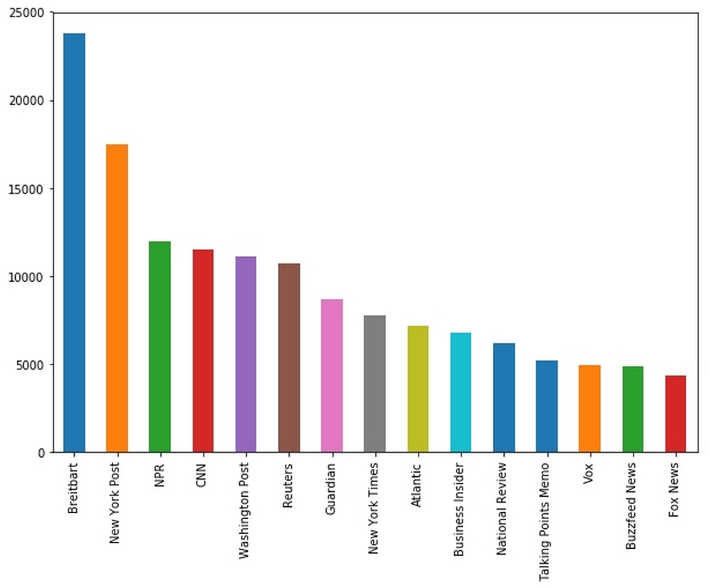


News page distribution
:::
:::

As you can see in the preceding graph the dataset
that we extracted contains no articles from classical financial news
media, instead it mostly contains articles from mainstream and
politically oriented publications.


Named entity recognition {#named-entity-recognition .title style="clear: both"}
------------------------------------------


A common task in NLP is **named entity recognition**
(**NER**). NER is all about finding things that the text
explicitly refers to. Before discussing more about
what is going on, let\'s jump right in and do some hands-on NER on the
first article in our dataset.

The first thing we need to do is load spaCy, in addition to the model
for English language processing:


``` {.programlisting .language-markup}
import spacy
nlp = spacy.load('en')
```
:::

Next, we must select the text of the article from our data:


``` {.programlisting .language-markup}
text = df.loc[0,'content']
```
:::

Finally, we\'ll run this piece of text through the English language
model pipeline. This will create a `Doc` instance, something
we explained earlier on in this lab. The file will hold a lot of
information, including the named entities:


``` {.programlisting .language-markup}
doc = nlp(text)
```
:::

One of the best features of spaCy is that it comes with a handy
visualizer called `displacy`, which we can use to show the
named entities in text. To get the visualizer to generate the display,
based on the text from our article, we must run this code:


``` {.programlisting .language-markup}
from spacy import displacy
displacy.render(doc,              #1style='ent',      #2jupyter=True)     #3
```
:::

With that command now executed, we\'ve done three important things,
which are:


1.  We\'ve passed the document

2.  We have specified that we would like to render entities

3.  We let `displacy` know that we are running this in a
    Jupyter notebook so that rendering works correctly
:::


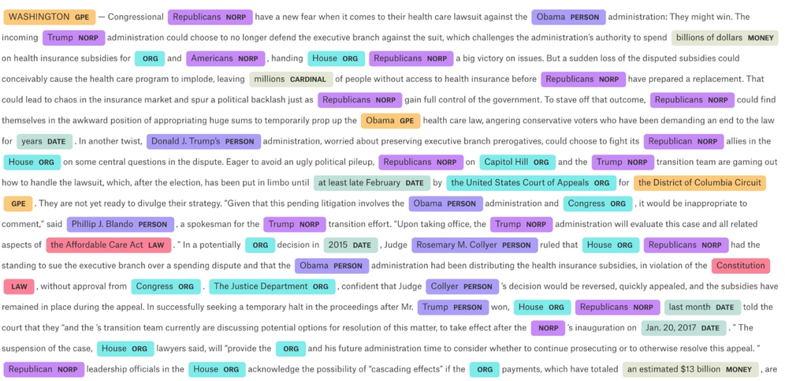


The output of the previous NER using spaCy tags
:::
:::

And voilà! As you can see, there are a few mishaps, such as blank spaces
being classified as organizations, and \"Obama\" being classified as a
place.

So, why has this happened? It\'s because the tagging has been done by a
neural network and neural networks are strongly
dependent on the data that they were trained on. So, because of these
imperfections, we might find that we need to fine-tune the tagging model
for our own purposes, and in a minute, we will see how that works.

You can also see in our output that NER offers a wide range of tags,
some of which come with strange abbreviations. For now, don\'t worry as
we will examine a full list of tags later on in this lab.

Right now, let\'s answer a different question: what organizations does
the news in our dataset write about? To make this exercise run faster,
we will create a new pipeline in which we will disable everything but
NER.

To find out the answer to this question, we must first run the following
code:


``` {.programlisting .language-markup}
nlp = spacy.load('en',disable=['parser','tagger','textcat'])
```
:::

In the next step, we\'ll loop over the first 1,000 articles from our
dataset, which can be done with the following code:


``` {.programlisting .language-markup}
from tqdm import tqdm_notebook

frames = []
for i in tqdm_notebook(range(1000)):
    doc = df.loc[i,'content']                              #1
    text_id = df.loc[i,'id']                               #2
    doc = nlp(doc)                                         #3
    ents = [(e.text, e.start_char, e.end_char, e.label_)   #4
            for e in doc.ents 
            if len(e.text.strip(' -—')) > 0]
    frame = pd.DataFrame(ents)                             #5
    frame['id'] = text_id                                  #6
    frames.append(frame)                                   #7
    
npf = pd.concat(frames)                                    #8

npf.columns = ['Text','Start','Stop','Type','id']          #9
```
:::

The code we\'ve just created has nine key points. Let\'s take a minute
to break it down, so we are confident in
understanding what we\'ve just written. Note that in the preceding code,
the hashtag, `#`, refers to the number it relates to in this
following list:


1.  We get the content of the article at row `i`.

2.  We get the id of the article.

3.  We run the article through the pipeline.

4.  For all the entities found, we save the text, index of the first and
    last character, as well as the label. This only happens if the tag
    consists of more than white spaces and dashes. This removes some of
    the mishaps we encountered earlier when the classification tagged
    empty segments or delimiters.

5.  We create a pandas DataFrame out of the array of tuples created.

6.  We add the id of the article to all records of our named entities.

7.  We add the DataFrame containing all the tagged entities of one
    document to a list. This way, we can build a collection of tagged
    entities over a larger number of articles.

8.  We concatenate all DataFrames in the list, meaning that we create
    one big table with all tags.

9.  For easier use, we give the columns meaningful names
:::

Now that we\'ve done that, the next step is to plot the distribution of
the types of entities that we found. This code will produce a chart
which can be created with the following code:


``` {.programlisting .language-markup}
npf.Type.value_counts().plot(kind='bar')
```
:::

The output of the code being this graph:


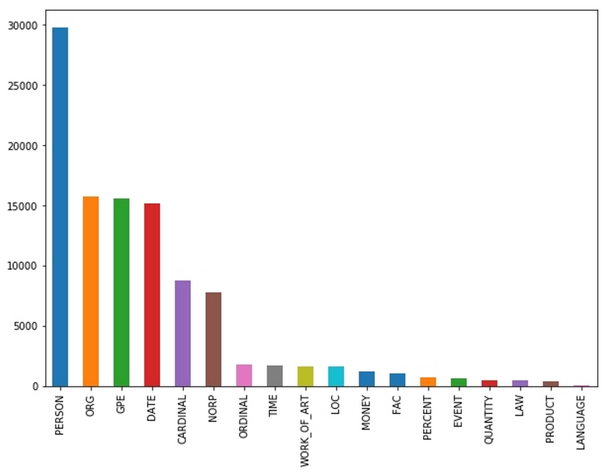


spaCy tag distribution
:::
:::

After seeing the preceding graph, it is a fair
question to ask which categories spaCy can identify and where they come
from. The English language NER that comes with spaCy is a neural network
trained on the [*OntoNotes 5.0 corpus*], meaning it can
recognize the following categories:


- **PERSON**: People, including fictional characters

- **ORG**: Companies, agencies, institutions

- **GPE**: Places including countries, cities, and states

- **DATE**: Absolute (for example, January 2017) or
    relative dates (for example, two weeks)

- **CARDINAL**: Numerals that are not covered by other
    types

- **NORP**: Nationalities or religious or political groups

- **ORDINAL**: \"first,\" \"second,\" and so on

- **TIME**: Times shorter than a day (for example, two
    hours)

- **WORK\_OF\_ART**: Titles of books, songs, and so on

- **LOC**: Locations that are not `GPE`s, for
    example, mountain ranges or streams

- **MONEY**: Monetary values

- **FAC**: Facilities such as
    airports, highways or bridges

- **PERCENT**: Percentages

- **EVENT**: Named hurricanes, battles, sporting events,
    and so on

- **QUANTITY**: Measurements such as weights or distance

- **LAW**: Named documents that are laws

- **PRODUCT**: Objects, vehicles, food, and so on

- **LANGUAGE**: Any named language
:::

Using this list, we will now look at the 15 most frequently named
organizations, categorized as ORG. As part of this, we will produce a
similar graph showing us that information.

To get the graph, we must run the following:


``` {.programlisting .language-markup}
orgs = npf[npf.Type == 'ORG']
orgs.Text.value_counts()[:15].plot(kind='bar')
```
:::

The resulting code will give us the following graph:


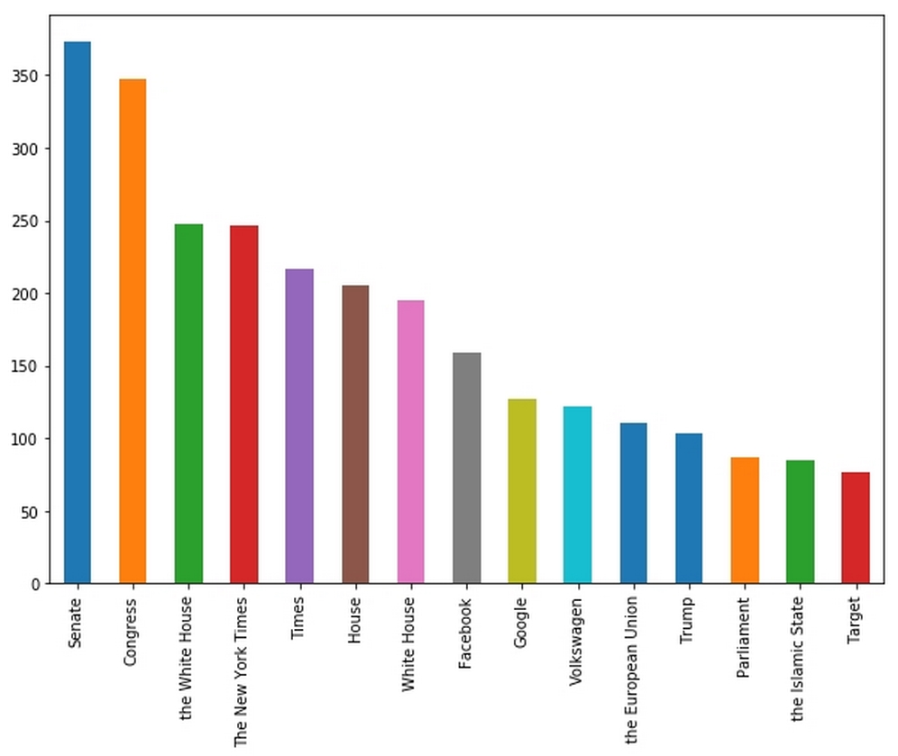


spaCy organization distance
:::
:::

As you can see, political institutions such as the
[*senate*] are most frequently named in our news dataset.
Likewise, some companies, such as [*Volkswagen*], that were
in the center of media attention can also be found in the chart. Take a
minute to also notice how **the White House** and **White
House** are listed as two separate organizations, despite us
knowing they are the same entity.

Depending on your needs, you might want to do some post-processing, such
as removing \"the\" from organization names. Python comes with a
built-in string replacement method that you can use with pandas. This
would allow you to achieve post-processing. However, this is not
something we will cover in depth here.

Should you want to look at it in more detail, you can get the
documentation and example from the following link:
<https://pandas.pydata.org/pandas-docs/stable/generated/pandas.Series.str.replace.html>

Also, note how **Trump** is shown here as 
an organization. However, if you look at the tagged text, you
will also see that \"Trump\" is tagged several times as an NORP,
a political organization. This has happened because the NER infers the
type of tag from the context. Since Trump is the U.S. president, his
name often gets used in the same context as
(political) organizations.

This pretrained NER gives you a powerful tool that can solve many common
NLP tasks. So, in reality, from here you could conduct all kinds of
other investigations. For example, we could fork the notebook to see
whether The New York Times is mentioned as different entities more often
than the Washington Post or Breitbart.


### Fine-tuning the NER {#fine-tuning-the-ner .title}


A common issue you may find is that the pretrained
NER does not perform well enough on the specific types of text that you
want it to work with. To solve this problem, you will need to fine-tune
the NER model by training it with custom data. Achieving this will be
the focus of this section.

The training data you\'re using should be in a form like this:


``` {.programlisting .language-markup}
TRAIN_DATA = [
    ('Who is Shaka Khan?', {
        'entities': [(7, 17, 'PERSON')]
    }),
    ('I like London and Berlin.', {
        'entities': [(7, 13, 'LOC'), (18, 24, 'LOC')]
    })
]
```
:::

As you can see, you provide a list of tuples of the string, together
with the start and end points, as well as the types of entities you want
to tag. Data such as this is usually collected
through manual tagging, often on platforms such as Amazon\'s[
**Mechanical Turk** (**MTurk**).

The company behind spaCy, Explosion AI, also make a (paid) data tagging
system called [*Prodigy*], which enables efficient data
collection. Once you have collected enough data, you can either
fine-tune a pretrained model or initialize a completely new model.

To load and fine-tune a model, we need to use the `load()`
function:


``` {.programlisting .language-markup}
nlp = spacy.load('en')
```
:::

Alternatively, to create a new and empty model from scratch that is
ready for the English language, use the `blank` function:


``` {.programlisting .language-markup}
nlp = spacy.blank('en')
```
:::

Either way, we need to get access to the NER component. If you have
created a blank model, you\'ll need to create an NER pipeline component
and add it to the model.

If you have loaded an existing model, you can just
access its existing NER by running the following code:


``` {.programlisting .language-markup}
if 'ner' not in nlp.pipe_names:
    ner = nlp.create_pipe('ner')
    nlp.add_pipe(ner, last=True)
else:
    ner = nlp.get_pipe('ner')
```
:::

The next step is to ensure that our NER can recognize the labels we
have. Imagine our data contained a new type of named entity such as
`ANIMAL`. With the `add_label` function, we can add
a label type to an NER.

The code to achieve this can be seen below, but don\'t worry if it
doesn\'t make sense right now, we\'ll break it down on the next page:


``` {.programlisting .language-markup}
for _, annotations in TRAIN_DATA:
    for ent in annotations.get('entities'):
        ner.add_label(ent[2])
import random

                                                   #1
other_pipes = [pipe for pipe in nlp.pipe_names if pipe != 'ner']

with nlp.disable_pipes(*other_pipes):
    optimizer = nlp._optimizer                     #2
    if not nlp._optimizer:
        optimizer = nlp.begin_training()
    for itn in range(5):                           #3
        random.shuffle(TRAIN_DATA)                 #4
        losses = {} #5
        for text, annotations in TRAIN_DATA:       #6
            nlp.update(                            #7
                [text],  
                [annotations],  
                drop=0.5,                          #8
                sgd=optimizer,                     #9
                losses=losses)                     #10
        print(losses)
```
:::

What we\'ve just written is made up of 10 key elements:


1.  We disable all pipeline components that are not the NER by first
    getting a list of all the components that are not the NER and then
    disabling them for training.

2.  Pretrained models come with an optimizer. If you have a blank model,
    you will need to create a new optimizer. Note that this also resets
    the model weights.

3.  We now train for a number of epochs, in this case, 5.

4.  At the beginning of each epoch, we shuffle the training data using
    Python\'s built-in `random` module.

5.  We create an empty dictionary to keep track of the losses.

6.  We then loop over the text and annotations in the training data.

7.  `nlp.update` performs one forward and backward pass, and
    updates the neural network weights. We need to supply text and
    annotations, so that the function can figure out how to train a
    network from it.

8.  We can manually specify the dropout rate we want to use while
    training.

9.  We pass a stochastic gradient descent optimizer
    that performs the model updates. Note that you cannot just pass a
    Keras or TensorFlow optimizer here, as spaCy has its own optimizers.

10. We can also pass a dictionary to write losses that we can later
    print to monitor progress.
:::

Once you\'ve run the code, the output should look something like this:


``` {.programlisting .language-markup}
{'ner': 5.0091189558407585}
{'ner': 3.9693684224622108}
{'ner': 3.984836024903589}
{'ner': 3.457960373417813}
{'ner': 2.570318400714134}
```
:::

What you are seeing is the loss value of a part of the spaCy pipeline,
in this case, the **named entity recognition**
(**NER**) engine. Similar to the cross-entropy loss we
discussed in previous chapters, the actual value is hard to interpret
and does not tell you very much. What matters here is that the loss is
decreasing over time and that it reaches a value much lower than the
initial loss.


Part-of-speech (POS) tagging {#part-of-speech-pos-tagging .title style="clear: both"}
----------------------------------------------


On Tuesday, October 10, 2017, between 9:34 AM and 9:36 AM, the US Dow
Jones newswire encountered a technical error that
resulted in it posting some strange headlines. One of them was, \"Google
to buy Apple.\" These four words managed to send Apple stock up over two
percent.

The algorithmic trading systems obviously failed here to understand that
such an acquisition would be impossible as Apple had a market
capitalization of \$800 billion at the time, coupled with the fact that
the move would likely not find regulatory approval.

So, the question arises, why did the trading algorithms choose to buy
stock based on these four words? The answer is through
**part-of-speech** (**POS**) tagging. POS tagging
allows an understanding of which words take which function in a
sentence and how the words relate to each other.

spaCy comes with a handy, pretrained POS tagger. In this section we\'re
going to apply this to the Google/Apple news story. To start the POS
tagger, we need to run the following code:


``` {.programlisting .language-markup}
import spacy
from spacy import displacy
nlp = spacy.load('en')

doc = 'Google to buy Apple'
doc = nlp(doc)
displacy.render(doc,style='dep',jupyter=True, options={'distance':120})
```
:::

Again, we will load the pretrained English model and run our sentence
through it. Then we\'ll use `displacy` just as we did for NER.

To make the graphics fit better in this course, we will set the
`distance` option to something shorter than the default, in
this case, 1,120, so that words get displayed closer together, as we can
see in the following diagram:


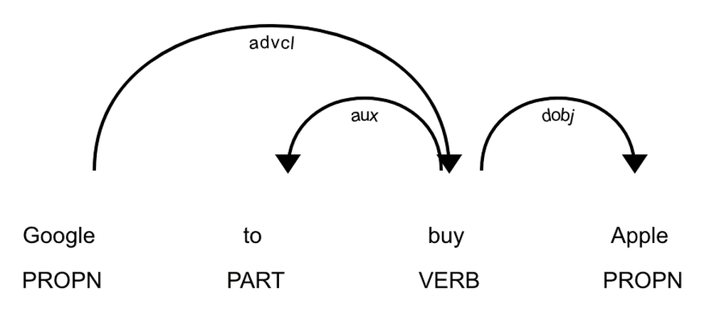


spaCy POS tagger
:::
:::

As you can see, the POS tagger identified **buy** as a verb
and **Google** and **Apple** as the nouns in the
sentence. It also identified that **Apple** is the object the
action is applied to and that **Google** is applying the
action.

We can access this information for nouns through this code:


``` {.programlisting .language-markup}
nlp = spacy.load('en')
doc = 'Google to buy Apple'
doc = nlp(doc)

for chunk in doc.noun_chunks:
    print(chunk.text, chunk.root.text, chunk.root.dep_,chunk.root.head.text)
```
:::

After running the preceding code, we get the following table featured as
the result:


  Text     Root Text   Root dep   Root Head Text
  -------- ----------- ---------- ----------------
  Google   Google      ROOT       Google
  Apple    Apple       dobj       buy
:::

In our example, Google is the root of the sentence,
while Apple is the object of the sentence. The verb applied to Apple is
\"buy.\"

From there, it is only a hard-coded model of price developments under an
acquisition (demand for the target stock goes up and with it the price)
and a stock lookup table to a simple event-driven trading algorithm.
Making these algorithms understand the context and plausibility is
another story, however.


Rule-based matching {#rule-based-matching .title style="clear: both"}
-------------------------------------


Before deep learning and statistical modeling took over, NLP was all
about rules. That\'s not to say that rule-based 
systems are dead! They are often easy to set up and perform
very well when it comes to doing simple tasks.

Imagine you wanted to find all mentions of Google in a text. Would you
really train a neural network-based named entity recognizer? If you did,
you would have to run all of the text through the neural network and
then look for Google in the entity texts. Alternatively, would you
rather just search for text that exactly matches Google with a classic
search algorithm? Well, we\'re in luck, as spaCy comes with an
easy-to-use, rule-based matcher that allows us to do just that.

Before we start this section, we first must make sure that we reload the
English language model and import the matcher. This is a very simple
task that can be done by running the following code:


``` {.programlisting .language-markup}
import spacy
from spacy.matcher import Matcher

nlp = spacy.load('en')
```
:::

The matcher searches for patterns, which we encode as a list of
dictionaries. It operates token by token, that is, word for word, except
for punctuation and numbers, where a single symbol can be a token.

As a starting example, let\'s search for the phrase \"hello, world.\" To
do this, we would define a pattern as follows:


``` {.programlisting .language-markup}
pattern = [{'LOWER': 'hello'}, {'IS_PUNCT': True}, {'LOWER': 'world'}]
```
:::

This pattern is fulfilled if the lower case first token is
`hello`. The `LOWER` attribute checks if both words
would match if they were both converted to lowercase. That means if the
actual token text is \"Hello\" or \"HELLO,\" then it would also fulfill
the requirement. The second token has to be punctuation to pick up the
comma, so the phrases \"hello. world\" or \"hello! world\" would both
work, but not \"hello world.\"

The lower case of the third token has to be
\"world,\" so \"WoRlD\" would also be fine.

The possible attributes for a token can be the following:


-   `ORTH`: The token text has to match exactly

-   `LOWER`: The lower case of the token has to match

-   `LENGTH`: The length of the token text has to match

-   `IS_ALPHA`, `IS_ASCII`, `IS_DIGIT`:
    The token text has to consist of alphanumeric characters, ASCII
    symbols, or digits

-   `IS_LOWER`, `IS_UPPER`, `IS_TITLE`:
    The token text has to be lower case, upper case, or title case

-   `IS_PUNCT`, `IS_SPACE`, `IS_STOP`: The
    token text has to be punctuation, white space, or a stop word

-   `LIKE_NUM`, `LIKE_URL`, `LIKE_EMAIL`:
    The token has to resemble a number, URL, or email

-   `POS`, `TAG`, `DEP`,
    `LEMMA`, `SHAPE`: The token\'s position, tag,
    dependency, lemma, or shape has to match

-   `ENT_TYPE`: The token\'s entity type from NER has to match
:::

spaCy\'s lemmatization is extremely useful. A lemma is the base version
of a word. For example, \"was\" is a version of \"be,\" so \"be\" is the
lemma for \"was\" but also for \"is.\" spaCy can lemmatize words in
context, meaning it uses the surrounding words to determine what the
actual base version of a word is.

To create a matcher, we have to pass on the vocabulary the matcher works
on. In this case, we can just pass the vocabulary of our English
language model by running the following:


``` {.programlisting .language-markup}
matcher = Matcher(nlp.vocab)
```
:::

In order to add the required attributes to our matcher, we must call the
following:


``` {.programlisting .language-markup}
matcher.add('HelloWorld', None, pattern)
```
:::

The `add` function expects three arguments. The first is a
name of the pattern, in this case, `HelloWorld`, so that we
can keep track of the patterns we added. The second is a function that
can process matches once found. Here we pass `None`, meaning
no function will be applied, though we will use this tool later.
Finally, we need to pass the list of token attributes we want to search
for.

To use our matcher, we can simply call `matcher(doc)`. This
will give us back all the matches that the matcher found. We can call
this by running the following:


``` {.programlisting .language-markup}
doc = nlp(u'Hello, world! Hello world!')
matches = matcher(doc)
```
:::

If we print out the matches, we can see the structure:


``` {.programlisting .language-markup}
matches
[(15578876784678163569, 0, 3)]
```
:::

The first thing in a match is the hash of the string found. This is just
to identify what was found internally; we won\'t use it here. The next
two numbers indicate the range in which the matcher found something,
here tokens 0 to 3.

We can get the text back by indexing the original document:


``` {.programlisting .language-markup}
doc[0:3]
```
:::


``` {.programlisting .language-markup}
Hello, wor
ld
```
:::

In the next section we will look at how we can add custom functions to
matchers.


### Adding custom functions to matchers {#adding-custom-functions-to-matchers .title}


Let\'s move on to a more complex case. We know that the iPhone is a
product. However, the neural network-based matcher often 
classifies it as an organization. This happens because the
word \"iPhone\" gets used a lot in a similar context as organizations,
as in \"The iPhone offers\...\" or \"The iPhone sold\....\"

Let\'s build a rule-based matcher that always classifies the word
\"iPhone\" as a product entity.

First, we have to get the hash of the word PRODUCT. Words in spaCy can
be uniquely identified by their hash. Entity types also get identified
by their hash. To set an entity of the product type, we have to be able
to provide the hash for the entity name.

We can get the name from the language model\'s vocabulary by running the
following:


``` {.programlisting .language-markup}
PRODUCT = nlp.vocab.strings['PRODUCT']
```
:::

Next, we need to define an `on_match` rule. This function will
be called every time the matcher finds a match. `on_match`
rules have four arguments:


-   `matcher`: The matcher that made the match.

-   `doc`: The document the match was made in.

-   `i`: The index of a match. The first match in a document
    would have index zero, the second would have index one, and so on.

-   `matches`: A list of all matches made.
:::

There are two things happening in our `on_match` rule:


``` {.programlisting .language-markup}
def add_product_ent(matcher, doc, i, matches):
    match_id, start, end = matches[i]            #1
    doc.ents += ((PRODUCT, start, end),)         #2
```
:::

Let\'s break down what they are:


1.  We index all matches to find our match at index `i`. One
    match is a tuple of a `match_id`, the start of the match,
    and the end of the match.

2.  We add a new entity to the document\'s named
    entities. An entity is a tuple of the hash of the type of entity
    (the hash of the word `PRODUCT` here), the start of the
    entity, and the end of the entity. To append an entity, we have to
    nest it in another tuple. Tuples that only contain one value need to
    include a comma at the end. It is important not to overwrite
    `doc.ents`, as we otherwise would remove all the entities
    that we have already found.
:::

Now that we have an `on_match` rule, we can define our
matcher.

We should note that matchers allow us to add multiple patterns, so we
can add a matcher for just the word \"iPhone\" and another pattern for
the word \"iPhone\" together with a version number, as in \"iPhone 5\":


``` {.programlisting .language-markup}
pattern1 = [{'LOWER': 'iPhone'}]                           #1
pattern2 = [{'ORTH': 'iPhone'}, {'IS_DIGIT': True}]        #2

matcher = Matcher(nlp.vocab)                               #3
matcher.add('iPhone', add_product_ent,pattern1, pattern2)  #4
```
:::

So, what makes these commands work?


1.  We define the first pattern.

2.  We define the second pattern.

3.  We create a new empty matcher.

4.  We add the patterns to the matcher. Both will fall under the rule
    called `iPhone`, and both will call our
    `on_match` rule called `add_product_ent`.
:::

We will now pass one of the news articles through the matcher:


``` {.programlisting .language-markup}
doc = nlp(df.content.iloc[14])         #1
matches = matcher(doc)                 #2
```
:::

This code is relatively simple, with only two steps:


1.  We run the text through the pipeline to create an annotated
    document.

2.  We run the document through the matcher. This modifies the document
    created in the step before. We do not care as much about the matches
    but more about how the `on_match` method adds the matches
    as entities to our documents.
:::

Now that the matcher is set up, we need to add it to the pipeline so
that spaCy can use it automatically. This will be the focus in the next
section.
:::


### Adding the matcher to the pipeline {#adding-the-matcher-to-the-pipeline .title}


Calling the matcher separately is somewhat
cumbersome. To add it to the pipeline, we have to wrap it into a
function, which we can achieve by running the following:


``` {.programlisting .language-markup}
def matcher_component(doc):
    matches = matcher(doc)
    return doc
```
:::

The spaCy pipeline calls the components of the pipeline as functions and
always expects the annotated document to be returned. Returning anything
else could break the pipeline.

We can then add the matcher to the main pipeline, as can be seen in the
following code:


``` {.programlisting .language-markup}
nlp.add_pipe(matcher_component,last=True)
```
:::

The matcher is now the last piece of the pipeline. From this point
onward iPhones will now get tagged based on the matcher\'s rules.

And boom! All mentions of the word \"iPhone\" (case independent) are now
tagged as named entities of the product type. You can validate this by
displaying the entities with `displacy` as we have done in the
following code:


``` {.programlisting .language-markup}
displacy.render(doc,style='ent',jupyter=True)
```
:::

The results of that code can be seen in the following screenshot:


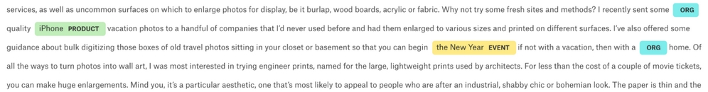


spaCy now finds the iPhone as a product
:::


### Combining rule-based and learning-based systems {#combining-rule-based-and-learning-based-systems .title}


One especially interesting aspect of spaCy\'s pipeline system is that it
is relatively easy to combine different aspects of it. We can,
for example, combine neural network-based named
entity recognition with a rule-based matcher in order to find something
such as executive compensation information.

Executive compensation is often reported in the press but hard to find
in aggregate. One possible rule-based matching pattern for executive
compensation could look like this:


``` {.programlisting .language-markup}
pattern = [{'ENT_TYPE':'PERSON'},{'LEMMA':'receive'},{'ENT_TYPE':'MONEY'}]
```
:::

A matcher looking for this pattern would pick up any combination of a
person\'s name, for example, John Appleseed, or Daniel; any version of
the word receive, for example, received, receives, and so on; followed
by an expression of money, for example, \$4 million.

This matcher could be run over a large text corpus with the
`on_match` rule handily saving the found snippets into a
database. The machine learning approach for naming
entities and the rule-based approach go hand in hand seamlessly.

Since there is much more training data available with annotations for
names and money, rather than statements about executive education, it is
much easier to combine the NER with a rule-based method rather than
training a new NER.


Regular expressions {#regular-expressions .title style="clear: both"}
-------------------------------------


Regular expressions, or regexes, are a powerful form of rule-based
matching. Invented back in the 1950s, they were, for a very long time,
the most useful way to find things in text and
proponents argue that they still are.

No lab on NLP would be complete without mentioning regexes. With
that being said, this section is by no means a complete regex tutorial.
It\'s intended to introduce the general idea and show how regexes can be
used in Python, pandas, and spaCy.

A very simple regex pattern could be \"a.\" This would only find
instances of the lower-case letter a followed by a dot. However, regexes
also allow you to add ranges of patterns; for example, \"\[a-z\].\"
would find any lower-case letter followed by a dot, and \"xy.\" would
find only the letters \"x\" or \"y\" followed by a dot.

Regex patterns are case sensitive, so \"A-Z\" would only capture
upper-case letters. This is useful if we are searching for expressions
in which the spelling is frequently different; for example, the pattern
\"seriali\[sz\]e\" would catch the British as well as the American
English version of the word.

The same goes for numbers. \"0-9\" captures all numbers from 0 to 9. To
find repetitions, you can use \"\*,\" which captures zero or more
occurrences, or \"+,\" which captures one or more occurrences. For
example, \"\[0-9\]+\" would capture any series of numbers, which might
be useful when looking for years. While \"\[A-Z\]\[a-z\] + \[0-9\] +,\"
for example, would find all words starting with a capital letter
followed by one or more digit, such as \"March 2018\" but also \"Jaws
2.\"

Curly brackets can be used to define the number of repetitions. For
instance, \"\[0-9\]{4}\" would find number sequences with exactly four
digits. As you can see, a regex does not make any attempt to understand
what is in the text, but rather offers a clever method of finding text
that matches patterns.

A practical use case in the financial industry is finding the VAT number
of companies in invoices. These follow a pretty strict pattern in most
countries that can easily be encoded. VAT numbers in the Netherlands,
for example, follow this regex pattern: \"NL\[0-9\]{9}B\[0-9\]{2}\".


### Using Python\'s regex module


Python has a built-in tool for regexes called
`re`. While it does not need to be installed because it is
part of Python itself, we can import it with the following code:


``` {.programlisting .language-markup}
import re
```
:::

Imagine we are working on an automatic invoice
processor, and we want to find the VAT number of the company that sent
us the invoice. For simplicity\'s sake, we\'re going to only deal with
Dutch VAT numbers (the Dutch for \"VAT\" is \"BTW\"). As mentioned
before, we know the pattern for a Dutch VAT number is as follows:


``` {.programlisting .language-markup}
pattern = 'NL[0-9]{9}B[0-9]{2}'
```
:::

A string for finding a BTW number might look like this:


``` {.programlisting .language-markup}
my_string = 'ING Bank N.V. BTW:NL003028112B01'
```
:::

So, to find all the occurrences of a BTW number in the string, we can
call `re.findall`, which will return a list of all strings
matching the pattern found. To call this, we simply run:


``` {.programlisting .language-markup}
re.findall(pattern,my_string)
```
:::


``` {.programlisting .language-markup}
['NL003028112B01']
```
:::

`re` also allows the passing of flags to make the development
of regex patterns a bit easier. For example, to ignore the case of
letters when matching a regular expression, we can add a
`re.IGNORECASE` flag, like we\'ve done here:


``` {.programlisting .language-markup}
re.findall(pattern,my_string, flags=re.IGNORECASE)
```
:::

Often, we are interested in a bit more information about our matches. To
this end, there is a `match` object. `re.search`
yields a `match` object for the first match found:


``` {.programlisting .language-markup}
match = re.search(pattern,my_string)
```
:::

We can get more information out of this object, such as the location of
our match, simply by running:


``` {.programlisting .language-markup}
match.span()
(18, 32)
```
:::

The span, the start and the end of our match, is the characters 18 to
32.
:::


### Regex in pandas {#regex-in-pandas .title}


The data for NLP problems often comes in pandas
DataFrames. Luckily for us, pandas natively supports regex. If, for
example, we want to find out whether any of the articles in our news
dataset contain a Dutch BTW number, then we can pass the following code:


``` {.programlisting .language-markup}
df[df.content.str.contains(pattern)]
```
:::

This would yield all the articles that include a Dutch BTW number, but
unsurprisingly no articles in our dataset do.
:::


### When to use regexes and when not to {#when-to-use-regexes-and-when-not-to .title}


A regex is a powerful tool, and this very short
introduction does not do it justice. In fact, there are several books
longer than this one written purely on the topic of regexes. However,
for the purpose of this course, we\'re only going to briefly introduce
you to the topic.

A regex, as a tool, works well on simple and clear-to-define patterns.
VAT/BTW numbers are a perfect example, as are email addresses and phone
numbers, both of which are very popular use cases for regexes. However,
a regex fails when the pattern is hard to define or if it can only be
inferred from context. It is not possible to create a rule-based named
entity recognizer that can spot that a word refers to the name of a
person, because names follow no clear distinguishing pattern.

So, the next time you are looking to find something that is easy to spot
for a human but hard to describe in rules, use a machine learning-based
solution. Likewise, the next time you are looking for something clearly
encoded, such as a VAT number, use regexes.


A text classification task {#a-text-classification-task .title style="clear: both"}
--------------------------------------------


A common NLP task is to classify text. The most
common text classification is done in sentiment analysis, where texts
are classified as positive or negative. In this section, we will
consider a slightly harder problem, classifying whether a tweet is about
an actual disaster happening or not.

Today, investors have developed a number of ways to gain information
from tweets. Twitter users are often faster than news outlets to report
disasters, such as a fire or a flood. In the case of finance, this speed
advantage can be used and translated to event-driven trading strategies.

However, not all tweets that contain words associated with disasters are
actually about disasters. A tweet such as, \"California forests on fire
near San Francisco\" is a tweet that should be taken into consideration,
whereas \"California this weekend was on fire, good times in San
Francisco\" can safely be ignored.

The goal of the task here is to build a classifier that separates the
tweets that relate to real disasters from irrelevant tweets. The dataset
that we are using consists of hand-labeled tweets that were obtained by
searching Twitter for words common to disaster tweets such as \"ablaze\"
or \"fire.\"


### Note {#note .title}

**Note**: In preparation for this section, the code and data
can be found on Kaggle at <https://www.kaggle.com/jannesklaas/nl>.


Preparing the data {#preparing-the-data .title style="clear: both"}
------------------------------------


Preparing the text is a task in its own right. This is because in the
real world, text is often messy and cannot be fixed with a few simple
scaling operations. For instance, people can often
make typos after adding unnecessary characters as they are adding text
encodings that we cannot read. NLP involves its own set of data cleaning
challenges and techniques.


### Sanitizing characters {#sanitizing-characters .title}


To store text, computers need to encode the
characters into bits. There are several different ways to do this, and
not all of them can deal with all the characters out there.

It is good practice to keep all the text files in one encoding scheme,
usually UTF-8, but of course, that does not always happen. Files might
also be corrupted, meaning that a few bits are off, therefore rendering
some characters unreadable. Therefore, before we do anything else, we
need to sanitize our inputs.

Python offers a helpful `codecs` library, which allows us to
deal with different encodings. Our data is UTF-8 encoded, but there are
a few special characters in there that cannot be read easily. Therefore,
we have to sanitize our text of these special characters, which we can
do by running the following:


``` {.programlisting .language-markup}
import codecs
input_file = codecs.open('../input/socialmedia-disaster-tweets-DFE.csv','r',',encoding='utf-8', errors='replace')
```
:::

In the preceding code, `codecs.open` acts as a stand-in
replacement for Python\'s standard file opening function. It returns a
file object, which we can later read line by line. We specify the input
path that we want to read the file (with `r`), the expected
encoding, and what to do with errors. In this case, we are going to
replace the errors with a special unreadable character marker.

To write to the output file, we can just use Python\'s standard
`open()` function. This function will create a file at the
specified file path we can write to:


``` {.programlisting .language-markup}
output_file = open('clean_socialmedia-disaster.csv', 'w')
```
:::

Now that\'s done, all we have to do is loop over the lines in our input
file that we read with our `codecs` reader and save it as a
regular CSV file again. We can achieve this by running the following:


``` {.programlisting .language-markup}
for line in input_file:
    out = line
    output_file.write(line)
```
:::

Likewise, it\'s good practice to close the file objects afterward, which
we can do by running:


``` {.programlisting .language-markup}
input_file.close()
output_file.close()
```
:::

Now we can read the sanitized CSV file with pandas:


``` {.programlisting .language-markup}
df = pd.read_csv('clean_socialmedia-disaster.csv')
```


### Lemmatization {#lemmatization .title}


Lemmas have already made several appearances
throughout this lab. A lemma in the field of linguistics, also
called a headword, is the word under which the set of related words or
forms appears in a dictionary. For example, \"was\" and \"is\" appear
under \"be,\" \"mice\" appears under \"mouse,\" and so on. Quite often,
the specific form of a word does not matter very much, so it can be a
good idea to convert all your text into its lemma form.

spaCy offers a handy way to lemmatize text, so once again, we\'re going
to load a spaCy pipeline. Only that in this case, we don\'t need any
pipeline module aside from the tokenizer. The tokenizer splits the text
into separate words, usually by spaces. These individual words, or
tokens, can then be used to look up their lemma. In our case, it looks
like this:


``` {.programlisting .language-markup}
import spacy
nlp = spacy.load('en',disable=['tagger','parser','ner'])
```
:::

Lemmatization can be slow, especially for big files, so it makes sense
to track our progress. `tqdm` allows us to show progress bars
on the pandas `apply` function. All we have to do is import
`tqdm` as well as the notebook component for pretty rendering
in our work environment. We then have to tell `tqdm` that we
would like to use it with pandas. We can do this by running the
following:


``` {.programlisting .language-markup}
from tqdm import tqdm, tqdm_notebook
tqdm.pandas(tqdm_notebook)
```
:::

We can now run `progress_apply` on a DataFrame just as we
would use the standard `apply` method, but here it has a
progress bar.

For each row, we loop over the words in the `text` column and
save the lemma of the word in a new `lemmas` column:


``` {.programlisting .language-markup}
df['lemmas'] = df["text"].progress_apply(lambda row: [w.lemma_ for w in nlp(row)])
```
:::

Our `lemmas` column is now full of lists, so to turn the lists
back into text, we will join all of the elements of the lists with a
space as a separator, as we can see in the following code:


``` {.programlisting .language-markup}
df['joint_lemmas'] = df['lemmas'].progress_apply(lambda row: ' '.join(row))
```


### Preparing the target {#preparing-the-target .title}


There are several possible prediction targets in
this dataset. In our case, humans were asked to rate a tweet, and, they
were given three options, `Relevant`,
`Not Relevant`, and `Can't Decide`, as the
lemmatized text shows:


``` {.programlisting .language-markup}
df.choose_one.unique()
array(['Relevant', 'Not Relevant', "Can't Decide"], dtype=object)
```
:::

The tweets where humans cannot decide whether it is about a real
disaster are not interesting to us. Therefore, we will just remove the
category, [*Can\'t Decide*], which we can do in the following
code:


``` {.programlisting .language-markup}
df = df[df.choose_one != "Can't Decide"]
```
:::

We are also only interested in mapping text to relevance, therefore we
can drop all the other metadata and just keep these
two columns, which we do here:


``` {.programlisting .language-markup}
df = df[['text','choose_one']]
```
:::

Finally, we\'re going to convert the target into numbers. This is a
binary classification task, as there are only two categories. So, we map
`Relevant` to `1` and `Not Relevant` to
`0`:


``` {.programlisting .language-markup}
f['relevant'] = df.choose_one.map({'Relevant':1,'Not Relevant':0})
```


### Preparing the training and test sets {#preparing-the-training-and-test-sets .title}


Before we start building models, we\'re going to
split our data into two sets, the training dataset
and the test dataset. To do this we simply need to run the following
code:


``` {.programlisting .language-markup}
from sklearn.model_selection import train_test_split
X_train, X_test, y_train, y_test = train_test_split(df['joint_lemmas'], 
                                                    df['relevant'], 
                                                    test_size=0.2,
                                                    random_state=42)
```


Bag-of-words {#bag-of-words .title style="clear: both"}
------------------------------


A simple yet effective way of classifying text is to see the text as a
bag-of-words. This means that we do not care for the order in which
words appear in the text, instead we only care about which words appear
in the text.

One of the ways of doing a bag-of-words
classification is by simply counting the occurrences of different words
from within a text. This is done with a so-called **count
vector**. Each word has an index, and for
each text, the value of the count vector at that index is the number of
occurrences of the word that belong to the index.

Picture this as an example: the count vector for the text \"I see cats
and dogs and elephants\" could look like this:


  i   see   cats   and   dogs   elephants
  --- ----- ------ ----- ------ -----------
  1   1     1      2     1      1
:::

In reality, count vectors are pretty sparse. There are about 23,000
different words in our text corpus, so it makes sense to limit the
number of words we want to include in our count vectors. This could mean
excluding words that are often just gibberish or typos with no meaning.
As a side note, if we kept all the rare words, this could be a source of
overfitting.

We are using `sklearn`\'s built-in count vectorizer. By
setting `max_features`, we can control how many words we want
to consider in our count vector. In this case, we will only consider
the 10,000 most frequent words:


``` {.programlisting .language-markup}
from sklearn.feature_extraction.text import CountVectorizer
count_vectorizer = CountVectorizer(max_features=10000)
```
:::

Our count vectorizer can now transform texts into count vectors. Each
count vector will have 10,000 dimensions:


``` {.programlisting .language-markup}
X_train_counts = count_vectorizer.fit_transform(X_train)
X_test_counts = count_vectorizer.transform(X_test)
```
:::

Once we have obtained our count vectors, we can
then perform a simple logistic regression on them. While we could use
Keras for logistic regression, as we did in the first lab of this
course, it is often easier to just use the logistic regression class from
scikit-learn:


``` {.programlisting .language-markup}
from sklearn.linear_model import LogisticRegression
clf = LogisticRegression()

clf.fit(X_train_counts, y_train)

y_predicted = clf.predict(X_test_counts)
```
:::

Now that we have predictions from our logistic regressor, we can measure
the accuracy of it with `sklearn`:


``` {.programlisting .language-markup}
from sklearn.metrics import accuracy_score
accuracy_score(y_test, y_predicted)
```
:::


``` {.programlisting .language-markup}
0.8011049723756906
```
:::

As you can see, we\'ve got 80% accuracy, which is pretty decent for such
a simple method. A simple count vector-based classification is useful as
a baseline for more advanced methods, which we will be discussing later.


### TF-IDF {#tf-idf .title}


**TF-IDF** stands for **Term Frequency, Inverse Document
Frequency**. It aims to address a problem of simple
 word counting, that being words that frequently appear in a
text are important, while words that appear in [*all*] texts
are not important.

The TF component is just like a count vector, except that TF divides the
counts by the total number of words in a text. Meanwhile, the IDF
component is the logarithm of the total number of texts in the entire
corpus divided by the number of texts that include a specific word.

TF-IDF is the product of these two measurements. TF-IDF vectors are like
count vectors, except they contain the TF-IDF scores instead of the
counts. Rare words will gain a high score in the TF-IDF vector.

We create TF-IDF vectors just as we created count vectors with
`sklearn`:


``` {.programlisting .language-markup}
from sklearn.feature_extraction.text import TfidfVectorizer
tfidf_vectorizer = TfidfVectorizer()

X_train_tfidf = tfidf_vectorizer.fit_transform(X_train)
X_test_tfidf = tfidf_vectorizer.transform(X_test)
```
:::

Once we have the TF-IDF vectors, we can train a logistic regressor on
them just like we did for count vectors:


``` {.programlisting .language-markup}
clf_tfidf = LogisticRegression()
clf_tfidf.fit(X_train_tfidf, y_train)

y_predicted = clf_tfidf.predict(X_test_tfidf)
```
:::

In this case, TF-IDF does slightly worse than count vectors. However,
because the performance difference is very small, this poorer
performance might be attributable to chance in this case:


``` {.programlisting .language-markup}
accuracy_score(y_pred=y_predicted, y_true=y_test)
```
:::


``` {.programlisting .language-markup}
0.79788213627992
63
```


Topic modeling {#topic-modeling .title style="clear: both"}
--------------------------------


A final, very useful application of word counting
is topic modeling. Given a set of texts, are we able to find clusters of
topics? The method to do this is called
**Latent Dirichlet Allocation** (**LDA**).


### Note {#note .title}

**Note**: The code and data for this section can be found on
Kaggle at <https://www.kaggle.com/jannesklaas/topic-modeling-with-lda>.
:::

While the name is quite a mouth full, the algorithm is a very useful
one, so we will look at it step by step. LDA makes the following
assumption about how texts are written:


1.  First, a topic distribution is chosen, say 70% machine learning and
    30% finance.

2.  Second, the distribution of words for each topic is chosen. For
    example, the topic \"machine learning\" might be made up of 20% the
    word \"tensor,\" 10% the word \"gradient,\" and so on. This means
    that our topic distribution is a [*distribution of
    distributions*], also called a Dirichlet distribution.

3.  Once the text gets written, two probabilistic decisions are made for
    each word: first, a topic is chosen from the distribution of topics
    in the document. Then, a word is chosen for the distribution of
    words in that document.
:::

Note that not all documents in a corpus have the
same distribution of topics. We need to specify a fixed number of
topics. In the learning process, we start out by assigning each word in
the corpus randomly to one topic. For each document, we then calculate
the following:


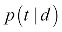
:::

The preceding formula is the probability of each topic,
[*t,*] to be included in document [*d*]. For each
word, we then calculate:


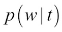
:::

That is the probability of a word, [*w,*] to belong to a
topic, [*t*]. We then assign the word to a new topic,
[*t,*] with the following probability:


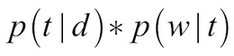
:::

In other words, we assume that all of the words are already correctly
assigned to a topic except for the word currently under consideration.
We then try to assign words to topics to make documents more homogenous
in their topic distribution. This way, words that actually belong to a
topic cluster together.

Scikit-learn offers an easy-to-use LDA tool that will help us achieve
this. To use this, we must first create a new LDA analyzer and specify
the number of topics, called components that we expect.

This can be done by simply running the following:


``` {.programlisting .language-markup}
from sklearn.decomposition import LatentDirichletAllocation
lda = LatentDirichletAllocation(n_components=2)
```
:::

We then create count vectors, just as we did for the bag-of-words
analysis. For LDA, it is important to remove frequent words that don\'t
mean anything, such as \"an\" or \"the,\" so-called stop words.
`CountVectorizer` comes with a built-in stopword dictionary
that removes these words automatically. To use this, we\'ll need to run
the following code:


``` {.programlisting .language-markup}
from sklearn.feature_extraction.text import TfidfVectorizer, CountVectorizer
vectorizer = CountVectorizer(stop_words='english')
tf = vectorizer.fit_transform(df['joint_lemmas'])
```
:::

Next, we fit the LDA to the count vectors:


``` {.programlisting .language-markup}
lda.fit(tf)
```
:::

To inspect our results, we can print out the most frequent words for
each topic. To this end, we first need to specify
the number of words per topic we want to print, in this case 5. We also
need to extract the mapping word count vector indices to words:


``` {.programlisting .language-markup}
n_top_words = 5
tf_feature_names = vectorizer.get_feature_names()
```
:::

Now we can loop over the topics of the LDA, in order to print the most
frequent words:


``` {.programlisting .language-markup}
for topic_idx, topic in enumerate(lda.components_):
        message = "Topic #%d: " % topic_idx
        message += " ".join([tf_feature_names[i]
                             for i in topic.argsort()[:-n_top_words - 1:-1]])
        print(message)
Topic #0: http news bomb kill disaster
Topic #1: pron http like just https
```
:::

As you can see, the LDA seems to have discovered the grouping into
serious tweets and non-serious ones by itself without being given the
targets.

This method is very useful for classifying news articles, too. Back in
the world of finance, investors might want to know if there is a news
article mentioning a risk factor they are exposed to. The same goes for
support requests for consumer-facing organizations, which can be
clustered this way.


Word embeddings {#word-embeddings .title style="clear: both"}
---------------------------------


The order of words in a text matters. Therefore, we
can expect higher performance if we do not just look at texts in
aggregate but see them as a sequence. This section makes use of a lot of
the techniques discussed in the previous lab; however, here we\'re
going to add a critical ingredient, word vectors.

Words and word tokens are categorical features. As such, we cannot
directly feed them into a neural network. Previously, we have dealt with
categorical data by turning it into one-hot encoded vectors. Yet for
words, this is impractical. Since our vocabulary is 10,000 words, each
vector would contain 10,000 numbers that are all zeros except for one.
This is highly inefficient, so instead, we will use an embedding.

In practice, embeddings work like a lookup table. For each token, they
store a vector. When the token is given to the embedding layer, it
returns the vector for that token and passes it through the neural
network. As the network trains, the embeddings get optimized as well.

Remember that neural networks work by calculating the derivative of the
loss function with respect to the parameters
(weights) of the model. Through backpropagation, we can also calculate
the derivative of the loss function with respect to the input of the
model. Thus we can optimize the embeddings to deliver ideal inputs that
help our model.


### Preprocessing for training with word vectors {#preprocessing-for-training-with-word-vectors .title}


Before we start with training word embeddings, we
need to do some preprocessing steps. Namely, we need to assign each word
token a number and create a NumPy array full of sequences.

Assigning numbers to tokens makes the training process smoother and
decouples the tokenization process from the word vectors. Keras has a
`Tokenizer` class, which can create numeric tokens for words.
By default, this tokenizer splits text by spaces. While this works
mostly fine in English, it can be problematic and cause issues in other
languages. A key learning point to take away is that it\'s better to
tokenize the text with spaCy first, as we already did for our two
previous methods, and then assign numeric tokens with Keras.

The `Tokenizer` class also allows us to specify how many words
we want to consider, so once again we will only use the 10,000 most used
words, which we can specify by running:


``` {.programlisting .language-markup}
from keras.preprocessing.text import Tokenizer
import numpy as np

max_words = 10000
```
:::

The tokenizer works a lot like `CountVectorizer` from
`sklearn`. First, we create a new `tokenizer`
object. Then we fit the tokenizer, and finally, we can transform the
text into tokenized sequences:


``` {.programlisting .language-markup}
tokenizer = Tokenizer(num_words=max_words)
tokenizer.fit_on_texts(df['joint_lemmas'])
sequences = tokenizer.texts_to_sequences(df['joint_lemmas'])
```
:::

The `sequences` variable now holds all of our texts as numeric
tokens. We can look up the mapping of words to numbers from the
tokenizer\'s word index with the following code:


``` {.programlisting .language-markup}
word_index = tokenizer.word_index
print('Token for "the"',word_index['the'])
print('Token for "Movie"',word_index['movie'])
Token for "the" 4
Token for "Movie" 333
```
:::

As you can see, frequently used words such as \"the\" have lower token
numbers than less frequent words such as \"movie.\" You can also see
that `word_index` is a dictionary. If you are using your model
in production, you can save this dictionary to disk in order to convert
words into tokens at a later time.

Finally, we need to turn our sequences into sequences of equal length.
This is not always necessary, as some model types
can deal with sequences of different lengths, but it usually makes sense
and is often required. We will examine which models need equal length
sequences in the next section on building custom NLP models.

Keras\' `pad_sequences` function allows us to easily bring all
of the sequences to the same length by either cutting off sequences or
adding zeros at the end. We will bring all the tweets to a length of 140
characters, which for a long time was the maximum length tweets could
have:


``` {.programlisting .language-markup}
from keras.preprocessing.sequence import pad_sequences

maxlen = 140

data = pad_sequences(sequences, maxlen=maxlen)
```
:::

Finally, we split our data into a training and validation set:


``` {.programlisting .language-markup}
from sklearn.model_selection import train_test_split
X_train, X_test, y_train, y_test = train_test_split(data, df['relevant'],test_size = 0.2, shuffle=True, random_state = 42)
```
:::

Now we are ready to train our own word vectors.

Embeddings are their own layer type in Keras. To use them, we have to
specify how large we want the word vectors to be. The 50-dimensional
vector that we have chosen to use is able to capture good embeddings
even for quite large vocabularies. Additionally, we also have to specify
how many words we want embeddings for and how long our sequences
are. Our model is now a simple logistic regressor that trains its own
embeddings:


``` {.programlisting .language-markup}
from keras.models import Sequential
from keras.layers import Embedding, Flatten, Dense

embedding_dim = 50

model = Sequential()
model.add(Embedding(max_words, embedding_dim, input_length=maxlen))
model.add(Flatten())
model.add(Dense(1, activation='sigmoid'))
```
:::

Notice how we do not have to specify an input shape. Even specifying the
input length is only necessary if the following
layers require knowledge of the input length. `Dense` layers
require knowledge about the input size, but since we are using dense
layers directly, we need to specify the input length here.

Word embeddings have [*many*] parameters. This is something
you can see if you are printing out the models summary:


``` {.programlisting .language-markup}
model.summary()
```
:::


``` {.programlisting .language-markup}
_________________________________________________________________Layer (type)                 Output Shape              Param #   =================================================================embedding_2 (Embedding)      (None, 140, 50)           500000    _________________________________________________________________flatten_2 (Flatten)          (None, 7000)              0         _________________________________________________________________dense_3 (Dense)              (None, 1)                 7001      =================================================================Total params: 507,001Trainable params: 507,001Non-trainable params: 0
_________________________________________________________________
```
:::

As you can see, the embedding layer has 50 parameters for 10,000 words
equaling 500,000 parameters in total. This makes training slower and can
increase the chance of overfitting.

The next step is for us to compile and train our model as usual:


``` {.programlisting .language-markup}
model.compile(optimizer='adam',loss='binary_crossentropy',metrics=['acc'])
              
history = model.fit(X_train, y_train,epochs=10,batch_size=32,validation_data=(X_test, y_test))
```
:::

This model achieves about 76% accuracy on the test set but over 90%
accuracy on the training set. However, the large number of parameters in
the custom embeddings has led us to overfitting. To avoid overfitting
and reduce training time, it\'s often better to use pretrained word
embeddings.
:::


### Loading pretrained word vectors {#loading-pretrained-word-vectors .title}


Like in computer vision, NLP models can benefit from using pretrained
pieces of other models. In this case, we will use the pretrained GloVe
vectors. **GloVe** stands for **Global Vectors**
for Word 8 and is a project of the Stanford NLP
group. GloVe provides different sets of vectors trained in different
texts.

In this section, we will be using word embeddings trained on
Wikipedia texts as well as the Gigaword dataset. In
total, the vectors were trained on a text of 6 billion tokens.

With all that being said, there are alternatives to GloVe, such as
Word2Vec. Both GloVe and Word2Vec are relatively similar, although the
training method for them is different. They each have their strengths
and weaknesses, and in practice it is often worth trying out both.

A nice feature of GloVe vectors is that they encode word meanings in
vector space so that \"word algebra\" becomes possible. The vector for
\"king\" minus the vector for \"man\" plus the vector for \"woman,\" for
example, results in a vector pretty close to \"queen.\" This means the
differences between the vectors for \"man\" and \"woman\" are the same
as the differences for the vectors of \"king\" and \"queen,\" as the
differentiating features for both are nearly the same.

Equally, words describing similar things such as \"frog\" and \"toad\"
are very close to each other in the GloVe vector space. Encoding
semantic meanings in vectors offer a range of other exciting
opportunities for document similarity and topic modeling, as we will see
later in this lab. Semantic vectors are also pretty useful for a
wide range of NLP tasks, such as our text classification problem.

The actual GloVe vectors are in a text file. We will use the
50-dimensional embeddings trained on 6 billion tokens. To do this, we
need to open the file:


``` {.programlisting .language-markup}
import os
glove_dir = '../input/glove6b50d'
f = open(os.path.join(glove_dir, 'glove.6B.50d.txt'))
```
:::

Then we create an empty dictionary that will later map words to
embeddings:


``` {.programlisting .language-markup}
embeddings_index = {}
```
:::

In the dataset, each line represents a new word embedding. The line
starts with the word, and the embedding values follow. We can read out
the embeddings like this:


``` {.programlisting .language-markup}
for line in f:                                            #1
    values = line.split()                                 #2
    word = values[0]                                      #3
    embedding = np.asarray(values[1:], dtype='float32')   #4
    embeddings_index[word] = embedding dictionary         #5
f.close()                                                 #6
```
:::

But what does that mean? Let\'s take a minute to break down the meaning
behind the code, which has six key elements:


1.  We loop over all lines in the file. Each line contains a word and
    embedding.

2.  We split the line by whitespace.

3.  The first thing in the line is always the word.

4.  Then come the embedding values. We immediately transform them into
    a NumPy array and make sure that they are all floating-point
    numbers, that is, decimals.

5.  We then save the embedding vector in our embedding dictionary.

6.  Once we are done with it, we close the file.
:::

As a result of running this code, we now have a
dictionary mapping words to their embeddings:


``` {.programlisting .language-markup}
print('Found %s word vectors.' % len(embeddings_index))
```
:::


``` {.programlisting .language-markup}
Found 400000-word vectors.
```
:::

This version of GloVe has vectors for 400,000 words, which should be
enough to cover most of the words that we will encounter. However, there
might be some words where we still do not have a vector. For these
words, we will just create random vectors. To make sure these vectors
are not too far off, it is a good idea to use the same mean and standard
deviation for the random vectors as from the trained vectors.

To this end, we need to calculate the mean and standard deviation for
the GloVe vectors:


``` {.programlisting .language-markup}
all_embs = np.stack(embeddings_index.values())
emb_mean = all_embs.mean()
emb_std = all_embs.std()
```
:::

Our embedding layer will be a matrix with a row for each word and a
column for each element of the embedding. Therefore, we need to specify
how many dimensions one embedding has. The version of GloVe we loaded
earlier has 50-dimensional vectors:


``` {.programlisting .language-markup}
embedding_dim = 50
```
:::

Next, we need to find out how many words we actually have. Although we
have set the maximum to 10,000, there might be fewer words in our
corpus. At this point, we also retrieve the word index from the
tokenizer, which we will use later:


``` {.programlisting .language-markup}
word_index = tokenizer.word_index
nb_words = min(max_words, len(word_index))
```
:::

To create our embedding matrix, we first create a random matrix with the
same `mean` and `std` as the embeddings:


``` {.programlisting .language-markup}
embedding_matrix = np.random.normal(emb_mean, emb_std, (nb_words, embedding_dim))
```
:::

Embedding vectors need to be in the same position as their token number.
A word with token 1 needs to be in row 1 (rows start with zero), and so
on. We can now replace the random embeddings for the words for which we
have trained embeddings:


``` {.programlisting .language-markup}
for word, i in word_index.items():                    #1
    if i >= max_words:                                #2
        continue  
    embedding_vector = embeddings_index.get(word)     #3
    if embedding_vector is None:                      #4
        embedding_matrix[i] = embedding_vector
```
:::

This command has four key elements that we should
explore in more detail before we move on:


1.  We loop over all the words in the word index.

2.  If we are above the number of words we want to use, we do nothing.

3.  We get the embedding vector for the word. This operation might
    return none if there is no embedding for this word.

4.  If there is an embedding vector, we put it in the embedding matrix.
:::

To use the pretrained embeddings, we just have to set the weights in the
embedding layer to the embedding matrix that we just created. To make
sure the carefully created weights are not destroyed, we are going to
set the layer to be non-trainable, which we can achieve by running the
following:


``` {.programlisting .language-markup}
model = Sequential()
model.add(Embedding(max_words, embedding_dim, input_length=maxlen, weights = [embedding_matrix], trainable = False))
                    
model.add(Flatten())
model.add(Dense(1, activation='sigmoid'))
```
:::

This model can be compiled and trained just like any other Keras model.
You will notice that it trains much faster than the model in which we
trained our own embeddings and suffers less from overfitting. However,
the overall performance on the test set is roughly the same.

Word embeddings are pretty cool in reducing training time and helping to
build accurate models. However, semantic embeddings go further. They
can, for example, be used to measure how similar two texts are on a
semantical level, even if they include different words.
:::


### Time series models with word vectors {#time-series-models-with-word-vectors .title}


Text is a time series. Different words follow each
other and the order in which they do matters. Therefore, every neural
network-based technique from the previous lab can also be used for
NLP. In addition, there are some building blocks that were not
introduced in [Lab
4](https://subscription.packtpub.com/course/data/9781789136364/4){.link},
[*Understanding Time Series*] that are useful for NLP.

Let\'s start with an LSTM, otherwise known as long short-term memory.
All you have to change from the implementation in the last lab is
that the first layer of the network should be an embedding layer. This
example below uses a `CuDNNLSTM` layer,
which trains much faster than a regular `LSTM` layer.

Other than this, the layer remains the same. If you do not have a GPU,
replace `CuDNNLSTM` with `LSTM`:


``` {.programlisting .language-markup}
from keras.layers import CuDNNLSTM
model = Sequential()
model.add(Embedding(max_words, embedding_dim, input_length=maxlen, weights = [embedding_matrix], trainable = False))
model.add(CuDNNLSTM(32))
model.add(Dense(1, activation='sigmoid'))
```
:::

One technique used frequently in NLP but less frequently in time series
forecasting is a bidirectional **recurrent neural network**
(**RNN**). A bidirectional RNN is effectively just two RNNs
where one gets fed the sequence forward, while the other one gets fed
the sequence backward:


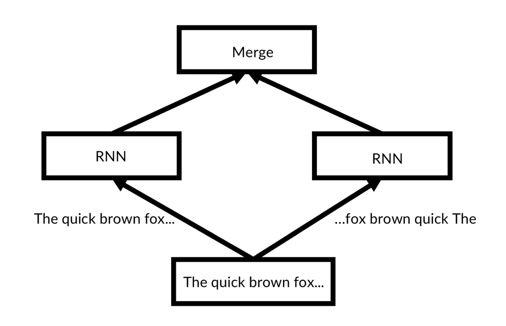


A bidirectional RNN
:::
:::

In Keras, there is a `Bidirectional` layer that we can wrap
any RNN layer around, such as an `LSTM`.
We achieve this in the following code:


``` {.programlisting .language-markup}
from keras.layers import Bidirectional
model = Sequential()
model.add(Embedding(max_words, embedding_dim, input_length=maxlen, weights = [embedding_matrix], trainable = False))
model.add(Bidirectional(CuDNNLSTM(32)))
model.add(Dense(1, activation='sigmoid'))
```
:::

Word embeddings are great because they enrich neural networks. They are
a space-efficient and powerful method that allows us to transform words
into numbers that a neural network can work with. With that being said,
there are more advantages to encoding semantics as vectors, such as how
we can perform vector math on them! This is useful if we want to measure
the similarity between two texts, for instance.


Document similarity with word embeddings {#document-similarity-with-word-embeddings .title style="clear: both"}
----------------------------------------------------------


The practical use case of word vectors is to
compare the semantic similarity between documents. If you are a retail
bank, insurance company, or any other company that sells to end users,
you will have to deal with support requests. You\'ll often find that
many customers have similar requests, so by finding out how similar
texts are semantically, previous answers to similar requests can be
reused, and your organization\'s overall service can be improved.

spaCy has a built-in function to measure the
similarity between two sentences. It also comes with pretrained vectors
from the Word2Vec model, which is similar to GloVe. This method works by
averaging the embedding vectors of all the words in a text and then
measuring the cosine of the angle between the average vectors. Two
vectors pointing in roughly the same direction will have a high
similarity score, whereas vectors pointing in different directions will
have a low similarity score. This is visualized in the following graph:


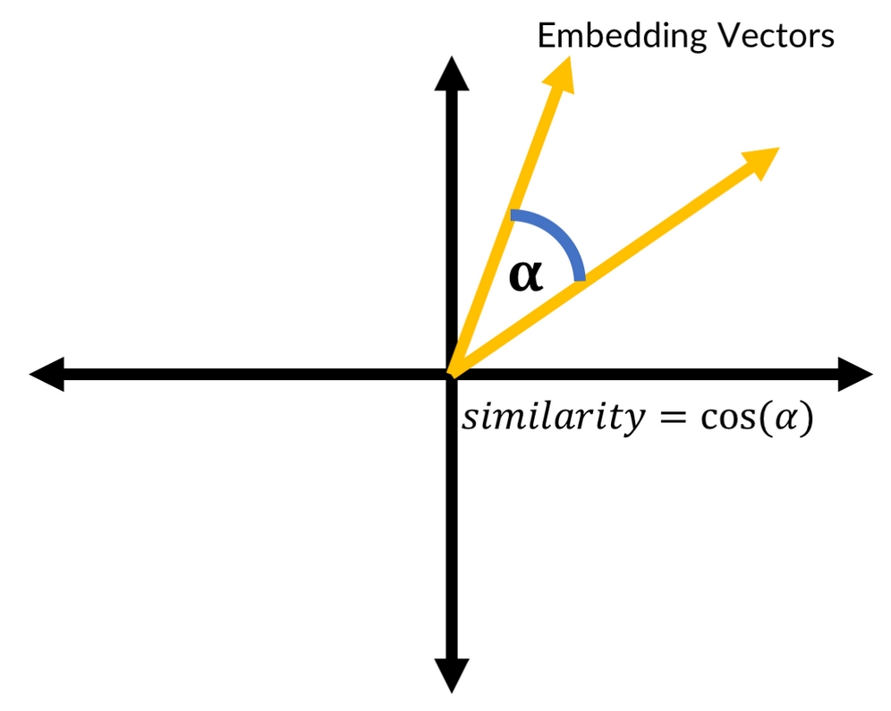


Similarity vectors
:::
:::

We can see the similarity between two phrases by running the following
command:


``` {.programlisting .language-markup}
sup1 = nlp('I would like to open a new checking account')
sup2 = nlp('How do I open a checking account?')
```
:::

As you can see, these requests are pretty similar, achieving a rate of
70%:


``` {.programlisting .language-markup}
sup1.similarity(sup2)
```
:::


``` {.programlisting .language-markup}
0.7079433112862716
```
:::

As you can see, their similarity score is quite
high. This simple averaging method works pretty decently. It is not,
however, able to capture things such as negations or a single deviating
vector, which might not influence the average too much.

For example, \"I would like to close a checking account\" has a
semantically different meaning than, \"I would like to open a checking
account.\" However, the model sees them as being
pretty similar. Yet, this approach is still useful and a good
illustration of the advantages of representing semantics as vectors.


A quick tour of the Keras functional API {#a-quick-tour-of-the-keras-functional-api .title style="clear: both"}
----------------------------------------------------------


So far, we\'ve used sequential models. In the
sequential model, layers get stacked on top of each other when we call
`model.add()`. The advantage of the functional API is that it
is simple and prevents errors. The disadvantage is that it only allows
us to stack layers linearly:


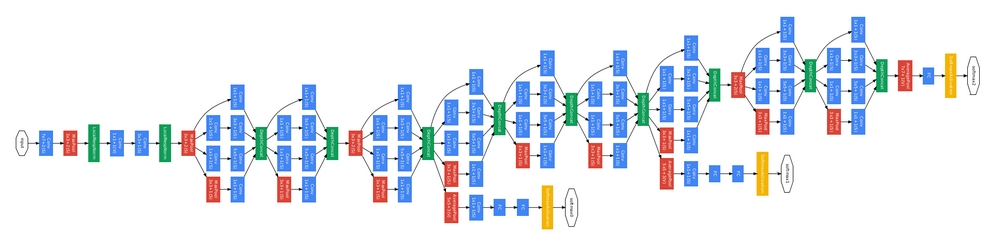


GoogLeNet Architecture from Szegedy and others\' \"Going Deeper with
Convolutions\"
:::
:::

Take a look at the preceding GoogLeNet architecture. While the graph is
very detailed, what we need to take away is the fact that the model is
not just a number of layers stacked on top of each other. Instead, there
are multiple layers in parallel; in this case, the model has three
outputs. However, the question remains, how did the authors build this
complicated model? The sequential API wouldn\'t have allowed them to,
but the functional API makes it easy to string up layers like a pearl
string and create architectures such as the preceding one.

For many NLP applications, we need more complex models in which, for
example, two separate layers run in parallel. In the Keras functional
API, we have more control and can specify how layers should be
connected. We can use this to create much more advanced and complex
models.

We will use the functional API a lot more from now on. This section of
the lab aims to provide a brief overview of the Keras functional
API, as we will be going into much more depth in later chapters.
Firstly, let\'s look at a simple two-layer network in both the
sequential and functional way:


``` {.programlisting .language-markup}
from keras.models import Sequential
from keras.layers import Dense, Activation

model = Sequential()
model.add(Dense(64, input_dim=64))
model.add(Activation('relu'))
model.add(Dense(4))
model.add(Activation('softmax'))
model.summary()
```
:::


``` {.programlisting .language-markup}
Layer (type)                 Output Shape              Param #   =================================================================dense_1 (Dense)              (None, 64)                4160      _________________________________________________________________activation_1 (Activation)    (None, 64)                0         _________________________________________________________________dense_2 (Dense)              (None, 4)                 260       _________________________________________________________________activation_2 (Activation)    (None, 4)                 0         =================================================================Total params: 4,420Trainable params: 4,420Non-trainable params: 0
_________________________________________________________________
```
:::

The preceding model is a simple model implemented
in the sequential API. Take note that this is how we have done it
throughout this course so far. We will now implement the same model in the
functional API:


``` {.programlisting .language-markup}
from keras.models import Model                        #1
from keras.layers import Dense, Activation, Input

model_input = Input(shape=(64,))                      #2
x = Dense(64)(model_input)                            #3
x = Activation('relu')(x)                             #4
x = Dense(4)(x)
model_output = Activation('softmax')(x)

model = Model(model_input, model_output)              #5
model.summary()
```
:::

Notice the differences to the sequential API:


1.  Instead of defining the model first with
    `model = Sequential()`, you now define the computational
    graph first and then turn it into a model using the
    `Model` class.

2.  Inputs are now their own layer.

3.  Instead of using `model.add()`, you define the layer and
    then pass on an input layer or the output tensor of the previous
    layer.

4.  You create models by stringing layers on a chain.
    `Dense(64)(model_input)`, for instance, returns a tensor.
    You pass on this tensor to the next layer, like in
    `Activation('relu')(x)`. This function will return a new
    output tensor, which you can pass to the next layer, and so on. This
    way, you create a computational graph like a chain.

5.  To create a model, you pass the model input layer as well as the
    final output tensor of your graph into the `Model` class.
:::

Functional API models can be used just like sequential API models. In
fact, from the output of this model\'s summary, you
can see it is pretty much the same as the model we just created with the
sequential API:


``` {.programlisting .language-markup}
Layer (type)                 Output Shape              Param #   =================================================================input_2 (InputLayer)         (None, 64)                0         _________________________________________________________________dense_3 (Dense)              (None, 64)                4160      _________________________________________________________________activation_3 (Activation)    (None, 64)                0         _________________________________________________________________dense_4 (Dense)              (None, 4)                 260       _________________________________________________________________activation_4 (Activation)    (None, 4)                 0         =================================================================Total params: 4,420Trainable params: 4,420Non-trainable params: 0
_________________________________________________________________
```
:::

You can see that the functional API can connect layers in more advanced
ways than the sequential API. We can also separate the layer creation
and connection step. This keeps the code clean and allows us to use the
same layer for different purposes.

The following code segment will create the exact same model as the
preceding segment, but with separate layer creation and connection
steps:


``` {.programlisting .language-markup}
model_input = Input(shape=(64,))

dense = Dense(64)

x = dense(model_input)

activation = Activation('relu')

x = activation(x)

dense_2 = Dense(4)

x = dense_2(x)

model_output = Activation('softmax')(x)

model = Model(model_input, model_output)
```
:::

Layers can be reused. For example, we could train some layers in one
computational graph and then use them for another, as we will do in the
section on seq2seq models later in the lab.

One more caveat before we move on to use the functional API to build
advanced models. We should note that the activation function of
 any layer can also be specified directly in the layer. So
far, we have used a separate activation layer, which increases clarity
but is not strictly required. A `Dense` layer with a
`relu` activation function can also be specified as:


``` {.programlisting .language-markup}
Dense(24, activation='relu')
```
:::

When using the functional API, this can be easier than adding an
activation function.


Attention {#attention .title style="clear: both"}
---------------------------


Are you paying attention? If so, certainly not to everyone equally. In
any text, some words matter more than others. An 
attention mechanism is a way for a neural network to
[*focus*] on a certain element in a sequence. Focusing, for
neural networks, means amplifying what is important:


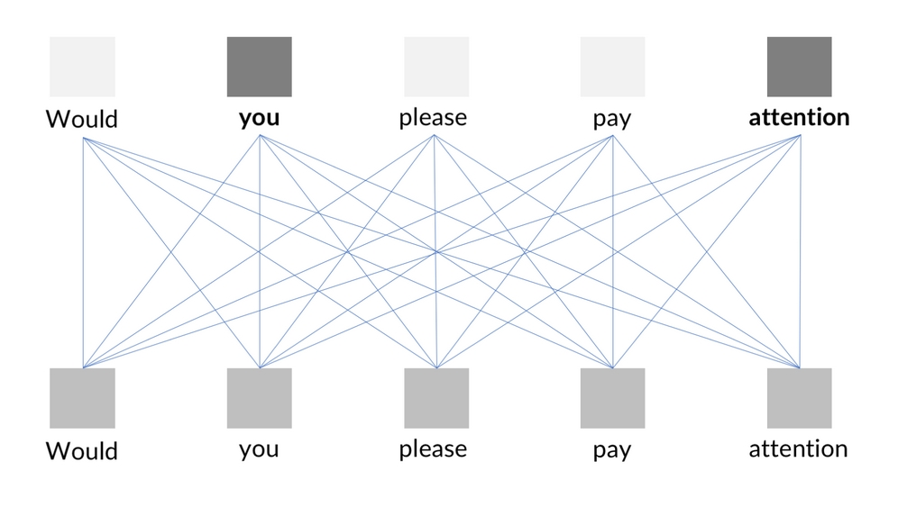


An example of an attention mechanism
:::
:::

Attention layers are fully connected layers that take in a sequence and
output the weighting for a sequence. The sequence
is then multiplied with the weightings:


``` {.programlisting .language-markup}
def attention_3d_block(inputs,time_steps,single_attention_vector = False):
    input_dim = int(inputs.shape[2])                             #1
    a = Permute((2, 1),name='Attent_Permute')(inputs)            #2
    a = Reshape((input_dim, time_steps),name='Reshape')(a)       #3
    a = Dense(time_steps, activation='softmax', name='Attent_Dense')(a) # Create attention vector            #4
    if single_attention_vector:                                  #5
        a = Lambda(lambda x: K.mean(x, axis=1), name='Dim_reduction')(a)                             #6
        a = RepeatVector(input_dim, name='Repeat')(a)            #7
        a_probs = Permute((2, 1), name='Attention_vec')(a)       #8
    output_attention_mul = Multiply(name='Attention_mul')([inputs, a_probs])                                          #9
    return output_attention_mul
```
:::

Let\'s break down the sequence we\'ve just created. As you can see,
it\'s made up of nine key elements:


1.  Our input has the shape
    `(batch_size, time_steps, input_dim)`, where
    `time_steps` is the length of the sequence, and
    `input_dim` is the dimensionality of the input. If we
    applied this directly to a text series with the embeddings used,
    `input_dim` would be 50, the same as the embedding
    dimensionality.

2.  We then swap (permute) the axis for `time_steps` and
    `input_dim` so that the tensor has a shape of
    `(batch_size, input_dim, time_steps)`.

3.  If everything went fine, our tensor is already in the shape that we
    want it to be in. Here we are adding a reshaping operation just to
    be sure.

4.  Now comes the trick. We run our input through a `dense`
    layer with a `softmax` activation. This will generate a
    weighting for each element in the series, just as shown previously.
    This `dense` layer is what is trained inside the
    `attention` block.

5.  By default, the `dense` layer computes attention for each
    input dimension individually. That is, for our word vectors, it
    would compute 50 different weightings. That can be useful if we are
    working with time series models where the input dimensions actually
    represent different things. In this case, we want to weight words as
    a whole.

6.  To create one attention value per word, we
    average the attention layer across the input dimensions. Our new
    tensor has the shape `(batch_size, 1, time_steps)`.

7.  In order to multiply the attention vector with the input, we need to
    repeat the weightings across the input dimension. After repetition,
    the tensor has the shape
    `(batch_size, input_dim, time_steps)` again, but with the
    same weights across the `input_dim` dimension.

8.  To match the shape of the input, we permute the axis for
    `time_steps` and `input_dim` back, so that the
    attention vector once again has a shape of
    `(batch_size, time_steps, input_dim)`.

9.  Finally, we apply the attention to the input by element-wise
    multiplying the attention vector with the input. We return the
    resulting tensor.
:::

The following flowchart gives an overview of the process:


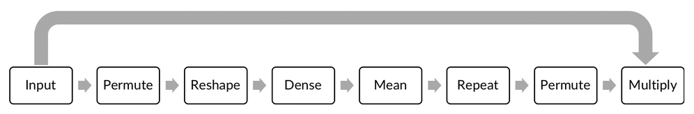


Attention block
:::
:::

Notice how the preceding function defines takes a tensor as an input,
defines a graph, and returns a tensor. We can now call this function as
part of our model building process:


``` {.programlisting .language-markup}
input_tokens = Input(shape=(maxlen,),name='input')

embedding = Embedding(max_words, embedding_dim, input_length=maxlen, weights = [embedding_matrix], trainable = False, name='embedding')(input_tokens)

attention_mul = attention_3d_block(inputs = embedding,time_steps = maxlen,single_attention_vector = True)

lstm_out = CuDNNLSTM(32, return_sequences=True, name='lstm')(attention_mul)


attention_mul = Flatten(name='flatten')(attention_mul)
output = Dense(1, activation='sigmoid',name='output')(attention_mul)
model = Model(input_tokens, output)
```
:::

In this case, we are using the attention block right after the
embeddings. This means that we can amplify or suppress certain
 word embeddings. Equally, we could use the attention block
after the LSTM. In many cases, you will find attention blocks to be
powerful tools in your arsenal when it comes to building models that
deal with any kind of sequence, especially in NLP.

To become more comfortable with how the functional API strings up layers
and how the attention block reshapes tensors, take a look at this model
summary:


``` {.programlisting .language-markup}
model.summary()
```
:::


``` {.programlisting .language-markup}
__________________________________________________________________________________________________Layer (type)                    Output Shape         Param #     Connected to                     ==================================================================================================input (InputLayer)              (None, 140)          0                                            __________________________________________________________________________________________________embedding (Embedding)           (None, 140, 50)      500000      input[0][0]                      __________________________________________________________________________________________________Attent_Permute (Permute)        (None, 50, 140)      0           embedding[0][0]                  __________________________________________________________________________________________________Reshape (Reshape)               (None, 50, 140)      0           Attent_Permute[0][0]             __________________________________________________________________________________________________Attent_Dense (Dense)            (None, 50, 140)      19740       Reshape[0][0]                    __________________________________________________________________________________________________Dim_reduction (Lambda)          (None, 140)          0           Attent_Dense[0][0]               __________________________________________________________________________________________________Repeat (RepeatVector)           (None, 50, 140)      0           Dim_reduction[0][0]              __________________________________________________________________________________________________Attention_vec (Permute)         (None, 140, 50)      0           Repeat[0][0]                     __________________________________________________________________________________________________Attention_mul (Multiply)        (None, 140, 50)      0           embedding[0][0]                  Attention_vec[0][0]              __________________________________________________________________________________________________flatten (Flatten)               (None, 7000)         0           Attention_mul[0][0]              __________________________________________________________________________________________________output (Dense)                  (None, 1)            7001        flatten[0][0]                    ==================================================================================================Total params: 526,741Trainable params: 26,741Non-trainable params: 500,000
__________________________________________________________________________________________________
```
:::

This model can be trained, just as any Keras model
can be, and achieves around 80% accuracy on the validation set.


Seq2seq models {#seq2seq-models .title style="clear: both"}
--------------------------------


In 2016, Google announced that it had replaced the
entire Google Translate algorithm with a single neural network. The
special thing about the Google Neural Machine Translation system is that
it translates mutliple languages \"end-to-end\" using only a single
model. It works by encoding the semantics of a sentence and then
decoding the semantics into the desired output language.

The fact that such a system is possible at all baffled many linguists
and other researchers, as it shows that machine learning can create
systems that accurately capture high-level meanings and semantics
without being given any explicit rules.

These semantic meanings are represented as an encoding vector, and while
we don\'t quite yet know how to interpret these vectors, there are a lot
of useful applications for them. Translating from one language to
another is one such popular method, but we could use a similar approach
to \"translate\" a report into a summary. Text summarization has
made great strides, but the downside is that it
requires a lot of computing power to deliver meaningful results, so we
will be focusing on language translation.


### Seq2seq architecture overview {#seq2seq-architecture-overview .title}


If all phrases had the exact same length, we could
simply use an LSTM (or multiple LSTMs). Remember that an LSTM can also
return a full sequence of the same length as the input sequence.
However, in many cases, sequences will not have the same length.

To deal with different lengths of phrases, we\'ll need to create an
encoder that aims to capture the sentence\'s semantic meaning. We then
create a decoder that has two inputs: the [*encoded
semantics*] and the [*sequence*] that was already
produced. The decoder then predicts the next item in the sequence. For
our character-level translator, it looks like this:


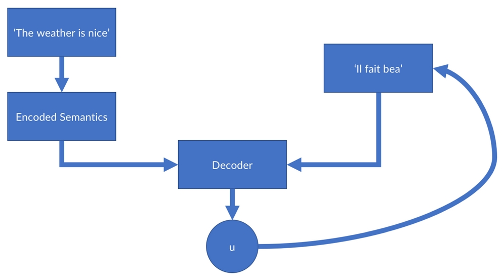


Seq2seq architecture overview
:::
:::

Note how the output of the decoder is used as the input of the decoder
again. This process is only stopped once the decoder 
produces a `<STOP>` tag, which indicates that the
sequence is over.


### Note {#note .title}

**Note**: The data and code for this section can be found on
Kaggle at
<https://www.kaggle.com/jannesklaas/a-simple-seq2seq-translat>.


### The data {#the-data .title}


We use a dataset of English phrases and their
translation. This dataset was obtained from the **Tabotea**
project, a translation database, and you can find
the file attached to the code on Kaggle. We implement this model on a
character level, which means that unlike previous models, we won\'t
tokenize words, but characters. This makes the task harder for our
network because it now has to also learn how to spell words! However, on
the other hand, there are a lot fewer characters than words, therefore
we can just one-hot encode characters instead of
having to work with embeddings. This makes our model a bit simpler.

To get started, we have to set a few parameters:


``` {.programlisting .language-markup}
batch_size = 64                #1
epochs = 100                   #2
latent_dim = 256               #3 
num_samples = 10000            #4
data_path = 'fra-eng/fra.txt'  #5
```
:::

But what are the parameters that we\'ve set up?


1.  Batch size for training.

2.  The number of epochs to train for.

3.  Dimensionality of the encoding vectors. How many numbers we use
    to encode the meaning of a sentence.

4.  A number of samples to train on. The whole dataset has about 140,000
    samples. However, we will train on fewer for memory and time
    reasons.

5.  The path to the data `.txt` file on disk.
:::

Input (English) and target (French) is tab delimited in the data file.
Each row represents a new phrase. The translations are separated by a
tab (escaped character: `\t`). So, we loop over the lines and
read out inputs and targets by splitting the lines at the tab symbol.

To build up our tokenizer, we also need to know which characters are
present in our dataset. So, for all of the characters, we need to check
whether they are already in our set of seen characters, and if not, add
them to it.

To do this, we must first set up the holding variables for texts and
characters:


``` {.programlisting .language-markup}
input_texts = []
target_texts = []
input_characters = set()
target_characters = set()
```
:::

Then we loop over as many lines as we want samples and extract the texts
and characters:


``` {.programlisting .language-markup}
lines = open(data_path).read().split('\n')
for line in lines[: min(num_samples, len(lines) - 1)]:
    
    input_text, target_text = line.split('\t')          #1
    
    target_text = '\t' + target_text + '\n'             #2
    input_texts.append(input_text)
    target_texts.append(target_text)

    for char in input_text:                             #3
        if char not in input_characters:
            input_characters.add(char)
            
    for char in target_text:                            #4
        if char not in target_characters:
            target_characters.add(char)
```
:::

Let\'s break this code down so that we can understand it in more detail:


1.  Input and target are split by tabs, English TAB French, so we split
    the lines by tabs to obtain input and target
    texts.

2.  We use `\t` as the \"start sequence\" character for the
    targets, and `\n` as \"end sequence\" character. This way,
    we know when to stop decoding.

3.  We loop over the characters in the input text, adding all characters
    that we have not seen yet to our set of input characters.

4.  We loop over the characters in the output text, adding all
    characters that we have not seen yet to our set of output
    characters.


### Encoding characters {#encoding-characters .title}


We now need to create lists of alphabetically
sorted input and output characters, which we can do by running:


``` {.programlisting .language-markup}
input_characters = sorted(list(input_characters))
target_characters = sorted(list(target_characters))
```
:::

We\'re also going to count how many input and output characters we have.
This is important since we need to know how many dimensions our one-hot
encodings should have. We can find this by writing the following:


``` {.programlisting .language-markup}
num_encoder_tokens = len(input_characters)
num_decoder_tokens = len(target_characters)
```
:::

Instead of using the Keras tokenizer, we will build our own dictionary
mapping characters to token numbers. We can do this by running the
following:


``` {.programlisting .language-markup}
input_token_index = {char: i for i, char in enumerate(input_characters)}
target_token_index = {char: i for i, char in enumerate(target_characters)}
```
:::

We can see how this works by printing the token numbers for all
characters in a short sentence:


``` {.programlisting .language-markup}
for c in 'the cat sits on the mat':
    print(input_token_index[c], end = ' ')
```
:::


``` {.programlisting .language-markup}
63 51 48 0 46 44 63 0 62 52 63 62 0 58 57 0 63 51 48 0 56 44 63
```
:::

Next, we build up our model training data. Remember that our model has
two inputs but only one output. While our model can
handle sequences of any length, it is handy to prepare the data in NumPy
and thus to know how long our longest sequence is:


``` {.programlisting .language-markup}
max_encoder_seq_length = max([len(txt) for txt in input_texts])
max_decoder_seq_length = max([len(txt) for txt in target_texts])

print('Max sequence length for inputs:', max_encoder_seq_length)
print('Max sequence length for outputs:', max_decoder_seq_length)
```
:::


``` {.programlisting .language-markup}
Max sequence length for inputs: 16
Max sequence length for outputs: 59
```
:::

Now we prepare input and output data for our model.
`encoder_input_data` is a 3D array of shape
`(num_pairs, max_english_sentence_length, num_english_characters)`
containing a one-hot vectorization of the English sentences:


``` {.programlisting .language-markup}
encoder_input_data = np.zeros((len(input_texts), max_encoder_seq_length, num_encoder_tokens),dtype='float32')
```
:::

`decoder_input_data` is a 3D array of shape
`(num_pairs, max_french_sentence_length, num_french_characters)`
containing a one-hot vectorization of the French sentences:


``` {.programlisting .language-markup}
decoder_input_data = np.zeros((len(input_texts), max_decoder_seq_length, num_decoder_tokens),dtype='float32')
```
:::

`decoder_target_data` is the same as
`decoder_input_data` but offset by one timestep.
`decoder_target_data[:, t, :]` will be the same as
`decoder_input_data[:, t + 1, :]`.


``` {.programlisting .language-markup}
decoder_target_data = np.zeros((len(input_texts), max_decoder_seq_length, num_decoder_tokens),dtype='float32')
```
:::

You can see that the input and output of the decoder are the same except
that the output is one timestep ahead. This makes
sense when you consider that we feed an unfinished sequence into the
decoder and want it to predict the next character. We will use the
functional API to create a model with two inputs.

You can see that the decoder also has two inputs: the [*decoder
inputs*] and the [*encoded semantics*]. The
encoded semantics, however, are not directly the outputs of the encoder
LSTM but its [*states*]. In an LSTM, states are the hidden
memory of the cells. What happens is that the first \"memory\" of our
decoder is the encoded semantics. To give the decoder this first memory,
we can initialize its states with the states of the decoder LSTM.

To return states, we have to set the `return_state` argument,
configuring an RNN layer to return a list where the first entry is the
outputs and the next entries are the internal RNN states. Once again, we
are using `CuDNNLSTM`. If you do not have a GPU, replace it
with `LSTM`, but note that training this model without
a GPU can take a very long time to complete:


``` {.programlisting .language-markup}
encoder_inputs = Input(shape=(None, num_encoder_tokens), name = 'encoder_inputs')               #1
encoder = CuDNNLSTM(latent_dim, return_state=True, name = 'encoder')                         #2
encoder_outputs, state_h, state_c = encoder(encoder_inputs)   #3

encoder_states = [state_h, state_c]                           #4
```
:::

Let\'s look at the four key elements of the code:


1.  We create an input layer for our encoder

2.  We create the LSTM encoder

3.  We link the LSTM encoder to the input layer and get back the outputs
    and states

4.  We discard `encoder_outputs` and only keep the states
:::

Now we define the decoder. The decoder uses the states of the encoder as
initial states for its decoding LSTM.

You can think of it like this: imagine you were a translator translating
English to French. When tasked with translating, you would first listen
to the English speaker and form ideas about what the speaker wants to
say in your head. You would then use these ideas to form a French
sentence expressing the same idea.

It is important to understand that we are not just
passing a variable, but a piece of the computational graph. This means
that we can later backpropagate from the decoder to the encoder. In the
case of our previous analogy, you might think that your
French translation suffered from a poor understanding of the English
sentence, so you might start changing your English comprehension based
on the outcomes of your French translation, for example:


``` {.programlisting .language-markup}
decoder_inputs = Input(shape=(None, num_decoder_tokens), name = 'decoder_inputs')                    #1
decoder_lstm = CuDNNLSTM(latent_dim, return_sequences=True, return_state=True, name = 'decoder_lstm')                     #2

decoder_outputs, _, _ = decoder_lstm(decoder_inputs,initial_state=encoder_states) #3

decoder_dense = Dense(num_decoder_tokens, activation='softmax', name = 'decoder_dense')
decoder_outputs = decoder_dense(decoder_outputs)                   #4
```
:::

The preceding code is made up of four key elements:


1.  Set up the decoder inputs.

2.  We set up our decoder to return full output sequences, and to return
    internal states as well. We don\'t use the return states in the
    training model, but we will use them for inference.

3.  Connect the decoder to the decoder inputs and specify the internal
    state. As mentioned previously, we don\'t use the internal states of
    the decoder for training, so we discard them here.

4.  Finally, we need to decide which character we want to use as the
    next character. This is a classification task, so we will use a
    simple `Dense` layer with a `softmax` activation
    function.
:::

We now have the pieces we need to define our model with two inputs and
one output:


``` {.programlisting .language-markup}
model = Model([encoder_inputs, decoder_inputs], decoder_outputs)
```
:::

If you have the `graphviz` library installed, you can
 visualize the model very nicely using the following code
lines. Unfortunately, however, this code snippet won\'t work on Kaggle:


``` {.programlisting .language-markup}
from IPython.display import SVG
from keras.utils.vis_utils import model_to_dot

SVG(model_to_dot(model).create(prog='dot', format='svg'))
```
:::

As you can see, this visualization is represented in the following
diagram:


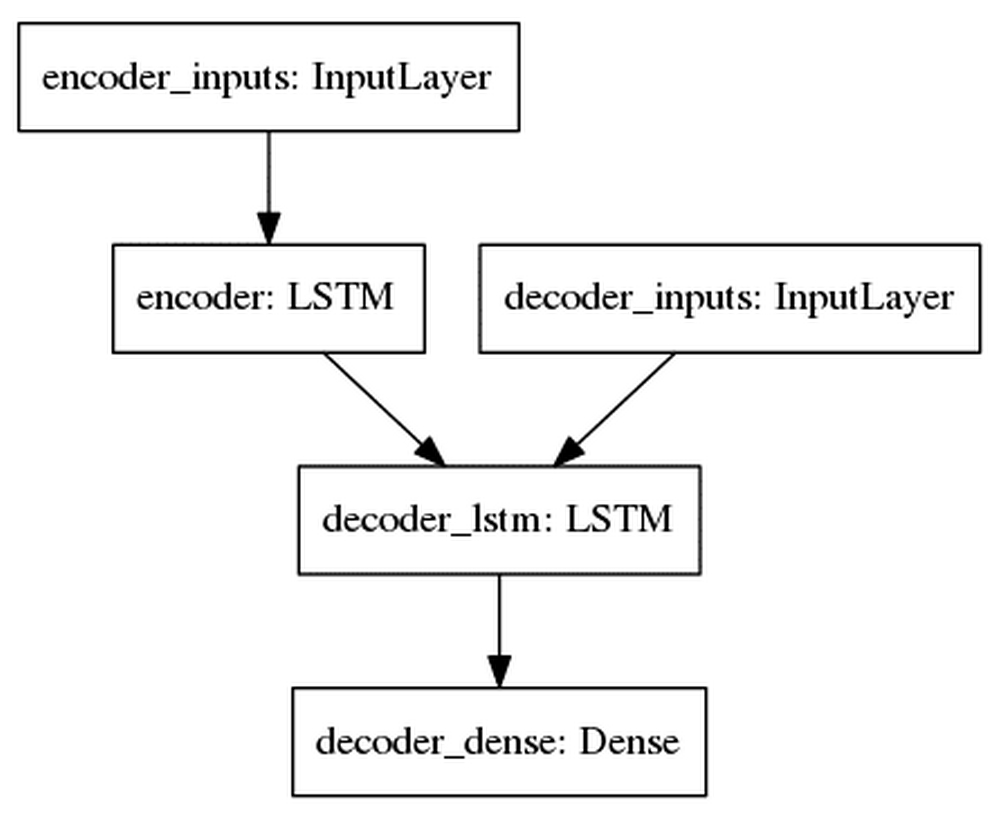


Seq2seq visual
:::
:::

You can now compile and train the model. Since we have to choose between
a number of possible characters to output next, this is basically a
multi-class classification task. Therefore, we\'ll use a categorical
cross-entropy loss:


``` {.programlisting .language-markup}
model.compile(optimizer='rmsprop', loss='categorical_crossentropy')
history = model.fit([encoder_input_data, decoder_input_data], decoder_target_data,batch_size=batch_size,epochs=epochs,validation_split=0.2)
```
:::

The training process takes about 7 minutes on a
GPU. However, if we were to plot the model\'s progress, you can see that
it\'s overfitting:


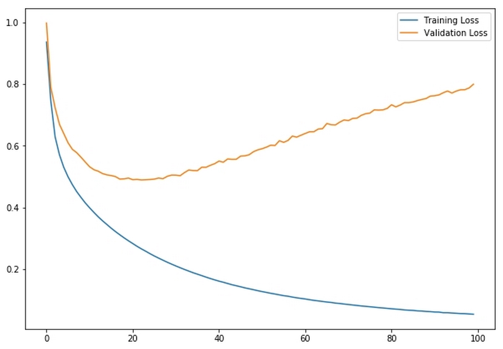


Seq2seq overfitting
:::
:::

The reason it\'s overfitting is largely because we used only 10,000
sentence pairs of only relatively short sentences. To get a bigger
model, a real translation or summarization system would have to be
trained on many more examples. To allow you to follow the examples
without owning a massive datacenter, we are just using a smaller model
to give an example of what a seq2seq architecture can do.
:::


### Creating inference models {#creating-inference-models .title}


Overfitting or not, we would like to use our model
now. Using a seq2seq model for inference, in this case for doing
translations, requires us to build a separate inference model that uses
the weights trained in the training model, but does the routing a bit
differently. More specifically, we will separate the encoder and
decoder. This way, we can first create the encoding once and then use it
for decoding instead of creating it again and again.

The encoder model maps from the encoder inputs to the encoder states:


``` {.programlisting .language-markup}
encoder_model = Model(encoder_inputs, encoder_states)
```
:::

The decoder model then takes in the encoder memory plus its own memory
from the last character as an input. It then spits out a prediction plus
its own memory to be used for the next character:


``` {.programlisting .language-markup}
#Inputs from the encoder
decoder_state_input_h = Input(shape=(latent_dim,))     #1
decoder_state_input_c = Input(shape=(latent_dim,))

#Create a combined memory to input into the decoder
decoder_states_inputs = [decoder_state_input_h, decoder_state_input_c]                                 #2

#Decoder
decoder_outputs, state_h, state_c = decoder_lstm(decoder_inputs, initial_state=decoder_states_inputs)                   #3

decoder_states = [state_h, state_c]                    #4

#Predict next char
decoder_outputs = decoder_dense(decoder_outputs)       #5

decoder_model = Model([decoder_inputs] + decoder_states_inputs,[decoder_outputs] + decoder_states)                #6
```
:::

Let\'s look at the six elements of this code:


1.  The encoder memory consists of two states. We need to create two
    inputs for both of them.

2.  We then combine the two states into one memory representation.

3.  We then connect the decoder LSTM we trained earlier to the decoder
    inputs and the encoder memory.

4.  We combine the two states of the decoder LSTM into one memory
    representation.

5.  We reuse the dense layer of the decoder to predict the next
    character.

6.  Finally, we set up the decoder model to take in
    the character input as well as the state input and map it to the
    character output as well as the state output.


### Making translations {#making-translations .title}


We can now start to use our model. To do this, we
must first create an index that maps tokens to characters again:


``` {.programlisting .language-markup}
reverse_input_char_index = {i: char for char, i in input_token_index.items()}
reverse_target_char_index = {i: char for char, i in target_token_index.items()}
```
:::

When we translate a phrase, we must first encode the input. We\'ll then
loop, feeding the decoder states back into the decoder until we receive
a STOP; in our case, we use the tab character to signal STOP.

`target_seq` is a NumPy array representing the last character
predicted by the decoder:


``` {.programlisting .language-markup}
def decode_sequence(input_seq):
    
    states_value = encoder_model.predict(input_seq)      #1
    
    target_seq = np.zeros((1, 1, num_decoder_tokens))    #2
    
    target_seq[0, 0, target_token_index['\t']] = 1.      #3

    stop_condition = False                               #4
    decoded_sentence = ''
    
    while not stop_condition:                            #5
        
        output_tokens, h, c = decoder_model.predict(
            [target_seq] + states_value)                           #6

        sampled_token_index = np.argmax(output_tokens[0, -1, :])   #7

        sampled_char = reverse_target_char_index[sampled_token_index]                                               #8
        
        decoded_sentence += sampled_char                           #9


        if (sampled_char == '\n' or                               #10
           len(decoded_sentence) > max_decoder_seq_length):
            stop_condition = True

        target_seq = np.zeros((1, 1, num_decoder_tokens))         #11
        target_seq[0, 0, sampled_token_index] = 1.

        states_value = [h, c]                                     #12

    return decoded_sentence
```
:::

For the final time in this lab, let\'s break down the code:


1.  Encode the input as state vectors

2.  Generate an empty target sequence of length one

3.  Populate the first character of the target
    sequence with the start character

4.  There was no stop sign, and the decoded sequence is empty so far

5.  Loop until we receive a stop sign

6.  Get output and internal states of the decoder

7.  Get the predicted token (the token with the highest probability)

8.  Get the character belonging to the token number

9.  Append a character to the output

10. Exit condition: either hit max length or find stop character

11. Update the target sequence (of length one)

12. Update states
:::

Now we can translate English into French! At least for some phrases, it
works quite well. Given that we did not supply our model with any rules
about French words or grammar, this is quite impressive. Translation
systems such as Google Translate, of course, use much bigger datasets
and models, but the underlying principles are the same.

To translate a text, we first create a placeholder
array full of zeros:


``` {.programlisting .language-markup}
my_text = 'Thanks!'
placeholder = np.zeros((1,len(my_text)+10,num_encoder_tokens))
```
:::

We then one-hot encode all characters in the text by setting the element
at the index of the characters\' token numbers to `1`:


``` {.programlisting .language-markup}
for i, char in enumerate(my_text):
    print(i,char, input_token_index[char])
    placeholder[0,i,input_token_index[char]] = 1
```
:::

This will print out the characters\' token numbers alongside the
character and its position in the text:


``` {.programlisting .language-markup}
0 T 38
1 h 51
2 a 44
3 n 57
4 k 54
5 s 62
6 ! 1
```
:::

Now we can feed this placeholder into our decoder:


``` {.programlisting .language-markup}
decode_sequence(placeholder)
```
:::

And we get the translation back:


``` {.programlisting .language-markup}
'Merci !\n'
```
:::

Seq2seq models are useful not only for translating between languages.
They can be trained on just about anything that takes a sequence as an
input and also outputs a sequence.

Remember our forecasting task from the last lab? The winning
solution to the forecasting problem was a seq2seq model. Text
summarization is another useful application. Seq2seq models can also be
trained to output a series of actions, such as a sequence of trades that
would minimize the impact of a large order.


Exercises {#exercises .title style="clear: both"}
---------------------------


Now that we\'re at the end of the lab, let\'s see what we\'ve
learned. To finish this lab, I\'ve included three exercises that
will challenge you based on what we\'ve covered in this lab:


1.  Add an extra layer to the encoder of the translation model. The
    translation model might work better if it had a bit more capacity to
    learn the structure of French sentences. Adding one more LSTM layer
    will be a good exercise to learn about the functional API.

2.  Add attention to the encoder of the translation model. Attention
    will allow the model to focus on the (English)
    words that really matter for translation. It is best to use
    attention as the last layer. This task is a bit harder than the
    previous one, but you will understand the inner workings of
    attention much better.

3.  Visit [*Daily News for Stock Market Prediction*] at
    <https://www.kaggle.com/aaron7sun/stocknews>. The task is to use the
    daily news as an input to predict stock prices. There are a number
    of kernels already that can help you with this. Use what you have
    learned in this lab to predict some stock prices!


Summary 
-------------------------


In this lab, you have learned the most important NLP techniques.
There was a lot that we\'ve learned, and here\'s a big list of things we
covered in this lab and everything you should now feel confident
about understanding:


-   Finding named entities

-   Fine-tuning spaCy\'s models for your own custom applications

-   Finding parts of speech and mapping the grammatical structure of
    sentences

-   Using regular expressions

-   Preparing text data for classification tasks

-   Using techniques such as bag-of-words and TF-IDF for classification

-   Modeling the topics present in a text with LDA

-   Using pretrained word embeddings

-   Building advanced models with the Keras functional API

-   Training your model to focus on attention

-   Translating sentences with the seq2seq model
:::

You now have a big set of tools in your toolbox that will allow you to
tackle NLP problems. Throughout the rest of this course, you will see some
of these techniques again, being used in different contexts to solve
hard problems. These techniques are useful across the industry, from
retail banking to hedge fund investing. While the problem your
institution is trying to solve might require a bit of tweaking, the
general approaches are quite transferable.

In the next lab, we will look at a technique that has gained a lot
of attention since DeepMind beat a human Go champion: reinforcement
learning. This technique is especially useful when working in financial
markets and is in many ways a natural extension of what many
quantitative investment firms are already doing. So, stay tuned, and
I\'ll see you on the other side.
