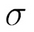

Chapter 6. Using Generative Models {#lab-6.-using-generative-models .title}
-------------------------------------------


Generative models generate new data. In a way, they are the exact
opposite of the models that we\'ve dealt with in prior chapters. While
an image classifier takes in a high-dimensional input, the image, and
outputs a low-dimensional output such as the content of the image, a
generative model goes about things in exactly the opposite way around.
It might, for example, draw images from the description of what\'s in
them.

Generative models are still in the experimental phase of their
development, and are currently used mostly in image applications.
However, they are an important model as shown by the fact that there
have already been several applications that have used generative models
that have caused an uproar within the industry.

In 2017, so-called [*DeepFakes*] began to appear on the
internet. **Generative Adversarial Networks**
(**GANs**), which we will cover later in
this lab, were used to generate pornographic videos featuring famous
celebrities. The year before, in 2016, researchers showcased a system in
which they could generate videos of politicians saying anything the
researcher wanted them to say, complete with realistic mouth movements
and facial expressions. An example of this can be seen in a fake speech
made by former US president Barack Obama that news site BuzzFeed
produced in 2018: <https://youtu.be/cQ54GDm1eL0>.

This technology is not completely negative, there are positive
applications as well, especially if the generative model\'s data is
sparse. If this is the case, generative models can generate realistic
data that other models can then train on. Generative models are able to
\"translate\" images, a prime example being taking satellite images and
turning them into street maps. Another example is that generative models
can generate code from website screenshots. They can even be used to
combat unfairness and discrimination in machine learning models,
as we will
see in [Chapter 9,
[*Fighting Bias*].

In the field of finance, data is frequently sparse. Think back to the
fraud case from Lab
2,
[*Applying Machine Learning to Structured Data,*] in which we
were classifying fraudulent transactions from transaction metadata. We
found that there was not much fraud taking place in the dataset that we
used, so the model had a hard time detecting when fraud was taking
place. Usually, when this occurs, engineers make assumptions and create
synthetic data. Machine learning models, however, can do this
themselves, and in the process, they might even discover some useful
features that can help with fraud detection.

In algorithmic trading, data is frequently generated in simulators. Want
to know how your algorithm would do in a global selloff? Luckily, there
are not that many global selloffs, so engineers at quantitative analysis
firms spend a lot of their time creating simulations of selloffs. These
simulators are often biased by the engineer\'s experience and their
feelings about what a selloff should look like. However, what if the
models could learn what a selloff fundamentally looks like, and then
create data describing an infinite number of selloffs?

In this lab, we\'ll be focusing on two families of generative
models: autoencoders and GANs. Firstly there is the family of
**autoencoders**, which aim to compress data into a lower
dimensional representation and then reconstruct the data faithfully. The
second family is that of the **GANs**, which aim to train a
generator so that a separate discriminator cannot tell fake images from
true images.


Understanding autoencoders {#understanding-autoencoders .title style="clear: both"}
--------------------------------------------


Technically, autoencoders are not generative models
since they cannot create completely new kinds of data. Yet, variational
autoencoders, a minor tweak to vanilla autoencoders, can. So, it makes
sense to first understand autoencoders by themselves, before adding the
generative element.

Autoencoders by themselves have some interesting properties that can be
exploited for applications such as detecting credit card fraud, which is
useful in our focus on finance.

Given an input, [*x*], an autoencoder learns how to output
[*x*]. It aims to find a function, [*f,*] so that
the following is true:


This might sound trivial at first, but the trick here is that
autoencoders have a bottleneck. The middle hidden layer\'s size is
smaller than the size of the input, [*x*]. Therefore, the
model has to learn a compressed representation that captures all
of the important elements of [*x*] in a smaller vector.

This can best be shown in the following diagram, where we can see a
compressed representation of the Autoencoder scheme:


Autoencoder scheme


This compressed representation aims to capture the essence of the input,
which turns out to be useful for us. We might, for example, want to
capture what essentially distinguishes a fraudulent transaction from a
genuine one. Vanilla autoencoders accomplish this
with something similar to standard **principal component
analysis** (**PCA**). They allow us to reduce the
dimensionality of our data and focus on what
matters. But in contrast to PCA, autoencoders can be extended in order
to generate more data of a certain type. For example, autoencoders can
better deal with image or video data since they can make use of the
spatiality of data using convolutional layers.

In this section, we will build two autoencoders. The first will be used
for handwritten digits from the MNIST dataset. Generative models are
easier to debug and understand for visual data due to the fact that
humans are intuitively good at judging whether two pictures show
something similar, but are less good at judging abstract data. The
second autoencoder is for a fraud detection task, using similar methods
as the MNIST dataset.


### Autoencoder for MNIST {#autoencoder-for-mnist .title}


Let\'s start with a simple autoencoder for the MNIST dataset of
handwritten digits. An MNIST image is 28x28 pixels and can be flattened
into a vector of 784 elements, which equals 28x28. We will compress
this data into a vector with only 32 elements by
using an autoencoder.

Before diving into the code described here, make sure you have saved the
MNIST dataset on the right path, successfully imported both the NumPy
and Matplotlib libraries, and set a random seed to ensure that your
experiments are reproducible.


### Note {#note .title}

**Note**: You can find the code for the
MNIST autoencoder and variational autoencoder under the following URL
<https://www.kaggle.com/jannesklaas/mnist-autoencoder-vae.>


We\'re going to set the encoding dimensionality hyperparameter now so
that we can use it later:


``` {.programlisting .language-markup}
encoding_dim = 32
```


Then, we construct the autoencoder using the Keras functional API. While
a simple autoencoder could be constructed using the sequential API, this
is a good refresher for us on how the functional API works.

First, we import the `Model` class, which allows us to create
functional API models. We also need to import both the `Input`
and `Dense` layers. You\'ll remember from previous chapters
how the functional API needs a separate input layer, while the
sequential API does not need one. To import both layers, we need to run
the following:


``` {.programlisting .language-markup}
from keras.models import Model
from keras.layers import Input, Dense
```


Now we are chaining up the autoencoder\'s layers: an `Input`
layer followed by a `Dense` layer that encodes the image to a
smaller representation.

This is followed by a `Dense` decoding layer that aims to
reconstruct the original image:


``` {.programlisting .language-markup}
input_img = Input(shape=(784,))

encoded = Dense(encoding_dim, activation='relu')(input_img)

decoded = Dense(784, activation='sigmoid')(encoded)
```


After we have created and chained up the layers, we are then able to
create a model that maps from the input to the decoded image:


``` {.programlisting .language-markup}
autoencoder = Model(input_img, decoded)
```


To get a better idea of what is going on, we can plot a visualization of
the resulting autoencoder model with the following code:


``` {.programlisting .language-markup}
from keras.utils import plot_model
plot_model(autoencoder, to_file='model.png', show_shapes=True) plt.figure(figsize=(10,10))
plt.imshow(plt.imread('model.png'))
```


You can see our autoencoder as follows:


Autoencoder model


Which we can compile with:


``` {.programlisting .language-markup}
autoencoder.compile(optimizer='adadelta', loss='binary_crossentropy')
```


To train this autoencoder, we use the [*X*] values as both
the input and output:


``` {.programlisting .language-markup}
autoencoder.fit(X_train_flat, X_train_flat,epochs=50,batch_size=256,shuffle=True,validation_data=(X_test_flat, X_test_flat))
```


After we train this autoencoder, which will take between one and two
minutes, we can visually inspect how well it is doing. To do this, we
first extract a single image from the test set,
before adding a batch dimension to the image in order to run it through
the model, which is what we use `np.expand_dims` for:


``` {.programlisting .language-markup}
original = np.expand_dims(X_test_flat[0],0)
```


Now we\'re going to run the original image through the autoencoder.
You\'ll remember that the original MNIST image showed us a number seven,
so we\'re hoping that the output of our autoencoder shows a seven as
well:


``` {.programlisting .language-markup}
seven = autoencoder.predict(original)
```


Next, we\'re going to reshape both the autoencoder output as well as the
original image back into 28x28-pixel images:


``` {.programlisting .language-markup}
seven = seven.reshape(1,28,28)
original = original.reshape(1,28,28)
```


We then plot the original and reconstructed image next to each other.
`matplotlib` does not allow the image to have a batch
dimension, therefore we need to pass an array without it. By indexing
the images with `[0,:,:]`, we\'ll only pass the first item in
the batch with all pixels.

This first item now doesn\'t have a batch dimension anymore:


``` {.programlisting .language-markup}
fig = plt.figure(figsize=(7, 10))
a=fig.add_subplot(1,2,1)
a.set_title('Original')
imgplot = plt.imshow(original[0,:,:])

b=fig.add_subplot(1,2,2)
b.set_title('Autoencoder')
imgplot = plt.imshow(seven[0,:,:])
```


After running that code, you\'ll see that our hopes have been achieved!
Compared to the original image (left), our autoencoder image (right) is
also showing a seven!:


Autoencoder result


As you can see in the preceding screenshot, the
reconstructed seven is still a seven, so the autoencoder was able to
capture the general idea of what a seven is. It\'s not perfect though,
as you can see it\'s a bit blurry around the edges, especially in the
top left. It seems that while the autoencoder is unsure about the length
of the lines, it does have a good idea that there are two lines in a
seven and it is aware of the general direction they follow.

An autoencoder such as this one performs nonlinear PCA. It learns which
components matter the most for a seven to be a seven. The usefulness of
being able to learn this representation goes beyond images. Within
credit card fraud detection, such principal components would make for
good features that another classifier would be able to work with.

In the next section, we will apply an autoencoder to the credit card
fraud problem.


### Autoencoder for credit cards {#autoencoder-for-credit-cards .title}


Throughout this section, we will once again be dealing with the problem
of credit card fraud. This time, we will be using a slightly different
dataset from that in Lab
2,
[*Applying Machine Learning to Structured Data*].

This new dataset contains records of actual credit
card transactions with anonymized features; however, it does not lend
itself much to feature engineering. Therefore, we will have to rely on
end-to-end learning methods in order to build a good fraud detector.


### Note {#note-1 .title}

**Note**: You can find the dataset at:
<https://www.kaggle.com/mlg-ulb/creditcardfraud> and the notebook with
an implementation of an autoencoder and variational autoencoder at:
<https://www.kaggle.com/jannesklaas/credit-vae>.


As usual, we first load the data. The `Time` feature shows the
absolute time of the transaction, which makes the data a bit hard to
deal with here. Therefore, we will just drop it, which we can do by
running:


``` {.programlisting .language-markup}
df = pd.read_csv('../input/creditcard.csv')
df = df.drop('Time',axis=1)
```


We then separate the `X` data on the transaction from the
classification of the transaction and extract the NumPy array that
underlies the pandas DataFrame:


``` {.programlisting .language-markup}
X = df.drop('Class',axis=1).values
y = df['Class'].values
```


Now we need to scale the features. Feature scaling makes it easier for
our model to learn a good representation of the data. This time around,
we\'re going employ a slightly different method of feature scaling than
what we did before. We\'ll scale all features to be between zero and
one, as opposed to having a mean of zero and a standard deviation of
one. By doing this, we ensure that there are neither any very high
nor very low values in the dataset.

We must be aware that this method is susceptible to outliers influencing
the result. For each column, we first subtract the minimum value, so
that the new minimum value becomes zero. Next, we divide by the maximum
value so that the new maximum value becomes one.

By specifying `axis=0`, we perform the scaling column-wise:


``` {.programlisting .language-markup}
X -= X.min(axis=0)
X /= X.max(axis=0)
```


Then, finally, we split our data:


``` {.programlisting .language-markup}
from sklearn.model_selection import train_test_split
X_train, X_test, y_train,y_test = train_test_split(X,y,test_size=0.1)
```


We then create the exact same autoencoder as we did before; however,
this time, we do it with different dimensions. Our input now has 29
dimensions, which we compress down to 12 dimensions before aiming to
restore the original 29-dimensional output.

While 12 dimensions is a somewhat arbitrary choice here, it allows for
enough capacity to capture all the relevant information while
still significantly compressing the data:


``` {.programlisting .language-markup}
from keras.models import Model
from keras.layers import Input, Dense
```


We are going to use the sigmoid activation function for the decoded
data. This is only possible because we\'ve scaled the data to have
values between zero and one. We are also using a tanh activation within
the encoded layer. This is just a style choice that worked well in
experiments and ensures that encoded values are all
between minus one and one. With that being said, you may use different
activation functions depending on your individual needs.

If you are working with images or deeper networks, a ReLU activation is
usually a good choice. However, if you are working with a shallower
network, as we are doing here, then a tanh activation often works well:


``` {.programlisting .language-markup}
data_in = Input(shape=(29,))
encoded = Dense(12,activation='tanh')(data_in)
decoded = Dense(29,activation='sigmoid')(encoded)
autoencoder = Model(data_in,decoded)
```


In this example, we\'ve used a mean squared error loss. This seems a bit
of an unusual choice at first, using a sigmoid activation with a mean
squared error loss, yet it makes sense. Most people think that sigmoid
activations have to be used with a cross-entropy loss, but cross-entropy
loss encourages values to either be zero or one, which works well for
classification tasks where this is the case.

In our credit card example, most values will be around 0.5. Mean squared
error, which we can see being implemented in the code below, is better
at dealing with values where the target is not binary, but on a
spectrum. Binary cross entropy forces values to be close to zero and
one, which is not what we always want:


``` {.programlisting .language-markup}
autoencoder.compile(optimizer='adam',loss='mean_squared_error')
```


After training, which will take around two minutes, the autoencoder
converges to a low loss:


``` {.programlisting .language-markup}
autoencoder.fit(X_train,X_train,epochs = 20,batch_size=128,validation_data=(X_test,X_test))
```


The reconstruction loss is low, but how do we know whether our
autoencoder is working well? Once again, a visual inspection will come
to the rescue. As we\'ve explained before, humans are very good at
judging things visually, but not very good at judging abstract numbers.

To run a visual inspection, first we must make some
predictions, in which we\'ll run a subset of our test set through the
autoencoder:


``` {.programlisting .language-markup}
pred = autoencoder.predict(X_test[0:10])
```


We must can then plot individual samples. The following code produces an
overlaid bar chart comparing the original transaction data with the
reconstructed transaction data:


``` {.programlisting .language-markup}
import matplotlib.pyplot as plt
import numpy as np

width = 0.8

prediction   = pred[9]
true_value    = X_test[9]

indices = np.arange(len(prediction))

fig = plt.figure(figsize=(10,7))

plt.bar(indices, prediction, width=width, color='b', label='Predicted Value')

plt.bar([i+0.25*width for i in indices], true_value, width=0.5*width, color='r', alpha=0.5, label='True Value')

plt.xticks(indices+width/2., ['V{}'.format(i) for i in range(len(prediction))] )

plt.legend()

plt.show()
```


This code will then give us the following chart:


Autoencoder reconstruction versus original data


As you can see, our model does a fine job at
reconstructing the original values. The reconstructed values often match
the true values, and if they don\'t, then they only deviate by a small
margin. As you can see, visual inspection gives more insight than
looking at abstract numbers.


Visualizing latent spaces with t-SNE {#visualizing-latent-spaces-with-t-sne .title style="clear: both"}
------------------------------------------------------


We now have an autoencoder that takes in a credit
card transaction and outputs a credit card transaction that looks more
or less the same. However, this is not why we built
the autoencoder. The main advantage of an autoencoder is that we can now
encode the transaction into a lower dimensional representation that
captures the main elements of the transaction.

To create the encoder model, all we have to do is to define a new Keras
model that maps from the input to the encoded state:


``` {.programlisting .language-markup}
encoder = Model(data_in,encoded)
```


Note that you don\'t need to train this model again. The layers keep the
weights from the previously trained autoencoder.

To encode our data, we now use the encoder model:


``` {.programlisting .language-markup}
enc = encoder.predict(X_test)
```


But how would we know whether these encodings contain any meaningful
information about fraud? Once again, visual representation is key. While
our encodings have fewer dimensions than the input data, they still have
12 dimensions. It\'s impossible for humans to think about a
12-dimensional space, so we need to draw our encodings in a lower
dimensional space while still preserving the characteristics we care
about.

In our case, the characteristic we care about is
[*proximity*]. We want points that are close to each other in
the 12-dimensional space to be close to each other in the 2-dimensional
plot. More precisely, we care about the
neighborhood. We want the points that are closest to each other in the
high-dimensional space to also be closest to each other in the
low-dimensional space.

Preserving the neighborhood is important because we
want to find clusters of fraud. If we find that fraudulent transactions
form a cluster in our high-dimensional encodings, then we can use a
simple check if a new transaction falls into the fraud cluster to flag a
transaction as fraudulent. A popular method to project high-dimensional
data into low-dimensional plots while preserving neighborhoods is called
**t-distributed stochastic neighbor embedding,** or[
**t-SNE**.

In a nutshell, t-SNE aims to faithfully represent the probability that
two points are neighbors in a random sample of all points. That is, it
tries to find a low-dimensional representation of data in which points
in a random sample have the same probability of being the closest
neighbors as in the high-dimensional data:


How t-SNE measures similarity


The t-SNE algorithm follows these steps:


1.  Calculate the Gaussian similarity between all
    points. This is done by calculating the Euclidean (spatial)
    distance between points and then calculating
    the value of a Gaussian curve at that distance, as you can see in
    the preceding diagram. The Gaussian similarity for all points,
    [*j,*] from point [*i*] can be calculated as
    follows:

    
    
    

    In the preceding formula,
    []{.inlinemediaobject}2 is the
    variance of the Gaussian distribution. We will look at how to
    determine this variance later on in this lab. Note that since
    the similarity between points [*i*] and [*j*]
    is scaled by the sum of distances between [*i*] and all
    other points (expressed as [*k*]), the similarity between
    [*i*] and
    [*j*],[]{.inlinemediaobject},
    can be different from the similarity between [*j*] and
    [*i*],
    []{.inlinemediaobject}. Therefore, we
    average the two similarities to gain the final similarity that
    we\'ll work with going forward:

    
    
    

    In the preceding formula, [*n*] is the number of data
    points.

2.  Randomly position the data points in the lower dimensional space.

3.  Calculate the [*t-similarity*] between all the points in
    the lower dimensional space:

    
    
    

4.  Just like in training neural networks, we will
    optimize the positions of the data points in the lower dimensional
    space by following the gradient of a loss
    function. The loss function, in this case, is the
    **Kullback--Leibler** (**KL**) divergence
    between the similarities in the higher and lower dimensional space.
    We will give the KL divergence a closer look in the section
    on variational autoencoders. For now, just
    think of it as a way to measure the difference between two
    distributions. The derivative of the loss function with respect to
    the position [*y~i~*] of data point [*i*] in
    the lower dimensional space is as follows:

    
    
    

5.  Adjust the data points in the lower dimensional space by using
    gradient descent, moving points that were close in the
    high-dimensional data closer together and moving points that were
    further away further from each other:

    
    
    

6.  You will recognize this as a form of gradient descent with momentum,
    as the previous gradient is incorporated into the updated position.


The t-distribution used always has one degree of freedom. This freedom
leads to a simpler formula as well as some nice numerical properties
that lead to faster computation and more useful charts.

The standard deviation of the Gaussian distribution
can be influenced by the user with a [*perplexity*]
hyperparameter. Perplexity can be interpreted as the number of neighbors
we expect a point to have. A low perplexity value 
emphasizes local proximities, while a high perplexity value
emphasizes global perplexity values. Mathematically, perplexity can be
calculated as follows:


Here [*P~i~*] is a probability distribution over the position
of all data points in the dataset and
[]{.inlinemediaobject} is the Shanon
entropy of this distribution, calculated as follows:


While the details of this formula are not very relevant to using t-SNE,
it is important to know that t-SNE performs a search over values of the
standard deviation,
[]{.inlinemediaobject}, so that it finds a
global distribution, [*P~i~,*] for which the entropy over our
data is of our desired perplexity. In other words, you need to specify
the perplexity by hand, but what that perplexity means for your dataset
also depends on the dataset itself.

Laurens Van Maarten and Geoffrey Hinton, the inventors of t-SNE, report
that the algorithm is relatively robust for choices of perplexity
between 5 and 50. The default value in most libraries is 30, which is a
fine value for most datasets. However, if you find that your
visualizations are not satisfactory, then tuning the perplexity value is
probably the first thing you would want to do.

For all the math involved, using t-SNE is surprisingly simple.
Scikit-learn has a handy t-SNE implementation that we
 can use just like any algorithm in scikit-learn.

We first import the `TSNE` class, and then we can create a new
`TSNE` instance. We define that we want to train for 5000
epochs, and use the default perplexity of 30 and the default learning
rate of 200. We also specify that we would like
output during the training process. We then call
`fit_transform`, which transforms our 12 encodings into
2-dimensional projections:


``` {.programlisting .language-markup}
from sklearn.manifold import TSNE
tsne = TSNE(verbose=1,n_iter=5000)
res = tsne.fit_transform(enc)
```


As a word of warning, t-SNE is quite slow as it needs to compute the
distances between all the points. By default, scikit-learn uses a faster
version of t-SNE called the Barnes Hut approximation. While it\'s not as
precise, it\'s significantly faster.

There\'s also a faster Python implementation of t-SNE that can be used
as a drop-in replacement of the scikit-learn implementation. However,
this is not as well documented and contains fewer features, therefore we
will not be covering it in this book.


### Note {#note .title}

**Note**: You can find the faster implementation with
installation instructions under the following URL
<https://github.com/DmitryUlyanov/Multicore-TSNE>.


We can then plot our t-SNE results as a scatterplot. For illustration,
we will distinguish frauds from non-frauds by color, with frauds being
plotted in red and non-frauds being plotted in blue. Since the actual
values of t-SNE do not matter as much, we will hide the axes:


``` {.programlisting .language-markup}
fig = plt.figure(figsize=(10,7))
scatter =plt.scatter(res[:,0],res[:,1],c=y_test, cmap='coolwarm', s=0.6)
scatter.axes.get_xaxis().set_visible(False)
scatter.axes.get_yaxis().set_visible(False)
```


Let\'s now see, what the output chart will look like:


t-SNE results in the form of a scatter graph


For easier spotting, and for those reading the print version,
the cluster containing the most frauds, those that
are marked red, has been marked with a circle. You can see that the
frauds are nicely separate from the rest of the genuine transactions,
those in blue. Clearly, our autoencoder has found a way to distinguish
frauds from the genuine transaction without being given labels. This is
a form of unsupervised learning.

In fact, plain autoencoders perform an
approximation of PCA, which is useful for unsupervised learning. In the
output chart, you can see that there are a few more clusters that are
clearly separate from the other transactions, yet these are not frauds.
Using autoencoders and unsupervised learning, it is possible to separate
and group our data in ways that we did not even think of before. For
example, we might be able to cluster transactions by purchase type.

Using our autoencoder, we could now use the encoded information as
features for a classifier. However, what\'s even better is that with
only a slight modification of the autoencoder, we can generate more data
that has the underlying properties of a fraud case
while having different features. This is done with a variational
autoencoder, which will be the focus of the next section.


Variational autoencoders {#variational-autoencoders .title style="clear: both"}
------------------------------------------


Autoencoders are basically an approximation for PCA. However, they can
be extended to become generative models. Given an input, **variational
autoencoders** (**VAEs**) can create encoding
[*distributions*]. This means that for a
fraud case, the encoder would produce a distribution of possible
encodings that all represent the most important characteristics of the
transaction. The decoder would then turn all of the encodings back into
the original transaction.

This is useful since it allows us to generate data about transactions.
One problem of fraud detection that we discovered earlier is that there
are not all that many fraudulent transactions. Therefore, by using a
VAE, we can sample any amount of transaction encodings and train our
classifier with more fraudulent transaction data.

So, how do VAEs do it? Instead of having just one compressed
representation vector, a VAE has two: one for the mean encoding,
[]{.inlinemediaobject}, and one for the
standard deviation of this encoding,
[]{.inlinemediaobject}:


VAE scheme


Both the mean and standard deviation are vectors, just as with the
encoding vector we used for the vanilla autoencoder. However, to create
the actual encoding, we simply need to add random noise with the
standard deviation,
[]{.inlinemediaobject}, to our
encoding vector.

To achieve a broad distribution of values, our network trains with a
combination of two losses: the reconstruction loss, which you know from
the vanilla autoencoder; and the KL divergence loss between the encoding
distribution and a standard Gaussian distribution with a standard
deviation of one.


### MNIST example {#mnist-example .title}


Now on to our first VAE. This VAE will work with the MNIST dataset and
give you a better idea about how VAEs work. In the
next section, we will build the same VAE for credit card fraud
detection.

Firstly, we need to import several elements, which we can do simply by
running:


``` {.programlisting .language-markup}
from keras.models import Model
from keras.layers import Input, Dense, Lambda
from keras import backend as K
from keras import metrics
```


Notice the two new imports, the `Lambda` layer and the
`metrics` module. The `metrics` module provides
metrics, such as the cross-entropy loss, which we will use to build our
custom loss function. Meanwhile the `Lambda` layer allows us
to use Python functions as layers, which we will use to sample
 from the encoding distribution. We will see just how the
`Lambda` layer works in a bit, but first, we need to set up
the rest of the neural network.

The first thing we need to do is to define a few hyperparameters. Our
data has an original dimensionality of 784, which we compress into a
latent vector with 32 dimensions. Our network has an intermediate layer
between the input and the latent vector, which has 256 dimensions. We
will train for 50 epochs with a batch size of 100:


``` {.programlisting .language-markup}
batch_size = 100
original_dim = 784
latent_dim = 32
intermediate_dim = 256
epochs = 50
```


For computational reasons, it is easier to learn the log of the standard
deviation rather than the standard deviation itself. To do this we
create the first half of our network, in which the input, `x,`
maps to the intermediate layer, `h`. From this layer, our
network splits into `z_mean`, which expresses
[]{.inlinemediaobject} and
`z_log_var`, which expresses
[]{.inlinemediaobject}:


``` {.programlisting .language-markup}
x = Input(shape=(original_dim,))
h = Dense(intermediate_dim, activation='relu')(x)
z_mean = Dense(latent_dim)(h)
z_log_var = Dense(latent_dim)(h)
```


### Using the Lambda layer


The `Lambda` layer wraps an arbitrary expression, that is, a
Python function, as a Keras layer. Yet there are a few requirements in
order to make this work. For backpropagation to
work, the function needs to be differentiable. After all, we want to
update the network weights by the gradient of the loss. Luckily, Keras
comes with a number of functions in its `backend` module that
are all differentiable, and simple Python math, such as [*y = x +
4*], is fine as well.

Additionally, a `Lambda` function can only take one input
argument. In the layer we want to create, the input is just the previous
layer\'s output tensor. In this case, we want to create a layer with two
inputs, []{.inlinemediaobject} and
[]{.inlinemediaobject}. Therefore, we will
wrap both inputs into a tuple that we can then take apart.

You can see the function for sampling below:


``` {.programlisting .language-markup}
def sampling(args):
    z_mean, z_log_var = args                                  #1
    epsilon = K.random_normal(shape=(K.shape(z_mean)[0], latent_dim), mean=0.,stddev=1.0)                     #2
    return z_mean + K.exp(z_log_var / 2) * epsilon            #3
```


Let\'s take a minute to break down the function:


1.  We take apart the input tuple and have our two input tensors.

2.  We create a tensor containing random, normally distributed noise
    with a mean of zero and a standard deviation of one. The tensor has
    the shape as our input tensors (`batch_size`,
    `latent_dim`).

3.  Finally, we multiply the random noise with our standard deviation to
    give it the learned standard deviation and add the learned mean.
    Since we are learning the log standard deviation, we have to apply
    the exponent function to our learned tensor.


All these operations are differentiable since we are using the Keras
backend functions. Now we can turn this function into a layer and
connect it to the previous two layers with one line:


``` {.programlisting .language-markup}
z = Lambda(sampling)([z_mean, z_log_var])
```


And voilà! We\'ve now got a custom layer that samples from a normal
distribution described by two tensors. Keras can automatically
backpropagate through this layer and train the weights of the layers
before it.

Now that we have encoded our data, we also need to decode it as well. We
are able to do this with two `Dense` layers:


``` {.programlisting .language-markup}
decoder_h = Dense(intermediate_dim, activation='relu')(z)
x_decoded = Dense(original_dim, activation='sigmoid')decoder_mean(h_decoded)
```


Our network is now complete. This network will encode any MNIST image
into a mean and a standard deviation tensor from which the decoding part
then reconstructs the image. The only thing missing is the custom loss
incentivizing the network to both reconstruct images and produce a
normal Gaussian distribution in its encodings. Let\'s address that now.


### Kullback--Leibler divergence {#kullbackleibler-divergence .title}


To create the custom loss for our VAE, we need a custom loss function.
This loss function will be based on the **Kullback-Leibler**
(**KL**) divergence.

KL divergence, is one of the metrics, just like cross-entropy, that
machine learning inherited from information theory.
While it is used frequently, there are many struggles you can encounter
when trying to understand it.

At its core, KL divergence measures how much information is lost when
distribution [*p*] is approximated with distribution
[*q*].

Imagine you are working on a financial model and have collected data on
the returns of a security investment. Your financial modeling tools all
assume a normal distribution of returns. The following chart shows the
actual distribution of returns versus an approximation using a normal
distribution model. For the sake of this example, let\'s assume there
are only discrete returns. Before we go ahead, be assured that we\'ll
cover continuous distributions later:


Approximation versus actual


Of course, the returns in your data are not exactly normally
distributed. So, just how much information about returns would you lose
if you did lose the approximation? This is exactly what the KL
divergence is measuring:


Here []{.inlinemediaobject} and
[]{.inlinemediaobject} are the
probabilities that [*x*], in this case, the return, has some
value [*i*], say 5%. The preceding formula 
effectively expresses the expected difference in the
logarithm of probabilities of the distributions [*p*] and
[*q*]:


This expected difference of log probabilities is the same as the average
information lost if you approximate distribution [*p*] with
distribution [*q*]. See the following:


Given that the KL divergence is usually written out as follows:


It can also be written in its continuous form as:


For VAEs, we want the distribution of encodings to be a normal Gaussian
distribution with a mean of zero and a standard deviation of one.

When [*p*] is substituted with the normal Gaussian
distribution, []{.inlinemediaobject}, and
the approximation [*q*] is a normal
distribution with a mean of
[]{.inlinemediaobject} and a standard
deviation of []{.inlinemediaobject},
[]{.inlinemediaobject}, the KL divergence,
simplifies to the following:


The partial derivatives to our mean and standard deviation vectors are,
therefore as follows:


With the other being:


You can see that the derivative with respect to
[]{.inlinemediaobject} is zero if
[]{.inlinemediaobject} is zero, and the
derivative with respect to
[]{.inlinemediaobject} is zero if
[]{.inlinemediaobject} is one. This loss
term is added to the reconstruction loss.


### Creating a custom loss {#creating-a-custom-loss .title}


The VAE loss is a combination of two losses: a reconstruction loss
incentivizing the model to reconstruct its input well, and a KL
divergence loss which is incentivizing the model to approximate a normal
Gaussian distribution with its encodings. To create
this combined loss, we have to first calculate the two loss components
separately before combining them.

The reconstruction loss is the same loss that we applied for the vanilla
autoencoder. Binary cross-entropy is an appropriate loss for MNIST
reconstruction. Since Keras\' implementation of a binary cross-entropy
loss already takes the mean across the batch, an operation we only want
to do later, we have to scale the loss back up, so that we can divide it
by the output dimensionality:


``` {.programlisting .language-markup}
reconstruction_loss = original_dim * metrics.binary_crossentropy(x, x_decoded)
```


The KL divergence loss is the simplified version of KL divergence, which
we discussed earlier on in the section on KL divergence:


Expressed in Python, the KL divergence loss appears like the following
code:


``` {.programlisting .language-markup}
kl_loss = - 0.5 * K.sum(1 + z_log_var - K.square(z_mean) - K.exp(z_log_var), axis=-1)
```


Our final loss is then the mean of the sum of the reconstruction loss
and KL divergence loss:


``` {.programlisting .language-markup}
vae_loss = K.mean(reconstruction_loss + kl_loss)
```


Since we have used the Keras backend for all of the calculations, the
resulting loss is a tensor that can be automatically differentiated. Now
we can create our model as usual:


``` {.programlisting .language-markup}
vae = Model(x, x_decoded)
```


Since we are using a custom loss, we have the loss separately, and we
can\'t just add it in the `compile` statement:


``` {.programlisting .language-markup}
vae.add_loss(vae_loss)
```


Now we will compile the model. Since our model already has a loss, we
only have to specify the optimizer:


``` {.programlisting .language-markup}
vae.compile(optimizer='rmsprop')
```


Another side effect of the custom loss is that it compares the
[*output*] of the VAE with the [*input*] of the
VAE, which makes sense as we want to reconstruct
the input. Therefore, we do not have to specify the [*y*]
values, as only specifying an input is enough:


``` {.programlisting .language-markup}
        vae.fit(X_train_flat,
            shuffle=True,
            epochs=epochs,
            batch_size=batch_size,
            validation_data=(X_test_flat, None))
```


In the next section we will learn how we can use a VAE to generate data.


### Using a VAE to generate data


So, we\'ve got our autoencoder, but how do we
generate more data? Well, we take an input, say, a picture of a seven,
and run it through the autoencoder multiple times. Since the autoencoder
is randomly sampling from a distribution, the output will be slightly
different at each run.

To showcase this, from our test data, we\'re going to take a seven:


``` {.programlisting .language-markup}
one_seven = X_test_flat[0]
```


We then add a batch dimension and repeat the seven across the batch four
times. After which we now have a batch of four, identical sevens:


``` {.programlisting .language-markup}
one_seven = np.expand_dims(one_seven,0)
one_seven = one_seven.repeat(4,axis=0)
```


We can then make a prediction on that batch, in which case, we get back
the reconstructed sevens:


``` {.programlisting .language-markup}
s = vae.predict(one_seven)
```


The next step is broken in two parts. Firstly, we\'re going to reshape
all the sevens back into image form:


``` {.programlisting .language-markup}
s= s.reshape(4,28,28)
```


Then we are going to plot them:


``` {.programlisting .language-markup}
fig=plt.figure(figsize=(8, 8))
columns = 2
rows = 2
for i in range(1, columns*rows +1):
    img = s[i-1]
    fig.add_subplot(rows, columns, i)
    plt.imshow(img)
plt.show()
```


As a result of running the code that we\'ve just walked through, we\'ll
then see the following screenshot showing our four sevens as our output:


A collection of sevens


As you can see, all of the images show a seven.
While they look quite similar, if you look closely, you can see that
there are several distinct differences. The seven on the top left has
a less pronounced stroke than the seven on the bottom left. Meanwhile,
the seven on the bottom right has a sight bow at the end.

What we\'ve just witnessed is the VAE successfully creating new data.
While using this data for more training is not as good as compared to
using using completely new real-world data, it is still very useful.
While generative models such as this one are nice on the eye we will now
discuss how this technique can be used for credit card fraud detection.


### VAEs for an end-to-end fraud detection system {#vaes-for-an-end-to-end-fraud-detection-system .title}


To transfer the VAE from an MNIST example to a real fraud detection
problem, all we have to do is change three 
hyperparameters: the input, the intermediate, and the latent
dimensionality of the credit card VAE, which are all smaller than for
the MNIST VAE. Everything else will remain the same:


``` {.programlisting .language-markup}
original_dim = 29
latent_dim = 6
intermediate_dim = 16
```


The following visualization shows the resulting VAE including both the
input and output shapes:


Overview of the credit card VAE


Armed with a VAE that can encode and generate
credit card data, we can now tackle the task of an end-to-end fraud
detection system. This can reduce bias in predictions as we can learn
complicated rules directly from data.

We are using the encoding part of the autoencoder as a feature extractor
as well as a method to give us more data where we
need it. How exactly that works will be covered in the section on active
learning, but for now, let\'s take a little detour and look at how VAEs
work for time series.


VAEs for time series {#vaes-for-time-series .title style="clear: both"}
--------------------------------------


This section covers the how and why of time series
VAEs and gives a couple of examples where they have been used. Time
series are such a big topic in finance that [Lab
4,
[*Understanding Time Series,*] is heavily focused to it.

Autoencoders have found applications in connection to time series as
they are able to encode a long time series into a single, descriptive
vector. This vector can then, for example, be used to efficiently
compare one time series to another time series, based on specific and
complex patterns that cannot be captured with a simple correlation, for
instance.

Consider the 2010 \"Flash Crash.\" On May 6, 2010, starting at 02:32, US
markets saw a major loss of value. The Dow Jones
Industrial Average lost about 9%, which equates to about a trillion
dollars\' worth of value being wiped out in a couple of minutes. 36
minutes later, the crash was over, most of the lost value was regained,
and people started wondering what on earth had just happened.

Five years later, a man named Navinder Singh Sarao was arrested for
having in part caused the flash crash and having made \$40 million in
the process. Sarao engaged in a practice called \"spoofing\" in which he
used an automated bot to place large sell orders that could not be
filled in the market but would drive prices down.

The bot would leave the orders in the order books of the stock exchange
for only a short period of time before canceling them. In the mean time,
Sarao would buy the stock at the new lower prices and then profit when
the stocks started rebounding after the canceled sales orders. While
Sarao was certainly not the only one responsible for the flash crash,
practices such as spoofing are now illegal, and exchanges, such as the
NASDAQ (US), Tokyo (Japan), and Bombay (India) Stock Exchanges, now have
to monitor and flag such cases.

If you dig back into old blog posts about high-frequency trading, such
as Bloomberg\'s [*Spoofers Keep Markets Honest*], which you
can view at
<https://www.bloomberg.com/opinion/articles/2015-01-23/high-frequency-trading-spoofers-and-front-running>,
then you will find that some traders working at large firms openly
recommend spoofing or front-running large orders, but that is a story
for another time.

How would we detect when someone engages in spoofing? One way is to use
an autoencoder. By using a large amount of order course information, we
can train an autoencoder to reconstruct \"normal\" trading behavior. For
traders whose trading patterns deviate a lot from normal trading, the
reconstruction loss of the trained autoencoder for the transaction will
be quite high.

Another option is to train the autoencoder on different kinds of
patterns, whether these are illegal or not, and then cluster the
patterns in the latent space, just as we did for the fraudulent credit
card transactions.

Recurrent neural networks (RNNs), by default, take
in a time series and output a single vector. They can also output
sequences if Keras\' `return_sequences` argument is set to
`True`. Using recurrent neural networks such as LSTMs,
building an autoencoder for time series can be done using the following
code:


``` {.programlisting .language-markup}
from keras.models import Sequential
from keras.layers import LSTM, RepeatVector

model = Sequential()                                            #1
model.add(LSTM(latent_dim, input_shape=(maxlen, nb_features)))  #2
model.add(RepeatVector(maxlen))                                 #3
model.add(LSTM(nb_features, return_sequences=True))             #4
```


Let\'s pause for a second and break down what we\'ve just coded. As you
can see, there are four key elements to this code:


1.  A simple autoencoder is built using the sequential API.

2.  We first feed our sequence length, `maxlen`, along with
    the number of features equal to `nb_features` into an
    LSTM. The LSTM will only return its last output, a single vector of
    dimension `latent_dim`. This vector is the encoding of our
    sequence.

3.  To decode the vector, we need to repeat it over the length of the
    time series. This is done by the `RepeatVector` layer.

4.  Now we feed the sequence of repeated encodings into a decoding
    LSTM, which this time returns the full sequence.


VAEs can also find their way into trading. They can be used to augment
backtesting by generating new, unseen data for testing. Likewise, we can
use VAEs to generate data about contracts where data is missing.

It is reasonable to assume that just because two market days look a bit
different, the same forces might be at work. Mathematically, we can
assume that market data
[]{.inlinemediaobject} is sampled from a
probability distribution, [*p(x),*] with a small number of
latent variables, [*h*]. Using an autoencoder, we can then
approximate [*p(h\|x)*], the distribution of [*h*]
given [*x*]. This will allow us to analyze the driving
forces, [*h*], in a market.

This solves the problem that a standard maximum likelihood model for
this kind of problem is computationally intractable. Two other methods
performing the same feat are the [*Markov Chain Monte Carlo*]
and [*Hamilton Monte Carlo*] methods. While neither will be
covered in depth here, though they will be featured in later chapters,
it\'s worth understanding that VAEs address long-standing problems in
mathematical finance in a computationally tractable way.

Generative models can also be used to solve problems beyond the scope of
traditional methods. Financial markets are fundamentally adversarial
environments in which investors are trying to achieve something that is
impossible in aggregate: above-average returns. Knowing that 
a company is doing well is not enough: if everyone knows the
company is doing well, then the stock price will be high and returns
will be low. The key is knowing that a company is doing well while
everyone else believes it is doing poorly. Markets are a zero-sum
game-theoretic environment. GANs make use of these dynamics to generate
realistic data.


GANs {#gans .title style="clear: both"}
----------------------


GANs work a lot like an art forger and a museum
curator. Every day, the art forger tries to sell some fake art to the
museum, and every day the curator tries to distinguish whether a certain
piece is real or fake. The forger learns from their failures. By trying
to fool the curator and observing what leads to success and failure,
they become a better forger. But the curator learns too. By trying to
stay ahead of the forger, they become a better curator. As time passes,
the forgeries become better and so does the distinguishing process.
After years of battle, the art forger is an expert that can draw just as
well as Picasso and the curator is an expert that can distinguish a real
painting by tiny details.

Technically, a GAN consists of two neural networks: a
[*generator,*] which produces data from a random latent
vector, and a [*discriminator,*] which classifies data as
\"real,\" that is, stemming from the training set, or \"fake,\" that is,
stemming from the generator.

We can visualize a GAN scheme, as we can see in the following diagram:


GAN scheme


Once again, generative models are easier to
understand when images are generated, so in this section, we will look
at image data, although all kinds of data can be used.

The training process for a GAN works as follows:


1.  A latent vector containing random numbers is created.

2.  The latent vector is fed into the generator, which produces an
    image.

3.  A set of fake images from the generator is mixed with a set of real
    images from the training set. The discriminator is trained in the
    binary classification of real and fake data.

4.  After the discriminator has been trained for a while we feed in the
    fake images again. This time, we set the label of the fake images to
    \"real.\" We backpropagate through the discriminator and obtain the
    loss gradient with respect to the [*input*] of the
    discriminator. We do [*not*] update the weights of the
    discriminator based on this information.

5.  We now have gradients describing how we would have to change our
    fake image so that the discriminator would classify it as a real
    image. We use these gradients to backpropagate and train the
    generator.

6.  With our new and improved generator, we once again create fake
    images, which get mixed with real images in order to train the
    discriminator, whose gradients are used to train the generator
    again.


### Note {#note .title}

**Note**: GAN training has a lot of similarities to the
visualization of the network layers that we discussed in Lab 3,
[*Utilizing Computer Vision*], only this time we don\'t just
create one image that maximizes an activation
function, instead we create a generative network that specializes in
maximizing the activation function of another network.


Mathematically, generator [*G*] and discriminator
[*D*] play a mini-max two-player game with the value function
[*V(G,D)*]:


In this formula [*x*] is an item drawn from the distribution
of real data, []{.inlinemediaobject}, and
[*z*] is a latent vector drawn from the latent vector space,
[*p~z~*].

The output distribution of the generator is noted as
[*p~g~*]. It can be shown that the global optimum of this
game is


, that is, if the distribution of the generated data is equal to the
distribution of actual data.

GANs get optimized following a game-theoretic value function. Solving
this type of optimization problem with deep learning is an active area
of research, and an area we will visit again in Lab
8,
[*Privacy, Debugging, and Launching Your Products,*] where we
will discuss reinforcement learning. The fact that deep learning can be
used to solve Minimax games is exciting news for the field of finance
and economics, which features many such problems.


### A MNIST GAN {#a-mnist-gan .title}


Let\'s now implement a GAN in order to generate MNIST characters. Before
we start, we need to do some imports. GANs are large models, and in this
section you will see how to combine sequential and functional API models
for easy model building:


``` {.programlisting .language-markup}
from keras.models import Model, Sequential
```


In this example we will be using a few new layer types:


``` {.programlisting .language-markup}
from keras.layers import Input, Dense, Dropout, Flatten
from keras.layers import LeakyReLU, Reshape
from keras.layers import Conv2D, UpSampling2D
```


Let\'s look at some of the key elements:


-   `LeakyReLU` is just like ReLU, except that the activation
    allows for small negative values. This prevents
    the gradient from ever becoming zero. This activation function works
    well for GANs, something we will discuss in the next section:


Leaky ReLU


-   `Reshape` does the same as `np.reshape`: it
    brings a tensor into a new form.

-   `UpSampling2D` scales a 2D feature map up, for example, by
    a factor of two, by repeating all numbers in the feature map.


We will be using the `Adam` optimizer as we often do:


``` {.programlisting .language-markup}
from keras.optimizers import Adam
```


Neural network layers get initialized randomly. Usually, the random
numbers are drawn from a distribution that supports
learning well. For GANs, it turns out that a normal Gaussian
distribution is a better alternative:


``` {.programlisting .language-markup}
from keras.initializers import RandomNormal
```


Now we\'re going to build the generator model:


``` {.programlisting .language-markup}
generator = Sequential()                                       #1 

generator.add(Dense(128*7*7, input_dim=latent_dim, kernel_initializer=RandomNormal(stddev=0.02)))   #2

generator.add(LeakyReLU(0.2))                                  #3
generator.add(Reshape((128, 7, 7)))                            #4
generator.add(UpSampling2D(size=(2, 2)))                       #5

generator.add(Conv2D(64,kernel_size=(5, 5),padding='same'))    #6

generator.add(LeakyReLU(0.2))                                  #7
generator.add(UpSampling2D(size=(2, 2)))                       #8

generator.add(Conv2D(1, kernel_size=(5, 5),padding='same', activation='tanh'))                    #9

adam = Adam(lr=0.0002, beta_1=0.5)
generator.compile(loss='binary_crossentropy', optimizer=adam) #10
```


Again, let\'s take a look at the generator model code, which consists of
10 key steps:


1.  We construct the generator as a sequential model.

2.  The first layer takes in the random latent vector and maps it to a
    vector with dimensions [*128 \* 7 \* 7 = 6,272*]. It
    already significantly expands the dimensionality of our generated
    data. For this fully connected layer, it is important to initialize
    weights from a normal Gaussian distribution with a relatively small
    standard deviation. A Gaussian distribution, as opposed to a uniform
    distribution, will have fewer extreme values, which will make
    training easier.

3.  The activation function for the first layer is
    `LeakyReLU`. We need to specify how steep the slope for
    negative inputs is; in this case, negative inputs are multiplied
    with 0.2.

4.  Now we reshape our flat vector into a 3D tensor. This is the
    opposite of using a `Flatten` layer, which
     we did in Lab
    3,
    [*Utilizing Computer Vision*]. We now have a tensor with
    128 channels in a 7x7-pixel image or feature map.

5.  Using `UpSampling2D`, we enlarge this image to 14x14
    pixels. The `size` argument specifies the multiplier
    factor for width and height.

6.  Now we can apply a standard `Conv2D` layer. As opposed to
    the case with most image classifiers, we use a relatively large
    kernel size of 5x5 pixels.

7.  The activation following the `Conv2D` layer is another
    `LeakyReLU`.

8.  We upsample again, bringing the image to 28x28 pixels, the same
    dimensions as an MNIST image.

9.  The final convolutional layer of our generator outputs only a single
    channel image, as MNIST images are only black and white. Notice how
    the activation of this final layer is a `tanh` activation.
    `Tanh` squishes all values to between negative one and
    one. This might be unexpected as image data usually does not feature
    any values below zero. Empirically, it turned out, however, that
    `tanh` activations work much better for GANs than
    `sigmoid` activations.

10. Finally, we compile the generator to train with the `Adam`
    optimizer with a very small learning rate and smaller-than-usual
    momentum.


The discriminator is a relatively standard image classifier that
classifies images as real or fake. There are only a few GAN-specific
modifications:


``` {.programlisting .language-markup}
#Discriminator
discriminator = Sequential()
discriminator.add(Conv2D(64, kernel_size=(5, 5), strides=(2, 2), padding='same', input_shape=(1, 28, 28),kernel_initializer=RandomNormal(stddev=0.02)))                                               #1

discriminator.add(LeakyReLU(0.2))
discriminator.add(Dropout(0.3))
discriminator.add(Conv2D(128, kernel_size=(5, 5), strides=(2, 2), padding='same'))
discriminator.add(LeakyReLU(0.2))
discriminator.add(Dropout(0.3))                          #2
discriminator.add(Flatten())
discriminator.add(Dense(1, activation='sigmoid'))
discriminator.compile(loss='binary_crossentropy', optimizer=adam)
```


There are two key elements here:


1.  As with the generator, the first layer of the discriminator should
    be initialized randomly from a Gaussian distribution.

2.  Dropout is commonly used in image classifiers. For GANs, it should
    also be used just before the last layer.


Now we have both a generator and a discriminator. To train the
generator, we have to get the gradients from the discriminator to
backpropagate through and train the generator. This is where the power
of Keras\' modular design comes into play.


### Note {#note-1 .title}

**Note**: Keras models can be treated just like Keras layers.


The following code creates a GAN model that can be used to train the
generator from the discriminator gradients:


``` {.programlisting .language-markup}
discriminator.trainable = False                         #1
ganInput = Input(shape=(latent_dim,))                   #2
x = generator(ganInput)                                 #3
ganOutput = discriminator(x)                            #4
gan = Model(inputs=ganInput, outputs=ganOutput)         #5
gan.compile(loss='binary_crossentropy', optimizer=adam) #6
```


Within that code, there are six key stages:


1.  When training the generator, we do not want to train
    `discriminator`. When setting `discriminator` to
    non-trainable, the weights are frozen only for the model that is
    compiled with the non-trainable weights. That is, we can still train
    the `discriminator` model on its own, but as soon as
    it becomes part of the GAN model that is compiled again, its weights
    are frozen.

2.  We create a new input for our GAN, which takes in the random latent
    vector.

3.  We connect the generator model to the `ganInput` layer.
    The model can be used just like a layer under the functional API.

4.  We now connect the discriminator with frozen weights to the
    generator. Again, we call the model in the same way we would use a
    layer in the functional API.

5.  We create a model that maps an input to the output of the
    discriminator.

6.  We compile our GAN model. Since we call `compile` here,
    the weights of the discriminator model are frozen for as long as
    they are part of the GAN model. Keras will throw a warning on
    training time that the weights are not frozen for the actual
    discriminator model.


Training our GAN requires some customization of the training process and
a couple of GAN-specific tricks as well. More specifically, we have to
write our own training loop, something that we\'ll achieve with the
following code:


``` {.programlisting .language-markup}
epochs=50
batchSize=128
batchCount = X_train.shape[0] // batchSize                     #1

for e in range(1, epochs+1):                                   #2
    print('-'*15, 'Epoch %d' % e, '-'*15)
    for _ in tqdm(range(batchCount)):                          #3
      
        noise = np.random.normal(0, 1, size=[batchSize, latent_dim]) #4
        imageBatch = X_train[np.random.randint(0, X_train.shape[0],size=batchSize)] #5

        
        generatedImages = generator.predict(noise)             #6
        X = np.concatenate([imageBatch, generatedImages])      #7

        yDis = np.zeros(2*batchSize)                           #8
        yDis[:batchSize] = 0.9 
        
        labelNoise = np.random.random(yDis.shape)              #9
        yDis += 0.05 * labelNoise + 0.05

        
        discriminator.trainable = True                         #10
        dloss = discriminator.train_on_batch(X, yDis)          #11

        
        noise = np.random.normal(0, 1, size=[batchSize, latent_dim]) #12
        yGen = np.ones(batchSize)                              #13
        discriminator.trainable = False                        #14
        gloss = gan.train_on_batch(noise, yGen)                #15

    dLosses.append(dloss)                                      #16
    gLosses.append(gloss)
```


That was a lot of code we just introduced. So, let\'s take a minute to
pause and think about the 16 key steps:


1.  We have to write a custom loop to loop over the
    batches. To know how many batches there are, we need to make an
    integer division of our dataset size by our batch size.

2.  In the outer loop, we iterate over the number of epochs we want to
    train.

3.  In the inner loop, we iterate over the number of batches we want to
    train on in each epoch. The `tqdm` tool helps us keep
    track of progress within the batch.

4.  We create a batch of random latent vectors.

5.  We randomly sample a batch of real MNIST images.

6.  We use the generator to generate a batch of fake MNIST images.

7.  We stack the real and fake MNIST images together.

8.  We create the target for our discriminator. Fake images are encoded
    with 0, and real images with 0.9. This technique is called soft
    labels. Instead of hard labels (zero and one), we use something
    softer in order to not train the GAN too aggressively. This
    technique has been shown to make GAN training more stable.

9.  On top of using soft labels, we add some noise
    to the labels. This, once again, will make the training more stable.

10. We make sure that the discriminator is trainable.

11. We train the discriminator on a batch of real and fake data.

12. We create some more random latent vectors for training the
    generator.

13. The target for generator training is always one. We want the
    discriminator to give us the gradients that would have made a fake
    image look like a real one.

14. Just to be sure, we set the discriminator to be non-trainable, so
    that we can not break anything by accident.

15. We train the GAN model. We feed in a batch of random latent vectors
    and train the generator part of the GAN so that the discriminator
    part will classify the generated images as real.

16. We save the losses from training.


In the following figure, you can see some of the generated MNIST
characters:


GAN-generated MNIST characters


Most of these characters look like identifiable
numbers, although some, such as those in the bottom left and right, seem
a bit off.

The code that we wrote and explored is now outputted in the following
chart, showing us the Discriminitive and Generative loss of an
increasing number of Epochs.


GAN training progress


Note that the loss in GAN training is not
interpretable as it is for supervised learning. The loss of a GAN will
not decrease even as the GAN makes progress.

The loss of a generator and discriminator is dependent on how well the
other model does. If the generator gets better at fooling the
discriminator, then the discriminator loss will stay high. If one of the
losses goes to zero, it means that the other model lost the race and
cannot fool or properly discriminate the other model anymore.

This is one of the things that makes GAN training so hard: **GANs
don\'t converge to a low loss solution**; they converge to an
[*equilibrium*] in which the generator fools the
discriminator not all the time, but many times. That equilibrium is not
always stable. Part of the reason so much noise is added to labels and
the networks themselves is that it increases the stability of the
equilibrium.

As GANs are unstable and difficult, yet useful, a number of tricks has
been developed over time that makes GAN training more stable. Knowing
these tricks can help you with your GAN building
process and save you countless hours, even though there is often no
theoretical reason for why these tricks work.


### Understanding GAN latent vectors {#understanding-gan-latent-vectors .title}


For autoencoders, the latent space was a relatively
straightforward approximation of PCA. VAEs create a latent space of
distributions, which is useful but still easy to see as a form of PCA.
So, what is the latent space of a GAN if we just sample randomly from it
during training? As it turns out, GANs self-structure the latent space.
Using the latent space of a GAN, you would still be able to cluster
MNIST images by the characters they display.

Research has shown that the latent space of GANs often has some
surprising features, such as \"smile vectors,\" which arrange face
images according to the width of the person\'s smile. Researchers have
also shown that GANs can be used for latent space algebra, where adding
the latent representation of different objects creates realistic, new
objects. Yet, research on the latent space of GANs is still in its
infancy and drawing conclusions about the world from its latent space
representations is an active field of research.


### GAN training tricks {#gan-training-tricks .title}


GANs are tricky to train. They might collapse,
diverge, or fail in a number of different ways. Researchers and
practitioners have come up with a number of tricks that make GANs work
better. While it may seem odd, it\'s not known why these work, but all
that matters to us is that they help in practice:


- **Normalize the inputs**: GANs don\'t work well with
    extreme values, so make sure you always have normalized inputs
    between -1 and 1. This is also the reason why you should use the
    tanh function as your generator output.

- **Don\'t use the theoretical correct loss function**: If
    you read papers on GANs, you will find that they give the generator
    optimization goal as the following formula:

    
    
    

    In this formula, [*D*] is the discriminator output. In
    practice, it works better if the objective of the generator is this:

    
    
    

    In other words, instead of minimizing the negative discriminator
    output, it is better to maximize the discriminator output. The
    reason is that the first objective often has vanishing gradients at
    the beginning of the GAN training process.

- **Sample from a normal Gaussian distribution**: There are
    two reasons to sample from normal distributions
    instead of uniform distributions. First, GANs don\'t work well with
    extreme values, and normal distributions have fewer extreme values
    than uniform distributions. Additionally, it has turned out that if
    the latent vectors are sampled from a normal distribution, then the
    latent space becomes a sphere. The relationships between latent
    vectors in this sphere are easier to describe than latent vectors in
    a cube space.

- **Use batch normalization**: We\'ve already seen that
    GANs don\'t work well with extreme values since they are so fragile.
    Another way to reduce extreme values is to use batch normalization,
    as we discussed in Lab
    3,
    [*Utilizing Computer Vision*].

- **Use separate batches for real and fake data**: In the
    beginning of this process, real and fake data might have very
    different distributions. As batch norm applies normalization over a
    batch, using the batches\' mean and standard deviation, it is more
    advisable to keep the real and fake data separate. While this does
    lead to slightly less accurate gradient estimates, the gain from
    fewer extreme values is great.

- **Use soft and noisy labels**: GANs are fragile; the use
    of soft labels reduces the gradients and keeps the gradients from
    tipping over. Adding some random noise to labels also helps to
    stabilize the system.

- **Use basic GANs**: There is now a wide range of GAN
    models. Many of them claim wild performance improvements, whereas in
    reality they do not work much better, and are often worse, than a
    simple **deep convolutional generative adversarial
    network,** or **DCGAN**. That does not mean
    they have no justification for existing, but for the bulk of tasks,
    more basic GANs will perform better. Another GAN that works well is
    the adversarial autoencoder, which combines a VAE with a GAN by
    training the autoencoder on the gradients of a discriminator.

- **Avoid ReLU and MaxPool**: ReLU activations and MaxPool
    layers are frequently used in deep learning, but they have the
    disadvantage of producing \"sparse gradients.\" A ReLU activation
    will not have any gradient for negative inputs, and a MaxPool layer
    will not have any gradients for all inputs that were not the maximum
    input. Since gradients are what the generator is being trained on,
    sparse gradients will hurt generator training.

- **Use the Adam optimizer**: This optimizer has been shown
    to work very well with GANs, while many other optimizers do not work
    well with them.

- **Track failures early**: Sometimes, GANs can fail for
    random reasons. Just choosing the \"wrong\" random seed could set
    your training run up for failure. Usually, it is possible to see
    whether a GAN goes completely off track by observing outputs. They
    should slowly become more like real data.

    If the generator goes completely off track and produces only zeros,
    for instance, you will be able to see it before 
    spending days of GPU time on training that will go
    nowhere.

- **Don\'t balance loss via statistics**: Keeping the
    balance between the generator and discriminator is a delicate task.
    Many practitioners, therefore, try to help the balance by training
    either the generator or discriminator a bit more depending on
    statistics. Usually, that does not work. GANs are very
    counterintuitive and trying to help them with an intuitive approach
    usually makes matters worse. That is not to say there are no ways to
    help out GAN equilibriums, but the help should stem from a
    principled approach, such as \"train the generator while the
    generator loss is above [*X*].\"

- **If you have labels, use them**: A slightly more
    sophisticated version of a GAN discriminator can not only classify
    data as real or fake but also classify the class of the data. In the
    MNIST case, the discriminator would have 11 outputs: an output for
    the 10 real numbers as well as an output for a fake. This allows us
    to create a GAN that can show more specific images. This is useful
    in the domain of semi-supervised learning, which we will cover in
    the next section.

- **Add noise to inputs, reduce it over time**: Noise adds
    stability to GAN training so it comes as no surprise that noisy
    inputs can help, especially in the early, unstable phases of
    training a GAN. Later, however, it can obfuscate too much and keep
    the GAN from generating realistic images. So, we should reduce the
    noise applied to inputs over time.

- **Use dropouts in G in both the train and test phases**:
    Some researchers find that using dropout on inference time leads to
    better results for the generated data. Why that is the case is still
    an open question.

- **Historical averaging**: GANs tend to \"oscillate,\"
    with their weights moving rapidly around a mean during training.
    Historical averaging penalizes weights that are too far away from
    their historical average and reduces oscillation. It, therefore,
    increases the stability of GAN training.

- **Replay buffers**: Replay buffers keep a number of older
    generated images so they can be reused for training the
    discriminator. This has a similar effect as historical averaging,
    reducing oscillation and increasing stability. It also reduces the
    correlation and the test data.

- **Target networks**: Another \"anti-oscillation\" trick
    is to use target networks. That is, to create copies of both the
    generator and discriminator, and then train the generator 
    with a frozen copy of the discriminator and train
    the discriminator with a frozen copy of the generator.

- **Entropy regularization**: Entropy regularization means
    rewarding the network for outputting more different values. This can
    prevent the generator network from settling on a few things to
    produce, say, only the number seven. It is a regularization method
    as it prevents overfitting.

- **Use dropout or noise layers**: Noise is good for GANs.
    Keras not only features dropout layers, but it also features a
    number of noise layers that add different kinds of noise to
    activations in a network. You can read the documentation of these
    layers to see whether they are helpful for your specific GAN
    application: <https://keras.io/layers/noise/>.


Using less data -- active learning
----------------------------------------------------


Part of the motivation for generative models, be they GANs or VAEs, was
always that they would allow us to generate data and therefore require
less data. As data is inherently sparse, especially in finance, and we
never have enough of it, generative models seem as though they are the
free lunch that economists warn us about. Yet even the best GAN works
with [*no*] data. In this section, we will have a look at the
different methods used to bootstrap models with as
little data as possible. This method is also called active learning or
semi-supervised learning.

**Unsupervised learning** uses unlabeled
data to cluster data in different ways. An example is autoencoders,
where images can be transformed into learned and latent vectors, which
can then be clustered without the need for labels that describe
the image.

**Supervised learning** uses data with
labels. An example is the image classifier we built in Lab
3,
[*Utilizing Computer Vision,*] or most of the other models
that we\'ve built in this book.

**Semi-supervised learning** aims to 
perform tasks usually done by supervised models, but with
less data at hand and using either unsupervised or generative methods.
There are three ways this can work: firstly, by making smarter use of
humans; secondly, by making better use of unlabeled data, and thirdly,
by using generative models.


### Using labeling budgets efficiently


For all the talk about AI replacing humans, an
awful lot of humans are required to train AI systems. Although the
numbers are not clear, it\'s a safe bet that there are between 500,000
and 750,000 registered \"Mechanical Turkers\" on Amazon\'s MTurk
service.

MTurk is an Amazon website that offers, according to its own site,
\"Human intelligence through an API.\" In practice, this means that
companies and researchers post simple jobs such as filling out a survey
or classifying an image and people all over the world perform these
tasks for a few cents per task. For an AI to learn, humans need to
provide labeled data. If the task is large scale, then many companies
will hire MTurk users in order to let humans do the labeling. If it is a
small task, you will often find the company\'s own staff labeling the
data.

Surprisingly little thought goes into what these humans label. Not all
labels are equally useful. The following diagram shows a linear
classifier. As you can see, the frontier point, which is close to the
frontier between the two classes, determines where the decision boundary
is, while the points further in the back are not as relevant:


Frontier points are more valuable


As such, the frontier points are more valuable than points further away
from the decision boundary. You can train on less data by doing the
following:


1.  Labeling only a few images

2.  Training a weak model

3.  Letting that weak model make predictions for some unlabeled images

4.  Labeling the images that the model is least confident about and
    adding them to your training set

5.  Repeating the process


This process of labeling data is much more efficient than just randomly
labeling data and can accelerate your efforts quite drastically.


### Leveraging machines for human labeling {#leveraging-machines-for-human-labeling .title}


In labeling, many companies rely on Microsoft
Excel. They have human labelers look at something to label, such as an
image or a text, and then that person will type the label into an Excel
spreadsheet. While this is incredibly inefficient and error prone, it\'s
a common practice. Some slightly more advanced labeling operations
include building some simple web applications that let the user see the
item to label and directly click on the label or press a hotkey. This
can accelerate the labeling process quite substantially. However, it\'s
still not optimal if there are a large number of label categories.

Another way is to once again label a few images and pretrain a weak
model. At the point where the labeling takes place, the computer shows
the labeler the data as well as a label. The labeler only has to decide
whether this label is correct. This can be done easily with hotkeys and
the time it takes to label a single item goes down dramatically. If the
label was wrong, the label interface can either bring up a list of
possible options, sorted by the probability the model assigned to them,
or just put the item back on the stack and display the next most likely
label the next time.

A great implementation of this technique is \"Prodigy,\" a labeling tool
by the company that makes spaCy, which we learned about in Lab
5,
[*Parsing Textual Data with Natural Language Processing*], we
can see an example of the Prodigy tool in the following screenshot:


Screenshot of the Prodigy labeling tool


Prodigy is a labeling tool that leverages machines,
you can find more out about it by reading its official documentation
here: <https://prodi.gy/>.


### Note {#note .title}

**Note**: A better user interface design and smart
implementation of weak models can greatly accelerate the speed and
quality of labeling.


### Pseudo labeling for unlabeled data {#pseudo-labeling-for-unlabeled-data .title}


Often there is plenty of unlabeled data available,
but only a small amount of data that has been labeled. That unlabeled
data can still be used. First, you train a model on the labeled data
that you have. Then you let that model make predictions on your corpus
of unlabeled data. You treat those predictions as if they were true
labels and train your model on the full pseudo-labeled dataset. However,
actual true labels should be used more often than pseudo labels.

The exact sampling rate for pseudo labels can vary
for different circumstances. This works under the condition that errors
are random. If they are biased, your model will be biased as well. This
simple method is surprisingly effective and can greatly reduce labeling
efforts.


### Using generative models


As it turns out, GANs extend quite naturally to
semi-supervised training. By giving the discriminator two outputs, we
can train it to be a classifier as well.

The first output of the discriminator only
classifies data as real or fake, just as it did for the GAN previously.
The second output classifies the data by its class, for example,
the digit an image represents, or an extra \"is fake\" class. In the
MNIST example, the classifying output would have 11 classes, 10 digits
plus the \"is fake\" class. The trick is that the generator is one model
and only the output, that is, the last layer, is different. This forces
the \"real or not\" classification to share weights with the \"which
digit\" classifier.

The idea is that to determine whether an image is real or fake, the
classifier would have to figure out whether it can classify this image
into one class. If it can, the image is probably real. This approach,
called **semi-supervised generative adversarial network**
(**SGAN**), has been shown to generate
more realistic data and deliver better results on limited data than
standard supervised learning. Of course, GANs can be applied to more
than just images.

In the next section, we will apply them to our fraud detection task.


SGANs for fraud detection {#sgans-for-fraud-detection .title style="clear: both"}
-------------------------------------------


As the final applied project of this lab,
let\'s consider the credit card problem again. In
this section, we will create an SGAN as follows:


SGAN scheme


We will train this model on fewer than 1,000
transactions and still get a decent fraud detector.


### Note {#note .title}

**Note**: You can find the code for the
SGAN on Kaggle under this link:
<https://www.kaggle.com/jannesklaas/semi-supervised-gan-for-fraud-detection/code>.


In this case, our data has 29 dimensions. We set
our latent vectors to have 10 dimensions:


``` {.programlisting .language-markup}
latent_dim=10
data_dim=29
```


The generator model is constructed as a fully connected network with
`LeakyReLU` activations and batch normalization. The output
activation is a `tanh` activation:


``` {.programlisting .language-markup}
model = Sequential()
model.add(Dense(16, input_dim=latent_dim))
model.add(LeakyReLU(alpha=0.2))
model.add(BatchNormalization(momentum=0.8))
model.add(Dense(32, input_dim=latent_dim))
model.add(LeakyReLU(alpha=0.2))
model.add(BatchNormalization(momentum=0.8))
model.add(Dense(data_dim,activation='tanh'))
```


To use the generator model better, we wrap the model we created into
a functional API model that maps the noise vector
to a generated transaction record. Since most GAN literature is about
images, and \"transaction record\" is a bit of a mouthful, therefore we
just name our transaction records as \"images\":


``` {.programlisting .language-markup}
noise = Input(shape=(latent_dim,))
img = model(noise)
        
generator = Model(noise, img)
```


Just as we did with the generator, we build the discriminator in the
sequential API. The discriminator has two output:
one for the classes, and one for fake or not fake. We first only
construct the base of the model:


``` {.programlisting .language-markup}
model = Sequential()
model.add(Dense(31,input_dim=data_dim))
model.add(LeakyReLU(alpha=0.2))
model.add(BatchNormalization(momentum=0.8))
model.add(Dropout(0.25))
model.add(Dense(16,input_dim=data_dim))
model.add(LeakyReLU(alpha=0.2))
```


Now we\'ll map the input of the discriminator to its two heads using the
functional API:


``` {.programlisting .language-markup}
img = Input(shape=(data_dim,))                               #1
features = model(img)                                        #2
valid = Dense(1, activation="sigmoid")(features)             #3
label = Dense(num_classes+1, activation="softmax")(features) #4

discriminator = Model(img, [valid, label])                   #5
```


Let\'s take a minute to look at the five key aspects of the preceding
code:


1.  We create an input placeholder for the noise vector

2.  We get the feature tensor from the discriminator base model

3.  We create a `Dense` layer for classifying a transaction as
    real or not and map it to the feature vector

4.  We create a second `Dense` layer for classifying
    transactions as genuine or fake

5.  We create a model mapping the input to the two heads


To compile the discriminator with two heads, we need to use a few
advanced model-compiling tricks:


``` {.programlisting .language-markup}
     optimizer = Adam(0.0002, 0.5) #1
        discriminator.compile(loss=['binary_crossentropy',
                                    'categorical_crossentropy'], #2
                                    loss_weights=[0.5, 0.5], #3
                                    optimizer=optimizer, #4
                                    metrics=['accuracy']) #5
```


Breaking that code down, we see five key elements:


1.  We define an `Adam` optimizer with a learning rate of
    `0.0002` and a momentum of `0.5`.

2.  Since we have two model heads, we can specify two losses. Our fake
    or not head is a binary classifier, so we use
    `binary_crossentropy` for it. Our classifying head is a
    multi-class classifier, so we use
    `categorical_crossentropy` for the second head.

3.  We can specify how we want to weight the two different losses. In
    this case, we give all losses a 50% weight.

4.  We optimize our predefined `Adam` optimizer.

5.  As long as we are not using soft labels, we can
    track progress using the accuracy metric.


Finally, we create our combined GAN model:


``` {.programlisting .language-markup}
noise = Input(shape=(latent_dim,))               #1
img = generator(noise)                           #2
discriminator.trainable = False                  #3
valid,_ = discriminator(img)                     #4
combined = Model(noise , valid)                  #5
combined.compile(loss=['binary_crossentropy'],optimizer=optimizer)
```


Again, looking at the code, we can see the following key points:


1.  We create a placeholder for the noise vector input.

2.  We obtain a tensor representing the generated image by mapping the
    generator to the noise placeholder.

3.  We make sure we do not destroy the discriminator by setting it to
    not trainable.

4.  We only want the discriminator to believe the generated transactions
    are real, so we can discard the classification output tensor.

5.  We map the noise input to the \"fake or not fake\" output of the
    discriminator.


For training, we define a `train` function, which handles all
the training for us:


``` {.programlisting .language-markup}
 def train(X_train,y_train,
                X_test,y_test,
                generator,discriminator,
                combined,
                num_classes,
                epochs,
                batch_size=128):
    
    f1_progress = []                                             #1
    half_batch = int(batch_size / 2)                             #2

    cw1 = {0: 1, 1: 1}                                           #3
    cw2 = {i: num_classes / half_batch for i in range(num_classes)}
    cw2[num_classes] = 1 / half_batch

    for epoch in range(epochs):
      
        idx = np.random.randint(0, X_train.shape[0], half_batch) #4
        imgs = X_train[idx]

        noise = np.random.normal(0, 1, (half_batch, 10))         #5
        gen_imgs = generator.predict(noise)
        
        valid = np.ones((half_batch, 1))                           #6
        fake = np.zeros((half_batch, 1))
        
        labels = to_categorical(y_train[idx], num_classes=num_classes+1)                                         #7
        
        fake_labels = np.full((half_batch, 1),num_classes)         #8
        fake_labels = to_categorical(fake_labels,num_classes=num_classes+1)
        d_loss_real = discriminator.train_on_batch(imgs, [valid, labels],class_weight=[cw1, cw2])  #9
        d_loss_fake = discriminator.train_on_batch(gen_imgs, [fake, fake_labels],class_weight=[cw1, cw2])  #10
        d_loss = 0.5 * np.add(d_loss_real, d_loss_fake)            #11

        noise = np.random.normal(0, 1, (batch_size, 10))           #12
        validity = np.ones((batch_size, 1))
        g_loss = combined.train_on_batch(noise, validity, class_weight=[cw1, cw2]) #13

        print ("%d [D loss: %f] [G loss: %f]" % (epoch, g_loss))  #14
        
        if epoch % 10 == 0:                                       #15
            _,y_pred = discriminator.predict(X_test,batch_size=batch_size)
            y_pred = np.argmax(y_pred[:,:-1],axis=1)
            
            f1 = f1_score(y_test,y_pred)
            print('Epoch: {}, F1: {:.5f}'.format(epoch,f1))
            f1_progress.append(f1)
            
    return f1_progress
```


Take a minute to pause: that was a very long and complicated function to
code. Before we summarize this lab, let\'s look at the 15 key
elements of that code:


1.  We create an empty array to monitor the F1 score of the
    discriminator on the test set.

2.  Since we use separate batch training steps for
    real and fake data, we effectively use a half batch for each of the
    training steps.

3.  The classification head of the discriminator
    has a class label for \"this is fake.\" Since half of the images are
    fake, we want to give this class a higher weight.

4.  We now draw a random sample of real data.

5.  We generate some random noise vectors and use the generator to
    create some fake data.

6.  For the \"fake or not\" head, we create labels. All of the real
    images have the label `1` (real), while all the fake
    images have the label `0` (fake).

7.  We one-hot encode the labels of our real data. By specifying that
    our data has one more class than it actually has, we leave space for
    the \"is fake\" class.

8.  Our fake data is all labeled with the \"is fake\" label. We create a
    vector of those labels, and one-hot encode them, too.

9.  First, we train the discriminator on the real data.

10. Then we train the discriminator on the fake data.

11. The total loss of the discriminator for this epoch is the mean of
    the loss from the real and fake data.

12. Now we train the generator. We generate a batch
    full of noise vectors as well as a batch full of labels saying,
    \"this is real data.\"

13. With this data in hand, we train the generator.

14. To keep track of what is going on, we print out the progress.
    Remember that we do not want the losses to go down; we want them to
    stay roughly constant. If either the generator or discriminator
    starts performing much better than the other, then the equilibrium
    breaks.

15. Finally, we calculate and output the F1 score of using the
    discriminator as a fraud detection classifier for the data. This
    time, we only care about the classification data and discard the
    \"real or fake\" head. We classify the transactions by the highest
    value that is not the \"is real\" class of the classifier.


Now that we have everything set up, we are going to train our SGAN for
5,000 epochs. This will take about 5 minutes on a GPU but could take
much longer if you do not have a GPU:


``` {.programlisting .language-markup}
f1_p = train(X_res,y_res,X_test,y_test,generator,discriminator,combined,num_classes=2,epochs=5000, batch_size=128)
```


Finally, we plot the F1 score of our semi-supervised fraud classifier
over time:


``` {.programlisting .language-markup}
fig = plt.figure(figsize=(10,7))
plt.plot(f1_p)
plt.xlabel('10 Epochs')
plt.ylabel('F1 Score Validation')
```


This would output as the following graph:


SGAN progress


As you can see, the model learns pretty quickly at
first, but then collapses with its F1 score going to zero. This is a
textbook example of a collapsing GAN. As mentioned previously, GANs are
unstable. If the delicate balance between the generator and
discriminator breaks, performance quickly
deteriorates.

Making GANs more stable is an active area of research. So far, many
practitioners will just attempt to try multiple runs with different
hyperparameters and random seeds in a hope to get lucky. Another popular
method is just to save the model every couple of epochs. The model seems
to be a pretty decent fraud detector at around epoch 150 despite being
trained on fewer than 1,000 transactions.


Exercises {#exercises .title style="clear: both"}
---------------------------


To get more comfortable with generative models, try your hand at these
exercises:


1.  Create an SGAN in order to train an MNIST image classifier. How few
    images can you use to achieve over 90% classification accuracy?

2.  Using LSTMs, you can build an autoencoder for stock price movements.
    Using a dataset such as the DJIA stock prices, build an autoencoder
    that encodes stock movements. Then visualize what happens to the
    outputs as you move through the latent space. You can find the
    dataset here:
    <https://www.kaggle.com/szrlee/stock-time-series-20050101-to-20171231>.


Summary 
-------------------------


In this lab, you have learned about the two most important types of
generative models: autoencoders and GANs. We first developed an
autoencoder for MNIST images. We then used a similar architecture to
encode credit card data and detect fraud. Afterward, we expanded the
autoencoder to a VAE. This allowed us to learn distributions of
encodings and generate new data that we could use for training.

Afterward, we learned about GANs, again first in the context of MNIST
images and then in the context of credit card fraud. We used an SGAN to
reduce the amount of data we needed to train our fraud detector. We used
model outputs to reduce the amount of labeling necessary through active
learning and smarter labeling interfaces.

We\'ve also discussed and learned about latent spaces and the use they
have for financial analysis. We saw the t-SNE algorithm and how it can
be used to visualize higher dimensional (latent) data. You also got a
first impression of how machine learning can solve game-theoretic
optimization problems. GANs solve a minimax problem, which is frequent
in economics and finance.

In the next lab, we will deep dive into exactly that type of
optimization as we cover reinforcement learning.
