Lab 7. Reinforcement Learning for Financial Markets
----------------------------------------------------------------


Humans don\'t learn from millions of labeled examples. Instead, we often
learn from positive or negative experiences that we associate with our
actions. Children that touch a hot stove once will never touch it again.
Learning from experiences and the associated rewards or punishments is
the core idea behind **reinforcement learning**
(**RL**). RL allows us to learn sophisticated decision-making
rules while having no data at all. Through this approach, several
high-profile breakthroughs occurred in AI, such as AlphaGo, which beat
the world Go champion in 2016.

In finance, reinforcement learning, also known as RL, is making inroads
as well. In its 2017 report, [*Machine learning in investment
management*] (<https://www.ahl.com/machine-learning>), Man
AHL outlined a reinforcement system for order routing in the FX and
futures market. Order routing is a classic problem in quantitative
finance. When placing an order, funds can usually choose from different
brokers and place their orders at different times. The goal is to fill
the order as cheaply as possible. This also means minimizing the market
impact, as large orders can lift prices of stocks.

Traditional algorithms with colorful names such as [*Sniper*]
or [*Guerilla*] rely on statistics from historical data and
smart engineering. The RL-based routing system learned an optimal
routing policy by itself. The advantage is that this system can adapt to
changing markets and because of that it outperforms traditional methods
in data-rich markets such as the FX market.

However, RL can do more. Researchers at OpenAI have used RL to predict
when agents will collaborate or fight. Meanwhile at DeepMind,
researchers there have used RL to yield new insights into the workings
of the frontal cortex in the brain and the role of the dopamine hormone.

This lab will start with an intuitive introduction to RL using a
simple \"catch the fruit\" game. We will then dive into the underlying
theory before covering more advanced RL applications. The examples in
this lab rely on visualizations that are not easily rendered in
Kaggle kernels. In order to simplify them, the example algorithms are
also not optimized for GPU usage. It is, therefore, best to run these
examples on your local machine.

The algorithms in this lab run relatively quickly, so you won\'t
have to wait too long for them to run. The lab code was written on a
Mid-2012 MacBook Pro, and no example took longer than 20 minutes to run
on that machine. Of course, you can also run the code on Kaggle, however
the visualizations will not work there.


Catch -- a quick guide to reinforcement learning
------------------------------------------------------------------


Catch is a straightforward arcade game that you
might have played as a child. Fruits fall from the
top of the screen, and the player has to catch them with a basket. For
every fruit caught, the player scores a point. For every fruit lost,
the player loses a point.

The goal here is to let the computer play Catch by itself. We will be
using a simplified version in this example in order to make the task
easier:


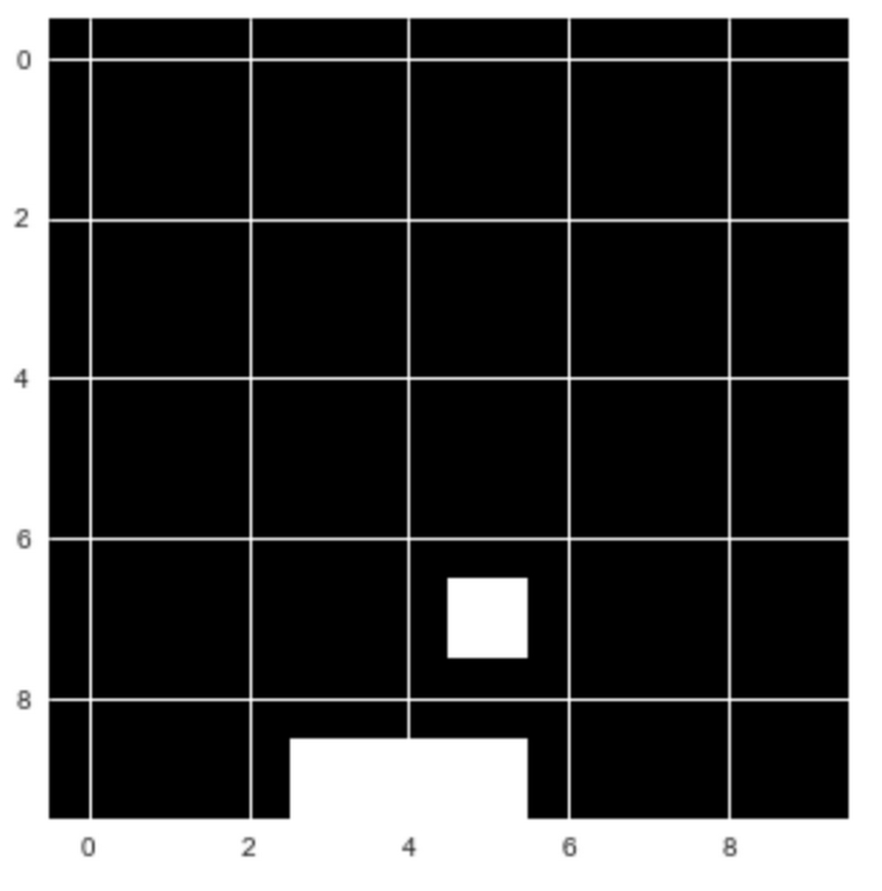


The \"Catch\" game that we will be creating


While playing Catch, the player decides between three possible actions.
They can move the basket to the left, to the right, or make it stay put.

The basis for this decision is the current state of
the game; in other words, the positions of the falling fruit and of the
basket. Our goal is to create a model that, given the content of the
game screen, chooses the action that leads to the highest score
possible. This task can be seen as a simple classification problem. We
could ask expert human players to play the game multiple times and
record their actions. Then, we could train a model to choose the
\"correct\" action that mirrors the expert players.

This is not how humans learn, however. Humans can learn a game such as
Catch by themselves, without guidance. This is very useful, because
imagine if you had to hire a bunch of experts to perform a task
thousands of times every time you wanted to learn something as simple as
Catch: it would be expensive and slow.

In reinforcement learning, the model trains from experience, rather than
labeled data. Instead of providing the model with the correct actions,
we provide it with rewards and punishments. The model receives
information about the current state of the environment, for example, the
computer game screen. It then outputs an action, such as a joystick
movement. The environment reacts to this action and provides the next
state, along with any rewards:


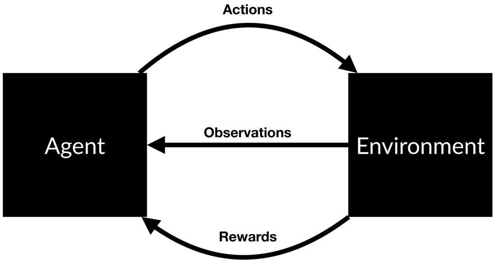


RL scheme


The model then learns to find actions that lead to maximum rewards.
There are many ways this can work in practice. Right now, we are going
to look at **Q-learning**. Q-learning made a splash when it
was used to train a computer to play Atari video
games. Today, it is still a relevant concept. Most modern RL algorithms
are based on some adaptation of Q-learning.

An excellent way to understand Q-learning is to
compare playing Catch with playing chess. In both games, you are given a
state, [*s*]. With chess, this is the position of the figures
on the board. In Catch, this is the location of the fruit and the
basket. The player then has to take an action, [*a*]. In
chess, this is moving a figure. In Catch, this is moving the basket left
or right or remaining in the current position.

As a result, there will be some reward, [*r,*] and a new
state, [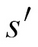]{.inlinemediaobject}. The problem
with both Catch and chess is that the rewards do not appear immediately
after the action.

In Catch, you only earn rewards when the fruits hit the basket or fall
on the floor, and in chess, you only earn a reward when you win or lose
the game. This means that rewards are sparsely distributed. Most of the
time, [*r*] will be zero. When there is a reward, it is not
always a result of the action taken immediately before. Some action
taken long before might have caused the victory. Figuring out which
action is responsible for the reward is often referred to as the credit
assignment problem. Because rewards are delayed, good chess players do
not choose their plays only by the immediate reward. Instead, they
choose the expected future reward.

For example, they do not only think about whether they can eliminate an
opponent\'s figure in the next move, they also consider how taking a
specific action now will help them in the long run. In Q-learning, we
choose our action based on the highest expected future reward. We use a
**Q-function** to calculate this. This
is a mathematical function that takes two arguments: the current state
of the game, and a given action. We can write this as [*Q(state,
action)*].

While in state [*s*], we estimate the future reward for each
possible action, [*a*]. We assume that after we have taken
action [*a*] and moved to the next state,
[]{.inlinemediaobject}, everything works
out perfectly. The expected future reward, [*q(s,a)*], for a
given state and action is calculated as the immediate reward, plus the
expected future reward thereafter,
[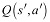]{.inlinemediaobject}. We assume the next
action, [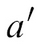]{.inlinemediaobject}, is
optimal. Because there is uncertainty about the future, we discount
[]{.inlinemediaobject} by the factor
gamma, [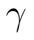]{.inlinemediaobject}. We,
therefore, arrive at an expected reward of this:


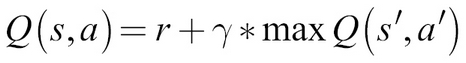


### Note

**Note**: We discount future rewards in RL for the same
reason we discount future returns in finance. They are uncertain. Our
choice here reflects how much we value future returns.


Good chess players are very good at estimating
future rewards in their head. In other words, their Q-function,
[*Q(s,a),*] is very precise.

Most chess practice revolves around developing a better Q-function.
Players peruse many old games to learn how specific moves played out in
the past, and how likely a given action is to lead to victory. However,
this raises the question, how can a machine estimate a good Q-function?
This is where neural networks come into play.


### Q-learning turns RL into supervised learning


When playing a game, we generate lots of
\"experiences.\" These experiences consist of the following:


-   The initial state, [*s*]

-   The action taken, [*a*]

-   The reward earned, [*r*]

-   The state that followed,
    []{.inlinemediaobject}


These experiences are our training data. We can frame the problem of
estimating [*Q(s,a)*] as a regression problem. To solve this,
we can use a neural network. Given an input vector consisting of
[*s*] and [*a*], the neural network is supposed to
predict the value of [*Q(s,a)*] equal to the target:
[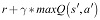]{.inlinemediaobject}. If we are good at
predicting [*Q(s,a)*] for different states [*s*]
and actions [*a*], we will have a good approximation of the
Q-function.


### Note

**Note**: We estimate
[]{.inlinemediaobject} through the same
neural network as [*Q(s,a)*]. This leads to some instability
as our targets now change as the networks learn, just as with
**generative adversarial networks (GANs)**.


Given a batch of experiences,
[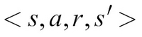]{.inlinemediaobject}, the training
process then looks as follows:


1.  For each possible action,
    []{.inlinemediaobject}, (left, right,
    stay), predict the expected future reward,
    [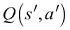]{.inlinemediaobject}, using the
    neural network.
2.  Choose the highest value of the three predictions as the max,
    [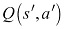]{.inlinemediaobject}.
3.  Calculate [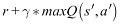]{.inlinemediaobject}. This
    is the target value for the neural network.
4.  Train the neural network using a loss function. This is a function
    that calculates how near or far the predicted value is from the
    target value. Here, we will use
    [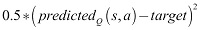]{.inlinemediaobject} as the loss
    function. Effectively, we want to minimize the squared error between
    prediction and target. The factor of 0.5 is just there to make the
    gradient nicer.


During gameplay, all the experiences are stored in a replay memory. This
acts like a simple buffer in which we store
[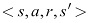]{.inlinemediaobject} pairs. The
`ExperienceReplay` class also handles preparing the data for
training.

Check out the following code:


``` {.programlisting .language-markup}
class ExperienceReplay(object):                                   #1
    def __init__(self, max_memory=100, discount=.9):
        self.max_memory = max_memory                              #2
        self.memory = []
        self.discount = discount

    def remember(self, states, game_over):                        #3
        self.memory.append([states, game_over])
        if len(self.memory) > self.max_memory:
            del self.memory[0]                                    #4

    def get_batch(self, model, batch_size=10):                    #5
        len_memory = len(self.memory)                             #6
        num_actions = model.output_shape[-1]
        env_dim = self.memory[0][0][0].shape[1]
        
        inputs = np.zeros((min(len_memory, batch_size), env_dim)) #7
        targets = np.zeros((inputs.shape[0], num_actions))
        
        for i, idx in enumerate(np.random.randint(0, len_memory, size=inputs.shape[0])):           #8
            state_t, action_t, reward_t, state_tp1 = self.memory[idx][0]                               #9
            game_over = self.memory[idx][1]

            inputs[i:i+1] = state_t                               #10
            
            targets[i] = model.predict(state_t)[0]                #11
            
            Q_sa = np.max(model.predict(state_tp1)[0])            #12
            
            if game_over:                                         #13
                targets[i, action_t] = reward_t
            else:
                targets[i, action_t] = reward_t + self.discount * Q_sa
        return inputs, targets
```


Let\'s pause for a second and break down the code that we\'ve just
created:


1.  Firstly, we implement the experience replay
    buffer as a Python class. A replay buffer object is responsible for
    storing experiences and generating training data. Therefore, it has
    to implement some of the most critical pieces of the Q-learning
    algorithm.

2.  To initialize a replay object, we need to let it know how large its
    buffer should be and what the discount rate,
    []{.inlinemediaobject}, is. The replay
    memory itself is a list of lists following this scheme:
    
    
    Copy
    

    ``` {.programlisting .language-markup}
    [...[experience, game_over][experience, game_over]...]
    ```
    

3.  Within this, `experience` is a tuple holding the
    experience information and `game_over` is a binary Boolean
    value indicating whether the game was over after this step.

4.  When we want to remember a new experience, we add it to our list
    of experiences. Since we cannot store infinite experiences, we
    delete the oldest experience if our buffer exceeds its maximum
    length.

5.  With the `get_batch` function, we can obtain a single
    batch of training data. To calculate
    []{.inlinemediaobject}, we need a
    neural network as well, so we need to pass a Keras model to use the
    function.

6.  Before we start generating a batch, we need to know how many
    experiences we have stored in our replay buffer, how many possible
    actions there are, and how many dimensions a game state has.

7.  Then we need to set up placeholder arrays for the inputs and targets
    we want to train the neural network on.

8.  We loop over the experience replay in a random order until we have
    either sampled all stored experiences or filled the batch.

9.  We load the experience data as well as the `game_over`
    indicator from the replay buffer.

10. We add state [*s*] to the input matrix. Later, the model
    will train to map from this state to the expected reward.

11. We then fill the expected reward for all actions with the expected
    reward calculated by the current model. This ensures that our model
    only trains on the action that was actually taken since the loss for
    all other actions is zero.

12. Next, we calculate
    []{.inlinemediaobject}. We simply
    assume that for the next state,
    []{.inlinemediaobject}, or
    `state_tp1` in code, the neural network will estimate the
    expected reward perfectly. As the network trains, this assumption
    slowly becomes true.

13. Finally, if the game ended after state [*S*], the
    expected reward from the action, [*a,*] should be the
    received reward, [*r*]. If it did not end, then the
    expected reward should be the received reward
    as well as the discounted expected future reward.


### Defining the Q-learning model


Now it is time to define the model that will learn
a Q-function for Catch. It turns out that a relatively simple model can
already learn the function well. We need to define the number of
possible actions as well as the grid size. There are three possible
actions, which are [*move left*], [*stay in
position*], and [*move right*]. Additionally, the
game is being played on a 10x10-pixel grid:


``` {.programlisting .language-markup}
num_actions = 3
grid_size = 10
```


As this is a regression problem, the final layer has no activation
function, and the loss is a mean squared error loss. We optimize the
network using stochastic gradient descent without momentum or any other
bells and whistles:


``` {.programlisting .language-markup}
model = Sequential()
model.add(Dense(100, input_shape=(grid_size**2,), activation='relu'))
model.add(Dense(100, activation='relu'))
model.add(Dense(num_actions))
model.compile(optimizer='sgd', loss='mse')
```


### Training to play Catch


The final ingredient to Q-learning is exploration.
Everyday life shows that sometimes you have to do
something weird and/or random to find out whether there is something
better than your daily trot.

The same goes for Q-learning. By always choosing the best option, you
might miss out on some unexplored paths. To avoid this, the learner will
sometimes choose a random option, and not necessarily the best one.

Now we can define the training method:


``` {.programlisting .language-markup}
def train(model,epochs):
    win_cnt = 0                                                 #1

    win_hist = []

    for e in range(epochs):                                     #2
        loss = 0.
        env.reset()
        game_over = False
        input_t = env.observe()
        
        while not game_over:                                    #3
            input_tm1 = input_t                                 #4
            
            if np.random.rand() <= epsilon:                     #5
                action = np.random.randint(0, num_actions, size=1)
            else:
                q = model.predict(input_tm1)                    #6
                action = np.argmax(q[0])

            input_t, reward, game_over = env.act(action)        #7
            if reward == 1:
                win_cnt += 1

            exp_replay.remember([input_tm1, action, reward, input_t],game_over)            #8

            inputs, targets = exp_replay.get_batch(model, batch_size=batch_size)          #9

            batch_loss = model.train_on_batch(inputs, targets)

            loss += batch_loss
            
        win_hist.append(win_cnt)
    return win_hist
```


Before we go further, again let\'s break down the code so we can see
what we\'re doing:


1.  We want to keep track of the progress of our
    Q-learner, so we count the wins of the model over time.

2.  We now play for a number of games, specified by the
    `epoch` argument. At the beginning of a game, we first
    reset the game, set the `game_over` indicator to
    `False`, and observe the initial state of the game.

3.  We will then be playing frame by frame until the game is over.

4.  At the start of a frame cycle, we save the previously observed input
    as `input_tm1`, the input at time [*t*] minus
    one.

5.  Now comes the exploration part. We draw a random number between zero
    and one. If the number is smaller than `epsilon`, we pick
    a random action. This technique is also called \"epsilon greedy,\"
    as we pick a random action with a probability of epsilon and
    greedily choose the action promising the highest rewards otherwise.

6.  If we choose a non-random action, we let the neural network predict
    the expected rewards for all actions. We then pick the action with
    the highest expected reward.

7.  We now act with our chosen or random action and
    observe a new state, a reward, and information about whether the
    game is over. The game gives a reward of one if we win, so we
    eventually have to increase our win counter.

8.  We store the new experience in our experience replay buffer.

9.  We then sample a new training batch from the experience replay and
    train on that batch.


The following graph shows the rolling mean of successful games. After
about 2,000 epochs of training, the neural network should be quite good
at playing Catch:


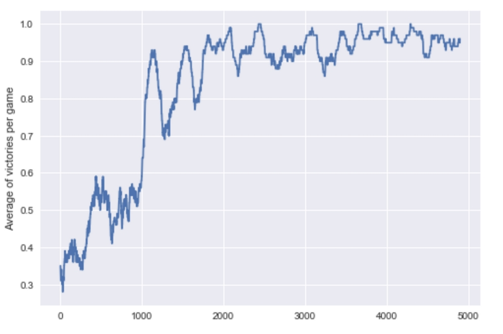


The progress of a Q-learning neural network playing Catch


Looking at the preceding graph, it\'s safe to say that you have now
successfully created your first reinforcement
learning system, as after 5000 epochs the average of victories per games
is between 90% and 100%. In the next section, we will explore the
theoretical foundations of reinforcement learning and discover how the
same system that learns to play catch can learn to route orders in the
futures market.


Markov processes and the bellman equation -- A more formal introduction to RL
-----------------------------------------------------------------------------------------------


Following the long history of modern deep learning
being a continuation of quantitative finance with
more GPUs, the theoretical foundation of
reinforcement learning lies in Markov models.


### Note

**Note**: This section requires a bit of mathematical
background knowledge. If you are struggling, there is a beautiful visual
introduction by Victor Powell here:
<http://setosa.io/ev/markov-chains/>.

A more formal, but still simple, introduction is available
 on the website Analytics Vidhya:
<https://www.analyticsvidhya.com/blog/2014/07/markov-chain-simplified/>.


A Markov model describes a stochastic process with different states in
which the probability of ending up in a specific state is purely
dependent on the state one is currently in. In the following diagram,
you can see a simple Markov model describing
recommendations given for a stock:


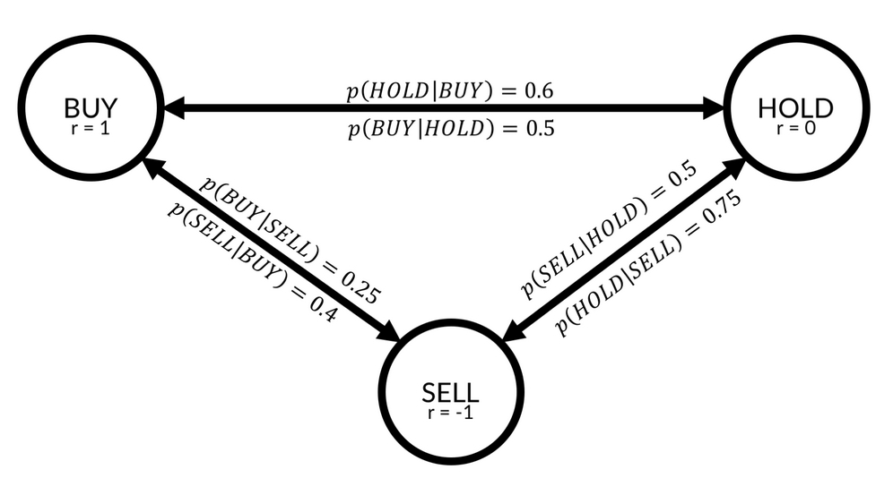


The Markov model


As you can see, there are three states in this model,
**BUY**, **HOLD,** and **SELL**. For
every two states, there is a transition probability. For example, the
probability that a state gets a **BUY** recommendation if it
had a **HOLD** recommendation in the previous round is
described by [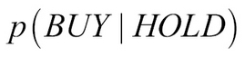]{.inlinemediaobject}, which
is equal to 0.5. There is a 50% chance that a stock that is currently in
**HOLD** will move to **BUY** in the next round.

States are associated with rewards. If you own stock, and that stock has
a **BUY** recommendation, the stock will go up, and you will
earn a reward of **1**. If the stock has a sell
recommendation, you will gain a negative reward, or punishment, of
**-1**.


### Note

**Note**: In some textbooks, the rewards are associated with
state transitions and not states themselves. It turns out to be
mathematically equivalent, and for the ease of notation, we are
associating the rewards with states here.


In a Markov model, an agent can follow a policy, usually denoted as
[]{.inlinemediaobject}. A policy describes
the probability of taking action [*a*]
when in state [*s*]. Say you are a trader: you own stock and
that stock gets a **SELL** recommendation. In that case, you
might choose to sell the stock in 50% of cases, hold the stock in 30% of
cases, and buy more in 20% of cases. In other words, your policy for the
state **SELL** can be described as follows:


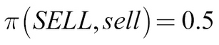


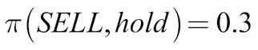


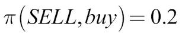


Some traders have a better policy and can make more money from a state
than others. Therefore, the value of state [*s*] depends on
the policy, []{.inlinemediaobject}. The
value function, [*V,*] describes the value of state
[*s*] when policy
[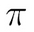]{.inlinemediaobject} is followed. It is
the expected return from state [*s*] when policy
[]{.inlinemediaobject} is followed:


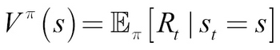


The expected return is the reward gained immediately plus the discounted
future rewards:


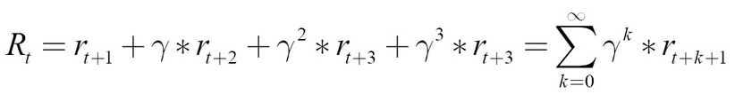


The other value function frequently used in RL is the function
[*Q(s,a),*] which we have already seen in the previous
section. [*Q*] describes the expected
return of taking action [*a*] in state [*s*] if
policy []{.inlinemediaobject} is followed:


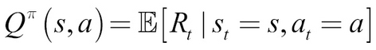


### Note

**Note**: We use the expected value since our environment and
our actions are stochastic. We cannot say for certain that we will land
in a specific state; we can only give a probability.


[*Q*] and [*V*] describe the same thing. If we
find ourselves in a certain state, what should we do? [*V*]
gives recommendations regarding which state we should seek, and
[*Q*] gives advice on which action we should take. Of course,
[*V*] implicitly assumes we have to take some action and
[*Q*] assumes that the result of our actions is landing in
some state. In fact, both [*Q*] and [*V*] are
derived from the so-called Bellman equation, which brings us back to the
Markov model from the beginning of this section.

If you assume that the environment you operate in can be described as a
Markov model, you would really want to know two things. First, you would
want to find out the [*state transition probabilities*]. If
you are in state [*s*], what is the chance
[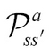]{.inlinemediaobject} ends in state
[]{.inlinemediaobject} if you take action
[*a*]? Mathematically, it is as follows:


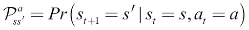


Equally, you would be interested in the expected
reward [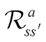]{.inlinemediaobject} of being in
state [*s*], taking action [*a*] and ending up in
state []{.inlinemediaobject}:


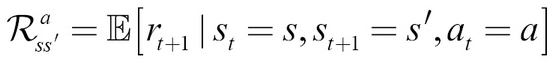


With this in mind, we can now derive the two Bellman equations for
[*Q*] and [*V*]. First, we rewrite the equation
describing [*V*] to contain the actual formula for
[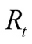]{.inlinemediaobject}:


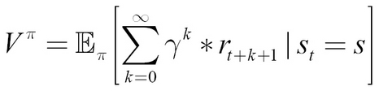


We can pull the first reward out of the sum:


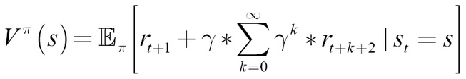


The first part of our expectation is the expected reward we directly
receive from being in state [*s*] and the following policy,
[]{.inlinemediaobject}:


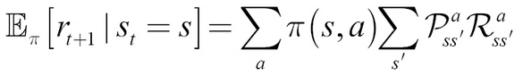


The preceding equation shows a nested sum. First, we sum over all
actions, [*a,*] weighted by their probability of occurrence
under policy []{.inlinemediaobject}. For
each action, we then sum over the distribution of rewards
[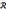]{.inlinemediaobject} from the transition
from state [*s*] to the next state,
[]{.inlinemediaobject}, after action
[*a*], weighted by the probability of this transition
occurring following the transition probability
[]{.inlinemediaobject}.

The second part of our expectation can be rewritten as follows:


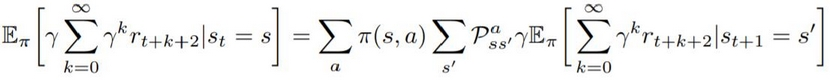


The expected discounted value of the future rewards
after state [*s*] is the discounted expected future value of
all states, []{.inlinemediaobject},
weighted by their probability of occurrence,
[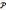]{.inlinemediaobject}, and the
probability of action [*a*] being taken following policy
[]{.inlinemediaobject}.

This formula is quite a mouthful, but it gives us a glimpse into the
recursive nature of the value function. If we now replace the
expectation in our value function, it becomes clearer:


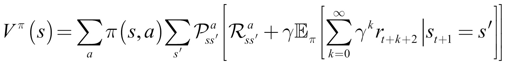


The inner expectation represents the value function for the next step,
[]{.inlinemediaobject}! That means we can
replace the expectation with the value function,
[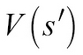]{.inlinemediaobject}:


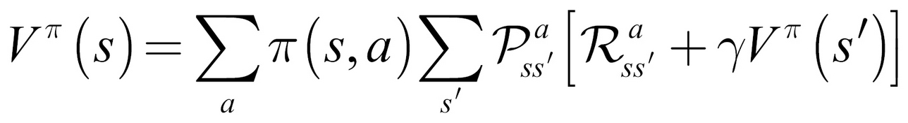


Following the same logic, we can derive the [*Q*] function as
follows:


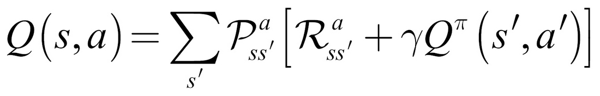


Congratulations, you have just derived the Bellman equation! For now,
pause and take a second to ponder and make sure you really 
understand the mechanics behind these equations. The core
idea is that the value of a state can be expressed as the value of other
states. For a long time, the go-to approach to optimizing the Bellman
equation was to build a model of the underlying Markov model and its
state transition and reward probabilities.

However, the recursive structure calls for a technique called dynamic
programming. The idea behind dynamic programming is to solve easier
sub-problems. You\'ve already seen this in action in the Catch example.
There, we used a neural network to estimate
[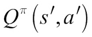]{.inlinemediaobject}, except for states
that ended the game. For these games, finding the reward associated with
the state is easy: it is the final reward received at the end of the
game. It was these states for which the neural network first developed
an accurate estimate of the function [*Q*]. From there, it
could then go backward and learn the values of states that were further
away from the end of the game. There are more possible applications of
this dynamic programming and model-free approach to reinforcement
learning.

Before we jump into the different kinds of systems that can be built
using this theoretical foundation, we will pay a brief visit to the
applications of the Bellman equation in economics. Readers who are
familiar with the work discussed here will find reference points that
they can use to develop a deeper understanding of Bellman equations.
Readers unfamiliar with these works will find inspiration for further
reading and applications for techniques discussed throughout this
lab.


### The Bellman equation in economics


While the first application of the Bellman equation
to economics occurred in 1954, Robert C. Merton\'s 1973 article, [*An
Intertemporal Capital Asset Pricing Model*]
(<http://www.people.hbs.edu/rmerton/Intertemporal%20Capital%20Asset%20Pricing%20Model.pdf>)[*,*]
is perhaps the most well-known application. Using the Bellman equation,
Merton developed a capital asset pricing model that, unlike the classic
CAPM model, works in continuous time and can account for changes in an
investment opportunity.

The recursiveness of the Bellman equation inspired the subfield of
recursive economics. Nancy Stokey, Robert Lucas, and Edward Prescott
wrote an influential 1989 course titled [*Recursive Methods in Economic
Dynamics*]
(<http://www.hup.harvard.edu/catalog.php?isbn=9780674750968>) in which
they apply the recursive approach to solve problems in economic theory.
This course inspired others to use recursive economics to address a wide
range of economic problems, from the principal-agent problem to optimal
economic growth.

Avinash Dixit and Robert Pindyck developed and applied the approach
successfully to capital budgeting in their 1994 course, [*Investment Under
Uncertainty*]
(<https://press.princeton.edu/titles/5474.html>). Patrick Anderson
applied it to the valuation of private businesses in his 2009 article,
[*The Value of Private Businesses in the United States*]
(<https://www.andersoneconomicgroup.com/the-value-of-private-businesses-in-the-united-states/>).

While recursive economics still has many problems,
including the tremendous compute power required for it, it is a
promising subfield of the science.


Advantage actor-critic models
-----------------------------------------------


Q-learning, as we saw in the previous sections, is
quite useful but it does have its drawbacks. For example, as we have to
estimate a Q value for each action, there has to be a discrete, limited
set of actions. So, what if the action space is continuous or extremely
large? Say you are using an RL algorithm to build a portfolio of stocks.

In this case, even if your universe of stocks consisted only of two
stocks, say, AMZN and AAPL, there would be a huge amount of ways to
balance them: 10% AMZN and 90% AAPL, 11% AMZM and 89% AAPL, and so on.
If your universe gets bigger, the amount of ways you can combine stocks
explodes.

A workaround to having to select from such an action space is to learn
the policy, []{.inlinemediaobject},
directly. Once you have learned a policy, you can just give it a state,
and it will give back a distribution of actions. This means that your
actions will also be stochastic. A stochastic policy has advantages,
especially in a game theoretic setting.

Imagine you are playing rock, paper, scissors and you are following a
deterministic policy. If your policy is to pick rock, you will always
pick rock, and as soon as your opponent figures out that you are always
picking rock, you will always lose. The Nash equilibrium, the solution
of a non-cooperative game, for rock, paper, scissors is to pick actions
at random. Only a stochastic policy can do that.

To learn a policy, we have to be able to compute a gradient with respect
to policy. Contrary to most people\'s expectations, policies are
differentiable. In this section, we will build up a policy gradient step
by step and use it to create an **advantage actor-critic**
(**A2C**) model for continuous control.

The first part in the process of differentiating
policies is to look at the advantage we can have by picking a particular
action, [*a,*] rather than just following the policy,
[]{.inlinemediaobject}:


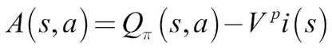


The advantage of action [*a*] in state [*s*] is
the value of executing [*a*] in [*s*] minus the
value of [*s*] under the policy,
[]{.inlinemediaobject}. We measure how
good our policy, []{.inlinemediaobject},
is with [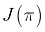]{.inlinemediaobject}, a function
expressing the expected value of the starting state,
[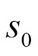]{.inlinemediaobject}:


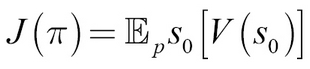


Now, to compute the gradient of the policy, we have to do two steps,
which are shown inside the expectation in the policy gradient formula:


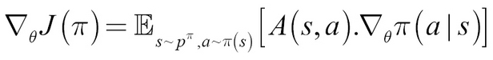


First, we have to calculate the advantage of a given action,
[*a,*] with [*A(s,a)*]. Then we have to calculate
the derivative of the weights of the neural network,
[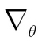]{.inlinemediaobject}, with respect to
increasing the probability,
[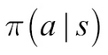]{.inlinemediaobject}, that
[*a*] is picked under policy
[]{.inlinemediaobject}.

For actions with a positive advantage, [*A(s,a)*], we follow
the gradient that would make [*a*] more likely. For actions
with a negative advantage, we go in the exact opposite direction.
The expectation says that we are doing this for all
states and all actions. In practice, we manually multiply the advantage
of actions with their increased likelihood gradients.

One thing left for us to look at is how we compute the advantage. The
value of taking an action is the reward earned directly as a result of
taking the action, as well as the value of the state we find ourselves
in after taking that action:


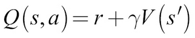


So, we can substitute [*Q(s,a)*] in the advantage
calculation:


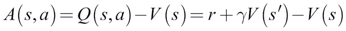


As calculating [*V*] turns out to be useful for calculating
the policy gradient, researchers have come up with the A2C architecture.
A single neural network with two heads that learns both [*V*]
and []{.inlinemediaobject}. As it turns
out, sharing weights for learning the two functions is useful because it
accelerates the training if both heads have to extract features from the
environment:


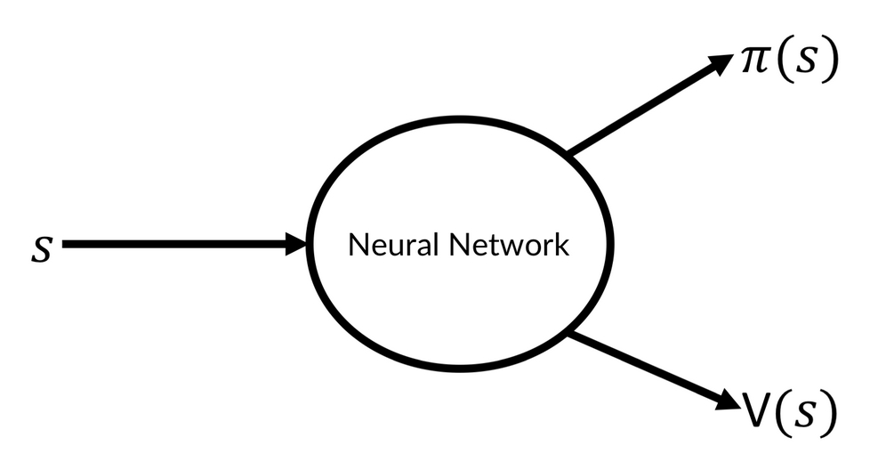


A2C scheme


If you are training an agent that operates on high-dimensional image
data, for instance, the value function and the policy head then both
need to learn how to interpret the image. Sharing weights would help
master the common task. If you are training on lower dimensional data,
it might make more sense to not share weights.

If the action space is continuous,
[]{.inlinemediaobject} is represented by
two outputs, those being the mean,
[]{.inlinemediaobject}, and standard
deviation, []{.inlinemediaobject}. This
allows us to sample from a learned distribution just as we did for the
autoencoder.

A common variant of the A2C approach is the **asynchronous advantage
actor-critic** or **A3C**. A3C works 
exactly like A2C, except that at training time, multiple
agents are simulated in parallel. This means that more independent data
can be gathered. Independent data is important as too-correlated
examples can make a model overfit to specific situations and forget
other situations.

Since both A3C and A2C work by the same principles, and the
implementation of parallel gameplay introduces some complexity that
obfuscates the actual algorithm, we will just stick with A2C in the
following examples.


### Learning to balance


In this section, we will train an A2C model to
swing up and balance a pendulum:


Pendulum gym


The pendulum is controlled by a rotational force that can be applied in
either direction. In the preceding diagram, you can see the arrow that
shows the force being applied. Control is continuous; the agent can
apply more or less force. At the same time, force can be applied in both
directions as a positive and negative force.

This relatively simple control task is a useful example of a continuous
control that can be easily extended to a stock trading task, which we
will look at later. In addition, the task can be visualized so that we
can get an intuitive grasp of how the algorithm learns, including any
pitfalls.


### Note

**Note**: When implementing a new algorithm, try it out on a
task you can visualize. Failures are often subtle and easier to spot
visually than through data.


The pendulum environment is part of the OpenAI Gym,
a suite of games made to train reinforcement learning algorithms. You
can install it via the command line as follows:


``` {.programlisting .language-markup}
pip install
```


Before we start, we have to make some imports:


``` {.programlisting .language-markup}
import gym                                           #1

import numpy as np                                   #2

from scipy.stats import norm                         #3
from keras.layers import Dense, Input, Lambda
from keras.models import Model
from keras.optimizers import Adam
from keras import backend as K

from collections import deque                        #4
import random
```


There are quite a few new imports, so let\'s walk through them one by
one:


1.  OpenAI\'s `gym` is a toolkit for developing reinforcement
    learning algorithms. It provides a number of game environments, from
    classic control tasks, such as a pendulum, to Atari games and
    robotics simulations.

2.  `gym` is interfaced by `numpy` arrays. States,
    actions, and environments are all presented in a
    `numpy`-compatible format.

3.  Our neural network will be relatively small and based around the
    functional API. Since we once again learn a distribution, we need to
    make use of SciPy\'s `norm` function, which helps us take
    the norm of a vector.

4.  The `deque` Python data structure is a highly efficient
    data structure that conveniently manages a maximum length for us. No
    more manually removing experiences! We can randomly sample from
    `deque` using Python\'s `random` module.


Now it is time to build the agent. The following methods all form the
`A2CAgent` class:


``` {.programlisting .language-markup}
def __init__(self, state_size, action_size):

    self.state_size = state_size                       #1
    self.action_size = action_size
    self.value_size = 1

    self.exp_replay = deque(maxlen=2000)               #2


    self.actor_lr = 0.0001                             #3
    self.critic_lr = 0.001
    self.discount_factor = .9


    self.actor, self.critic = self.build_model()       #4
    
    self.optimize_actor = self.actor_optimizer()       #5
    self.optimize_critic = self.critic_optimizer()
```


Let\'s walk through the code step by step:


1.  First, we need to define some game-related variables. The state
    space size and the action space size are given by the game. Pendulum
    states consist of three variables dependent on the angle of the
    pendulum. A state consists of the sine of theta, the cosine of
    theta, and the angular velocity. The value of a state is just a
    single scalar.

2.  Next, we set up our experience replay buffer, which can save at
    maximum 2,000 states. Larger RL experiments have much larger replay
    buffers (often around 5 million experiences), but for this task
    2,000 will do.

3.  As we are training a neural network, we need to set some
    hyperparameters. Even if the actor and critic share weights, it
    turns out that the actor learning rate should usually be lower than
    the critic learning rate. This is because the policy gradient we
    train the actor on is more volatile. We also need to set the
    discount rate, []{.inlinemediaobject}.
    Remember that the discount rate in reinforcement learning is applied
    differently than it is usually in finance. In finance, we discount
    by dividing future values by one plus the discount factor. In
    reinforcement learning, we multiply with the discount rate.
    Therefore, a higher discount factor,
    []{.inlinemediaobject}, means that
    future values are less discounted.

4.  To actually build the model, we define a separate method, which we
    will discuss next.

5.  The optimizers for actor and critic are custom optimizers. To define
    these, we also create a separate function. The optimizers themselves
    are functions that can be called at training
    time:


``` {.programlisting .language-markup}
def build_model(self):
  
    state = Input(batch_shape=(None, self.state_size))          #1
    
    actor_input = Dense(30,                                     #2 
                        activation='relu',
                        kernel_initializer='he_uniform')(state)
                        
    mu_0 = Dense(self.action_size,                              #3
                 activation='tanh',
                 kernel_initializer='he_uniform')(actor_input)
                 
    mu = Lambda(lambda x: x * 2)(mu_0)                          #4
    
    sigma_0 = Dense(self.action_size,                           #5
                    activation='softplus',
                    kernel_initializer='he_uniform')(actor_input)

    
    sigma = Lambda(lambda x: x + 0.0001)(sigma_0)               #6

    critic_input = Dense(30,                                    #7
                         activation='relu',
                         kernel_initializer='he_uniform')(state)
    
    state_value = Dense(1, kernel_initializer='he_uniform')(critic_input)                                                          #8

    
    actor = Model(inputs=state, outputs=(mu, sigma))            #9
    critic = Model(inputs=state, outputs=state_value)          #10

    
    actor._make_predict_function()                             #11
    critic._make_predict_function() 

    actor.summary()                                            #12
    critic.summary()
    
    return actor, critic                                       #13
```


The preceding function sets up the Keras model. It is quite complicated,
so let\'s go through it:


1.  As we are using the functional API, we have to
    define an input layer that we can use to feed the state to the actor
    and critic.

2.  The actor has a hidden first layer as an input to the actor value
    function. It has 30 hidden units and a `relu` activation
    function. It is initialized by an `he_uniform`
    initializer. This initializer is only slightly different from the
    default `glorot_uniform` initializer. The
    `he_uniform` initializer draws from a uniform distribution
    with the limits
    []{.inlinemediaobject}, where
    []{.inlinemediaobject} is the input
    dimension. The default glorot uniform samples from a uniform
    distribution with the limits
    
    
    

    , with [*o*] being the output dimensionality. The
    difference between the two is rather small, but as it turns out, the
    `he_uniform` initializer works better for learning the
    value function and policy.

3.  The action space of the pendulum ranges from -2 to 2. We use a
    regular `tanh` activation, which ranges from -1 to 1 first
    and corrects the scaling later.

4.  To correct the scaling of the action space, we now multiply the
    outputs of the `tanh` function by two. Using the
    `Lambda` layer, we can define such a function manually in
    the computational graph.

5.  The standard deviation should not be negative. The
    `softplus` activation works in principle just like
    `relu`, but with a soft edge:

    
    
    
    ReLU versus softplus
    
    

6.  To make sure the standard deviation is not zero, we add a tiny
    constant to it. Again we use the `Lambda` layer for this
    task. This also ensures that the gradients get
    calculated correctly, as the model is aware of the constant added.

7.  The critic also has a hidden layer to calculate its value function.

8.  The value of a state is just a single scalar that can have any
    value. The value head thus only has one output and a linear, that
    is: the default, activation function.

9.  We define the actor to map from a state to a policy as expressed by
    the mean, []{.inlinemediaobject}, and
    standard deviation,
    []{.inlinemediaobject}.

10. We define the critic to map from a state to a value of that state.

11. While it is not strictly required for A2C, if we want to use our
    agents for an asynchronous, A3C approach, then we need to make the
    predict function threading safe. Keras loads the model on a GPU the
    first time you call `predict()`. If that happens from
    multiple threads, things can
    break.` _make_predict_function` `()` makes sure
    the model is already loaded on a GPU or CPU and
    is ready to predict, even from multiple threads.

12. For debugging purposes, we print the summaries of our models.

13. Finally, we return the models.


Now we have to create the optimizer for the actor. The actor uses a
custom optimizer that optimizes it along the policy gradient. Before we
define the optimizer; however, we need to look at the last piece of the
policy gradient. Remember how the policy gradient was dependent on the
gradient of the weights,
[]{.inlinemediaobject}, that would make
action [*a*] more likely? Keras can calculate this derivative
for us, but we need to provide Keras with the value of policy
[]{.inlinemediaobject}.

To this end, we need to define a probability density function.
[]{.inlinemediaobject} is a normal
distribution with mean
[]{.inlinemediaobject} and standard
deviation []{.inlinemediaobject}, so the
probability density function, [*f*], is as follows:


In this term, []{.inlinemediaobject}
stands for the constant, 3.14..., not for the policy. Later, we only
need to take the logarithm of this probability density function. Why the
logarithm? Because taking the logarithm results in a smoother gradient.
Maximizing the log of a probability means maximizing the
 probability, so we can just use the \"log trick,\" as it is
called, to improve learning.

The value of policy []{.inlinemediaobject}
is the advantage of each action [*a,*] times the log
probability of this action occurring as expressed by the probability
density function, [*f*].

The following function optimizes our actor model. Let\'s go through the
optimization procedure:


``` {.programlisting .language-markup}
def actor_optimizer(self):
    action = K.placeholder(shape=(None, 1))                     #1
    advantages = K.placeholder(shape=(None, 1))

    mu, sigma_sq = self.actor.output                            #2

    pdf = 1. / K.sqrt(2. * np.pi * sigma_sq) * \
                      K.exp(-K.square(action - mu) / (2. * sigma_sq))                          #3
          
    log_pdf = K.log(pdf + K.epsilon())                          #4
    
    exp_v = log_pdf * advantages                                #5

    entropy = K.sum(0.5 * (K.log(2. * np.pi * sigma_sq) + 1.))  #6
    exp_v = K.sum(exp_v + 0.01 * entropy)                       #7
    actor_loss = -exp_v                                         #8

    optimizer = Adam(lr=self.actor_lr)                          #9
    
    updates = optimizer.get_updates(self.actor.trainable_weights, [], actor_loss)            #10

    train = K.function([self.actor.input, action, advantages], [], updates=updates)                       #11
                        
    return train                                               #12
```


1.  First, we need to set up some placeholders for the action taken and
    the advantage of that action. We will fill in these placeholders
    when we call the optimizer.

2.  We get the outputs of the actor model. These
    are tensors that we can plug into our optimizer. Optimization of
    these tensors will be backpropagated and optimizes the whole model.

3.  Now we set up the probability density function. This step can look a
    bit intimidating, but if you look closely, it is the same
    probability density function we defined previously.

4.  Now we apply the log trick. To ensure that we don\'t accidentally
    take the logarithm of zero, we add a tiny constant,
    `epsilon`.

5.  The value of our policy is now the probability of action
    [*a*] times the probability of this action occurring.

6.  To reward the model for a probabilistic policy, we add an entropy
    term. The entropy is calculated with the following term:

    
    
    

    Here, again, []{.inlinemediaobject} is
    a constant 3.14... and
    []{.inlinemediaobject} is the standard
    deviation. While the proof that this term expresses the entropy of a
    normal distribution is outside of the scope of this lab, you can
    see that the entropy goes up if the standard deviation goes up.

7.  We add the entropy term to the value of the policy. By using
    `K.sum()`, we sum the value over the batch.

8.  We want to maximize the value of the policy, but by default, Keras
    performs gradient descent that minimizes losses. An easy trick is to
    turn the value negative and then minimize the negative value.

9.  To perform gradient descent, we use the `Adam` optimizer.

10. We can retrieve an update tensor from the optimizer.
    `get_updates()` takes three arguments,
    `parameters`, `constraints`, and
    `loss`. We provide the parameters of the model, that is,
    its weights. Since we don\'t have any constraints, we just pass an
    empty list as a constraint. For a loss, we pass the actor loss.

11. Armed with the updated tensor, we can now create a function that
    takes as its input the actor model input, that
    is, the state, as well as the two placeholders, the action, and the
    advantages. It returns nothing but the empty list that applies the
    update tensor to the model involved. This function is callable, as
    we will see later.

12. We return the function. Since we call `actor_optimizer()`
    in the `init` function of our class, the optimizer
    function we just created becomes `self.optimize_actor`.


For the critic, we also need to create a custom optimizer. The loss for
the critic is the mean squared error between the predicted value and the
reward plus the predicted value of the next state:


``` {.programlisting .language-markup}
def critic_optimizer(self):
    discounted_reward = K.placeholder(shape=(None, 1))          #1

    value = self.critic.output

    loss = K.mean(K.square(discounted_reward - value))          #2

    optimizer = Adam(lr=self.critic_lr)                         #3
    
    updates = optimizer.get_updates(self.critic.trainable_weights, [], loss)
    
    train = K.function([self.critic.input, discounted_reward], 
                       [], 
                       updates=updates)                         #4
                      
    return train
```


The preceding function optimizes our critic model:


1.  Again we set up a placeholder for the variable we need.
    `discounted_reward` contains the discounted future value
    of state []{.inlinemediaobject} as
    well as the reward immediately earned.

2.  The critic loss is the mean squared error between the critic\'s
    output and the discounted reward. We first obtain the output tensor
    before calculating the mean squared error
    between the output and the discounted reward.

3.  Again we use an `Adam` optimizer from which we obtain an
    update tensor, just as we did previously.

4.  Again, and finally, as we did previously, we\'ll roll the update
    into a single function. This function will become
    `self.optimize_critic`.


For our agent to take actions, we need to define a method that produces
actions from a state:


``` {.programlisting .language-markup}
def get_action(self, state):
    state = np.reshape(state, [1, self.state_size])            #1
    mu, sigma_sq = self.actor.predict(state)                   #2
    epsilon = np.random.randn(self.action_size)                #3
    action = mu + np.sqrt(sigma_sq) * epsilon                  #4
    action = np.clip(action, -2, 2)                            #5
    return action
```


With this function, our actor can now act. Let\'s go through it:


1.  First, we reshape the state to make sure it has the shape the model
    expects.

2.  We predict the means and variance,
    []{.inlinemediaobject}, for this
    action from the model.

3.  Then, as we did for the autoencoder, we first sample a random normal
    distribution with a mean of zero and a standard deviation of 1.

4.  We add the mean and multiply by the standard deviation. Now we have
    our action, sampled from the policy.

5.  To make sure we are within the bounds of the action space, we clip
    the action at -2, 2, so it won\'t be outside of those boundaries.


At last, we need to train the model. The `train_model`
function will train the model after receiving one new experience:


``` {.programlisting .language-markup}
def train_model(self, state, action, reward, next_state, done):
    self.exp_replay.append((state, action, reward, next_state, done))              #1
    
     (state, action, reward, next_state, done) = random.sample(self.exp_replay,1)[0]             #2
    target = np.zeros((1, self.value_size))                 #3
    advantages = np.zeros((1, self.action_size))

    value = self.critic.predict(state)[0]                   #4
    next_value = self.critic.predict(next_state)[0]

    if done:                                                #5
        advantages[0] = reward - value
        target[0][0] = reward
    else:
        advantages[0] = reward + self.discount_factor * (next_value) - value
        target[0][0] = reward + self.discount_factor * next_value

    self.optimize_actor([state, action, advantages])        #6
    self.optimize_critic([state, target])
```


And this is how we optimize both actor and critic:


1.  First, the new experience is added to the
    experience replay.

2.  Then, we immediately sample an experience from the experience
    replay. This way, we break the correlation between samples the model
    trains on.

3.  We set up placeholders for the advantages and targets. We will fill
    them at [*step 5*].

4.  We predict the values for state [*s*] and
    []{.inlinemediaobject}.

5.  If the game ended after the current state, [*s*], the
    advantage is the reward we earned minus the value we assigned to the
    state, and the target for the value function is just the reward we
    earned. If the game did not end after this state, the advantage is
    the reward earned plus the discounted value of the next state minus
    the value of this state. The target, in that case, is the reward
    earned plus the discounted value of the next state.

6.  Knowing the advantage, the action taken, and the value target, we
    can optimize both the actor and critic with the optimizers we
    created earlier.


And that is it; our `A2CAgent` class is done. Now it is time
to use it. We define a `run_experiment` function. This
function plays the game for a number of episodes. It is useful to first
train a new agent without rendering, because training takes around 600
to 700 games until the agent does well. With your
trained agent, you can then watch the gameplay:


``` {.programlisting .language-markup}
def run_experiment(render=False, agent=None, epochs = 3000):
    env = gym.make('Pendulum-v0')                                   #1
    
    state_size = env.observation_space.shape[0]                     #2
    action_size = env.action_space.shape[0]

    if agent = None:                                                #3
        agent = A2CAgent(state_size, action_size)

    scores = []                                                     #4

    for e in range(epochs):                                         #5
        done = False                                                #6
        score = 0
        state = env.reset()
        state = np.reshape(state, [1, state_size])

        while not done:                                             #7
            if render:                                              #8
                env.render()

            action = agent.get_action(state)                        #9
            next_state, reward, done, info = env.step(action)      #10
            reward /= 10                                           #11
            next_state = np.reshape(next_state, [1, state_size])               #12
            agent.train_model(state, action, reward, next_state, done)                    #13

            score += reward                                        #14
            state = next_state                                     #15

            if done:                                               #16
                scores.append(score) 
                print("episode:", e, "  score:", score)
                
                if np.mean(scores[-min(10, len(scores)):]) > -20:  #17
                    print('Solved Pendulum-v0 after {} iterations'.format(len(scores)))
                    return agent, scores
```


Our experiment boils down to these functions:


1.  First, we set up a new `gym` environment. This environment
    contains the pendulum game. We can pass actions to it and observe
    states and rewards.

2.  We obtain the action and state space from the game.

3.  If no agent was passed to the function, we would create a new one.

4.  We set up an empty array to keep track of the scores over time.

5.  Now we play the game for a number of rounds
    specified by `epochs`.

6.  At the beginning of a game, we set the \"game over indicator\" to
    `false`, `score`  to `0`, and reset
    the game. By resetting the game, we obtain the initial starting
    state.

7.  Now we play the game until it is over.

8.  If you passed `render = True` to the function, the game
    would be rendered on screen. Note that this won\'t work on a remote
    notebook such as in Kaggle or Jupyter.

9.  We get an action from the agent and act in the environment.

10. When acting in the environment, we observe a new state, a reward,
    and whether the game is over. `gym` also passes an info
    dictionary, which we can ignore.

11. The rewards from the game are all negative, with a higher reward
    closer to zero being better. The rewards can be quite large, though,
    so we reduce them. Too extreme rewards can lead to too large
    gradients while training. That would hinder training.

12. Before training with the model, we reshape the state, just to be
    sure.

13. Now we train the agent on a new experience. As you have seen, the
    agent will store the experience in its replay buffer and draw a
    random old experience to train from.

14. We increase the overall reward to track the rewards earned during
    one game.

15. We set the new state to be the current state to prepare for the next
    frame of the game.

16. If the game is over, we track and print out the game score.

17. The agent usually does pretty well after 700 epochs. We declare the
    game solved if the average reward over the last 20 games was better
    than -20. If that is the case, we will exit the function and return
    the trained agent together with its scores.


### Learning to trade


Reinforcement learning algorithms are largely developed in games and
simulations where a failing algorithm won\'t cause
any damage. However, once developed, an algorithm can be adapted to
other, more serious tasks. To demonstrate this ability, we are now going
to create an A2C agent that learns how to balance a portfolio of stocks
within a large universe of stocks.


### Note

**Note**: Please do not trade based on this algorithm. It is
only a simplified and slightly naive implementation to demonstrate the
concept and shouldn\'t be used in the real world.


To train a new reinforcement learning algorithm, we first need to create
a training environment. In this environment, the agent trades in
real-life stock data. The environment can be interfaced just like an
OpenAI Gym environment. Following the Gym conventions for interfacing
reduces the complexity of development. Given a 100-day look back of the
percentile returns of stocks in the universe, the agent has to return an
allocation in the form of a 100-dimensional vector.

The allocation vector describes the share of assets the agent wants to
allocate on one stock. A negative allocation means the agent is short
trading the stock. For simplicity\'s sake, transaction costs and
slippage are not added to the environment. It would not be too difficult
to add them, however.


### Note

**Tip**: The full implementation of the environment and agent
can be found at <https://www.kaggle.com/jannesklaas/a2c-stock-trading>.


The environment looks like this:


``` {.programlisting .language-markup}
class TradeEnv():
    def reset(self):
        self.data = self.gen_universe()                        #1
        self.pos = 0                                           #2
        self.game_length = self.data.shape[0]                  #3
        self.returns = []                                      #4

        return self.data[0,:-1,:]                              #5

    def step(self,allocation):                                 #6
        ret = np.sum(allocation * self.data[self.pos,-1,:])    #7
        self.returns.append(ret)                               #8
        mean = 0                                               #9
        std = 1
        if len(self.returns) >= 20:                            #10
            mean = np.mean(self.returns[-20:])
            std = np.std(self.returns[-20:]) + 0.0001

        sharpe = mean / std                                    #11

        if (self.pos +1) >= self.game_length:                  #12
            return None, sharpe, True, {}
        else:                                                  #13
            self.pos +=1
            return self.data[self.pos,:-1,:], sharpe, False, {}

    def gen_universe(self):                                   #14
        stocks = os.listdir(DATA_PATH) 
        stocks = np.random.permutation(stocks)
        frames = [] 
        idx = 0
        while len(frames) < 100:                              #15
            try: 
                stock = stocks[idx]
                frame = pd.read_csv(os.path.join(DATA_PATH,stock),index_col='Date')
                frame = frame.loc['2005-01-01':].Close
                frames.append(frame)
            except:
                e = sys.exc_info()[0]
            idx += 1 

        df = pd.concat(frames,axis=1,ignore_index=False)      #16
        df = df.pct_change()
        df = df.fillna(0)
        batch = df.values
        episodes = []                                         #17
        for i in range(batch.shape[0] - 101):
            eps = batch[i:i+101]
            episodes.append(eps)
        data = np.stack(episodes)
        assert len(data.shape) == 3 
        assert data.shape[-1] == 100
        return data
```


Our trade environment is somewhat similar to the
pendulum environment. Let\'s see how we set it up:


1.  We load data for our universe.

2.  Since we are stepping through the data where each day is a step, we
    need to keep track of our position in time.

3.  We need to know when the game ends, so we need to know how much data
    we have.

4.  To keep track of returns over time, we set up an empty array.

5.  The initial state is the data for the first episode, until the last
    element, which is the return of the next day for all 100 stocks in
    the universe.

6.  At each step, the agent needs to provide an allocation to the
    environment. The reward the agent receives is the sharpe ratio, the
    ratio between the mean and standard deviation of returns, over the
    last 20 days. You could modify the reward function to, for example,
    include transaction costs or slippage. If you do want to do this,
    then refer to the section on reward shaping later in this lab.

7.  The return on the next day is the last element of the episode data.

8.  To calculate the Sharpe ratio, we need to keep
    track of past returns.

9.  If we do not have 20 returns yet, the mean and standard deviation of
    returns will be zero and one respectively.

10. If we do have enough data, we calculate the mean and standard
    deviation of the last 20 elements in our return tracker. We add a
    tiny constant to the standard deviation to avoid division by zero.

11. We can now calculate the Sharpe ratio, which will provide the reward
    for the agent.

12. If the game is over, the environment will return no next state, the
    reward, and an indicator that the game is over, as well as an empty
    information dictionary in order to stick to the OpenAI Gym
    convention.

13. If the game is not over, the environment will return the next state,
    a reward, and an indicator that the game is not over, along with an
    empty information dictionary.

14. This function loads the daily returns of a universe of 100 random
    stocks.

15. The selector moves in random order over the files containing stock
    prices. Some of them are corrupted so that loading them will result
    in an error. The loader keeps trying until it has 100 pandas
    DataFrames containing stock prices assembled. Only closing prices
    starting in 2005 will be considered.

16. In the next step, all DataFrames are concatenated. The percentile
    change in stock price is calculated. All missing values are filled
    with zero, for no change. Finally, we extract the values from the
    data as a NumPy array.

17. The last thing to do is transform the data into a time series. The
    first 100 steps are the basis for the agent\'s decision. The 101st
    element is the next day\'s return, on which the agent will be
    evaluated.


We only have to make minor edits in the `A2CAgent` agent
class. Namely, we only have to modify the model so that it can take in
the time series of returns. To this end, we add two `LSTM`
layers, which actor and critic share:


``` {.programlisting .language-markup}
def build_model(self):
    state = Input(batch_shape=(None, #1
            self.state_seq_length,
            self.state_size))
x = LSTM(120,return_sequences=True)(state) #2
x = LSTM(100)(x)
actor_input = Dense(100, activation='relu', #3
        kernel_initializer='he_uniform')(x)
mu = Dense(self.action_size, activation='tanh', #4
        kernel_initializer='he_uniform')(actor_input)
sigma_0 = Dense(self.action_size, activation='softplus',
            kernel_initializer='he_uniform')
            (actor_input)
sigma = Lambda(lambda x: x + 0.0001)(sigma_0)
critic_input = Dense(30, activation='relu',
                        kernel_initializer='he_uniform')(x)
state_value = Dense(1, activation='linear',
        kernel_initializer='he_uniform')
        (critic_input)
actor = Model(inputs=state, outputs=(mu, sigma))
critic = Model(inputs=state, outputs=state_value)

actor._make_predict_function()
critic._make_predict_function()

actor.summary()
critic.summary()

return actor, critic
```


Again, we have built a Keras model in a function.
It is only slightly different from the model before. Let\'s explore it:


1.  The state now has a time dimension.

2.  The two `LSTM` layers are shared across actor and critic.

3.  Since the action space is larger; we also have to increase the size
    of the actor\'s hidden layer.

4.  Outputs should lie between -1 and 1, and 100% short and 100% long,
    so that we can save ourselves the step of multiplying the mean by
    two.


And that is it! This algorithm can now learn to balance a portfolio just
as it could learn to balance before.


Evolutionary strategies and genetic algorithms
----------------------------------------------------------------


Recently, a decades-old optimization algorithm for reinforcement
learning algorithms has come back into fashion. **Evolutionary
strategies** (**ES**) are much simpler than
Q-learning or A2C.

Instead of training one model through
backpropagation, in ES we create a population
of models by adding random noise to the weights of the original model.
We then let each model run in the environment and evaluate its
performance. The new model is the performance-weighted average of all
the models.

In the following diagram, you can see a visualization of how evolution
strategies work:


Evolutionary strategy


To get a better grip on how this works, consider the following example.
We want to find a vector that minimizes the mean squared error to a
solution vector. The learner is not given the solution, but only the
total error as a reward signal:


``` {.programlisting .language-markup}
solution = np.array([0.5, 0.1, -0.3])
def f(w):
  reward = -np.sum(np.square(solution - w))
  return reward
```


A key advantage of evolutionary strategies is that
they have fewer hyperparameters. In this case, we need just three:


``` {.programlisting .language-markup}
npop =   50 #1
sigma = 0.1 #2
alpha = 0.1 #3
```


1.  **Population size**: We will create
    50 versions of the model at each iteration

2.  **Noise standard deviation**: The noise we add will have
    mean of zero and a standard deviation of 0.1

3.  **Learning rate**: Weights don\'t just simply get set to
    the new average but are slowly moved in the direction to avoid
    overshooting


The optimization algorithm will look like the following code:


``` {.programlisting .language-markup}
w = np.random.randn(3)                          #1
for i in range(300):                            #2
  N = np.random.randn(npop, 3) * sigma          #3 
  R = np.zeros(npop)
  for j in range(npop):                         #4
    w_try = w + N[j]
    R[j] = f(w_try)

  A = (R - np.mean(R)) / np.std(R)              #5
  w = w + alpha * np.dot(N.T, A)/npop           #6
```


Genetic optimization is relatively short in code, so let\'s go through
it:


1.  We start off with a random solution.

2.  Just like with the other RL algorithm, we train for a number of
    epochs, here 300.

3.  We create a noise matrix of 50 noise vectors with a mean of zero and
    a standard deviation of `sigma`.

4.  We now create and immediately evaluate our population by adding
    noise to the original weights and running the resulting vector
    through the evaluation function.

5.  We standardize the rewards by subtracting the mean and dividing by
    the standard deviation. The result can be interpreted as an
    advantage, in this case, that a particular member of the population
    has over the rest.

6.  Finally, we add the weighted average noise vector to the weight
    solution. We use a learning rate to slow down
    the process and avoid overshooting.


Similar to neural networks themselves, evolutionary
strategies are loosely inspired by nature. In nature, species optimize
themselves for survival using natural selection. Researchers have come
up with many algorithms to imitate this process. The preceding neural
evolution strategy algorithm works not only for single vectors but for
large neural networks as well. Evolutionary strategies are still a field
of active research, and at the time of writing, no best practice has
been settled on.

Reinforcement learning and evolutionary strategies are the go-to
techniques if no supervised learning is possible, but a reward signal is
available. There are many applications in the financial industry where
this is the case from simple \"multi-armed bandit\" problems, such as
the DHL order routing system, to complex trading systems.


Practical tips for RL engineering
---------------------------------------------------


In this section, we will be introducing some practical tips for building
RL systems. We will also highlight some current research frontiers that
are highly relevant to financial practitioners.


### Designing good reward functions


Reinforcement learning is the field of designing
algorithms that maximize a reward function. However, creating good
reward functions is surprisingly hard. As anyone
who has ever managed people will know, both people and machines game the
system.

The literature on RL is full of examples of researchers finding bugs in
Atari games that had been hidden for years but were found and exploited
by an RL agent. For example, in the game \"Fishing Derby,\" OpenAI has
reported a reinforcement learning agent achieving a higher score than is
ever possible according to the game makers, and this is without catching
a single fish!

While it is fun for games, such behavior can be dangerous when it occurs
in financial markets. An agent trained on maximizing returns from
trading, for example, could resort to illegal trading activities such as
spoofing trades, without its owners knowing about it. There are three
methods to create better reward functions, which we will look at in the
next three subsections.


#### Careful, manual reward shaping


By manually creating rewards, practitioners can help the system to
learn. This works especially well if the natural rewards of the
environment are sparse. If, say, a reward is usually only given if a
trade is successful, and this is a rare event, it
helps to manually add a function that gives a reward if the trade was
nearly successful.

Equally, if an agent is engaging in illegal trading, a hard-coded
\"robot policy\" can be set up that gives a huge negative reward to the
agent if it breaks the law. Reward shaping works if the rewards and the
environment are relatively simple. In complex environments, it can
defeat the purpose of using machine learning in the first place.
Creating a complex reward function in a very complex environment can be
just as big a task as writing a rule-based system acting in the
environment.

Yet, especially in finance, and more so in trading, hand-crafted reward
shaping is useful. Risk-averse trading is an example of creating a
clever objective function. Instead of maximizing the expected reward,
risk-averse reinforcement learning maximizes an evaluation function,


, which is an extension of the utility-based shortfall to a multistage
setting:


Here []{.inlinemediaobject} is a concave,
continuous, and strictly increasing function that can be freely chosen
according to how much risk the trader is willing to take. The RL
algorithm now maximizes as follows:


#### Inverse reinforcement learning


In **inverse reinforcement learning** (**IRL**), a
model is trained to predict the reward function of a human expert. A
human expert is performing a task, and the model
observes states and actions. It then tries to find a value function that
explains the human expert\'s behavior. More specifically, by observing
the expert, a policy trace of states and actions is created. One example
is the maximum likelihood inverse reinforcement learning, or IRL,
algorithm which works as follows:


1.  Guess a reward function, [*R*]

2.  Compute the policy,
    []{.inlinemediaobject}, that follows
    from [*R*], by training an RL agent

3.  Compute the probability that the actions observed, [*D,*]
    were a result of
    []{.inlinemediaobject},
    []{.inlinemediaobject}

4.  Compute the gradient with respect to [*R*] and update it

5.  Repeat this process until
    []{.inlinemediaobject} is very high


#### Learning from human preferences


Similar to IRL, which produces a reward function
from human examples, there are also algorithms that learn from human
preferences. A reward predictor produces a reward function under which
policy is trained.

The goal of the reward predictor is to produce a reward function that
results in a policy that has a large human preference. Human preference
is measured by showing the human the results of two policies and letting
the human indicate which one is more preferable:


Learning from preferences


### Robust RL


Much like for GANs, RL can be fragile and can be hard to train for good
results. RL algorithms are quite sensitive to hyperparameter choices.
But there are a few ways to make RL more robust:


- **Using a larger experience replay buffer**: The goal of
    using experience replay buffers is to collect uncorrelated
    experiences. This can be achieved by just creating a
     larger buffer or a whole buffer database that can store
    millions of examples, possibly from different agents.

- **Target networks**: RL is unstable in part because the
    neural network relies on its own output for training. By using a
    frozen target network for generating training data, we can mitigate
    problems. The frozen target network should only be updated slowly
    by, for example, moving the weights of the target network only a few
    percent every few epochs in the direction of the trained network.

- **Noisy inputs**: Adding noise to the state
    representation helps the model generalize to other situations and
    avoids overfitting. It has proven especially useful if the agent is
    trained in a simulation but needs to generalize to the real, more
    complex world.

- **Adversarial examples**: In a GAN-like setup, an
    adversarial network can be trained to fool the model by changing the
    state representations. The model can, in turn, learn to ignore the
    adversarial attacks. This makes learning more robust.

- **Separating policy learning from feature extraction**:
    The most well-known results in reinforcement
    learning have learned a game from raw inputs. However, this requires
    the neural network to interpret, for example, an image by learning
    how that image leads to rewards. It is easier to separate the steps
    by, for example, first training an autoencoder that compresses state
    representations, then training a dynamics model that can predict the
    next compressed state, and then training a relatively small policy
    network from the two inputs.


Similar to the GAN tips, there is little theoretical reason for why
these tricks work, but they will make your RL work better in practice.


Frontiers of RL
---------------------------------


You have now seen the theory behind and application
of the most useful RL techniques. Yet, RL is a moving field. This course
cannot cover all of the current trends that might
be interesting to practitioners, but it can highlight some that
are particularly useful for practitioners in the financial industry.


### Multi-agent RL


Markets, by definition, include many agents. Lowe
and others, 2017, [*Multi-Agent Actor-Critic for Mixed
Cooperative-Competitive Environments*] (see
<https://arxiv.org/abs/1706.02275>), shows that
reinforcement learning can be used to train agents that cooperate,
compete, and communicate depending on the situation.


Multiple agents (in red) working together to chase the green dots. From
the OpenAI blog.


In an experiment, Lowe and others let agents communicate by including a
communication vector into the action space. The communication vector
that one agent outputted was then made available to
other agents. They showed that the agents learned to communicate to
solve a task. Similar research showed that agents adopted collaborative
or competitive strategies based on the environment.

In a task where the agent had to collect reward tokens, agents
collaborated as long as plenty of tokens were available and showed
competitive behavior as tokens got sparse. Zheng and others, 2017,
[*MAgent: A Many-Agent Reinforcement Learning Platform for Artificial
Collective Intelligence*] (see
<https://arxiv.org/abs/1712.00600>), scaled the environment to include
hundreds of agents. They showed that agents developed more complex
strategies such as an encirclement attack on other agents through a
combination of RL algorithms and clever reward shaping.

Foerster and others, 2017, [*Learning with Opponent-Learning
Awareness*] (see <https://arxiv.org/abs/1709.04326>),
developed a new kind of RL algorithm that allows the agent to learn how
another agent will behave and develop actions to influence the other
agent.


### Learning how to learn


A shortcoming of deep learning is that skilled humans have to develop
neural networks. Because of that, one longstanding dream of researchers
and companies who are currently having to pay Ph.D.
students is to automate the process of designing neural networks.

One example of this so-called AutoML is the **neural evolution
of augmenting topologies**, known as the NEAT algorithm. NEAT
uses an evolutionary strategy to design a neural network that is then
trained by standard backpropagation:


A network developed by the NEAT algorithm


As you can see in the preceding diagram, the networks developed by NEAT
are often smaller than traditional, layer-based
neural networks. They are hard to come up with. This is the strength of
AutoML; it can find effective strategies that humans would not have
discovered.

An alternative to using evolutionary algorithms for network design is to
use reinforcement learning, which yields similar results. There are a
couple \"off-the-shelf\" AutoML solutions:


- **tpot** (<https://github.com/EpistasisLab/tpot>): This
    is a data science assistant that optimizes 
    machine learning pipelines using 
    genetic algorithms. It is built on top of scikit-learn,
    so it does not create deep learning models but models useful for
    structured data, such as random forests.

- **auto-sklear** **n**
    (<https://github.com/automl/auto-sklearn>): This is also based on
    scikit-learn but focuses more on
     creating models rather than feature extraction.

- **AutoW** **EKA**
    (<https://github.com/automl/autoweka>): This is similar to
    `auto-sklearn`, except that it is
    built on the WEKA package, which runs on Java.

- **H2O A** **utoML**
    (<http://docs.h2o.ai/h2o/latest-stable/h2o-docs/automl.html>): This
    is an AutoML tool that is
    part of the H2O software package, which provides model selection and
    ensembling.

- **Google Cloud AutoML**
    (<https://cloud.google.com/automl/>): This is currently focused on
    pipelines for computer 
    vision.


For the subfield of hyperparameter search, there are a few packages
available as well:


- **Hyperopt** (<https://github.com/hyperopt/hyperopt>):
    This package allows for distributed, asynchronous hyperparameter
    search in Python.

- **Spearmint** (<https://github.com/HIPS/Spearmint>): This
    package is similar to Hyperopt, optimizing hyperparameters but using
    a more advanced Bayesian optimization process.


AutoML is still an active field of research, but it holds great promise.
Many firms struggle to use machine learning due to a lack of skilled
employees. If machine learning could optimize itself, more firms could
start using machine learning.


### Understanding the brain through RL


The other emerging field in finance and economics
is behavioral economics. More recently,
reinforcement learning has been used to understand how the human brain
works. Wang and others, in 2018, published a paper titled, [*Prefrontal
cortex as a meta-reinforcement learning system*] (see
<http://dx.doi.org/10.1038/s41593-018-0147-8>), which provided new
insights into the frontal cortex and the function of dopamine.

Similarly, Banino and others in 2018 published a report titled,
[*Vector-based navigation using grid-like representations in artificial
agents*] (see <https://doi.org/10.1038/s41586-018-0102-6>),
where they replicated so-called \"grid cells\" that allow mammals to
navigate using reinforcement learning.

The method is similar because both papers train RL algorithms on tasks
related to the area of research, for example, navigation. They then
examine the learned weights of the model for emergent properties. Such
insight can be used to create more capable RL agents but also to further
the field of neuroscience.

As the world of economics gets to grips with the idea that humans are
not rational, but irrational in predictable ways, understanding the
brain becomes more important when understanding economics. The results
of neuroeconomics are particularly relevant to finance as they deal with
how humans act under uncertainty and deal with risk, such as why humans
are loss averse. Using RL is a promising avenue to yield further insight
into human behavior.


Exercises
---------------------------


As we\'ve now completed the task, let\'s try our hand at two appropriate
exercises based on the content that we\'ve covered.


1.  **A simple** ] **RL task**: Go to
    <https://github.com/openai/gym>. Once there, install the Gym
    environment and train an agent to solve the \"Cartpole\" problem.

2.  **A multi-agent** ] **RL task**: Go to
    <https://github.com/crazymuse/snakegame-numpy>. This is a Gym
    environment that lets you play multiple agents in a \"Snake\" game.
    Experiment with different strategies. Can you create an agent that
    fools the other agent? What is the emergent behavior of the snakes?


Summary 
-------------------------


In this lab, you learned about the main algorithms in RL,
Q-learning, policy gradients, and evolutionary strategies. You saw how
these algorithms could be applied to trading and learned about some of
the pitfalls of applying RL. You also saw the direction of current
research and how you can benefit from this research today. At this point
in the course, you are now equipped with a number of advanced machine
learning algorithms, which are hopefully useful to you when developing
machine learning models.

In the next lab, we will discuss the practicalities of developing,
debugging, and deploying machine learning systems. We will break out of
the data-science sandbox and get our models into the real world.
